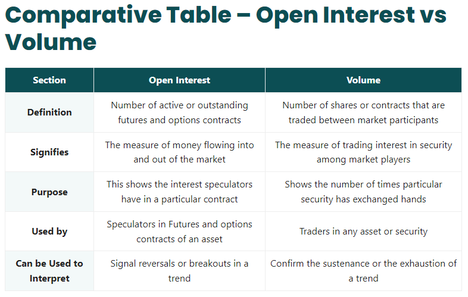

## Table of Contents

## What is trading volume in options trading?

Trading volume in options trading refers to the total number of options contracts that are bought and sold during a specific period, usually a trading day. It is an important indicator that shows how active the market is for a particular option. When the trading volume is high, it means that many traders are interested in that option, which can lead to more liquidity and potentially easier trading.

High trading volume can also provide insights into the market sentiment towards the underlying asset. For example, if there is a sudden increase in the trading volume of call options for a stock, it might suggest that traders are expecting the stock price to go up. On the other hand, a surge in put options might indicate that traders are anticipating a drop in the stock price. By keeping an eye on trading volume, traders can make more informed decisions about their options trading strategies.

## What is open interest in options trading?

Open interest in options trading is the total number of outstanding options contracts that have not been settled or closed. It represents the number of contracts that are still open and active in the market. When someone buys an option, open interest goes up if it's a new contract. If someone sells an option to close an existing position, open interest goes down.

Open interest is important because it can give traders an idea about the [liquidity](/wiki/liquidity-risk-premium) and interest in a particular option. High open interest means more people are interested in that option, which can make it easier to buy or sell. It can also show how strong the market's opinion is about the future price of the underlying asset. By watching open interest, traders can get clues about market trends and make better trading decisions.

## How can trading volume indicate the liquidity of an option?

Trading [volume](/wiki/volume-trading-strategy) shows how many options contracts are being bought and sold each day. When the trading volume is high, it means a lot of people are interested in that option. This makes it easier to buy or sell the option because there are more people trading it. High trading volume means the option is more liquid, like water flowing easily. If you want to trade an option quickly, you would look for one with high trading volume.

On the other hand, if the trading volume is low, it means fewer people are trading that option. This can make it harder to buy or sell the option because there are not many people interested in it. Low trading volume means the option is less liquid, like trying to move through thick mud. So, when you are looking at options, checking the trading volume can help you understand how easy or hard it will be to trade that option.

## How does open interest reflect the market's interest in a particular option?

Open interest shows how many people are holding onto a specific option and haven't closed their positions yet. When open interest is high, it means a lot of people are interested in that option and are keeping it open. This can be a sign that traders think the price of the underlying asset might move in a certain way. For example, if a lot of people are holding call options, it might mean they expect the stock price to go up.

On the other hand, if open interest is low, it means fewer people are interested in that option and are not holding onto it for long. This could suggest that traders are not very confident about the future price movement of the underlying asset. By looking at open interest, traders can get a sense of how strongly the market feels about an option and use that information to make smarter trading decisions.

## What are the differences between trading volume and open interest?

Trading volume and open interest are two important numbers in options trading, but they tell us different things. Trading volume is the total number of options contracts that are bought and sold in a day. It shows how active the market is for a specific option. If the trading volume is high, it means a lot of people are trading that option, which makes it easier to buy or sell because there are more people interested.

Open interest, on the other hand, is the total number of options contracts that are still open and haven't been closed yet. It shows how many people are holding onto an option and haven't settled their positions. High open interest means a lot of people are interested in that option and think it might be important for future price movements. Both trading volume and open interest help traders understand the market, but they focus on different aspects: trading volume looks at daily activity, while open interest looks at ongoing interest.

## How can beginners use trading volume to make trading decisions?

Beginners can use trading volume to see how popular an option is. If an option has a high trading volume, it means a lot of people are buying and selling it. This is good because it's easier to trade something that's popular. If you want to buy or sell an option quickly, you should look for ones with high trading volume. It's like choosing a busy road over a quiet one; you can get where you're going faster.

You can also use trading volume to get a sense of what other traders think about a stock. If you see a big jump in the trading volume of call options for a stock, it might mean that many people think the stock's price will go up soon. On the other hand, if you see a lot of put options being traded, it could mean people expect the stock's price to drop. By watching the trading volume, beginners can make smarter choices about which options to trade.

## What impact does high open interest have on option pricing?

High open interest can affect the price of an option. When a lot of people are holding onto an option, it means there's a big interest in it. This can make the option more valuable because more people want it. It's like how a popular toy might cost more because everyone wants it. So, if an option has high open interest, its price might go up because it's in demand.

But high open interest also means the option is more liquid. This can help keep the price stable because it's easier to buy and sell. When an option is easy to trade, it's less risky, and that can make the price more predictable. So, while high open interest might push the price up because of demand, it can also help keep the price from jumping around too much.

## How can changes in open interest signal potential market moves?

Changes in open interest can give you clues about what might happen next in the market. If you see open interest going up a lot for call options, it might mean that more people think the price of the stock will go up. They are buying and holding onto these options because they believe in the stock's future. On the other hand, if open interest for put options is increasing, it could be a sign that people expect the stock's price to go down. They are betting on the stock going lower by holding onto these options.

These changes can help you understand the overall mood of the market. If open interest is growing, it means more people are interested in the option and are willing to keep their positions open. This can show strong feelings about where the stock is headed. But if open interest is dropping, it might mean people are losing interest or closing their positions, which could signal that the market's opinion is changing or that the expected move might not happen. By watching these changes, you can get a sense of what other traders are thinking and make better trading choices.

## What advanced strategies can traders employ using both trading volume and open interest?

Traders can use both trading volume and open interest to make smart moves in the market. One strategy is to look for options where both trading volume and open interest are high. This means a lot of people are buying and selling the option and many are holding onto it. When you see this, it's a sign that the option is popular and liquid. You can use this to your advantage by trading these options because they are easier to buy and sell. Also, if you see a sudden increase in both trading volume and open interest for call options, it might mean that a lot of people expect the stock price to go up soon. You could buy call options too and maybe make money if the stock price does rise.

Another strategy is to watch for big changes in trading volume and open interest. If you see trading volume go up a lot but open interest stays the same, it means people are just trading the same options back and forth. This might not mean much for the future of the stock. But if you see both trading volume and open interest going up, it's a stronger sign that new money is coming into the market. This could mean a big move is coming for the stock. You could use this information to decide when to buy or sell options. For example, if you see both numbers going up for put options, it might be a good time to buy puts because people might think the stock price will go down.

## How do professional traders analyze volume and open interest patterns over time?

Professional traders look at how trading volume and open interest change over time to understand what's happening in the market. They use charts and graphs to see patterns. If they see that both trading volume and open interest for an option are going up over a few days or weeks, they might think that more and more people are getting interested in that option. This could mean that a big move in the stock price is coming. On the other hand, if they see trading volume going up but open interest staying the same, they know people are just trading the same options back and forth. This doesn't tell them much about future price moves.

They also look at how these patterns change around important times like earnings reports or big news events. If they see a sudden jump in trading volume and open interest right before an earnings report, it might mean that traders are expecting big news and are getting ready for it. After the news comes out, they'll watch to see if the volume and open interest keep going up or if they drop. If both numbers keep rising, it could mean the market is reacting strongly to the news. But if they see volume and open interest drop after the news, it might mean the market wasn't surprised and is losing interest. By looking at these patterns over time, professional traders can make better guesses about what the market might do next.

## What are the limitations of relying solely on trading volume and open interest for trading decisions?

Relying only on trading volume and open interest to make trading choices has its limits. These numbers can tell you a lot about how popular an option is and how many people are interested in it. But they don't tell you everything. For example, they don't explain why people are trading or holding onto an option. There might be other big factors at play, like news about the company or changes in the economy, that trading volume and open interest don't show. If you only look at these numbers, you might miss out on important information that could change your trading plan.

Also, trading volume and open interest can be tricky to understand on their own. High trading volume might mean a lot of people are buying and selling, but it doesn't always mean the price will move in a certain way. Open interest can go up because new people are buying options, or because old positions are being closed in a way that keeps the numbers high. If you don't look at other things like the price of the stock or what's happening in the market, you might make the wrong guess about what will happen next. So, while trading volume and open interest are helpful, they're just part of the puzzle and shouldn't be the only things you look at when making trading decisions.

## How can algorithmic trading systems incorporate volume and open interest data for better performance?

Algorithmic trading systems can use trading volume and open interest to make smarter trades. These systems look at a lot of data very quickly and can find patterns that humans might miss. They can set up rules to buy or sell options when trading volume and open interest hit certain levels. For example, if the system sees that both trading volume and open interest for a call option are going up fast, it might decide to buy that option because it thinks the stock price will go up soon. By using these numbers, the system can react faster and make trades that might be more profitable.

But these systems need to be careful not to rely only on trading volume and open interest. They should also look at other things like stock prices, news, and what's happening in the market. This way, they can make better guesses about what will happen next. If the system only uses volume and open interest, it might miss important information that could change its trading plan. By combining all these different pieces of data, the system can make smarter and more successful trades.

## References & Further Reading

[1]: Hull, J. (2018). ["Options, Futures, and Other Derivatives"](https://www.semanticscholar.org/paper/Options%2C-Futures%2C-and-Other-Derivatives-Hull/89bdee500c8623864fc9eb7a471546aa713acc44), 10th Edition. Pearson.

[2]: Engle, R. F., & Russell, J. R. (1998). ["Autoregressive Conditional Duration: A New Model for Irregularly Spaced Transaction Data."](https://www.jstor.org/stable/2999632) Econometrica, 66(5), 1127-1162.

[3]: Chance, D. M., & Brooks, R. (2015). ["An Introduction to Derivatives and Risk Management"](https://archive.org/details/introductiontode0000chan_m1l1), 10th Edition. Cengage Learning.

[4]: Black, F., & Scholes, M. (1973). ["The Pricing of Options and Corporate Liabilities."](https://www.cs.princeton.edu/courses/archive/fall09/cos323/papers/black_scholes73.pdf) Journal of Political Economy, 81(3), 637-654.

[5]: ["Quantitative Technical Analysis: An integrated approach to trading system development and trading management"](https://dl.acm.org/doi/book/10.5555/2789309) by Howard B. Bandy.