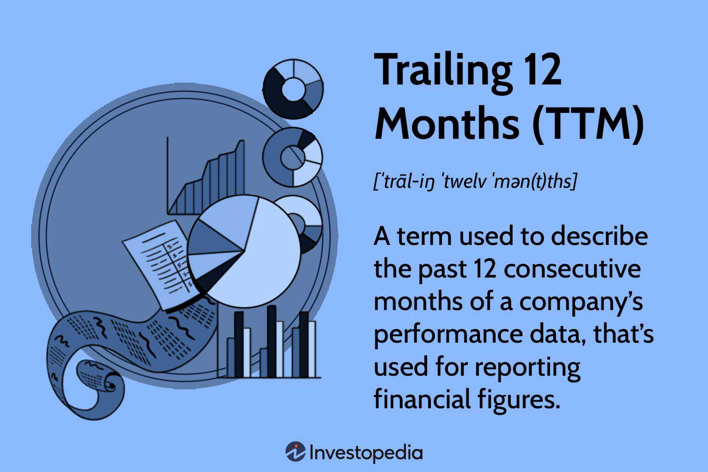

## Table of Contents

## What does Trailing Twelve Months (TTM) mean in finance?

Trailing Twelve Months (TTM) is a way to look at a company's financial performance over the last year. It takes the data from the most recent twelve months and puts it together. This helps people see how the company is doing right now, instead of waiting for the end of the year.

People use TTM a lot when they want to understand how a business is growing or making money. It's useful because it gives a current picture, which can be more helpful than looking at old yearly reports. For example, if you want to know how much profit a company made recently, you can use TTM to get that information quickly.

## Why is TTM important for financial analysis?

TTM is important for financial analysis because it gives a fresh look at a company's performance. Instead of waiting for the end of the year to see how a company did, TTM lets you see the last twelve months right now. This is helpful because it shows you the most recent data, which can tell you if the company is doing better or worse than before. It's like checking the weather today instead of last year; you get a better idea of what's happening now.

Using TTM also helps in comparing companies more fairly. Since companies might have different fiscal years, looking at TTM data means you're always comparing the same amount of time. This makes it easier to see which company is doing better or growing faster. For people who invest money or run businesses, this up-to-date and fair comparison is really useful for making smart choices.

## How is TTM calculated?

To calculate TTM, you add up the financial numbers from the last twelve months. If you want to know a company's total sales for the TTM, you take the sales from the most recent four quarters. For example, if today is June 2023, you would add the sales from the second quarter of 2023, the first quarter of 2023, the fourth quarter of 2022, and the third quarter of 2022.

Sometimes, you might not have all the data for the last twelve months. If a company just released its quarterly report, you can use that new data along with the data from the three quarters before it. This way, you always have the most up-to-date information for the last year. TTM helps you see how a company is doing right now, which is important for making good decisions about investments or business strategies.

## Can TTM be used for any financial metric?

Yes, TTM can be used for any financial metric that a company reports on a regular basis. This includes things like sales, profits, expenses, and cash flow. If a company gives out numbers every three months, you can add up the last four quarters to get the TTM for that metric. This helps you see how much money the company made or spent over the last year, no matter when their fiscal year ends.

Using TTM for different metrics can be really helpful. For example, if you want to know how much profit a company made recently, you can use TTM to see the profit for the last twelve months. This is more current than waiting for the end of the year. It's also good for comparing different companies, because you're always looking at the same amount of time, even if their fiscal years are different.

## What are the advantages of using TTM over other time periods?

Using TTM gives you a fresh look at how a company is doing right now. Instead of waiting for the end of the year, TTM lets you see the last twelve months at any time. This is helpful because it shows you the most recent data, which can tell you if the company is doing better or worse than before. It's like checking the weather today instead of last year; you get a better idea of what's happening now.

Another advantage of TTM is that it helps in comparing companies more fairly. Since companies might have different fiscal years, looking at TTM data means you're always comparing the same amount of time. This makes it easier to see which company is doing better or growing faster. For people who invest money or run businesses, this up-to-date and fair comparison is really useful for making smart choices.

## How does TTM help in comparing financial performance across different companies?

TTM helps in comparing financial performance across different companies by giving everyone the same time frame to look at. Companies might have different fiscal years, which means their year-end reports come at different times. But with TTM, you always look at the last twelve months no matter when a company's year ends. This makes it fair and easy to compare how much money different companies made or how fast they are growing.

For example, if Company A's fiscal year ends in December and Company B's ends in June, looking at their yearly reports would not be a fair comparison. But with TTM, you can see how both companies did over the same recent period, like from January to December. This helps investors and business people make better choices because they can see which company is doing better right now, not just at the end of their different fiscal years.

## What are the limitations of using TTM in financial analysis?

Using TTM has some downsides. One problem is that it might not show you the whole picture of a company's performance. If a company had a really good or bad quarter, that can make the TTM look better or worse than it really is over a longer time. For example, if a company made a lot of money in one quarter because of a one-time event, the TTM might look great, but that doesn't mean the company will keep doing that well.

Another limitation is that TTM can be affected by seasonal changes. Some businesses make more money at certain times of the year, like holiday sales for a toy company. If you look at TTM right after a busy season, it might make the company look better than it does during slower times. So, it's important to know when a company's busy times are to understand if the TTM numbers are showing a normal or unusual time for the business.

## How can TTM impact investment decisions?

TTM can help people make better choices about where to invest their money. By looking at a company's TTM numbers, investors can see how the company is doing right now, not just at the end of the year. This is important because it shows if the company is making more money or growing faster recently. If the TTM shows that a company's profits are going up, an investor might decide to buy more of that company's stock, hoping it will keep doing well.

But TTM can also be tricky. Sometimes, a company might have a really good or bad quarter that makes the TTM look different from how the company usually does. For example, if a company made a lot of money one time because of a special event, the TTM might look great, but that doesn't mean the company will keep making that much money. Also, TTM can be affected by when a company makes most of its money during the year, like during holidays. So, investors need to think about these things when using TTM to decide where to put their money.

## In what ways can TTM be misleading if not used correctly?

TTM can be misleading if you don't use it the right way. One big problem is that it can be affected by a single quarter that was really good or bad. If a company had a great quarter because of something that won't happen again, like selling a big piece of property, the TTM might make the company look better than it really is. This can trick investors into thinking the company is doing better than it will in the future.

Another way TTM can be misleading is because of seasonal changes. Some businesses make a lot more money at certain times of the year, like toy companies during the holidays. If you look at TTM right after a busy season, it might make the company look better than it does during slower times. So, if you don't know when a company's busy times are, you might get the wrong idea about how well it's doing overall.

## How do analysts adjust TTM data for seasonal businesses?

Analysts adjust TTM data for seasonal businesses by looking at the whole year and understanding when the business makes the most money. They might take out the really busy times, like holiday sales, to see how the company does during normal times. This way, they get a better idea of what the company's regular performance looks like, not just when it's doing really well because of the season.

For example, if a company sells a lot of ice cream in the summer, an analyst might look at TTM but also check how the company did in the winter. By doing this, they can see if the company is doing okay all year round, not just during the hot months. This helps them make smarter decisions about the company's health and future, without being tricked by seasonal highs and lows.

## What role does TTM play in valuation models like DCF?

TTM plays an important role in valuation models like Discounted Cash Flow (DCF) because it gives you a recent look at how much money a company is making. In a DCF model, you need to guess how much money the company will make in the future. By using TTM, you start with the most up-to-date numbers, which can help make your guesses more accurate. This is helpful because it lets you see how the company is doing right now, instead of waiting for the end of the year.

But TTM can be tricky when used in DCF models if the company's business changes a lot throughout the year. For example, if a company makes most of its money during the holidays, the TTM might make it look like the company always does that well. Analysts need to be careful and might need to adjust the TTM numbers to account for these seasonal changes. By doing this, they can make sure their DCF model is based on a fair view of the company's performance, not just a peak time.

## How has the use of TTM evolved with advancements in financial technology?

The use of TTM has changed a lot because of new technology in finance. Before, it was hard to get the most recent numbers from a company. People had to wait for reports that came out every three months or once a year. But now, with computers and the internet, companies can share their numbers faster. This means investors can see TTM data almost right away. They can use special software and websites to look at TTM numbers and make quick decisions about where to put their money.

Also, financial technology has made it easier to adjust TTM data for things like seasonal changes. Analysts can use computer programs to take out the busy times of the year and see how a company does normally. This helps them make better guesses about how much money a company will make in the future. With these tools, TTM is more useful than ever for understanding how a company is doing right now and making smart investment choices.

## What is TTM and why is it a key financial metric?

Trailing Twelve Months (TTM) is an essential metric in financial analysis that aggregates data from the past 12 months to offer a comprehensive and up-to-date financial picture of a company. By focusing on the preceding 12 months, TTM negates the effects of seasonality, thereby providing a clearer and more consistent snapshot of a company's ongoing performance. This characteristic makes TTM particularly valuable in settings where understanding a company's current financial health is key, as it avoids the distortions that can arise from seasonal variations.

The calculation of TTM involves summing up the financial results of a company from the most recent four quarters. This approach offers a more continuous and immediate reflection of a company's financial standing than traditional fiscal year reports. The formal representation of TTM for any financial metric can be expressed as follows:

$$

\text{TTM metric} = \sum_{i=1}^{4} \text{Quarter}_i 
$$

Where $\text{Quarter}_i$ represents the financial result for each of the last four quarters.

By depending on data from the past year, TTM provides a more meaningful measure compared to fiscal year metrics that might relate to a period in the distant past. This methodology ensures that the most recent company performance data is used, which is essential for stakeholders, including investors and analysts, in making informed decisions.

## How do you calculate TTM for financial ratios?

Trailing Twelve Months (TTM) is a method that offers a view into the financial health of a company by examining the cumulative data from the past twelve months. This information can be pivotal when calculating various financial ratios necessary for investment analysis, such as the Price/Earnings (P/E) ratio.

The P/E ratio, a widely recognized indicator, is calculated by taking the current market price per share and dividing it by the earnings per share (EPS) over a specified period. When using TTM, the formula for the P/E ratio becomes:

$$
\text{P/E Ratio (TTM)} = \frac{\text{Current Share Price}}{\text{EPS (TTM)}}
$$

Where EPS (TTM) is derived by summing the reported earnings in the most recent four quarters. Utilizing TTM in this context allows investors to assess a stock's value using the latest earnings data, eliminating the potential distortions that can arise from seasonal or one-off occurrences in quarterly results. Consequently, the TTM P/E ratio offers a more consistent and accurate reflection of a company's performance and its valuation.

In investment analysis, several other ratios can be calculated using TTM data, including:

1. **Return on Equity (ROE) (TTM):** This measures a corporation's profitability by revealing how much profit a company generates with the money shareholders have invested. It can be calculated using the formula:

   \[ \text{ROE (TTM)} = \frac{\text{Net Income (TTM)}}{\text{Shareholder's Equity}}
$$

2. **Gross Profit Margin (TTM):** This ratio examines the efficiency of production and the pricing strategy by assessing the gross profit as a percentage of revenue:

   \[ \text{Gross Profit Margin (TTM)} = \frac{\text{Gross Profit (TTM)}}{\text{Total Revenue (TTM)}} \times 100
$$

By leveraging TTM data, investors maintain analytical consistency. This uniformity is crucial as it enhances the reliability of trading algorithms. It ensures that trading strategies are based on the most up-to-date and relevant financial data, enabling investors to make informed decisions and better manage risks in the volatile world of trading. Consistent TTM-based analyses help in evaluating whether a stock or portfolio is adequately valued or if adjustments are necessary, contributing to a stable investment strategy.

## References & Further Reading

[1]: ["Financial Statement Analysis and Security Valuation"](https://www.amazon.com/Financial-Statement-Analysis-Security-Valuation/dp/0073379662) by Stephen H. Penman

[2]: ["Trading and Exchanges: Market Microstructure for Practitioners"](https://www.amazon.com/Trading-Exchanges-Market-Microstructure-Practitioners/dp/0195144708) by Larry Harris

[3]: ["Algorithmic Trading and DMA: An introduction to direct access trading strategies"](https://www.amazon.com/Algorithmic-Trading-DMA-introduction-strategies/dp/0956399207) by Barry Johnson

[4]: ["Numerical Python: A Practical Techniques Approach for Industry"](https://link.springer.com/book/10.1007/978-1-4842-0553-2) by Robert Johansson

[5]: Alexander, C. (2001). ["Market Models: A Guide to Financial Data Analysis"](https://www.casact.org/sites/default/files/old/marketmodels.pdf). John Wiley & Sons.