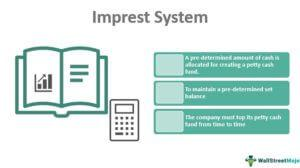

In today's fast-paced financial environment, effective cash and fund management is essential to ensuring smooth and efficient operations. Imprest funds present a practical solution for managing small, routine expenses with minimal bureaucratic interference. By maintaining a specified amount of cash for minor expenditures, organizations can swiftly address immediate financial needs, thereby enhancing operational efficiency.

Meanwhile, algorithmic trading systems have revolutionized financial markets by introducing a level of automation and precision that was previously unattainable. These systems utilize complex algorithms to execute trades based on pre-defined criteria, thereby reducing human error and allowing for rapid execution of transactions. The integration of technology in trading has not only increased the speed of transactions but also lowered costs and improved real-time decision-making.



Understanding the intersection of imprest funds and algorithm trading offers significant advantages in financial systems. By combining the efficient cash flow management of imprest funds with the sophisticated execution capabilities of algorithmic trading, financial systems can benefit from optimized operational processes. This synergy promises enhanced cost efficiency and improved allocation of resources, supporting more strategic financial decisions.

## Table of Contents

## Understanding Imprest Funds

An imprest fund serves as a fixed cash account that caters specifically to minor, everyday business expenses. The primary structure of an imprest fund is designed around maintaining a stable balance by making regular replenishments that correspond precisely to the expenses incurred. Essentially, this system ensures that the fund perpetually reflects the initial amount set aside, minus any receipts accounted for as disbursements.

To further elaborate, an imprest fund operates on a reimbursement basis, where expenses are paid upfront, and the fund is subsequently topped up to its original amount based on the receipts provided. This method is advantageous because it minimizes the need for issuing numerous checks or electronic transfers for trivial amounts, which can be both time-consuming and costly in terms of administrative resources.

Moreover, imprest funds are instrumental in mitigating unauthorized or excessive spending. By delineating a clear boundary around permissible expenses and ensuring that replenishments are contingent on rigorous documentation, organizations can exercise substantial control over petty cash flow. Regular monitoring and reconciliation are integral to this process, as they provide a mechanism for detecting discrepancies and curbing potential misuse or financial irregularities at an early stage.

In practice, the efficiency of an imprest fund hinges on meticulous record-keeping and stringent auditing processes. Companies often implement internal controls such as setting expenditure limits and appointing designated custodians responsible for fund management, further fortifying the fund's integrity against misappropriation. Such controls not only safeguard the fund but also enhance financial accountability and transparency within the organization.

## The Imprest System in Financial Management

Imprest systems have proven to be effective tools in financial management, particularly for handling petty cash transactions with efficiency and control. These systems are structured around the creation of an initial cash fund designated for small, routine expenses. The hallmark of an imprest system is its cyclical nature; it ensures that a pre-set cash balance is consistently maintained through regular replenishments that offset the expenses made.

The operation of an imprest system begins with the establishment of a fund, where a fixed amount of money is set aside for petty cash needs. Disbursements from this fund are made for approved small-scale transactions, typically those that are not feasible to process through the regular procurement or payment cycles due to their size or urgency. To facilitate quick financial decisions, the imprest fund provides the [liquidity](/wiki/liquidity-risk-premium) necessary for immediate access without the burden of bureaucratic delays.

A crucial aspect of managing an imprest system is the maintenance of strict records. Every disbursement from the fund requires documentation of the transaction, including receipts and purpose of the expenditure. This not only aids in tracking expenses but also simplifies the process of fund replenishment. By submitting these records to the finance department, the exact amount needed to restore the fund to its initial level can be determined and authorized.

Reconciliation and auditing are critical elements of the imprest system to prevent misuse and ensure funds are utilized as intended. Regular reconciliation involves comparing the recorded expenses against the remaining cash balance, while audits verify the accuracy and legitimacy of the transactions. These processes help identify any discrepancies or unauthorized expenditures, providing an added layer of financial oversight.

In summary, imprest systems enhance petty cash management by establishing a recurring cycle of disbursal and replenishment, supported by stringent record-keeping and reconciliation to avert misuse and overspending. This enables organizations to make quick financial decisions while maintaining robust accountability and control over their minor expenditure activities.

## Algorithmic Trading in Financial Systems

Algorithmic trading, commonly referred to as algo trading, employs pre-programmed instructions to execute large orders with increased efficiency and speed. This method capitalizes on complex algorithms to make decisions regarding the timing, pricing, and quantity of orders. By automating the trading process, [algorithmic trading](/wiki/algorithmic-trading) substantially reduces human error. Human discretion, often fraught with emotional biases and inconsistencies, is replaced with a consistent, objective framework that leverages historical data and predictive analytics.

One of the primary advantages of algorithmic trading is the reduction in transaction costs. By determining the optimal timing and size for trades, the algorithms minimize market impact and the associated costs. This is achieved through strategies such as statistical [arbitrage](/wiki/arbitrage), [market making](/wiki/market-making), and [trend following](/wiki/trend-following). These strategies analyze large datasets in real-time, taking advantage of arbitrage opportunities or market inefficiencies that are typically imperceptible to human traders.

Real-time analysis is another critical benefit of algorithmic trading. The algorithms are designed to process and respond to market conditions instantaneously, providing a competitive edge in fast-paced trading environments. This capability allows traders to capitalize on fleeting opportunities, executing trades in milliseconds—a task beyond human capability.

Algorithmic trading systems are designed to integrate seamlessly with various financial systems, offering flexibility across different market arenas. This adaptability ensures that these systems can be employed alongside other financial mechanisms, such as imprest funds, to manage cash flow efficiently and execute trades within pre-set constraints. By automating fund replenishments and trade executions, financial institutions can enhance operational efficiency and ensure compliance with predefined financial strategies.

Furthermore, the use of algorithmic trading within financial systems supports risk management through diversification and hedging strategies. Automated systems can continuously monitor positions and execute risk-reducing trades in response to market movements, thereby maintaining the firm's exposure within acceptable limits.

In summary, algorithmic trading is a transformative approach that enhances the efficiency, cost-effectiveness, and precision of trading activities. Its integration into contemporary financial systems, including those utilizing imprest funds, underscores its versatility and strategic value. As technology continues to advance, the scope and capability of algorithmic trading are likely to expand, further embedding it as a cornerstone of modern financial operations.

## Integrating Imprest Funds with Algo Trading

Integrating imprest funds with algorithmic trading presents a compelling opportunity to enhance the efficiency and accuracy of financial transaction processes. Imprest systems, which operate with a fixed cash account designated for minor, routine expenses, can be tailored to function as a controlled cash flow mechanism, supporting the seamless execution of algorithmic trades. This integration not only simplifies fund management but also ensures that trading operations are conducted within predefined financial parameters.

To effectively merge imprest funds with algorithmic trading, it is crucial to establish predefined limits that guide the trading activity. These limits serve to regulate the cash flow, ensuring that the imprest account maintains its constant balance. By setting thresholds for expenses related to trading, an organization can prevent excessive and unauthorized transactions that could destabilize the financial system.

Automation plays a pivotal role in this integration process. By automating the replenishment of the imprest fund, organizations can maintain optimal liquidity levels for trading while minimizing manual intervention. This can be achieved through algorithmic rules coded in trading platforms, where the trigger conditions for replenishment are clearly defined. For instance, a simple replenishment rule in Python using a pseudo-trading platform API might look like this:

```python
def check_and_replenish_balance(imprest_fund, threshold, max_balance):
    if imprest_fund.get_balance() < threshold:
        amount_to_replenish = max_balance - imprest_fund.get_balance()
        imprest_fund.replenish(amount_to_replenish)

threshold = 5000  # Minimum balance threshold
max_balance = 10000  # Maximum allowed balance

check_and_replenish_balance(imprest_fund, threshold, max_balance)
```

In this example, the function `check_and_replenish_balance` ensures that whenever the balance of the imprest fund drops below a certain threshold, it automatically replenishes the fund up to the maximum allowed balance. This method maintains fiscal control while enabling sufficient liquidity for executing algorithmic trades.

Furthermore, the integration requires that financial systems capable of algorithmic trading be equipped to recognize the cash flow dynamics of imprest systems. This involves synchronization between the imprest fund parameters and the trading algorithms to ensure that all transactions are executed in a fiscally responsible manner. By implementing such integrated strategies, organizations can optimize their financial operations, maintaining a balance between agile response to market opportunities and adherence to budgetary constraints.

## Challenges and Solutions

Managing imprest funds effectively requires maintaining precise records and preventing misuse, which are significant challenges. Accurate record-keeping ensures that the funds are spent appropriately, aligning with prescribed limits and purposes. To address this, organizations typically establish detailed protocols for documenting every transaction. Regular reconciliations of the imprest account, involving matching the balance with receipts and invoices, are crucial. A discrepancy often indicates potential errors or misappropriation, necessitating immediate investigation.

Algorithmic trading systems also encounter specific challenges, predominantly around regulatory compliance and technology risks. Regulatory compliance demands adherence to laws and guidelines that vary significantly across jurisdictions. This obligation requires continuous monitoring and updating of trading algorithms to ensure they operate within legal frameworks. Furthermore, the complexity and speed of algorithmic trading expose systems to technology risks, such as software errors or cyberattacks, which could lead to significant financial losses.

Both imprest fund management and algorithmic trading benefit from the implementation of robust internal controls and regular audits to mitigate these challenges. Internal controls in imprest fund management include establishing clear authorization protocols for fund access and use. These controls help prevent unauthorized access and ensure funds are used for their intended purposes. Similarly, algorithmic trading systems require rigorous controls to monitor trading activities and assess compliance with relevant regulations.

Conducting regular audits is another effective strategy. Audits involve comprehensive reviews of financial records and trading activities, identifying discrepancies or areas for improvement. In the context of imprest funds, audits verify that funds are accounted for accurately and have been used as intended. For algorithmic trading, audits can reveal deviations from compliance requirements and suggest enhancements to the algorithm's logic.

By integrating stringent internal controls and audit procedures, organizations can enhance the reliability and security of imprest funds and algorithmic trading systems. These measures ensure both financial integrity and compliance, aligning with broader organizational goals.

## Future Trends in Imprest Fund Management and Algo Trading

The rapid advancement of digital technologies is significantly transforming imprest fund management. Modern imprest systems are increasingly leveraging automation and digital tools to streamline processes and enhance financial oversight. These advancements facilitate real-time tracking and replenishment of funds, thereby reducing administrative overhead and increasing accuracy. Integration of mobile and web-based platforms allows for seamless transactions and instant access to fund reports, making the system more flexible and responsive to organizational needs.

Algorithmic trading is poised to become even more integral to financial markets as [artificial intelligence](/wiki/ai-artificial-intelligence) (AI) and [machine learning](/wiki/machine-learning) technologies continue to improve. These technologies enable more complex trading strategies by analyzing vast datasets to identify patterns that human traders might miss. AI-driven algorithms can adapt to market changes in real-time, optimizing trade executions to maximize profits while minimizing risks. Machine learning also aids in predictive analytics, enhancing the capability of algorithms to forecast market trends and behavior with greater precision.

The convergence of imprest fund management and algorithmic trading into comprehensive, integrated systems represents the future of financial operations. Such systems will combine the control and efficiency of imprest funds with the sophistication of algorithmic trading strategies. This integration can create a seamless financial process where imprest funds can be utilized with programmable trading conditions, ensuring optimal cash flow management and transaction timeliness.

Building these integrated systems requires setting precise triggers and implementing automated fund replenishment protocols that are responsive to trading activity and market conditions. For example, using Python, a simple script could automatically replenish an imprest fund when it drops below a certain threshold, ensuring sufficient liquidity for trading activities. Here's a basic example:

```python
def replenish_fund(current_balance, threshold, replenish_amount):
    if current_balance < threshold:
        current_balance += replenish_amount
        return current_balance
    return current_balance

# Example usage
current_balance = 5000
threshold = 1000
replenish_amount = 5000

new_balance = replenish_fund(current_balance, threshold, replenish_amount)
```

The future trend leans towards fully automated systems that blend real-time fund management sync with algorithmic trading strategies driven by AI. This fusion will ensure financial systems are not only efficient but also adaptive to the dynamic landscape of global financial markets, ultimately improving strategic decision-making and cost efficiency in financial operations.

## Conclusion

Imprest funds and algorithmic trading constitute pivotal elements in modern financial systems. Imprest funds, with their structured approach to managing small-scale expenses, help maintain financial discipline, prevent unauthorized spending, and allow rapid response to minor financial needs. Algorithmic trading, on the other hand, enables the execution of large and complex trades with enhanced speed and precision, reducing human error and operational costs.

Integrating these two systems can lead to notable improvements in financial transaction processes. An imprest fund can act as a controlled source for executing algorithmic trades, ensuring that transactions are conducted within established financial constraints. This integration can enhance overall efficiency by automating cash flow management and providing real-time adjustments based on market conditions. Moreover, it aids in reducing costs associated with manual interventions and errors, thereby optimizing financial management practices.

Continued innovation in these domains promises further advancements. As technological capabilities expand, particularly with improvements in artificial intelligence and machine learning, both imprest fund management and algorithmic trading will become increasingly sophisticated. This advancement will likely lead to more comprehensive systems that harmonize fund management with complex trading algorithms, resulting in more informed and strategic decision-making processes. As these trends evolve, financial operations will become not only more streamlined but also strategically aligned with market dynamics, securing a competitive advantage in the fast-paced financial landscape.

## References & Further Reading

[1]: Bergstra, J., Bardenet, R., Bengio, Y., & Kégl, B. (2011). ["Algorithms for Hyper-Parameter Optimization."](https://dl.acm.org/doi/10.5555/2986459.2986743) Advances in Neural Information Processing Systems 24.

[2]: ["Advances in Financial Machine Learning"](https://www.amazon.com/Advances-Financial-Machine-Learning-Marcos/dp/1119482089) by Marcos Lopez de Prado

[3]: ["Evidence-Based Technical Analysis: Applying the Scientific Method and Statistical Inference to Trading Signals"](https://www.amazon.com/Evidence-Based-Technical-Analysis-Scientific-Statistical/dp/0470008741) by David Aronson

[4]: ["Machine Learning for Algorithmic Trading"](https://github.com/stefan-jansen/machine-learning-for-trading) by Stefan Jansen

[5]: ["Quantitative Trading: How to Build Your Own Algorithmic Trading Business"](https://www.amazon.com/Quantitative-Trading-Build-Algorithmic-Business/dp/1119800064) by Ernest P. Chan

[6]: Hasbrouck, J., & Saar, G. (2013). ["Low-latency Trading."](https://www.sciencedirect.com/science/article/abs/pii/S1386418113000165) The Journal of Finance, 68(2), 573-618.

[7]: Hendershott, T., Jones, C. M., & Menkveld, A. J. (2011). ["Does Algorithmic Trading Improve Liquidity?"](https://onlinelibrary.wiley.com/doi/full/10.1111/j.1540-6261.2010.01624.x) The Review of Financial Studies, 24(3), 713-749.