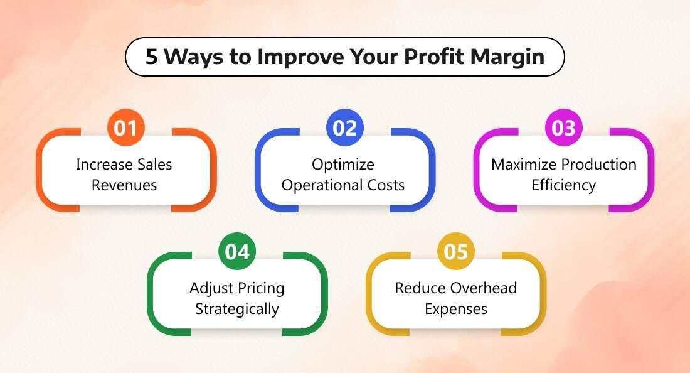

## Table of Contents

## What is net margin and why is it important for a company?

Net margin is a financial number that shows how much profit a company makes after paying all its costs. It is calculated by taking the net profit and dividing it by the total revenue, then turning that into a percentage. This number tells you what part of each dollar earned by the company is kept as profit.

Knowing the net margin is important for a company because it helps them see if they are making enough money to stay healthy and grow. If the net margin is high, it means the company is good at turning sales into profit. If it's low, the company might need to find ways to cut costs or increase prices. This information is also useful for investors who want to know if the company is a good place to put their money.

## How can a beginner understand the calculation of net margin?

To understand how to calculate net margin, think of it like figuring out how much money you keep after buying everything you need. First, you need to know the company's total revenue, which is all the money it made from selling its products or services. Then, you need to know the net profit, which is what's left after the company pays for everything it needs to run, like materials, employee salaries, and other expenses. To find the net margin, you divide the net profit by the total revenue and then multiply by 100 to get a percentage. This percentage tells you how much of every dollar earned is profit.

For example, if a company made $100,000 in revenue and had $80,000 in total expenses, its net profit would be $20,000. To calculate the net margin, you would divide $20,000 by $100,000, which equals 0.2. Then, multiply 0.2 by 100 to get a net margin of 20%. This means that for every dollar the company earns, it keeps 20 cents as profit. Understanding this helps you see how well the company is doing at making money after covering all its costs.

## What are the common factors that affect a company's net margin?

Many things can change a company's net margin. One big [factor](/wiki/factor-investing) is the cost of goods sold, which includes the money spent on making or buying the products the company sells. If these costs go up because materials or labor get more expensive, the net margin can go down. Another important factor is operating expenses, like rent, utilities, and employee salaries. If these costs increase without a matching increase in sales, the net margin will shrink. Competition can also play a role. If other companies lower their prices, a company might have to do the same to keep customers, which could mean less profit for each sale.

Taxes and interest expenses also affect net margin. If a company has a lot of debt, the interest it has to pay can eat into its profits. Changes in tax laws can mean the company has to pay more in taxes, which would reduce the net profit and thus the net margin. On the positive side, if a company can find ways to make its operations more efficient, like using less energy or automating some tasks, it can lower its costs and improve its net margin. Sales [volume](/wiki/volume-trading-strategy) is another factor; selling more products can spread out fixed costs over more units, potentially increasing the net margin.

## How can cost reduction strategies improve net margin?

Cost reduction strategies can help a company keep more money as profit, which makes the net margin bigger. One way to do this is by finding cheaper suppliers for materials or services. If a company can buy things it needs for less money, it spends less overall, and that means more money left over after paying for everything. Another way is by making operations more efficient, like using machines to do some jobs instead of people, or finding ways to use less energy or materials. These changes can lower the costs of running the business, which helps increase the net margin.

Also, a company can look at its big expenses like rent or salaries and see if there are ways to spend less. Maybe they can move to a cheaper building or find ways to do more work with fewer people. Sometimes, companies can even negotiate better deals with their suppliers or service providers to pay less. All these steps help the company keep more of the money it makes, which is what net margin is all about. By spending less, the company can turn more of its sales into profit, making its net margin higher.

## What role does pricing strategy play in enhancing net margin?

Pricing strategy is a big part of making a company's net margin better. When a company sets its prices, it needs to think about how much it costs to make or buy the product and how much profit it wants to make. If the company can charge more for its products without losing customers, it can make more money on each sale. This means more profit left over after paying for everything, which makes the net margin bigger. For example, if a company finds that people are willing to pay more for a special feature, it can raise its prices and keep more of the money as profit.

On the other hand, sometimes a company might choose to lower its prices to sell more products. This can work if selling more makes up for the lower price per item. If the company can sell a lot more products at a slightly lower price, it might still make more money overall. This can help spread out the fixed costs like rent and salaries over more sales, which can also improve the net margin. The trick is finding the right balance between price and sales volume to make the most profit possible.

## How can increasing sales volume impact net margin?

Increasing sales volume can help a company make more profit, which can improve its net margin. When a company sells more products, it can spread out its fixed costs, like rent and salaries, over more sales. This means each product doesn't have to make as much profit to cover these costs. If the company can sell a lot more without increasing these fixed costs too much, more of the money from each sale can be kept as profit.

However, it's important to think about how much it costs to make or buy more products. If the costs go up a lot when the company makes more, like if they need to pay more for materials or work longer hours, the extra sales might not help the net margin as much. The key is to make sure the increase in sales brings in more money than it costs to make those extra products. If the company can do this, increasing sales volume can be a good way to improve its net margin.

## What are effective ways to manage and reduce overhead costs?

Managing and reducing overhead costs is important for a company to keep more money as profit. One way to do this is by looking at all the regular expenses like rent, utilities, and office supplies. The company can try to find cheaper places to rent or move to a smaller space if they don't need a big one. They can also switch to energy-saving lights and machines to lower their utility bills. Buying supplies in bulk or finding cheaper suppliers can also help save money.

Another way to reduce overhead costs is by making the business more efficient. This can mean using technology to do some jobs instead of hiring more people, which can save on salaries. The company can also train its workers to do more than one job, so they don't need as many employees. Sometimes, working from home can be an option, which can cut down on the need for a big office space. By looking at all these areas and making smart choices, a company can lower its overhead costs and keep more of its earnings.

## How can a company use financial analysis to pinpoint areas for net margin improvement?

A company can use financial analysis to find ways to make its net margin better by looking closely at its income statement. This statement shows all the money the company makes and all the money it spends. By comparing the total revenue to the net profit, the company can see its current net margin. If the net margin is low, the company can look at the different costs listed on the income statement, like the cost of goods sold and operating expenses. If these costs are too high, the company might need to find cheaper suppliers or ways to make things more efficiently. By doing this, the company can spend less money and keep more as profit, which will make the net margin bigger.

Another way financial analysis helps is by looking at trends over time. The company can compare its net margin from one year to the next to see if it's getting better or worse. If the net margin is going down, the company can look at what's changed. Maybe the costs have gone up, or maybe the company isn't selling as much. By understanding these trends, the company can make smart choices about where to focus its efforts. For example, if the cost of goods sold is going up a lot, the company might need to find new suppliers or change how it makes its products. By using financial analysis to find these problem areas, the company can work on making its net margin better.

## What advanced strategies can be implemented to optimize supply chain costs?

To optimize supply chain costs, a company can use advanced strategies like just-in-time inventory management. This means the company only orders what it needs right when it needs it, which can cut down on storage costs and reduce the risk of having too much stock that might go bad or become outdated. Another strategy is to use data analytics to predict how much of each product will be needed. By looking at past sales and other information, the company can order just the right amount, which helps save money and keeps the supply chain running smoothly.

Another way to optimize supply chain costs is by working closely with suppliers to build strong relationships. This can lead to better deals and more reliable deliveries, which can save money over time. The company can also look into using technology like automation and robotics to make the supply chain more efficient. For example, robots can help move things around in a warehouse faster and with fewer mistakes, which can lower labor costs and speed up the whole process. By using these advanced strategies, a company can make its supply chain more cost-effective and improve its net margin.

## How can technology and automation contribute to improving net margin?

Technology and automation can help a company make more money by cutting down on costs. When a company uses machines or software to do jobs that people used to do, it can save a lot on salaries and other employee costs. For example, robots in a factory can work around the clock without getting tired, and they don't need breaks or vacations. This means the company can make more products without hiring more workers, which helps keep costs low and profits high.

Automation also makes things more efficient. If a company uses software to manage its inventory, it can keep track of what it has and what it needs more accurately. This means the company won't have to spend money on storing too much stuff or running out of things and losing sales. By making the whole process smoother and faster, technology helps the company spend less money and make more profit, which makes the net margin better.

## What are the industry-specific challenges and opportunities for improving net margin?

In different industries, there are special challenges and chances to make the net margin better. For example, in the retail industry, one big challenge is keeping prices low while still making a good profit. Retailers have to deal with a lot of competition, so they need to find ways to cut costs, like using cheaper suppliers or making their stores more efficient. On the other hand, a big opportunity for retailers is using online sales to reach more customers without having to open more physical stores. This can help them sell more without spending a lot more money, which can improve their net margin.

In the manufacturing industry, a major challenge is the cost of making things. If the price of materials goes up, it can make it harder to keep a good net margin. Manufacturers need to find ways to make their products more efficiently, maybe by using machines to do some of the work or finding cheaper materials. But there's also a big opportunity in using technology to make their factories run better. By using automation and smart systems, they can make more products for less money, which can really help their net margin.

## How can a company maintain a sustainable increase in net margin over the long term?

To keep a company's net margin growing over a long time, it needs to focus on making its business run smoothly and cutting down on costs. One way to do this is by always looking for ways to make things more efficient. This could mean using new technology or finding cheaper ways to get the things the company needs. By doing this, the company can keep its costs low even as it grows. Another important thing is to keep an eye on the competition and make sure the company's prices are good but still make enough profit. If the company can sell more without spending a lot more money, it can keep its net margin high.

Another key part of keeping the net margin up over time is to keep customers happy and coming back. This means making sure the products or services are good and that customers feel like they're getting a good deal. If customers keep coming back, the company can sell more without having to spend a lot on finding new customers. It's also important to keep up with changes in the market and be ready to change the way the company does things if needed. By staying flexible and always looking for ways to do better, a company can keep its net margin growing over the long term.

## What is Understanding Net Margin?

Net margin, or net profit margin, is a fundamental financial metric that evaluates a company's profitability by expressing net income as a percentage of total revenue. Its formula is:

$$
\text{Net Margin} = \left(\frac{\text{Net Profit}}{\text{Total Revenue}}\right) \times 100
$$

This calculation provides insights into how effectively a company converts its total revenues into profit after all expenses, including operating costs, taxes, and interest on debt, have been accounted for. A higher net margin signifies superior cost management and a heightened ability to generate profit from revenues, reflecting overall financial health and efficiency.

In essence, the net margin ratio allows businesses and investors to gauge the portion of revenue that remains as profit, offering an indicator of financial stability and operational success. This profitability measure can vary significantly across industries due to differing cost structures and pricing strategies. Consequently, analyzing net margin in conjunction with other financial metrics provides a comprehensive view of a company’s financial performance and sustainability.

## References & Further Reading

To gain a deeper understanding of profit margins and their impact on trading, several resources can be beneficial. Scholarly articles and financial textbooks providing comprehensive analyses of profitability metrics, such as "Damodaran on Valuation" by Aswath Damodaran, offer insights into the calculation and interpretation of net and gross margins. These resources lay foundational knowledge crucial for traders aiming to incorporate these metrics into sophisticated trading models.

For those interested in the application of financial metrics within [algorithmic trading](/wiki/algorithmic-trading) strategies, "Algorithmic Trading: Winning Strategies and Their Rationale" by Ernie Chan is a valuable resource. This book explores quantitative and algorithmic approaches extensively, demonstrating how financial ratios and profitability indicators can be integrated into automated trading systems. Chan's work is complemented by accessible online courses available through platforms like Coursera and Udemy, which often include modules on financial data analysis and algorithm design.

To further enhance understanding, accessing databases such as Bloomberg Terminal or Thomson Reuters Eikon is recommended for real-time data analysis. These platforms provide traders and financial analysts with current and historical data crucial for the development and testing of trading algorithms.

Python, being a versatile tool in the field of algorithmic trading, can be used extensively for modeling and simulation. The Python package `pandas` is particularly useful for manipulating financial data sets, while `numpy` and `scipy` can handle more complex computations required in algorithmic strategy development. Example Python scripts applying net margin calculations and trading strategy simulations can be found in online repositories like GitHub, where developers and traders share their code and insights. These resources combined offer a comprehensive path to mastering the integration of financial metrics into algorithmic trading strategies.

