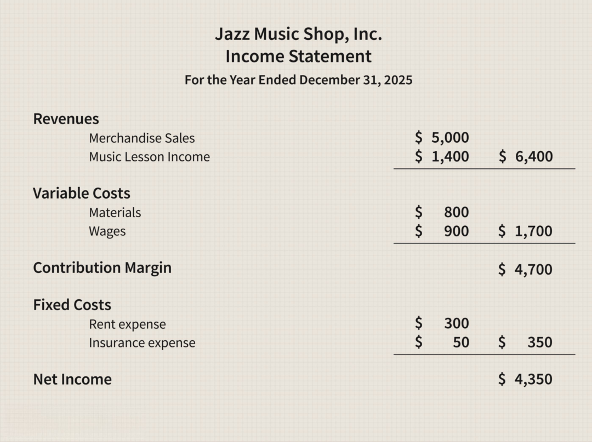

In the financial world, profitability metrics such as net margin are essential for evaluating a company's financial health and operational efficiency. Net margin, defined as the ratio of net profit to total revenue, provides insight into how effectively a company converts its revenues into actual profit. This measure is crucial for companies and investors alike, as it indicates whether a company is capable of maintaining cost control and generating profit after accounting for all operational expenses, taxes, and interest.

Algorithmic trading, a practice that increasingly dominates modern financial markets, leverages predefined algorithms to enhance trading execution and profitability. By utilizing complex mathematical models and fast data processing, algorithmic trading offers significant advantages in terms of speed, accuracy, and the ability to manage large volumes of trades. The integration of financial performance metrics, such as the net margin, into these algorithms can greatly increase the efficiency and success of trading strategies. This article examines the critical role that financial performance and profitability, particularly net margin, play in shaping and optimizing algorithmic trading strategies, leading to more informed and effective trading decisions.



## Table of Contents

## Understanding Net Margin

Net margin, or net profit margin, is a fundamental financial metric that evaluates a company's profitability by expressing net income as a percentage of total revenue. Its formula is:

$$
\text{Net Margin} = \left(\frac{\text{Net Profit}}{\text{Total Revenue}}\right) \times 100
$$

This calculation provides insights into how effectively a company converts its total revenues into profit after all expenses, including operating costs, taxes, and interest on debt, have been accounted for. A higher net margin signifies superior cost management and a heightened ability to generate profit from revenues, reflecting overall financial health and efficiency.

In essence, the net margin ratio allows businesses and investors to gauge the portion of revenue that remains as profit, offering an indicator of financial stability and operational success. This profitability measure can vary significantly across industries due to differing cost structures and pricing strategies. Consequently, analyzing net margin in conjunction with other financial metrics provides a comprehensive view of a company’s financial performance and sustainability.

## Profitability in Algorithmic Trading

Algorithmic trading uses mathematical models and algorithms to execute trades with high precision and speed. By incorporating financial metrics such as net margin, these algorithms enhance decision-making and profitability outcomes. Net margin is the percentage of revenue that remains as profit after all expenses are deducted, making it a key indicator of financial health and efficiency. 

When these metrics are integrated into trading algorithms, they provide a robust framework for evaluating the potential profitability of trades. For instance, algorithms can be programmed to identify companies with high net margins, which often signals efficient operations and financial stability. This identification process can involve the following programming logic in Python:

```python
def select_high_net_margin_stocks(stocks):
    high_margin_stocks = []
    for stock in stocks:
        net_margin = calculate_net_margin(stock)
        if net_margin > threshold:
            high_margin_stocks.append(stock)
    return high_margin_stocks

def calculate_net_margin(stock):
    return (stock['net_profit'] / stock['total_revenue']) * 100

# Example usage:
stocks_data = [
    {'ticker': 'ABC', 'net_profit': 1_000_000, 'total_revenue': 5_000_000},
    {'ticker': 'XYZ', 'net_profit': 200_000, 'total_revenue': 1_000_000},
    # More stock data...
]
threshold = 15  # 15% net margin threshold
selected_stocks = select_high_net_margin_stocks(stocks_data)
```

In this example, algorithms scan market data to isolate stocks that meet or exceed a predefined net margin threshold. By programmatically filtering data, traders can focus on stocks with the most promising profit margins, potentially leading to better investment decisions.

Moreover, integrating these financial performance indicators into algorithms allows for the automation of trade executions. This automation optimizes timing and minimizes human error, further enhancing profitability. Rapid execution is crucial in [algorithmic trading](/wiki/algorithmic-trading) as financial markets can change within milliseconds. By leveraging net margin data, algorithms can respond to these changes swiftly and precisely, ensuring that trades are executed in the most advantageous conditions.

Ultimately, the strategic incorporation of net margin metrics into trading algorithms not only boosts efficiency but also supports more informed investment strategies, offering a competitive edge in the fast-paced financial markets.

## Boosting Revenues to Improve Net Margin

Increasing revenues is a fundamental strategy for improving a company's net margin, which represents the portion of revenue that translates into profit. Businesses typically employ two primary methods to boost revenues: increasing sales [volume](/wiki/volume-trading-strategy) and adjusting pricing strategies. However, both strategies must be carefully implemented, taking into account market demand and consumer response to avoid potential negative impacts on profitability.

1. **Sales Volume Increase**: Expanding the sales volume involves selling more units of a product or service. Businesses may achieve this through enhanced marketing efforts, expanding market reach, diversifying product lines, or improving product quality to attract more customers. A successful increase in sales volume has the potential to significantly augment revenues, which, when managed efficiently, can lead to an improved net margin.

2. **Pricing Strategy Adjustments**: Adjusting pricing strategies is another avenue for revenue enhancement. This approach involves carefully setting the price of products to balance between maximizing revenue and maintaining customer satisfaction. Higher prices can lead to increased revenue, provided that the demand remains elastic enough to support sales at elevated prices. Effective market research and customer feedback are crucial to determining the optimal pricing strategy.

Algorithmic trading plays a pivotal role in monitoring revenue trends and identifying growth opportunities in financial markets. By utilizing sophisticated algorithms, traders can analyze large datasets to detect patterns and predict future revenue performances of stocks. This data-driven approach enables investors to identify companies with strong revenue growth potential. For instance, algorithms can be programmed to track revenue indicators such as quarterly earnings reports, market share expansion, and industry growth trends.

In practice, algorithmic trading systems may include the following Python code snippet to incorporate revenue-based metrics in the analysis of potential investments:

```python
import pandas as pd
import yfinance as yf  # For more datasets, visit: https://paperswithbacktest.com/datasets

# Function to calculate revenue growth rate
def calculate_revenue_growth(ticker, start_date, end_date):
    # Fetch financial data
    company = yf.Ticker(ticker)
    financials = company.quarterly_financials.T

    # Filter relevant revenue data
    filtered_data = financials['Total Revenue'].loc[start_date:end_date]

    # Calculate percentage growth
    revenue_growth = filtered_data.pct_change().mean() * 100
    return revenue_growth

# Example usage
ticker = "AAPL"
start_date = "2021-01-01"
end_date = "2021-12-31"
growth_rate = calculate_revenue_growth(ticker, start_date, end_date)
print(f"Average Revenue Growth Rate for {ticker} from {start_date} to {end_date}: {growth_rate:.2f}%")
```

In this code, we use `yfinance`, a Python library, to fetch and analyze quarterly financials of a given company. By calculating the average revenue growth rate, traders can make data-driven decisions on whether a company's revenue trajectory aligns with their investment objectives.

Overall, by leveraging advanced computational tools and rigorous financial analysis, businesses and traders can devise strategies to enhance revenues, thereby improving net margins and achieving better financial outcomes.

## Reducing Costs to Improve Net Margin

Reducing operational costs is a critical strategy for improving a company's net margin. By minimizing the expenses incurred in producing and delivering goods or services, businesses can effectively increase profitability. Cost reduction strategies encompass various approaches, such as lowering operating expenses by streamlining processes and improving efficiency. This includes adopting technology solutions that automate routine tasks, thereby reducing labor costs and minimizing human error, which can be costly.

Sourcing cheaper raw materials is another effective method to cut costs. This involves negotiating better terms with existing suppliers or finding alternative suppliers who offer similar quality materials at a lower price. Companies can also reduce costs by optimizing their supply chain and logistics to ensure that goods are delivered more efficiently, reducing transportation costs and inventory holdings.

Expanding business operations to benefit from economies of scale can further decrease costs per unit. As production volume increases, companies can spread fixed costs over more units, reducing the average cost per unit and increasing net margin. This requires careful planning and analysis to avoid overproduction, which can lead to excess inventory and increased storage costs.

Trading algorithms can incorporate cost-reduction measures when assessing investment opportunities. For example, algorithms can be programmed to prioritize companies with lower cost structures or those that are actively reducing costs, as these firms might have improved profitability prospects. This can be achieved using quantitative financial data, integrating metrics such as operating expenses as a percentage of revenue, and real-time data feeds to continually assess a company's cost performance.

Here is a basic Python code snippet that demonstrates how trading algorithms might [factor](/wiki/factor-investing) in cost-reduction measures:

```python
def evaluate_investment_opportunity(revenue, operating_expenses):
    cost_efficiency = (operating_expenses / revenue)
    if cost_efficiency < 0.3:  # Sample threshold for cost efficiency
        return True  # Consider this company as a favorable investment
    return False

# Example usage
companies_data = [
    {"revenue": 1000000, "operating_expenses": 250000},
    {"revenue": 2000000, "operating_expenses": 800000},
]

investment_opportunities = [evaluate_investment_opportunity(company['revenue'], company['operating_expenses'])
                            for company in companies_data]

print(investment_opportunities)  # Output: [True, False]
```

The code evaluates whether a company is a good investment opportunity based on its cost efficiency, with a threshold for the ratio of operating expenses to revenue. Such evaluations can be automated in trading algorithms to make faster, data-driven decisions in the financial markets. This underscores the importance of integrating financial performance metrics into algorithmic trading strategies to capture potential gains from cost-efficient operations.

## Role of Financial Metrics in Algorithmic Trading

Financial metrics such as net margin and gross margin play a crucial role in enhancing algorithmic trading strategies. These metrics provide traders with quantitative insights, enabling them to make informed, data-driven investment decisions. The integration of these metrics into trading algorithms allows for a more precise evaluation of investment opportunities by assessing the profitability and cost efficiency of different financial instruments.

Net margin, calculated as $(\text{Net Profit} / \text{Total Revenue}) \times 100$, serves as an indicator of a company's ability to convert revenue into profit. Similarly, gross margin, defined as $(\text{Total Revenue} - \text{Cost of Goods Sold}) / \text{Total Revenue} \times 100$, highlights the efficiency with which a company produces and sells its goods. By incorporating these financial metrics into trading algorithms, traders can identify companies that exhibit strong financial health, which may suggest higher potential returns.

Moreover, the inclusion of real-time financial data into these algorithms is essential for maintaining trading precision and responsiveness. Real-time data ensures that the algorithms are reacting to the most current market conditions, thereby optimizing trade execution. For example, a trading algorithm might be programmed to execute trades based on real-time fluctuations in net and gross margins, automatically adjusting strategies as these metrics change.

To illustrate, consider a simple Python function that evaluates stocks based on their net margin and gross margin:

```python
def evaluate_stock(stock_data):
    for stock in stock_data:
        net_margin = (stock['net_profit'] / stock['total_revenue']) * 100
        gross_margin = ((stock['total_revenue'] - stock['cost_of_goods_sold']) / stock['total_revenue']) * 100

        if net_margin > 15 and gross_margin > 30:
            print(f"Stock {stock['name']} is a potential buy due to strong financial metrics.")

# Example stock data
stocks = [
    {'name': 'Company A', 'net_profit': 500, 'total_revenue': 2000, 'cost_of_goods_sold': 1400},
    {'name': 'Company B', 'net_profit': 300, 'total_revenue': 1500, 'cost_of_goods_sold': 1000},
]

evaluate_stock(stocks)
```

In this example, the function evaluates each stock based on specified thresholds for net and gross margins, identifying stocks that meet the criteria for potential investment. By leveraging such computational tools, traders can systematically integrate financial metrics into their decision-making processes, ultimately enhancing the efficacy of algorithmic trading strategies. Integrating financial metrics into algorithmic trading not only facilitates better investment decisions but also positions traders to rapidly adapt to evolving financial landscapes.

## Integrating Metrics into Trading Algorithms

In algorithmic trading, the integration of financial metrics, such as net and gross profit margins, is crucial for optimizing trading decisions. Ensuring data accuracy and utilizing real-time data sources are foundational to maintaining the efficiency and reliability of trading algorithms. Real-time data enables traders to respond swiftly to market fluctuations, thereby enhancing their competitive edge.

To automate decision-making, traders often set specific thresholds for financial metrics. For instance, a trading algorithm can be programmed to execute buy or sell orders when a company's net margin exceeds a predetermined level. This approach allows for systematic and disciplined trading, reducing emotional and impulsive decisions that can negatively impact performance.

Risk management is another critical component of integrating metrics into trading algorithms. Effective strategies such as diversification and stop-loss mechanisms are essential to safeguard against potential losses. Diversification involves spreading investments across various assets to mitigate risk. Meanwhile, stop-loss orders automatically close a position once it reaches a certain loss threshold, protecting traders from significant downturns.

Here is a simple Python example illustrating how one might incorporate a threshold-based decision-making process into an algorithm:

```python
def trade_decision(stock_data, net_margin_threshold):
    for stock in stock_data:
        if stock['net_margin'] > net_margin_threshold:
            execute_trade('BUY', stock['symbol'])
        elif stock['net_margin'] < net_margin_threshold:
            execute_trade('SELL', stock['symbol'])

def execute_trade(action, symbol):
    print(f"{action} order executed for {symbol}")

# Example stock data
stock_data = [
    {'symbol': 'AAPL', 'net_margin': 21},
    {'symbol': 'GOOGL', 'net_margin': 19},
    {'symbol': 'AMZN', 'net_margin': 23}
]

# Set the net margin threshold
net_margin_threshold = 20

# Run trade decisions based on net margin
trade_decision(stock_data, net_margin_threshold)
```

This script evaluates each stock's net margin against a predefined threshold, executing buy or sell actions accordingly. In practice, trading algorithms would incorporate more complex logic and risk management protocols, ensuring robust and secure operation in dynamic market conditions.

By integrating financial metrics accurately and systematically, traders are better equipped to make informed decisions, enhancing their profitability and long-term success in financial markets.

## Conclusion

Net margin and other profitability metrics are indispensable in both traditional and algorithmic trading. By incorporating these metrics into trading algorithms, traders can achieve better-informed decisions and optimized strategies. Net margin, a reflection of a company's overall profitability, provides insights into the financial health and operational efficiency of a business. When traders integrate net margin data into their algorithms, they are better equipped to identify lucrative investment opportunities and assess the potential risks and returns associated with different assets.

In the context of algorithmic trading, these metrics enable automated systems to execute trades based on real-time financial data, enhancing decision-making accuracy and speed. For instance, algorithms can be programmed to prioritize investments in companies with consistently high net margins, suggesting efficient cost management and substantial profit generation. This strategic approach allows traders to navigate the complexities of financial markets more effectively.

Moreover, leveraging profitability metrics supports systematic review and adjustment of trading strategies. Algorithms can be fine-tuned to react instantly to financial data changes, minimizing the lag between data reception and trading execution. By doing so, traders increase their ability to capitalize on market opportunities and mitigate risks.

In conclusion, financial metrics such as net margin are not only crucial in evaluating company performance but also play a vital role in enhancing trading strategies. Traders utilizing these metrics within their algorithms are likely to experience an improved competitive edge in today's dynamic and fast-paced financial markets.

## References & Further Reading

To gain a deeper understanding of profit margins and their impact on trading, several resources can be beneficial. Scholarly articles and financial textbooks providing comprehensive analyses of profitability metrics, such as "Damodaran on Valuation" by Aswath Damodaran, offer insights into the calculation and interpretation of net and gross margins. These resources lay foundational knowledge crucial for traders aiming to incorporate these metrics into sophisticated trading models.

For those interested in the application of financial metrics within algorithmic trading strategies, "Algorithmic Trading: Winning Strategies and Their Rationale" by Ernie Chan is a valuable resource. This book explores quantitative and algorithmic approaches extensively, demonstrating how financial ratios and profitability indicators can be integrated into automated trading systems. Chan's work is complemented by accessible online courses available through platforms like Coursera and Udemy, which often include modules on financial data analysis and algorithm design.

To further enhance understanding, accessing databases such as Bloomberg Terminal or Thomson Reuters Eikon is recommended for real-time data analysis. These platforms provide traders and financial analysts with current and historical data crucial for the development and testing of trading algorithms.

Python, being a versatile tool in the field of algorithmic trading, can be used extensively for modeling and simulation. The Python package `pandas` is particularly useful for manipulating financial data sets, while `numpy` and `scipy` can handle more complex computations required in algorithmic strategy development. Example Python scripts applying net margin calculations and trading strategy simulations can be found in online repositories like GitHub, where developers and traders share their code and insights. These resources combined offer a comprehensive path to mastering the integration of financial metrics into algorithmic trading strategies.