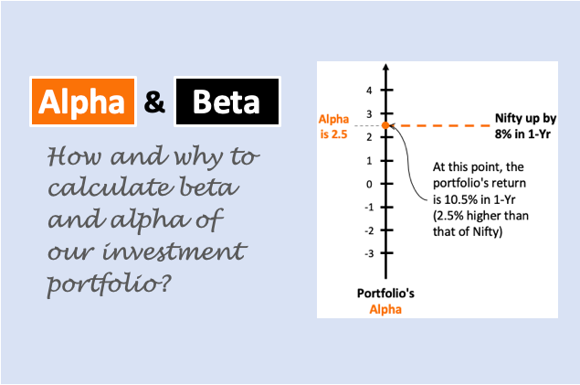

## Table of Contents

## What are alpha and beta in the context of investment portfolios?

In the world of investment portfolios, alpha and beta are two important measures that help investors understand the performance and risk of their investments. Alpha represents the excess return of an investment compared to a benchmark index, like the S&P 500. If a portfolio has a positive alpha, it means it has performed better than the benchmark, after accounting for the risk taken. A negative alpha indicates underperformance. Essentially, alpha is a way to gauge the skill of a portfolio manager in generating returns beyond what would be expected from the market.

Beta, on the other hand, measures the volatility or risk of an investment relative to the market as a whole. A beta of 1 means the investment moves in line with the market. If an investment has a beta greater than 1, it's considered more volatile than the market, meaning it could potentially offer higher returns but also comes with higher risk. Conversely, a beta less than 1 suggests the investment is less volatile and might provide more stable, but possibly lower, returns. Understanding beta helps investors assess how much risk they are taking on and whether it aligns with their investment goals.

## How can alpha be used to measure the performance of an investment?

Alpha is a way to see if an investment is doing better than just following the market. It's like a score that tells you how much more money you made compared to what you would have made if you just invested in a common market index, like the S&P 500. If your investment has a positive alpha, it means it did better than the market. If it has a negative alpha, it means it didn't do as well as the market. So, alpha helps you figure out if the person managing your money is doing a good job or not.

For example, if you put your money in a fund that aims to beat the market, you can look at its alpha to see if it's actually doing that. If the fund's alpha is positive, it means the fund manager made smart choices and your investment grew more than it would have if you just invested in the market. But if the alpha is negative, it might mean the fund manager's choices didn't work out so well. By looking at alpha, you can decide if you want to keep your money in that fund or if you should look for a different one that might do better.

## What does beta tell us about the risk of an investment?

Beta is a number that tells you how risky an investment is compared to the whole market. If an investment has a beta of 1, it means it moves up and down just like the market does. So, if the market goes up by 10%, the investment should also go up by about 10%. But if an investment has a beta higher than 1, it means it's more risky because it moves more than the market. For example, if the market goes up by 10%, an investment with a beta of 1.5 might go up by 15%. This can be good when the market is doing well, but it can also mean bigger losses if the market goes down.

On the other hand, if an investment has a beta lower than 1, it means it's less risky because it doesn't move as much as the market. For example, if the market goes up by 10%, an investment with a beta of 0.5 might only go up by 5%. This can be good if you want a safer investment, but it also means you might not make as much money when the market is doing well. So, by looking at the beta, you can get a sense of how much risk you're taking with your investment and decide if it fits with what you want.

## How can an investor use alpha to identify outperforming assets?

An investor can use alpha to find assets that are doing better than the market by looking at the alpha value of those assets. Alpha shows how much more or less an asset has earned compared to what it would have if it just followed the market. If an asset has a positive alpha, it means it's doing better than the market. For example, if you invest in a stock and it has an alpha of 2, it means that stock has earned 2% more than the market did. By checking the alpha of different assets, an investor can spot which ones are beating the market and might be good choices for their portfolio.

It's important to keep in mind that a high alpha doesn't always mean an asset will keep outperforming in the future. Past performance doesn't guarantee future results, but it can give you a clue about which assets might be worth watching. If you see an asset with a consistently positive alpha over time, it could be a sign that the managers of that asset are making smart choices. So, by using alpha, investors can make more informed decisions about where to put their money, trying to pick assets that have a track record of doing better than the market.

## What is the significance of a beta value greater than 1?

A beta value greater than 1 means that an investment is more risky than the overall market. If the market goes up, this investment will go up even more, and if the market goes down, the investment will fall even further. For example, if the market goes up by 10%, an investment with a beta of 1.5 might go up by 15%. This can be exciting when the market is doing well because you could make more money, but it can also be scary when the market is not doing well because you could lose more money.

Investors who like to take more risks might look for investments with a beta over 1 because they hope to get higher returns. But it's important to remember that with higher potential rewards come higher potential risks. So, someone thinking about investing in something with a high beta should be ready for bigger ups and downs and make sure it fits with their overall plan for their money.

## How can beta be used to construct a diversified investment portfolio?

Beta can help you build a diversified investment portfolio by showing you how different investments move compared to the market. If you have some investments with a high beta, like over 1, they can go up and down a lot. But if you also have investments with a low beta, like under 1, they won't move as much. By mixing these together, you can balance out the risk. For example, if the market goes down, your high beta investments might lose a lot, but your low beta investments won't lose as much, which can help protect your overall portfolio.

When you're picking investments, you can look at their beta to see how they might react to market changes. If you want a safer portfolio, you might choose more investments with a lower beta. But if you're okay with taking more risk for the chance of higher returns, you might pick more investments with a higher beta. By using beta, you can spread out your risk and make sure your portfolio isn't too heavily affected by big swings in the market. This way, you can feel more confident that your investments are working together to help you reach your goals.

## What are the limitations of using alpha and beta in investment analysis?

Using alpha and beta to analyze investments can be helpful, but they have some limits. Alpha shows how well an investment does compared to the market, but it doesn't tell you why it did well or if it will keep doing well. It's based on past performance, which doesn't always mean the same thing will happen in the future. Also, alpha can be affected by things like luck or short-term market changes, so it might not show the true skill of the person managing the investment.

Beta tells you how risky an investment is compared to the market, but it has its own problems too. Beta only looks at how an investment moves with the market and doesn't consider other risks, like changes in interest rates or company-specific problems. Also, beta is based on past data, so it might not be a good predictor of how an investment will act in the future, especially if the market changes a lot. So, while beta can give you an idea of risk, it's not a complete picture.

In short, alpha and beta are useful tools, but they shouldn't be the only things you look at when deciding where to invest your money. They give you part of the story, but you need to think about other things too, like the overall economy, the company's health, and your own investment goals. By understanding their limits, you can use alpha and beta as part of a bigger plan to make smarter investment choices.

## How do alpha and beta interact with each other in portfolio management?

In portfolio management, alpha and beta work together to help investors understand how their investments are doing and how risky they are. Alpha shows if an investment is doing better than the market. If your investment has a positive alpha, it means it's earning more than if you just followed the market. But, alpha doesn't tell you about the risk you're taking. That's where beta comes in. Beta tells you how much your investment moves up and down compared to the market. If your investment has a high beta, it means it's more risky because it moves more than the market. So, by looking at both alpha and beta, you can see if your investment is doing well and how much risk you're taking to get those returns.

When you're managing a portfolio, you want to balance alpha and beta to match your investment goals. If you're looking for higher returns, you might pick investments with a high alpha, but they often come with a high beta, which means more risk. On the other hand, if you want a safer portfolio, you might choose investments with a lower beta, but they might not give you as high an alpha. By understanding how alpha and beta interact, you can make better choices about which investments to put in your portfolio. This way, you can try to get the best returns while keeping the risk at a level you're comfortable with.

## Can you explain how to calculate alpha and beta for a specific stock?

To calculate the alpha of a specific stock, you need to compare its performance to a benchmark, like the S&P 500. First, find out the stock's return over a certain period, say a year. Then, find the return of the benchmark over the same period. Next, you need to know the stock's beta, which we'll talk about in a moment. Once you have the beta, you can use this formula: Alpha = (Stock's Return - Risk-Free Rate) - Beta * (Benchmark's Return - Risk-Free Rate). The risk-free rate is usually the return on a safe investment like a U.S. Treasury bond. If the alpha is positive, it means the stock did better than expected given its risk level. If it's negative, it did worse.

To calculate the beta of a stock, you need to look at how the stock's price moves compared to the market. You can do this by finding the stock's historical returns and the market's historical returns over the same period. Then, you calculate the covariance between the stock's returns and the market's returns, and divide that by the variance of the market's returns. The formula is: Beta = Covariance(Stock's Returns, Market's Returns) / Variance(Market's Returns). A beta of 1 means the stock moves with the market. A beta higher than 1 means it's more volatile, and a beta lower than 1 means it's less volatile. You can use financial websites or software to get these numbers and do the calculations for you.

## What advanced strategies can be employed to optimize portfolio alpha?

To optimize the alpha of a portfolio, investors can use a strategy called active management. This means they pick stocks or other investments they think will do better than the market. They do a lot of research to find companies that are growing fast, have good management, or are undervalued by the market. By choosing these investments carefully, they hope to get a higher alpha, which means their portfolio will do better than just following the market. They might also use tools like stock screeners and financial analysis software to help them find the best opportunities.

Another strategy is to use quantitative models. These are math-based ways to pick investments. Investors use computers to look at lots of data and find patterns that can help them predict which stocks will do well. They might look at things like how much a company earns, how much it grows, or even what people are saying about it on social media. By using these models, they can make decisions based on numbers and try to beat the market. This can help them get a higher alpha because they're using data to make smarter choices.

A third way to optimize alpha is through risk management. This means balancing the risk and reward in the portfolio. Investors might use techniques like hedging, where they buy investments that will go up if the market goes down, to protect their portfolio. They might also diversify by spreading their money across different types of investments, like stocks, bonds, and real estate. By managing risk well, they can try to get a higher alpha without taking on too much risk. This way, they can aim for better returns while keeping their portfolio safe.

## How does the use of alpha and beta differ in passive versus active investment strategies?

In passive investment strategies, investors usually try to match the performance of a market index, like the S&P 500. They don't aim for a high alpha because their goal is to get the same return as the market, not to beat it. Beta is more important in passive investing because it helps them understand how much their portfolio might move with the market. If they want a less risky portfolio, they might choose investments with a lower beta. So, in passive investing, alpha is less of a focus, and beta helps them manage risk and keep their investments stable.

In active investment strategies, investors try to do better than the market, so alpha is really important. They look for investments that they think will have a high alpha, meaning they'll earn more than the market. They might pick stocks they think are undervalued or companies they believe will grow a lot. Beta is still important in active investing because it tells them how much risk they're taking. If they want to try for higher returns, they might choose investments with a higher beta, but this means they could also lose more if the market goes down. So, in active investing, both alpha and beta are key, but alpha is what they're chasing to beat the market.

## What are some real-world examples where alpha and beta have significantly impacted investment decisions?

One real-world example where alpha and beta played a big role is the case of hedge fund manager David Einhorn's investment in Apple. In 2010, Einhorn saw that Apple had a lot of potential to grow and believed it could do better than the market. He used alpha to show that Apple's stock was undervalued and could earn more than the market. By investing in Apple, Einhorn's fund made a lot of money as Apple's stock price went up. At the same time, he looked at Apple's beta, which was around 1.5, meaning it was more risky than the market. But Einhorn was okay with that risk because he believed in Apple's future, and it paid off.

Another example is how investors used beta during the 2008 financial crisis. Many people wanted to protect their money from big market swings, so they looked for investments with a low beta. They chose things like utility companies and consumer staples, which don't move as much as the market. These investments had a beta lower than 1, which meant they were less risky. By focusing on beta, investors could keep their portfolios safer during a very scary time. This shows how beta can help people make decisions about risk, especially when the market is going through tough times.

## What is the understanding of Alpha and Beta in financial strategies?

Alpha and beta are fundamental components in evaluating and optimizing investment portfolios, serving as the building blocks of sophisticated financial strategies. Understanding these concepts allows investors to dissect their portfolio performance and align their investment approaches with specific financial goals.

Beta is a measure of a portfolio's market-related risk, reflecting its volatility relative to a market benchmark, such as the S&P 500. It quantifies the sensitivity of a portfolio’s returns to fluctuations in the broader market. A beta greater than one indicates that a portfolio is more volatile than the market, while a beta less than one suggests that it is less volatile. Mathematically, beta is often derived from the covariance between the portfolio returns and the market returns, divided by the variance of the market returns:

$$

\beta = \frac{\text{Cov}(R_p, R_m)}{\text{Var}(R_m)} 
$$

where $R_p$ and $R_m$ are the returns of the portfolio and the market, respectively.

In contrast, alpha represents the excess returns generated from active management strategies, independent of the market's movements. Alpha indicates how much returns surpass what would be predicted by the portfolio's beta, thus offering a measure of the value added by the portfolio manager's skill. A positive alpha suggests that the portfolio has outperformed its benchmark after adjusting for risk, whereas a negative alpha indicates underperformance. The formula for alpha is often expressed as:

$$

\alpha = R_p - [ \text{Rf} + \beta \times (R_m - \text{Rf}) ]
$$

where $R_p$ is the portfolio return, $\text{Rf}$ is the risk-free rate, $R_m$ is the market return, and $\beta$ is the beta of the portfolio.

By distinguishing between alpha and beta, investors can assess the effectiveness of their investment strategies, identifying how much of their portfolio's performance is due to market exposure (beta) versus the selection of individual investments and timing (alpha). This distinction helps investors to tailor their strategies according to their return expectations and risk appetite, ensuring a balanced and informed approach to managing their portfolios.

## What is the Alpha-Beta Framework?

The alpha-beta framework is an essential construct in investment portfolio management, providing a methodology for distinguishing between returns that are due to general market movements and those derived from active management strategies. Alpha and beta, both integral to this framework, are used to analyze and enhance investment performance.

Beta ($\beta$) represents a portfolio's sensitivity to movements in the overall market. It quantifies the systematic risk associated with a portfolio compared to a market benchmark, such as the S&P 500. A beta greater than 1 indicates that the portfolio is more volatile than the market, while a beta less than 1 suggests less [volatility](/wiki/volatility-trading-strategies). This metric helps investors understand how their portfolios might respond to market changes.

On the other hand, alpha ($\alpha$) measures the excess return of a portfolio relative to the returns predicted by its beta. It is a gauge of a portfolio manager’s effectiveness in generating returns beyond what would be expected given the portfolio's exposure to market risk. Alpha is calculated using the following formula:

$$
\alpha = R_p - \left( R_f + \beta (R_m - R_f) \right)
$$

Where:
- $R_p$ is the portfolio return,
- $R_m$ is the market return,
- $R_f$ is the risk-free rate.

In this framework, linear regression analysis is employed to estimate the alpha and beta of a portfolio. The regression model seeks to fit the historical returns of the portfolio to the returns of the market index, determining how much of the return is due to market movements (beta) and how much is due to active management (alpha). The regression equation is typically structured as:

$$
R_p = \alpha + \beta R_m + \epsilon
$$

Here, $\epsilon$ represents the residual term, capturing the idiosyncratic risk not explained by the market.

Understanding and applying the alpha-beta framework allows investors to systematically manage risks while pursuing optimal returns. By accurately assessing beta, investors can align their portfolios with their risk tolerance and market outlook. Simultaneously, identifying alpha helps investors evaluate the performance of active management, determining whether such strategies are adding value beyond market movements.

Ultimately, the alpha-beta framework supports investors in making informed decisions aimed at achieving desired risk-return profiles. It enhances their ability to allocate resources effectively, continually monitor portfolio performance, and adapt strategies in response to changing market dynamics.

## References & Further Reading

[1]: ["Advances in Financial Machine Learning"](https://www.amazon.com/Advances-Financial-Machine-Learning-Marcos/dp/1119482089) by Marcos Lopez de Prado

[2]: ["Quantitative Trading: How to Build Your Own Algorithmic Trading Business"](https://books.google.com/books/about/Quantitative_Trading.html?id=j70yEAAAQBAJ) by Ernest P. Chan

[3]: Fama, Eugene F., and Kenneth R. French. (1993). ["Common risk factors in the returns on stocks and bonds."](https://www.sciencedirect.com/science/article/pii/0304405X93900235) Journal of Financial Economics, 33(1), 3-56.

[4]: Grinold, Richard C., and Ronald N. Kahn. (1999). ["Active Portfolio Management: A Quantitative Approach for Producing Superior Returns and Controlling Risk"](https://www.amazon.com/Active-Portfolio-Management-Quantitative-Controlling/dp/0070248826) Second Edition.

[5]: ["Evidence-Based Technical Analysis: Applying the Scientific Method and Statistical Inference to Trading Signals"](https://www.amazon.com/Evidence-Based-Technical-Analysis-Scientific-Statistical/dp/0470008741) by David Aronson

[6]: Black, F., Jensen, M. C., & Scholes, M. (1972). ["The Capital Asset Pricing Model: Some Empirical Tests."](https://papers.ssrn.com/sol3/papers.cfm?abstract_id=908569) Studies in the Theory of Capital Markets.