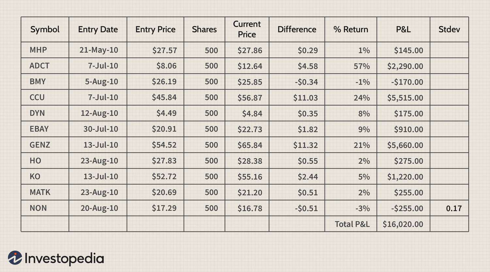

The financial markets provide a plethora of investment strategies designed to cater to varying risk appetites and expected returns. Among these sophisticated strategies is the utilization of alpha and beta in investment portfolios, particularly through the deployment of algorithmic trading techniques. Alpha and beta are foundational concepts in finance, where beta measures the tendency of a security's returns to respond to market movements, and alpha reflects the ability of an investment to outperform the benchmark index, designated as alpha = (actual return - expected return based on beta).

Algorithmic trading, which relies on computer algorithms to make trading decisions, amplifies the potential of alpha and beta strategies by enabling more precise execution and faster response times to market changes. Through such processes, investors can better manage risk while maximizing returns, thus enhancing the strategic value of their portfolios. This article will explore the complexities of financial strategies that involve alpha and beta, examine their functions within an investment portfolio, and consider the ways algorithmic trading can bolster these strategies.



## Table of Contents

## Understanding Alpha and Beta in Financial Strategies

Alpha and beta are fundamental components in evaluating and optimizing investment portfolios, serving as the building blocks of sophisticated financial strategies. Understanding these concepts allows investors to dissect their portfolio performance and align their investment approaches with specific financial goals.

Beta is a measure of a portfolio's market-related risk, reflecting its volatility relative to a market benchmark, such as the S&P 500. It quantifies the sensitivity of a portfolio’s returns to fluctuations in the broader market. A beta greater than one indicates that a portfolio is more volatile than the market, while a beta less than one suggests that it is less volatile. Mathematically, beta is often derived from the covariance between the portfolio returns and the market returns, divided by the variance of the market returns:

$$

\beta = \frac{\text{Cov}(R_p, R_m)}{\text{Var}(R_m)} 
$$

where $R_p$ and $R_m$ are the returns of the portfolio and the market, respectively.

In contrast, alpha represents the excess returns generated from active management strategies, independent of the market's movements. Alpha indicates how much returns surpass what would be predicted by the portfolio's beta, thus offering a measure of the value added by the portfolio manager's skill. A positive alpha suggests that the portfolio has outperformed its benchmark after adjusting for risk, whereas a negative alpha indicates underperformance. The formula for alpha is often expressed as:

$$

\alpha = R_p - [ \text{Rf} + \beta \times (R_m - \text{Rf}) ]
$$

where $R_p$ is the portfolio return, $\text{Rf}$ is the risk-free rate, $R_m$ is the market return, and $\beta$ is the beta of the portfolio.

By distinguishing between alpha and beta, investors can assess the effectiveness of their investment strategies, identifying how much of their portfolio's performance is due to market exposure (beta) versus the selection of individual investments and timing (alpha). This distinction helps investors to tailor their strategies according to their return expectations and risk appetite, ensuring a balanced and informed approach to managing their portfolios.

## The Alpha-Beta Framework

The alpha-beta framework is an essential construct in investment portfolio management, providing a methodology for distinguishing between returns that are due to general market movements and those derived from active management strategies. Alpha and beta, both integral to this framework, are used to analyze and enhance investment performance.

Beta ($\beta$) represents a portfolio's sensitivity to movements in the overall market. It quantifies the systematic risk associated with a portfolio compared to a market benchmark, such as the S&P 500. A beta greater than 1 indicates that the portfolio is more volatile than the market, while a beta less than 1 suggests less [volatility](/wiki/volatility-trading-strategies). This metric helps investors understand how their portfolios might respond to market changes.

On the other hand, alpha ($\alpha$) measures the excess return of a portfolio relative to the returns predicted by its beta. It is a gauge of a portfolio manager’s effectiveness in generating returns beyond what would be expected given the portfolio's exposure to market risk. Alpha is calculated using the following formula:

$$
\alpha = R_p - \left( R_f + \beta (R_m - R_f) \right)
$$

Where:
- $R_p$ is the portfolio return,
- $R_m$ is the market return,
- $R_f$ is the risk-free rate.

In this framework, linear regression analysis is employed to estimate the alpha and beta of a portfolio. The regression model seeks to fit the historical returns of the portfolio to the returns of the market index, determining how much of the return is due to market movements (beta) and how much is due to active management (alpha). The regression equation is typically structured as:

$$
R_p = \alpha + \beta R_m + \epsilon
$$

Here, $\epsilon$ represents the residual term, capturing the idiosyncratic risk not explained by the market.

Understanding and applying the alpha-beta framework allows investors to systematically manage risks while pursuing optimal returns. By accurately assessing beta, investors can align their portfolios with their risk tolerance and market outlook. Simultaneously, identifying alpha helps investors evaluate the performance of active management, determining whether such strategies are adding value beyond market movements.

Ultimately, the alpha-beta framework supports investors in making informed decisions aimed at achieving desired risk-return profiles. It enhances their ability to allocate resources effectively, continually monitor portfolio performance, and adapt strategies in response to changing market dynamics.

## Application of Alpha and Beta in Algorithmic Trading

Algorithmic trading utilizes computer algorithms to automate trading decisions, leveraging the separation of alpha and beta to enhance portfolio performance. This approach allows investors to delineate between systematic market risks and active management strategies, thereby optimizing returns and managing risks effectively.

To capture beta, [algorithmic trading](/wiki/algorithmic-trading) often employs index funds or futures, instruments designed to mirror market benchmarks such as the S&P 500. These vehicles facilitate efficient exposure to broad market movements with reduced transaction costs and operational complexities. For instance, futures contracts enable investors to manage significant market positions with relatively low capital outlay, allowing for scalable and efficient portfolio adjustments.

On the other hand, pursuing alpha within an algorithmic trading framework involves strategies aimed at generating excess returns through active management. Statistical [arbitrage](/wiki/arbitrage) is a common technique, utilizing statistical methods to identify and exploit pricing inefficiencies between correlated securities. This method involves creating long and short positions based on predicted price convergence, thereby attempting to achieve market-neutral profits independent of overall market direction.

Equity market neutral positions are another strategy employed to pursue alpha. These positions aim to balance long and short equity holdings to neutralize market risk, isolating specific factors or company performance as sources of return. By focusing on relative performance rather than absolute market movements, these strategies help maintain an intended risk profile while targeting additional gains.

The separation of alpha and beta within algorithmic trading frameworks not only streamlines risk management but also enhances return optimization across varying market climates. By clearly distinguishing between systematic risk exposure and active return generation, investors can adapt their portfolios to align with evolving financial landscapes and investor goals.

## Innovative Approaches to Obtaining Alpha and Beta

Investors can obtain beta exposure efficiently through vehicles like index funds and futures contracts. Index funds, which track a specific benchmark, offer a straightforward method to mimic the market's performance, ensuring investors gain exposure to market-wide movements. Futures contracts provide another avenue, allowing traders to manage significant market positions without deploying extensive capital upfront. This leverage potential means futures are particularly useful for investors seeking broad market exposure with minimized cash outlay.

On the quest for alpha, investors employ strategies like [statistical arbitrage](/wiki/statistical-arbitrage) and [liquidity](/wiki/liquidity-risk-premium) premium selling, particularly in fixed income markets. Statistical arbitrage hinges on identifying price inefficiencies between related financial instruments through statistical models. This strategy often involves rapid trading to exploit mean reversion tendencies in asset prices. Meanwhile, liquidity premium selling capitalizes on the extra yields gained from investing in less liquid assets. By taking on liquidity risk, investors can potentially achieve returns that exceed those of more traditional, liquid securities.

The advancement of technology plays a pivotal role in uncovering alpha opportunities. Machine learning and data analytics are revolutionizing algorithmic trading frameworks. Machine learning algorithms, such as random forests or neural networks, analyze vast datasets to identify hidden patterns and predictive signals. These models can adapt and improve over time, enhancing their ability to pinpoint lucrative trading opportunities. Data analytics, on the other hand, allows for the processing and interpretation of complex data en masse, providing insights that inform investment decisions and help refine trading strategies.

For instance, a typical [machine learning](/wiki/machine-learning) model used in discovering alpha might preprocess financial data—such as stock prices or trading volumes—before training a supervised learning algorithm to predict future price movements. The following is an example of a simple Python script using scikit-learn to implement linear regression for alpha discovery:

```python
import pandas as pd
from sklearn.model_selection import train_test_split
from sklearn.linear_model import LinearRegression
from sklearn.metrics import mean_squared_error

# Load dataset
data = pd.read_csv('financial_data.csv')
X = data[['feature_1', 'feature_2', 'feature_3']]  # Independent variables
y = data['future_price']  # Dependent variable

# Split data into training and testing sets
X_train, X_test, y_train, y_test = train_test_split(X, y, test_size=0.2, random_state=42)

# Create and train the model
model = LinearRegression()
model.fit(X_train, y_train)

# Make predictions and evaluate the model
predictions = model.predict(X_test)
mse = mean_squared_error(y_test, predictions)

print(f"Mean Squared Error: {mse}")
```

This script demonstrates a fundamental approach to predicting future prices based on historical data patterns, a crucial element in generating alpha. By leveraging such sophisticated techniques, investors bolster their ability to create robust, high-performing portfolios that transcend normal market returns.

## Challenges in Alpha-Beta Separation

Alpha-beta separation in portfolio management is a sophisticated strategy aimed at distinguishing between returns generated from market exposure (beta) and those garnered from active management (alpha). Although this approach offers several strategic benefits, it is not without its challenges, which are predominantly associated with model risk, data quality, and regulatory compliance.

**Model Risk**

Quantitative models are the backbone of alpha-beta separation. They rely on statistical techniques to differentiate between alpha and beta in investment portfolios. However, these models are susceptible to model risk, which refers to the possibility that a model is incorrect or misapplied. To mitigate this risk, continuous model validation and updates are essential. As market conditions change, models must adapt to new patterns and unforeseen market events. This requires constant refinement to keep the models aligned with the current financial environment. For example, a linear regression model used to estimate beta might require recalibration to account for structural changes in the market or shifts in the underlying asset correlations.

**Data Quality**

Accurate alpha and beta estimation hinges on the integrity of the data used in calculations. Poor data quality can lead to incorrect estimates, resulting in misinformed investment decisions. Data must be both accurate and complete, and it should be sourced from reliable providers. Consistency in historical data and real-time updates are crucial for maintaining accurate assessments of an investment portfolio's components. Furthermore, data pre-processing techniques must be applied to handle outliers, missing values, and noise, ensuring that the input dataset is robust and reliable for model inputs.

**Regulatory Compliance**

Adhering to financial regulations is a critical aspect of maintaining operational efficiency and avoiding systemic risks in alpha-beta strategies. Regulations such as the Markets in Financial Instruments Directive II (MiFID II) impose stringent requirements on data reporting and transparency, which influence how alpha and beta are managed and reported. Compliance with these regulations necessitates detailed record-keeping and reporting mechanisms that are up-to-date and precise. For instance, MiFID II requires firms to enhance transaction reporting standards and improve the quality of execution data, impacting the ways algorithms are designed to optimize alpha-beta separation. Failure to comply with such regulations can lead to significant penalties and damage to an institution's reputation.

In conclusion, while alpha-beta separation provides a robust framework for distinguishing between market-related and active management returns, overcoming the challenges associated with model risk, data quality, and regulatory compliance is crucial for effective implementation. By continually validating models, ensuring data integrity, and adhering to regulatory standards, investors can better manage risk and optimize portfolio performance.

## Conclusion

Alpha-beta separation is a fundamental aspect of advanced financial strategies, enabling investors to distinctly analyze the contributions of market movements (beta) and active management (alpha) to portfolio returns. This differentiation provides investors with a clearer understanding of where their returns are coming from—either from market exposure or from specific strategic decisions made by the portfolio manager.

As algorithms and computational technologies continue to evolve, the precision and efficacy of alpha-beta separation have improved significantly. These advancements facilitate the detailed analysis and execution of strategies that can effectively balance risk and potential rewards. Algorithmic trading, enhanced through machine learning and big data analytics, allows for real-time adjustments to strategies, increasing the potential for securing alpha while maintaining target beta exposure.

The refinement of these computational techniques means that investors can systematically reduce volatility and exposure to unsystematic risks, effectively managing risk through diversification and hedging. By employing these sophisticated methodologies, investors are better equipped to optimize portfolio returns with a considered approach towards balancing risk. Ultimately, effective alpha-beta separation contributes to achieving superior long-term portfolio performance, as investors gain the ability to strategically capitalize on both market trends and insightful, data-driven investment decisions.

In conclusion, the integration of alpha-beta separation in financial strategies provides a structured approach to dissecting returns, which can significantly enhance the analytical capabilities of investors. With the continuous progression of computational methods, these strategies not only promise improved risk management but also pave the way for more robust and successful portfolio outcomes in dynamic market environments.

## References & Further Reading

[1]: ["Advances in Financial Machine Learning"](https://www.amazon.com/Advances-Financial-Machine-Learning-Marcos/dp/1119482089) by Marcos Lopez de Prado

[2]: ["Quantitative Trading: How to Build Your Own Algorithmic Trading Business"](https://books.google.com/books/about/Quantitative_Trading.html?id=j70yEAAAQBAJ) by Ernest P. Chan

[3]: Fama, Eugene F., and Kenneth R. French. (1993). ["Common risk factors in the returns on stocks and bonds."](https://www.sciencedirect.com/science/article/pii/0304405X93900235) Journal of Financial Economics, 33(1), 3-56.

[4]: Grinold, Richard C., and Ronald N. Kahn. (1999). ["Active Portfolio Management: A Quantitative Approach for Producing Superior Returns and Controlling Risk"](https://www.amazon.com/Active-Portfolio-Management-Quantitative-Controlling/dp/0070248826) Second Edition.

[5]: ["Evidence-Based Technical Analysis: Applying the Scientific Method and Statistical Inference to Trading Signals"](https://www.amazon.com/Evidence-Based-Technical-Analysis-Scientific-Statistical/dp/0470008741) by David Aronson

[6]: Black, F., Jensen, M. C., & Scholes, M. (1972). ["The Capital Asset Pricing Model: Some Empirical Tests."](https://papers.ssrn.com/sol3/papers.cfm?abstract_id=908569) Studies in the Theory of Capital Markets.