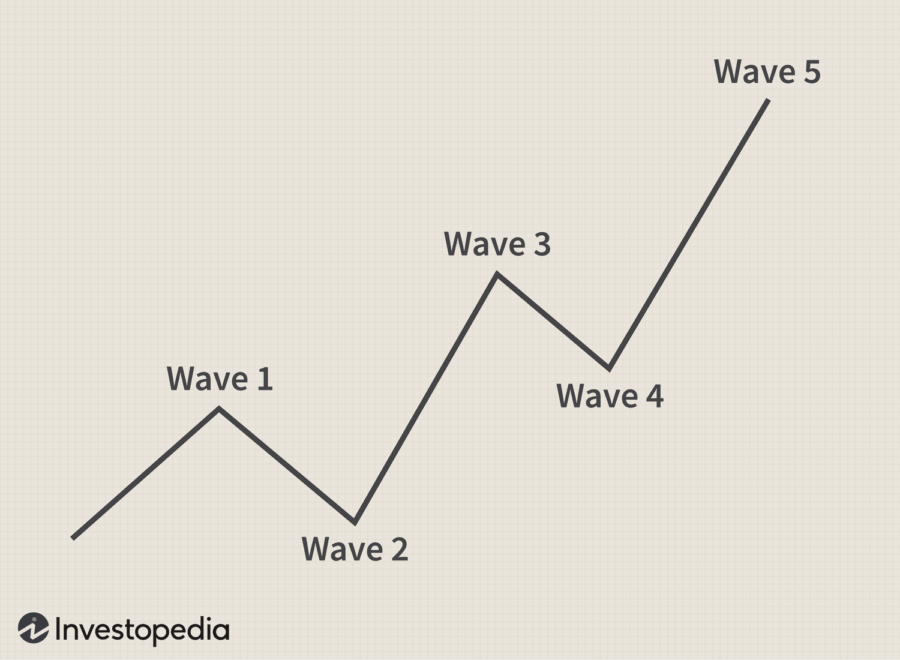

## Table of Contents

## What is an impulse wave pattern in technical analysis?

An impulse wave pattern is a key concept in technical analysis, especially when using the Elliott Wave Theory. It describes a strong, directional move in the price of an asset, usually in the direction of the larger trend. An impulse wave consists of five smaller waves, labeled as 1, 2, 3, 4, and 5. Waves 1, 3, and 5 are themselves impulse waves that move in the direction of the overall trend, while waves 2 and 4 are corrective waves that move against the trend but are smaller in size.

Understanding impulse waves can help traders predict future price movements. For example, if you spot an impulse wave pattern in an uptrend, you might expect the price to keep rising after the fifth wave. However, it's important to remember that correctly identifying these patterns can be tricky because real-world price movements don't always fit perfectly into the theory. So, traders often use other tools and indicators alongside Elliott Wave analysis to make more accurate predictions.

## How does an impulse wave differ from a corrective wave?

An impulse wave and a corrective wave are two main types of waves in the Elliott Wave Theory. An impulse wave moves in the same direction as the larger trend. It is made up of five smaller waves, where the first, third, and fifth waves move in the direction of the trend, while the second and fourth waves go against it. These waves show strong movement and are usually the bigger moves in the market.

On the other hand, a corrective wave moves against the larger trend. It consists of three smaller waves, labeled as A, B, and C. The A and C waves move against the main trend, while the B wave moves in the direction of the main trend but is smaller. Corrective waves are generally less powerful than impulse waves and help to correct or pull back the price before the trend continues.

In simple terms, impulse waves push the price in the direction of the trend, while corrective waves pull it back a bit. By understanding these waves, traders can better predict where the price might go next.

## What are the basic rules for identifying an impulse wave?

To identify an impulse wave, you need to look for a strong move in the direction of the main trend. This move is made up of five smaller waves. Waves 1, 3, and 5 go in the same direction as the trend, while waves 2 and 4 go against it. The key is that wave 3 should be the longest and strongest of these five waves. Also, wave 2 should not go below the start of wave 1, and wave 4 should not go into the price area of wave 1.

Another important rule is that wave 4 should not overlap with wave 1. This means that the price during wave 4 should not go back into the price range of wave 1. If it does, it might not be an impulse wave. By keeping these rules in mind, you can better spot impulse waves and use them to predict where the price might go next in the market.

## Can you explain the structure of a typical impulse wave?

An impulse wave is a pattern in the price of something you're trading, like a stock or a currency. It's made up of five smaller waves that go in the same direction as the bigger trend. The first, third, and fifth waves push the price in the direction of the trend, while the second and fourth waves pull it back a little. The third wave is usually the strongest and longest of the five waves. This whole pattern shows that the price is moving strongly in one direction.

To make sure it's really an impulse wave, there are a few rules to follow. The second wave shouldn't go below where the first wave started, and the fourth wave shouldn't go into the price area of the first wave. Also, the fourth wave should not overlap with the first wave. If you see these things happening, then you're probably looking at an impulse wave. This can help you guess where the price might go next.

## What are the key Fibonacci ratios used in impulse waves?

In impulse waves, Fibonacci ratios help traders predict how far the price might move. The most common ratios used are 38.2%, 50%, and 61.8%. For example, in an uptrend, the second wave often retraces between 38.2% to 61.8% of the first wave. This means if the first wave goes up by 100 points, the second wave might go down by 38 to 62 points before the third wave starts pushing the price up again.

Another important use of Fibonacci ratios in impulse waves is to estimate the length of the third wave. The third wave is often the strongest and can be at least 1.618 times the length of the first wave. Sometimes, it can even be 2.618 or 3.618 times longer. These ratios help traders set targets for where the price might go during the third wave. By using these Fibonacci levels, traders can better understand and predict the movement of impulse waves.

## How do you confirm the validity of an impulse wave pattern?

To confirm the validity of an impulse wave pattern, you need to make sure it follows some basic rules. The pattern should have five smaller waves, with the first, third, and fifth waves moving in the direction of the main trend, and the second and fourth waves moving against it. Importantly, the third wave should be the longest and strongest. You also need to check that the second wave doesn't go below the start of the first wave, and the fourth wave doesn't go into the price area of the first wave. If the fourth wave overlaps with the first wave, it's not a valid impulse wave.

Another way to confirm an impulse wave is by using Fibonacci ratios. The second wave often retraces between 38.2% to 61.8% of the first wave. This means if the first wave goes up by 100 points, the second wave might go down by 38 to 62 points. The third wave can be at least 1.618 times the length of the first wave, and sometimes even longer. By checking these ratios, you can see if the impulse wave fits the expected pattern. If everything lines up, you can be more confident that you're looking at a valid impulse wave.

## What common mistakes do beginners make when identifying impulse waves?

Beginners often get confused when trying to spot impulse waves because they don't pay attention to the rules. One big mistake is not checking if the second wave goes below the start of the first wave. If it does, it's not a real impulse wave. Another common error is when they see the fourth wave going into the price area of the first wave. This is a no-go because it means the pattern isn't valid. Beginners also sometimes mix up impulse waves with other patterns, like corrective waves, because they don't see the five smaller waves clearly.

Another mistake beginners make is not using Fibonacci ratios to confirm their guesses. They might see a pattern that looks like an impulse wave but don't check if the second wave retraces between 38.2% to 61.8% of the first wave. They also miss out on checking if the third wave is at least 1.618 times the length of the first wave. By ignoring these ratios, beginners can easily think they've found an impulse wave when it's not really there. It's important to take the time to double-check these things to avoid getting it wrong.

## How can impulse waves be applied in trading strategies?

Impulse waves can be used in trading strategies to help traders find good times to buy or sell. When traders see an impulse wave happening in an uptrend, they might decide to buy at the end of the second or fourth wave. These are the waves that go against the main trend but are smaller, so it's a chance to get in before the price goes up again in the third or fifth wave. Traders might also use the Fibonacci ratios to set their targets for how far the price might go up in the third wave, which is usually the strongest.

On the other hand, in a downtrend, traders might look to sell at the end of the second or fourth wave, which are the smaller waves that go up against the main trend. They can use Fibonacci ratios to guess how far the price might drop in the third wave, which is again the strongest. By understanding and spotting these impulse waves, traders can make better guesses about when to enter and exit trades, helping them to make more money or avoid losing too much.

## What advanced techniques exist for analyzing impulse wave extensions?

Advanced techniques for analyzing impulse wave extensions involve using Fibonacci ratios and other tools to predict how far the price might move. One common method is to look at the third wave, which often extends the most in an impulse wave pattern. Traders use Fibonacci extensions like 1.618, 2.618, or even 4.236 to estimate where the third wave might end. For example, if the first wave goes up by 100 points, the third wave might go up by 161.8 points or more. This helps traders set their targets for where to take profits or when to expect the next wave.

Another technique is to combine impulse wave analysis with other indicators like moving averages or trend lines. For instance, if a trader sees that the third wave is extending and it also breaks through a key moving average, this can confirm the strength of the move. Additionally, some traders use volume analysis to see if there's strong buying or selling pressure during the impulse wave. High volume during the third wave can indicate that the extension is likely to continue, giving traders more confidence in their predictions. By using these advanced techniques, traders can better understand and take advantage of impulse wave extensions in their trading.

## How do different market conditions affect the formation of impulse waves?

Different market conditions can change how impulse waves form. In a strong bull market, where prices are going up a lot, impulse waves are usually clear and strong. The third wave, which is often the longest, can go way further than expected. This happens because many people want to buy, pushing the price up quickly. In a bear market, where prices are going down, impulse waves can also be clear but they move in the opposite direction. The third wave can drop a lot, showing that many people are selling and pushing the price down fast.

In a sideways or choppy market, where prices don't move much in one direction, it can be harder to spot impulse waves. The waves might be smaller and less clear, making it trickier to tell them apart from other patterns. Sometimes, what looks like an impulse wave in a choppy market might just be a part of a bigger corrective wave. Traders need to be careful and use other tools, like trend lines or volume, to help them figure out if what they're seeing is a real impulse wave or just part of a different pattern.

## Can impulse wave patterns be used in conjunction with other technical indicators?

Yes, impulse wave patterns can be used with other technical indicators to make trading decisions easier. For example, traders might use moving averages to see if the price is trending up or down. If an impulse wave is going up and the price breaks above a key moving average, it can confirm that the wave is strong and likely to keep going up. Another tool traders use is the Relative Strength Index (RSI). If the RSI shows the price is not overbought during an impulse wave, it might mean the wave can go further before it needs to pull back.

Volume is another important indicator that can be used with impulse waves. If there's a lot of volume during the third wave of an impulse pattern, it can show that many people are buying or selling, making the wave stronger. By combining impulse waves with these other indicators, traders can get a clearer picture of what the market might do next. This helps them decide when to buy or sell, and how long they might want to hold onto their trades.

## What are the limitations and criticisms of the impulse wave theory?

The impulse wave theory, part of the Elliott Wave Theory, has some limitations and critics. One big problem is that it can be hard to spot impulse waves correctly. Real price movements don't always fit neatly into the theory's patterns. This can make traders unsure about whether they're seeing a real impulse wave or something else. Another issue is that the theory can be very subjective. Different traders might see the same price chart and come up with different wave counts, leading to different predictions about where the price might go next.

Critics also point out that the theory doesn't always work well in all market conditions. In choppy or sideways markets, impulse waves can be hard to find or might look like other patterns. This makes it tricky to use the theory in all situations. Some people also think that the theory relies too much on hindsight. It's easier to see the waves after they've happened than to predict them before they start. This can make it less useful for making real-time trading decisions.

## What is Elliott Wave Theory?

Elliott Wave Theory, formulated by Ralph Nelson Elliott in the 1930s, serves as a method for analyzing financial market cycles through the identification of wave patterns. Central to this theory is the concept that markets follow repetitive cycles, a reflection of the collective psychology and sentiments of investors. These cycles are comprised of patterns that can be broken down into two main types: impulse waves and corrective waves. Impulse waves, consisting of five wave structures, indicate the direction of the primary trend, while corrective waves, which have three waves, move against it.

Elliott Wave Theory is intrinsically linked to Fibonacci numbers, which aid in predicting the extension and retracement levels within wave patterns. This connection stems from the observation that both the number of waves and the length of the waves in an Elliott Wave sequence often align with Fibonacci ratios. For example, in an impulse wave, Wave 3 is typically 1.618 times the length of Wave 1, a ratio derived from the Fibonacci sequence. The formula to calculate Fibonacci retracement levels is as follows:

$$
\text{Retracement Level} = \text{Start Level} + (\text{End Level} - \text{Start Level}) \times \text{Fibonacci Ratio}
$$

Here, these ratios are commonly 23.6%, 38.2%, 50%, 61.8%, and 100%, providing potential targets for wave retracements or extensions.

This systemic approach takes into account various factors, such as investor emotions and crowd psychology, to forecast potential market movements. By understanding these patterns, traders attempt to predict future price movements, both during periods of advancement and correction. The application of Elliott Wave Theory requires meticulous observation and analysis, making it both a strategic tool and a complex subject for those aiming to anticipate market behaviors.

## References & Further Reading

[1]: Frost, A.J., & Prechter, R.R. (2005). [Elliott Wave Principle: Key to Market Behavior.](https://archive.org/details/elliottwaveprinc0000fros) John Wiley & Sons.

[2]: Prechter, R.R. (2006). [Conquer the Crash: You Can Survive and Prosper in a Deflationary Depression.](https://www.amazon.com/Conquer-Crash-Survive-Deflationary-Depression/dp/047056797X) John Wiley & Sons.

[3]: Neely, C. (2014). [The Art of Trading: Applying Elliott Wave Theory and the Fibonacci Method.](https://investwithjacob.com/unlocking-the-secrets-of-elliott-wave-theory-5-must-read-books-for-traders/) Trading Concepts, Inc.

[4]: Rohit, S. (2019). [Elliott Waves Made Simple: Master Elliott Waves Techniques using Fibonacci Ratios.](https://www.amazon.com/Elliott-Waves-Made-Simple-Techniques/dp/1980703531) Independently published.

[5]: Pardo, R. (2008). [The Evaluation and Optimization of Trading Strategies.](https://onlinelibrary.wiley.com/doi/book/10.1002/9781119196969) John Wiley & Sons.