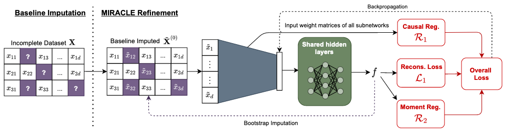

## Table of Contents

## What is imputation in the context of machine learning?

Imputation in machine learning is the process of filling in missing data in a dataset. When working with real-world data, it's common to find that some values are missing. This can happen for many reasons, like errors in data collection or data not being available. Imputation helps to solve this problem by estimating the missing values, so the dataset can be used for analysis or to train machine learning models.

There are different methods for imputation. One simple method is to fill in missing values with the mean, median, or mode of the available data. For example, if you have a dataset of people's ages and some ages are missing, you could replace those missing values with the average age of the people whose ages are known. More advanced methods might use machine learning algorithms to predict the missing values based on other data in the dataset. The choice of method depends on the nature of the data and the specific requirements of the analysis or model being developed.

## Why is imputation necessary in data preprocessing?

Imputation is necessary in data preprocessing because many machine learning algorithms cannot handle missing data. If your dataset has gaps where information should be, these algorithms might not work properly or might give you wrong results. By filling in these gaps, or imputing the missing values, you make sure that your dataset is complete and ready for analysis. This helps in building more accurate and reliable models.

There are different ways to fill in these missing values. One simple way is to use the average of the known values. For example, if you're missing some people's ages in your dataset, you could replace those missing ages with the average age of everyone else. More advanced methods might use other information in the dataset to make smarter guesses about what the missing values should be. Choosing the right method depends on what kind of data you have and what you need the data for.

## What are the common types of missing data that require imputation?

Missing data can be categorized into three main types: Missing Completely at Random (MCAR), Missing at Random (MAR), and Missing Not at Random (MNAR). MCAR means that the missing values are unrelated to any other data in the dataset. For example, if some survey responses are missing because people randomly skipped questions, that's MCAR. MAR means that the missing values can be explained by other observed data. For instance, if younger people are less likely to answer a question about retirement plans, the missing data is related to age, which is observed. MNAR is when the missingness is related to unobserved or unrecorded data. An example would be if people with higher incomes are less likely to report their income, but you don't have income data for everyone.

Each type of missing data requires different approaches to imputation. For MCAR, simple methods like filling in missing values with the mean or median of the observed data can work well. For MAR, more sophisticated methods like multiple imputation or regression-based imputation might be needed, as these can use the relationships between variables to estimate missing values. MNAR is the most challenging because the reason for the missing data is not captured in the dataset, so you might need to collect more data or use domain knowledge to make educated guesses about the missing values. Choosing the right imputation method depends on understanding which type of missing data you're dealing with.

## Can you explain the difference between single and multiple imputation?

Single imputation is when you fill in missing data with one guess. It's simple and quick. You might use the average of the known values or a prediction from a model. For example, if you're missing some people's ages, you could replace those missing ages with the average age of everyone else. The problem with single imputation is that it can make your data look more certain than it really is. It doesn't show that the filled-in values are just guesses.

Multiple imputation is a bit more complicated but better at handling uncertainty. Instead of filling in missing data with one guess, you create several different guesses. You make multiple copies of your dataset, and in each copy, you fill in the missing data a bit differently. Then, you analyze each of these datasets separately and combine the results. This way, you can see how much your guesses affect your final answers. Multiple imputation gives you a better idea of how sure you can be about your results because it takes into account the uncertainty of the missing data.

## What are some simple imputation techniques suitable for beginners?

For beginners, one of the simplest imputation techniques is to fill in missing data with the mean, median, or mode of the available data. If you're missing some numbers in your dataset, like people's ages, you can replace those missing numbers with the average age of everyone else. This method is easy to understand and quick to apply. You just need to calculate the average (mean), the middle value (median), or the most common value (mode) of the known data and use that to fill in the gaps.

Another simple technique is to use the last observed value to fill in the missing data. This is called "forward fill" or "last observation carried forward." For example, if you have a series of temperature readings and one reading is missing, you can use the temperature from the previous reading to fill in the missing spot. This method works well for time series data where values tend to change slowly over time. Both of these methods are straightforward and can be implemented easily, making them suitable for beginners who are just starting to work with data.

## How does mean, median, and mode imputation work, and when should each be used?

Mean, median, and mode imputation are simple ways to fill in missing data. Mean imputation means you replace missing values with the average of all the known values. For example, if you have a list of ages and some are missing, you calculate the average age of the people whose ages you know and use that to fill in the gaps. Median imputation works similarly, but instead of using the average, you use the middle value when you line up all the known values in order. Mode imputation uses the most common value in the dataset to fill in missing spots. For instance, if you're missing some people's favorite colors, you could use the color that most people chose to fill in the missing data.

When to use each method depends on the type of data you have. Mean imputation is good for data that follows a normal distribution, where values are spread out evenly around the average. It's simple but can distort the data if there are outliers, because the mean is sensitive to extreme values. Median imputation is better when your data has outliers or is not normally distributed, because the median is not affected by extreme values as much as the mean. Mode imputation is best for categorical data, like colors or types of cars, where you want to use the most common category to fill in missing values. Choosing the right method helps make sure your data is as accurate as possible after filling in the gaps.

## What are the limitations of basic imputation methods like mean imputation?

Mean imputation is a simple way to fill in missing data by using the average of the known values. It's easy to do and works well for data that follows a normal distribution. But it has some problems. One big issue is that it can make your data look more certain than it really is. When you fill in missing values with the average, you're treating those filled-in values as if they're as sure as the real data. This can make your results seem more precise than they actually are. Also, mean imputation can change the spread of your data. It can make the data look less varied than it really is, because all the missing values are being replaced with the same number, the average.

Another limitation of mean imputation is that it doesn't work well with data that has outliers. Outliers are numbers that are much higher or lower than most of the other numbers. When you calculate the average, these outliers can pull the average away from what most of the data looks like. This means the average you use to fill in missing values might not be a good guess for what the missing values really are. If your data has outliers, using the median instead of the mean might be a better choice, because the median is not affected by extreme values as much. So, while mean imputation is simple, it's important to think about these limitations before using it.

## How do more advanced imputation techniques like KNN imputation function?

KNN imputation, or k-nearest neighbors imputation, is a more advanced way to fill in missing data. Instead of just using the average or median of the known values, KNN imputation looks at the whole dataset to find similar cases. It works by finding the 'k' closest neighbors to the case with missing data. For example, if you're missing someone's age, KNN looks at other people who are similar in terms of other known data, like their job or where they live. It then uses the ages of these similar people to guess the missing age. The number 'k' decides how many neighbors to consider, and you can choose it based on what works best for your data.

This method can be better than simple imputation because it uses more information from the dataset. It takes into account how different pieces of data relate to each other, which can lead to more accurate guesses about missing values. However, KNN imputation can be slower and more complicated to use than simpler methods like mean or median imputation. You need to decide on the right value of 'k' and make sure your computer can handle the calculations, especially if you have a lot of data. Despite these challenges, KNN imputation can be a powerful tool for making your dataset more complete and accurate.

## What role does machine learning play in advanced imputation methods?

Machine learning plays a big role in advanced imputation methods by using patterns in the data to guess missing values. Instead of just using simple numbers like the average or median, [machine learning](/wiki/machine-learning) algorithms look at how different pieces of data relate to each other. For example, if you're missing someone's income, a machine learning model might look at their job, education, and age to make a smart guess about what their income might be. This can make the filled-in data more accurate because it uses more information from the dataset.

One common machine learning technique for imputation is called multiple imputation. This method creates several different guesses for the missing data, not just one. It makes multiple copies of the dataset, fills in the missing values differently in each copy, and then analyzes all these datasets. By doing this, multiple imputation can show how unsure the guesses are, which helps in understanding how reliable the final results are. This is much better than simple imputation methods because it takes into account the uncertainty of the missing data, leading to more trustworthy results.

## Can you describe how multiple imputation can be used to handle uncertainty in missing data?

Multiple imputation is a way to fill in missing data that helps us understand how unsure we are about our guesses. Instead of just filling in missing spots with one number, like the average, multiple imputation makes several different guesses. It creates multiple copies of the dataset, and in each copy, it fills in the missing data a bit differently. Then, it analyzes each of these datasets and combines the results. This way, we can see how much our guesses affect the final answers. It's like making several different versions of a puzzle and seeing how they all fit together.

By using multiple imputation, we get a better idea of how sure we can be about our results. If all the different guesses lead to similar answers, we can feel more confident in our results. But if the guesses lead to very different answers, it means there's more uncertainty. This helps us know how much to trust our data. Multiple imputation is more complicated than simple methods, but it's worth it because it gives us a clearer picture of the uncertainty in our data.

## What are the best practices for evaluating the effectiveness of an imputation method?

To evaluate how well an imputation method works, you can start by splitting your data into two parts: one part with all the data filled in, called the complete data, and another part where you take out some data on purpose, called the incomplete data. You then use your imputation method to fill in the missing spots in the incomplete data. After that, you compare the filled-in data to the complete data to see how close your guesses were. You can use measures like the mean squared error (MSE) or the root mean squared error (RMSE) to see how far off your guesses are. The smaller these numbers are, the better your imputation method is doing. For example, if your MSE is low, it means your guesses are pretty close to the real values.

Another good way to check if your imputation method is working well is to look at how it affects your final results. After you fill in the missing data, you can use the complete dataset and the imputed dataset to train a model or do some analysis. Then, you compare the results from both datasets. If the results are similar, it means your imputation method did a good job. You can also use statistical tests to see if there's a big difference between the results from the complete and imputed datasets. If there isn't a big difference, it's a sign that your imputation method is effective. By using these methods, you can make sure your imputation is helping you get reliable and accurate results.

## How do you choose the right imputation technique for a specific dataset and problem?

Choosing the right imputation technique depends on understanding your data and what you want to do with it. First, you need to figure out why data is missing. If it's missing completely at random, simple methods like filling in with the average or median might work well. But if the missing data is related to other data, like if younger people are less likely to answer a question about retirement plans, you might need a more advanced method like multiple imputation or KNN imputation. These methods look at the relationships between different pieces of data to make smarter guesses about what's missing.

Next, think about the type of data you have. For numbers that follow a normal distribution, mean imputation can be okay. But if your data has outliers or isn't normally distributed, using the median might be better because it's not affected by extreme values. For categories, like colors or types of cars, using the most common value, or mode, is a good choice. Also, consider how much time and computing power you have. Simple methods are quick and easy but might not be as accurate. More advanced methods, like those using machine learning, can give better results but take more time and effort. By considering these factors, you can pick the best imputation technique for your specific dataset and problem.

## References & Further Reading

[1]: Little, R. J., & Rubin, D. B. (2002). ["Statistical Analysis with Missing Data."](https://onlinelibrary.wiley.com/doi/book/10.1002/9781119482260) Wiley Series in Probability and Statistics.

[2]: Rubin, D. B. (1987). ["Multiple Imputation for Nonresponse in Surveys."](https://onlinelibrary.wiley.com/doi/book/10.1002/9780470316696) Wiley Series in Probability and Statistics.

[3]: Schafer, J. L. (1997). ["Analysis of Incomplete Multivariate Data."](https://www.taylorfrancis.com/books/mono/10.1201/9780367803025/analysis-incomplete-multivariate-data-schafer) Chapman & Hall/CRC.

[4]: Bergstra, J., & Bengio, Y. (2012). ["Random Search for Hyper-Parameter Optimization."](https://dl.acm.org/doi/10.5555/2188385.2188395) Journal of Machine Learning Research, 13(Feb), 281-305.

[5]: Liao, F. (2014). ["Machine Learning Methods for Imputation of Missing Data."](https://www.sciencedirect.com/science/article/pii/S0957417423007030) PhD thesis, Manchester Metropolitan University.

[6]: [Scikit-learn: Imputation of Missing Values](https://scikit-learn.org/stable/modules/impute.html) - Documentation on different imputation methods available in Scikit-learn.