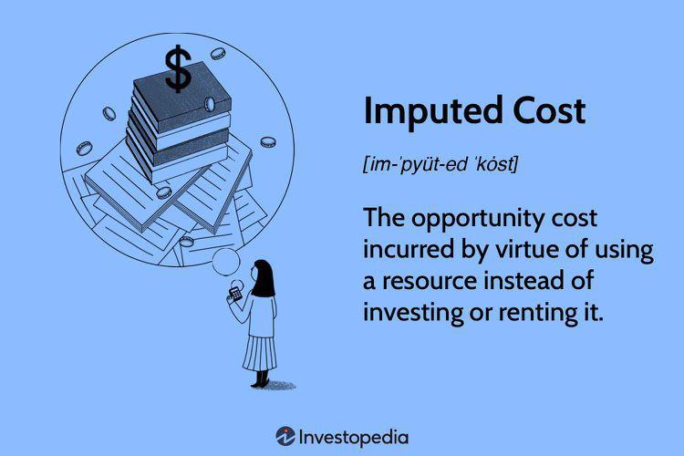

## Table of Contents

## What is the basic definition of imputed cost?

An imputed cost is a cost that is not actually paid or recorded in the books but is considered for decision-making purposes. It represents the opportunity cost of using a resource that a business already owns. For example, if a company uses its own building for operations instead of renting it out, the imputed cost would be the potential rental income the company could have earned.

Imputed costs are important because they help businesses make more informed decisions by considering all potential costs, even those that do not involve a direct cash outflow. By recognizing these costs, a company can better evaluate the true profitability of different options. For instance, if the imputed cost of using the company's building is high, it might be more profitable to rent out the building and lease a different space for operations.

## How does imputed cost differ from actual cost?

Imputed cost and actual cost are two different ideas in business. Actual cost is the real money a business spends on things like buying materials, paying workers, or renting a space. It's easy to see because it shows up in the company's financial records as money going out.

On the other hand, imputed cost is a bit trickier. It's not money that the business actually spends, but it's still important. It's the value of what the business could have done with a resource if it wasn't using it for something else. For example, if a company uses its own building instead of renting it out, the imputed cost is the rent money they could have gotten. This helps the business think about all the possible ways to use their resources to make the best decisions.

## What is opportunity cost and how is it calculated?

Opportunity cost is the value of the next best thing you give up when you make a choice. It's like when you decide to do one thing, you can't do something else at the same time. For example, if you spend an hour playing video games, the opportunity cost might be the hour you could have spent studying or working.

To calculate opportunity cost, you need to think about what you're giving up. If you're choosing between two options, you look at the value of the option you didn't choose. For instance, if you invest money in one stock instead of another, the opportunity cost is the potential profit you could have made from the stock you didn't buy. It's not always easy to figure out because it involves guessing what might have happened, but it helps you make smarter choices by thinking about what you're missing out on.

## Can you provide an example of imputed cost in a business scenario?

Imagine a small bakery that owns a delivery van. Instead of using the van to make deliveries, the bakery decides to rent it out to another business. The rent they get from this is $500 a month. But then, the bakery needs a delivery van again, so they decide to use their own van instead of renting one from someone else. The imputed cost here is the $500 a month they could have earned by renting out the van. Even though they don't actually pay this money, it's still important because it shows what they're giving up by using the van themselves.

This example helps the bakery owner make a better decision. If renting a different van would cost them less than $500 a month, it might be smarter to rent that van and keep renting out their own. But if renting a van costs more than $500 a month, it's better to use their own van. By thinking about the imputed cost, the bakery can see all the costs involved, even the ones that don't show up in their bank account, and choose the option that saves them the most money.

## How do imputed costs affect financial statements?

Imputed costs do not show up directly on a business's financial statements like the income statement or balance sheet. This is because they are not real money that the business spends. Instead, they are costs that the business thinks about when making decisions. For example, if a company uses its own building instead of renting it out, the imputed cost is the rent money they could have gotten. This cost is not written down in the financial statements, so it doesn't change the numbers you see there.

Even though imputed costs don't appear on financial statements, they are still important for making smart choices. When a business thinks about imputed costs, it can make better decisions about how to use its resources. For instance, if the imputed cost of using a company's building is high, it might be better to rent out the building and lease a different space. By considering these hidden costs, a business can figure out the true cost of its choices and improve its overall financial health, even if the financial statements don't show it directly.

## In what ways do opportunity costs influence business decisions?

Opportunity costs play a big role in how businesses make choices. When a business decides to do one thing, it has to give up doing something else. This "something else" is the opportunity cost. For example, if a company uses its money to buy new machines, the opportunity cost might be the profit it could have made by investing that money in the stock market. By thinking about what they're giving up, businesses can make smarter choices. They can see if the thing they want to do is really worth more than the thing they'll miss out on.

Businesses use opportunity costs to help them decide where to put their resources, like time, money, and people. If a company is thinking about starting a new project, they need to think about what other projects they won't be able to do because of it. If the new project's benefits are less than the opportunity cost, it might not be a good idea to go ahead with it. By always looking at opportunity costs, businesses can make sure they're using their resources in the best way possible. This helps them make choices that will help them grow and make more money in the long run.

## What are the key differences between imputed cost and opportunity cost?

Imputed cost and opportunity cost are both important ideas in business, but they are not the same thing. Imputed cost is about the money a business could have made if it used its resources differently. For example, if a company uses its own building instead of renting it out, the imputed cost is the rent money they could have gotten. This cost isn't paid out in real money, but it helps the business think about what they're giving up. Imputed costs are useful for making decisions about how to use what the business already owns.

Opportunity cost, on the other hand, is the value of the best thing a business gives up when it makes a choice. It's like when you choose to do one thing, you can't do something else at the same time. For example, if a company spends money on new machines, the opportunity cost might be the profit they could have made by investing that money in the stock market. Opportunity cost helps businesses see the bigger picture and make choices that consider all possible uses of their resources, not just what they own. Both concepts help with decision-making, but they focus on different aspects of what a business could do differently.

## How can a company accurately measure opportunity costs?

Measuring opportunity costs can be tricky because it involves guessing what might have happened if a different choice was made. A company needs to look at all the options they had and figure out the value of the best one they didn't choose. For example, if a business decides to invest in new equipment, they need to think about what they could have done with that money instead, like putting it in the stock market or saving it for later. They would then compare the expected profit from the equipment to the potential gains from the other option.

To make this easier, companies often use data and past experiences to help them guess what might happen. They might look at how similar choices worked out in the past or use financial models to predict future outcomes. By doing this, they can come up with a good estimate of the opportunity cost. Even though it's not always exact, thinking about opportunity costs helps businesses make smarter decisions by understanding what they're giving up.

## What role do imputed costs play in managerial accounting?

In managerial accounting, imputed costs help managers make better decisions by showing them what they're giving up when they use company resources. These costs are not real money that the business pays, but they are important to think about. For example, if a company uses its own building instead of renting it out, the imputed cost is the rent money they could have gotten. By considering these hidden costs, managers can see the true cost of their choices and decide if it's better to use what they have or to get something else.

Imputed costs are especially useful when a business is thinking about using its resources in different ways. For instance, if a company is deciding whether to use its own truck for deliveries or to rent it out and hire another truck, the imputed cost helps them see all the costs involved. Even though these costs don't show up in the financial statements, they help managers understand the full picture and make choices that can save the company money in the long run. By thinking about what they're giving up, managers can make smarter decisions that help the business grow.

## How do imputed and opportunity costs impact investment decisions?

Imputed and opportunity costs play big roles in making investment decisions. When a business thinks about investing in something new, like a new machine or a project, they need to think about imputed costs. These are the costs of using resources they already own. For example, if a company uses its own building for a new project instead of renting it out, the imputed cost is the rent money they could have earned. By thinking about this, the business can see if using their own building is really the best choice or if they should rent it out and find another place for the project.

Opportunity costs are also important. They are about what the business gives up when they choose to invest in one thing instead of another. For instance, if a company decides to buy new equipment, the opportunity cost might be the profit they could have made by investing that money in the stock market instead. By looking at opportunity costs, the business can see if the new equipment is really worth it or if they would be better off doing something else with their money. Both imputed and opportunity costs help businesses make smarter investment decisions by showing them the full picture of what they're giving up.

## Can you discuss a case study where understanding imputed and opportunity costs led to a significant business outcome?

A well-known case study where understanding imputed and opportunity costs led to a significant business outcome is the decision by Southwest Airlines to stick with a single type of aircraft, the Boeing 737. By choosing to use only one type of plane, Southwest Airlines reduced the imputed cost of training their pilots and mechanics. If they had used different types of aircraft, they would have needed to spend more time and money training their staff on each type. By sticking with one type, they saved money that they could have spent on other things, like expanding their routes or improving their services. This decision helped Southwest keep their costs down and become one of the most profitable airlines in the industry.

The opportunity cost in this case was also important. If Southwest had chosen to use different types of aircraft, they could have potentially served more routes or carried more passengers. But the opportunity cost of doing so would have been higher training and maintenance costs, which could have eaten into their profits. By understanding both the imputed cost of using one type of aircraft and the opportunity cost of using multiple types, Southwest made a smart choice. They decided that the benefits of lower costs and simpler operations were worth more than the potential gains from using different planes. This decision played a big role in their success and helped them stand out in a competitive industry.

## What advanced techniques are used to forecast opportunity costs in complex business environments?

In complex business environments, forecasting opportunity costs often involves using advanced techniques like scenario analysis and simulation models. Scenario analysis helps businesses look at different possible futures and see how their choices might turn out. For example, a company might create several scenarios to see what would happen if they invested in a new product line versus expanding into a new market. By comparing these scenarios, they can estimate the opportunity cost of each choice. This method helps businesses think through all the possible outcomes and make better decisions based on what they might miss out on.

Another technique is using simulation models, which are like computer games that let businesses play out different choices to see what might happen. These models can take into account lots of different factors, like changes in the market or the economy, and show how they could affect the opportunity cost of a decision. For example, a company might use a simulation to see how choosing to invest in new technology could affect their profits compared to investing in marketing. By running these simulations, businesses can get a clearer picture of what they're giving up and make choices that will help them do better in the long run.

## What is Understanding Opportunity Cost?

Opportunity cost is a foundational concept in economics and financial decision-making, representing the potential benefits an individual or business foregoes when selecting one option over another. This idea underlines the importance of evaluating not just the direct costs but also the benefits associated with alternative courses of action. In its essence, opportunity cost is about making informed choices given the constraints of limited resources.

To define opportunity cost mathematically, consider two mutually exclusive choices, A and B. If the benefit derived from choice A is $\text{Benefit(A)}$ and the benefit from choice B is $\text{Benefit(B)}$, then the opportunity cost of choosing A over B is given by:

$$
\text{Opportunity Cost of A} = \text{Benefit(B)} - \text{Benefit(A)}
$$

In economic and financial decision-making, opportunity costs are critical because they ensure that resources are utilized most effectively. By quantifying the potential upside of forgone alternatives, decision-makers can strive for optimal resource allocation.

An everyday example of opportunity cost can be observed in financial investments. Suppose an investor has $10,000 and must choose between investing in a risk-free government bond offering a 3% annual return or a stock portfolio with an expected return of 8%. Choosing the stock portfolio over the bond means the investor foregoes the security of guaranteed returns for potentially higher returns, and vice versa. Thus, the opportunity cost of choosing the bond is the additional return the investor could have earned from the stock portfolio, minus any additional risk considered.

Opportunity costs also play a pivotal role in business capital budgeting decisions. When a company considers multiple projects vying for limited capital, each project's opportunity cost involves the potential returns from projects that are not undertaken. This evaluation helps in prioritizing projects that align best with the organization's strategic goals and provide the greatest value.

On a personal level, opportunity costs influence decisions ranging from educational pursuits to major purchases. For instance, choosing to pursue a graduate degree involves opportunity costs that include not only tuition fees but also the potential income lost during the period of study. Similarly, when allocating funds to purchase a new vehicle, opportunity costs include what else could have been acquired or invested in with those funds.

In conclusion, understanding opportunity cost aids individuals and organizations in making strategic decisions by highlighting the unseen costs of foregone avenues. It ensures a broader view of economic choices, thereby enhancing strategic planning, financial analysis, and overall decision-making.

## References & Further Reading

[1]: Tversky, A., & Kahneman, D. (1986). ["Rational Choice and the Framing of Decisions."](https://www.jstor.org/stable/2352759) Journal of Business, 59(4), S251-S278.

[2]: Buchanan, J. M., & Thirlby, G. F. (Eds.). (1981). ["L.S.E. Essays on Cost."](https://oll.libertyfund.org/titles/buchanan-l-s-e-essays-on-cost) New York University Press.

[3]: ["Principles of Corporate Finance"](https://www.fincart.com/blog/corporate-finance-importance-types-principles/) by Richard A. Brealey, Stewart C. Myers, and Franklin Allen

[4]: Glasserman, P. (2003). ["Monte Carlo Methods in Financial Engineering."](https://link.springer.com/book/10.1007/978-0-387-21617-1) Springer.

[5]: Pyles, M. K. (2014). ["Applied Corporate Finance: Questions, Problems and Making Decisions in the Financial World."](https://archive.org/details/appliedcorporate0000pyle) Springer.