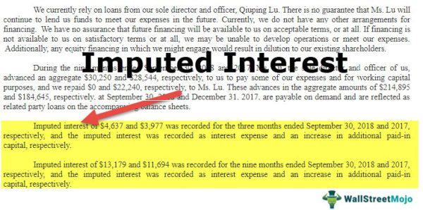

Interest calculation represents a core element of the financial sector, influencing everything from personal loans to complex financial instruments like bonds and derivatives. The methods of calculating interest can vary significantly, tailored to fit different financial products and scenarios. Among these, the concept of imputed interest holds particular importance due to its tax implications. Imputed interest accounts for interest that is considered to have been paid for tax purposes, even if no actual payment has occurred. This is particularly relevant in situations involving below-market-rate loans or no-interest loans, where determining the fair taxable amount becomes essential.

Parallel to the traditional sections of finance, algorithmic trading has emerged as a transformative influence on how financial transactions are executed. By employing sophisticated algorithms and technology, trades can be conducted with remarkable speed and precision. These computational approaches analyze vast amounts of data in real-time, enabling traders to make informed decisions that can hinge on quick movements in interest rates and other economic indicators.



This article will explore the intricacies of imputed interest, various methodologies for interest calculation, and how algorithmic trading integrates these elements to refine financial strategies. By understanding these components, investors and financial professionals can not only adhere to compliance demands but also leverage them for heightened market advantage.

## Table of Contents

## Understanding Interest Calculation in Finance

Interest calculation is a critical component of financial transactions, influencing the outcomes of various products such as loans, bonds, and savings accounts. The two principal methods of interest calculation are simple interest and compound interest, each serving different financial needs and applications.

**Simple Interest** is calculated on the principal amount alone, making it a straightforward method often used for short-term loans or investments. The formula for calculating simple interest is:

$$
\text{Simple Interest} = P \times r \times t
$$

where $P$ represents the principal amount, $r$ is the annual interest rate (expressed as a decimal), and $t$ is the time in years. Simple interest produces linear growth of money over time and is predictable given its constant interest payments.

**Compound Interest**, on the other hand, includes interest not only on the initial principal but also on the accumulated interest from previous periods. This results in exponential growth and is commonly used in savings accounts, bonds, and long-term investment products. The compound interest formula is:

$$
A = P \times \left(1 + \frac{r}{n}\right)^{n \times t}
$$

where $A$ is the future value of the investment/loan, $n$ is the number of times the interest is compounded per year, and $t$ is again the time in years. Compound interest can be more advantageous over long periods due to the effect of "interest on interest."

Accurate interest calculation is vital for all parties involved in financial transactions. For lenders, it ensures they receive fair compensation for the opportunity cost of lending money and for borrowers, it provides clarity on repayment obligations. Additionally, precise calculations adhere to market standards, promoting transparency and trust in financial markets.

Modern financial markets increasingly rely on automated tools for such calculations to enhance accuracy and efficiency. Programming languages like Python are equipped to handle these calculations, providing reliable results via simple scripts. For example, a Python code snippet to calculate compound interest could look like this:

```python
def calculate_compound_interest(principal, rate, times_compounded, years):
    amount = principal * (1 + rate / times_compounded) ** (times_compounded * years)
    return amount

# Example use
principal_amount = 1000  # principal in dollars
annual_rate = 0.05  # annual interest rate as a decimal
compounding_frequency = 4  # quarterly compounding
investment_period = 5  # in years

future_value = calculate_compound_interest(principal_amount, annual_rate, compounding_frequency, investment_period)
print(f"Future Value: ${future_value:.2f}")
```

Ensuring precision in interest calculations not only mitigates risks related to financial misrepresentations and disputes but also enables better financial forecasting and planning.

## What is Imputed Interest?

Imputed interest refers to notional interest used for tax purposes, which is considered paid even when no direct interest payment occurs. This concept is particularly relevant in situations involving below-market-rate loans or zero-interest loans, where the intention is to ensure equitable tax liability. These are situations where the lendable funds do not generate explicit interest payments, potentially leading to tax avoidance through understated income reporting.

For illustration, consider a scenario where an individual gives a loan to a family member with no interest charge. While no cash flow occurs in terms of interest payments, the Internal Revenue Service (IRS) requires recognizing interest income equivalent to what would have been earned had the loan been issued at a prevailing market rate. This is critical in related-party transactions where informal loan arrangements might otherwise allow parties to sidestep taxable income or expenses.

To systematize this process, the IRS employs the Applicable Federal Rates (AFR), which are predetermined statutory rates published monthly. AFRs serve as benchmark rates against which the market rate differential is calculated. The difference between these rates, applied over the loan principal, quantifies the imputed interest. This value must be reported as income by the lender, thus tightening compliance with tax regulations.

The calculation of imputed interest can be represented mathematically. Suppose a loan of principal amount $P$ is extended with an actual [interest rate](/wiki/interest-rate-trading-strategies) of $r_a$ and the AFR is $r_m$. The imputed interest $I$ for a specific period can be calculated as:

$$
I = P \times (r_m - r_a)
$$

This equation underscores how imputed interest functions as a corrective mechanism to align non-explicit interest arrangements with standard market practices, ensuring the accurate assessment of taxable amounts. Additionally, the imputed interest framework underscores the IRS's efforts to maintain equity within the tax system, minimizing opportunities for tax avoidance through non-arm's-length financial transactions.

## Calculating Imputed Interest

Calculating imputed interest is essential for determining applicable tax liabilities on financial arrangements where explicit interest payments are absent or below market rates. Imputed interest is calculated by comparing the actual interest rate with the market rate, using the difference to determine the interest income for tax reporting purposes.

The Internal Revenue Service (IRS) provides Applicable Federal Rates (AFR), which serve as benchmark rates for determining the imputed interest. The AFRs are periodically updated and vary based on compounding periods, such as annual, semi-annual, quarterly, or monthly. Choosing the appropriate AFR is crucial for accurate calculation.

The formula for calculating imputed interest is:

$$
\text{Imputed Interest} = (\text{Market Rate} - \text{Actual Rate}) \times \text{Principal}
$$

Where the Market Rate corresponds to the AFR, the Actual Rate is the interest rate actually charged, and the Principal refers to the loan amount or the face value of the bond.

Consider an example where a zero-coupon bond is issued at $10,000 with a market rate of 5% (annual AFR), and no explicit interest is paid. If the actual rate considered is 0%, the imputed interest is calculated as:

```plaintext
Imputed Interest = (0.05 - 0) * 10,000 = 500
```

Therefore, the imputed interest for tax purposes is $500. Lenders must report this amount as income, even though no actual interest payment occurs.

In the context of zero-coupon bonds or below-market-rate loans, accurately applying the AFR is mandatory under IRS guidelines to prevent tax evasion and ensure honest reporting of income. For computational tasks, such calculations can be automated using programming languages such as Python:

```python
def calculate_imputed_interest(principal, market_rate, actual_rate):
    return (market_rate - actual_rate) * principal

principal = 10000
market_rate = 0.05  # 5% AFR
actual_rate = 0.00  # Actual rate is 0% for zero-coupon

imputed_interest = calculate_imputed_interest(principal, market_rate, actual_rate)
print(f"Imputed Interest: ${imputed_interest}")
```

This function efficiently determines the imputed interest, supporting precise tax assessments in financial operations.

## Exemptions and Special Cases

Certain financial scenarios offer exemptions from the imputed interest regulations, aimed at providing flexibility and relief in personal or low-income-generating situations. One key exemption involves family loans that fall below a specific threshold, commonly set at $10,000. This exemption recognizes that many such loans are informal, serving personal needs rather than commercial or income-generating purposes. Therefore, they are often not subject to the rigors of imputed interest calculations, alleviating potential tax burdens on familial relationships.

Gift loans, another category receiving special consideration, involve transactions where the lender does not expect repayment, often crossing paths with tax implications related to gifts. The IRS allows certain gift loans to bypass imputed interest if they do not exceed the annual gift exclusion limit. For instance, in situations where formal repayment terms or interest are not stipulated, these loans can often be structured to leverage tax advantages without triggering imputed interest calculations.

Loans intended for non-income-generating purchases, such as buying a personal vehicle, can also benefit from specific exemptions. When such loans are extended at a below-market rate between family members or friends, the IRS may apply less stringent interest regulations, especially when the transaction's intent is not commercial profit. 

An understanding of these exemptions is essential for individuals aiming to avoid unnecessary tax implications. It ensures that financial assistance provided to family or friends does not inadvertently attract tax liabilities. Consulting with tax professionals or referring to IRS guidelines can provide further clarity on how these exemptions apply, safeguarding both parties in personal lending transactions from unintentional tax-related repercussions.

## The Role of Algorithmic Trading in Finance

Algorithmic trading has become a cornerstone of modern financial markets by utilizing complex algorithms to automate trading processes, which enhances efficiency and reduces the likelihood of human error. This method leverages computational power to analyze vast amounts of data in real time, allowing for rapid execution of financial transactions.

At its core, [algorithmic trading](/wiki/algorithmic-trading) is driven by computational formulas that analyze market conditions, such as price movements, trading volumes, and interest rates. These algorithms are designed to identify optimal trading opportunities, executing trades at speeds and frequencies far beyond human capability. For instance, if an algorithm detects a trend in interest rate movements, it can quickly adjust trading strategies to capitalize on anticipated market shifts.

The integration of interest calculations, including those for imputed interest, is increasingly influencing trading algorithms. Imputed interest, though primarily a concern for tax-related calculations, can significantly affect the pricing and attractiveness of fixed-income securities like bonds. By incorporating such interest calculations, algorithms can enhance their decision-making processes, optimizing investment strategies to improve returns while managing risk.

Python, a popular programming language in the field of algorithmic trading, is frequently used to implement such strategies. Here is a simplified example of how one might use Python to calculate imputed interest and adjust a trading strategy:

```python
def calculate_imputed_interest(principal, actual_rate, market_rate):
    """Calculate the imputed interest given principal, actual interest rate, and market rate."""
    return principal * (market_rate - actual_rate)

# Example rates and principal
principal = 100000  # Principal amount
actual_rate = 0.02  # Actual interest rate (2%)
market_rate = 0.05  # Market interest rate (5%)

# Calculate the imputed interest
imputed_interest = calculate_imputed_interest(principal, actual_rate, market_rate)
print(f"Imputed Interest: {imputed_interest}")

# Trading strategy adjustment based on imputed interest
def adjust_trading_strategy(imputed_interest):
    """Adjusts the trading strategy based on imputed interest."""
    if imputed_interest > 0:
        print("Consider selling bonds to capitalize on favorable market conditions.")
    else:
        print("Interest rates are aligned; maintain current strategy.")

# Adjust strategy
adjust_trading_strategy(imputed_interest)
```

In this example, the algorithm calculates the imputed interest and suggests a strategic adjustment if there is a discrepancy between the actual and market rates. Similar principles are applied on a much larger scale in algorithmic trading platforms to optimize trades in real time.

As algorithmic trading continues to evolve, its ability to integrate complex financial calculations like imputed interest will provide traders and investors with powerful tools to navigate the intricacies of financial markets.

## The Intersection of Interest Calculations and Algo Trading

Automated trading strategies leverage advanced computational power and mathematical modeling to make expedient and precise trading decisions, and interest calculations are an integral component of these algorithms. By incorporating various interest rates, such as the risk-free rate or expected market interest rate shifts, algorithmic trading systems can enhance predictive models to forecast market trends and optimize investment returns.

One critical aspect is the integration of imputed interest calculations within algorithmic models. Imputed interest, important in scenarios like zero-coupon bonds or below-market loans, affects fixed-income trading due to its impact on bond pricing. In the context of fixed-income securities, algorithms must consider the tax implications and income recognition of imputed interest to make accurate trading decisions. The IRS Applicable Federal Rates (AFR) play a crucial role here, as they help estimate the implied interest necessary for tax liabilities.

For instance, when trading zero-coupon bonds, an algorithm must account for the imputed interest to calculate the present value of future cash flows. This entails calculating the difference between the bond's issue price and its face value, which represents the interest income spread over the bond's life. If we let $P$ be the principal amount or purchase price, $F$ the face value, and $r$ the imitated annual interest rate, the formula for imputed interest $I$ over the bond's duration $n$ years is:

$$
I = (F - P) / n
$$

This calculation helps the algorithm determine the bond’s yield and potential trading price adjustments.

Furthermore, understanding how interest rate changes impact financial instruments is essential for effective risk management. Algorithmic trading systems might be programmed to respond to shifts in the interest rate environment by reallocating portfolios, hedging positions, or exploiting [arbitrage](/wiki/arbitrage) opportunities arising from interest rate disparities across markets.

The synergy between imputed interest calculations and algorithmic trading is beneficial for optimizing strategies that require precision and speed. As interest rates influence financial markets substantially, algorithms that integrate these calculations can adapt to market movements more efficiently, providing traders with the ability to refine tax strategies, manage portfolios, and improve returns. By merging financial theories with technological advancements, traders can gain a competitive advantage in today's complex financial landscape.

## Conclusion

Interest calculation, encompassing both traditional and imputed interest, is a critical aspect of financial transactions and regulatory compliance. The meticulous computation of interest ensures fairness and transparency in financial dealings, essential for maintaining market integrity. Imputed interest, specifically, plays a crucial role in preventing tax avoidance and ensuring appropriate taxation in scenarios like below-market loans or non-interest-bearing transactions. By utilizing applicable federal rates, imputed interest helps align transactions with market standards.

Simultaneously, algorithmic trading is rapidly advancing, integrating sophisticated financial calculations to enhance trading decisions. Algorithmic systems leverage real-time data analytics and computational formulas, facilitating rapid and efficient trading. These systems are capable of incorporating various interest rate calculations, including imputed interest, to refine investment strategies and optimize returns. By understanding the implications of interest dynamics, algorithms can adjust strategies dynamically in response to changing market conditions.

For investors, mastering both interest calculation and algorithmic trading offers a significant advantage in navigating the complex landscapes of finance and regulation. Proficiency in these areas not only aids in maximizing investment returns but also ensures compliance with tax and financial regulations, providing a robust framework for informed decision-making in modern financial markets.

## References & Further Reading

[1]: ["Imputed Interest for Below-Market-Interest Loans"](https://www.boardmanclark.com/publications/business-minute/phantom-income-below-market-loans-and-imputed-interest) - Internal Revenue Service (IRS)

[2]: ["The Basics of Interest Rates"](https://www.morpher.com/blog/interest-rates-explanation) - Investopedia

[3]: ["Algorithmic and High-Frequency Trading"](https://www.amazon.com/Algorithmic-High-Frequency-Trading-Mathematics-Finance/dp/1107091144) by Álvaro Cartea, Sebastian Jaimungal, and Jos I. Peña

[4]: ["Python for Finance: Analyze Big Financial Data"](https://books.google.com/books/about/Python_for_Finance.html?id=E93SBQAAQBAJ) by Yves Hilpisch

[5]: ["Interest and Imputed Interest"](https://www.investopedia.com/terms/i/imputedinterest.asp) - IRS Tax Map, Archived

[6]: ["Interest Rate Risk Modeling"](https://catalogimages.wiley.com/images/db/pdf/0471427241.excerpt.pdf) by Sanjay K. Nawalkha, Gloria M. Soto, Natalia A. Beliaeva