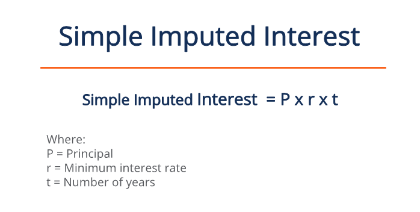

## Table of Contents

## What is imputed interest?

Imputed interest is the interest that is considered to be earned on money, even if no actual interest payment was received. It's used by the tax authorities to prevent people from avoiding taxes by making loans at very low or zero interest rates. For example, if you lend money to a family member without charging interest, the tax authorities might say there is still interest earned on that loan, and you might have to pay taxes on that imputed interest.

The rules about imputed interest can be important when dealing with things like below-market loans, gift loans, or selling something and letting the buyer pay over time. The tax rules help make sure everyone pays a fair amount of tax, even if they try to move money around in ways that avoid interest. It's a good idea to talk to a tax professional to understand how these rules might affect you, especially if you are making or receiving loans without interest.

## Why is imputed interest important in financial transactions?

Imputed interest is important in financial transactions because it helps make sure everyone pays the right amount of taxes. Imagine you lend money to a friend and don't charge any interest. The government might say there's still interest on that loan, even if you didn't get any money for it. This is called imputed interest, and you might have to pay taxes on it. This rule stops people from avoiding taxes by giving loans without interest.

This is especially important in situations like selling something and letting the buyer pay later, or when family members lend money to each other. If you sell a car and let someone pay you over time without charging interest, the tax people might say there's still interest on those payments. They do this to make sure everyone plays by the same rules and pays their fair share of taxes. If you're doing these kinds of deals, it's a good idea to talk to a tax expert to understand how imputed interest might affect you.

## How does imputed interest affect tax obligations?

Imputed interest can change how much tax you have to pay. When you lend money to someone without charging interest, the tax people might say there's still interest on that loan. This is called imputed interest, and you might have to pay taxes on it. The government does this to stop people from avoiding taxes by giving loans without interest. So, even if you don't get any money from the interest, you still have to pay taxes on the amount they say you should have gotten.

This is important in situations like selling something and letting the buyer pay later, or when family members lend money to each other. If you sell a car and let someone pay you over time without charging interest, the tax people might say there's still interest on those payments. This means you could owe more in taxes than you expected. It's a good idea to talk to a tax expert to understand how imputed interest might affect your taxes, especially if you're doing these kinds of deals.

## What are the common scenarios where imputed interest is applicable?

Imputed interest often comes up when you lend money to family or friends without charging any interest. The tax people might say there's still interest on that loan, even though you didn't get any money for it. This is to stop people from avoiding taxes by making loans without interest. So, if you lend money to your brother to help him buy a house and don't charge interest, you might still have to pay taxes on the interest the tax people say you should have gotten.

Another common situation is when you sell something and let the buyer pay over time without charging interest. For example, if you sell your car and let the buyer pay you in monthly payments without any interest, the tax authorities might say there's still interest on those payments. This means you could owe more in taxes than you expected. It's important to know about imputed interest in these situations because it can affect how much tax you have to pay.

## Can you explain the difference between stated interest and imputed interest?

Stated interest is the actual interest amount that a borrower agrees to pay to a lender. It's the interest rate written in the loan agreement. For example, if you lend money to a friend and agree on a 5% interest rate, that 5% is the stated interest. You get money from the interest, and you pay taxes on it.

Imputed interest is different. It's the interest the tax people say you should have gotten, even if you didn't actually get any money from interest. This happens when you lend money without charging interest or at a very low rate. For example, if you lend money to your family and don't charge any interest, the tax people might say there's still interest on that loan. You might have to pay taxes on that imputed interest, even though you didn't receive any actual interest payments.

## What are the IRS rules regarding imputed interest?

The IRS has rules about imputed interest to make sure everyone pays the right amount of taxes. When you lend money to someone without charging interest, the IRS might say there's still interest on that loan. They call this imputed interest, and you might have to pay taxes on it. The IRS does this to stop people from avoiding taxes by giving loans without interest. They use something called the Applicable Federal Rate (AFR) to figure out how much imputed interest there should be. This rate changes every month and depends on the length of the loan.

There are special rules for different kinds of loans. For example, if you lend more than $10,000 to someone and don't charge interest, or if you charge less than the AFR, you might have to pay taxes on the imputed interest. This also applies to loans between family members or friends. Another situation is when you sell something and let the buyer pay over time without charging interest. The IRS might say there's still interest on those payments, and you could owe more in taxes than you expected. If you're doing these kinds of deals, it's a good idea to talk to a tax expert to understand how the IRS rules might affect you.

## How do you calculate imputed interest for a below-market loan?

To calculate imputed interest for a below-market loan, you need to know the Applicable Federal Rate (AFR) set by the IRS. The AFR changes every month and depends on the length of the loan. For a below-market loan, you compare the interest you actually charged with the AFR. If the interest you charged is less than the AFR, the difference between what you charged and the AFR is the imputed interest. You might have to pay taxes on this imputed interest, even though you didn't actually get any money from it.

For example, let's say you lent $10,000 to a friend for one year and didn't charge any interest. The AFR for a one-year loan at that time was 2%. The imputed interest would be $10,000 times 2%, which equals $200. Even though you didn't get any interest money from your friend, the IRS might say you should have gotten $200 in interest, and you might have to pay taxes on that $200. It's a good idea to talk to a tax expert to make sure you understand how to calculate and report imputed interest correctly.

## What is the Applicable Federal Rate (AFR) and how does it relate to imputed interest?

The Applicable Federal Rate (AFR) is a set of interest rates published by the IRS every month. These rates are used to figure out how much interest should be on loans, especially when the loan is between family members or friends. The AFR depends on how long the loan will last, and there are different rates for short-term, mid-term, and long-term loans. The IRS uses the AFR to make sure everyone pays the right amount of taxes, even if they try to avoid interest by making loans at very low or zero interest rates.

When you lend money to someone without charging interest or at a rate lower than the AFR, the IRS might say there's still interest on that loan. This is called imputed interest. For example, if you lend $10,000 to your brother for a year and don't charge any interest, but the AFR for a one-year loan is 2%, the IRS might say you should have gotten $200 in interest. You might have to pay taxes on that $200, even though you didn't actually get any money from the interest. Talking to a tax expert can help you understand how the AFR and imputed interest might affect your taxes.

## Can you provide an example of how to calculate imputed interest on a gift loan?

Let's say you give your friend a gift loan of $50,000 for one year and you don't charge any interest. The IRS says there should be interest on that loan, even though you didn't get any money from it. They use something called the Applicable Federal Rate (AFR) to figure out how much interest there should be. For this example, let's say the AFR for a one-year loan at that time is 3%. The imputed interest would be $50,000 times 3%, which equals $1,500. Even though you didn't get any interest money from your friend, the IRS might say you should have gotten $1,500 in interest, and you might have to pay taxes on that $1,500.

This rule is to stop people from avoiding taxes by making loans without interest. If you're doing these kinds of deals, it's a good idea to talk to a tax expert. They can help you understand how to calculate and report imputed interest correctly, and make sure you're following the IRS rules.

## What are the potential financial implications of not reporting imputed interest?

Not reporting imputed interest can lead to some big problems with the IRS. If you lend money to someone without charging interest, the IRS might say there's still interest on that loan. They call this imputed interest, and you're supposed to report it on your taxes. If you don't report it, the IRS might find out and you could get in trouble. They might charge you extra taxes, plus penalties and interest on the money you should have paid.

This can be a lot of money, especially if the loan was for a big amount or if you didn't report imputed interest for a few years. It's always a good idea to follow the IRS rules and report any imputed interest. If you're not sure how to do this, talking to a tax expert can help. They can make sure you're doing everything right and avoid any big fines or problems with the IRS.

## How do different types of loans (e.g., demand loans, term loans) affect the calculation of imputed interest?

The type of loan you make can change how you figure out imputed interest. A demand loan is one where the borrower can pay back the money whenever they want. For demand loans, the IRS says you should use the short-term Applicable Federal Rate (AFR) to figure out imputed interest. This rate changes every month, so you need to check the right rate for the month you made the loan. If you lend money without charging interest or at a rate lower than the AFR, the difference between what you charged and the AFR is the imputed interest you might have to pay taxes on.

A term loan is different because it has a set time for when the borrower has to pay back the money. For term loans, you use the AFR that matches the length of the loan. There are different AFRs for short-term, mid-term, and long-term loans. If you give a term loan and don't charge enough interest, the IRS will use the right AFR to figure out how much imputed interest there should be. You might have to pay taxes on that amount, even if you didn't get any actual interest payments. It's a good idea to talk to a tax expert to make sure you're calculating imputed interest right for your loans.

## What are the advanced strategies for managing imputed interest to minimize tax liability?

One way to manage imputed interest and lower your taxes is to charge at least the Applicable Federal Rate (AFR) on your loans. The AFR is the interest rate the IRS says you should use, and it changes every month. If you charge at least the AFR, you won't have any imputed interest to report, because the interest you're charging is what the IRS expects. This way, you avoid having to pay taxes on money you didn't even get. For example, if you lend money to a family member, make sure to charge the right AFR so you don't have to worry about imputed interest.

Another strategy is to structure your loans carefully. If you're making a big loan, you might want to split it into smaller loans with different terms. This can help you use different AFRs for each part of the loan, which might lower the total imputed interest you have to report. For example, you could make a short-term loan at the short-term AFR and a long-term loan at the long-term AFR. Talking to a tax expert can help you figure out the best way to structure your loans to minimize your tax liability. They can make sure you're following all the rules and help you avoid any surprises when it's time to file your taxes.

## How can one understand interest calculation in finance?

Interest calculation is a critical component of financial transactions, influencing the outcomes of various products such as loans, bonds, and savings accounts. The two principal methods of interest calculation are simple interest and compound interest, each serving different financial needs and applications.

**Simple Interest** is calculated on the principal amount alone, making it a straightforward method often used for short-term loans or investments. The formula for calculating simple interest is:

$$
\text{Simple Interest} = P \times r \times t
$$

where $P$ represents the principal amount, $r$ is the annual interest rate (expressed as a decimal), and $t$ is the time in years. Simple interest produces linear growth of money over time and is predictable given its constant interest payments.

**Compound Interest**, on the other hand, includes interest not only on the initial principal but also on the accumulated interest from previous periods. This results in exponential growth and is commonly used in savings accounts, bonds, and long-term investment products. The compound interest formula is:

$$
A = P \times \left(1 + \frac{r}{n}\right)^{n \times t}
$$

where $A$ is the future value of the investment/loan, $n$ is the number of times the interest is compounded per year, and $t$ is again the time in years. Compound interest can be more advantageous over long periods due to the effect of "interest on interest."

Accurate interest calculation is vital for all parties involved in financial transactions. For lenders, it ensures they receive fair compensation for the opportunity cost of lending money and for borrowers, it provides clarity on repayment obligations. Additionally, precise calculations adhere to market standards, promoting transparency and trust in financial markets.

Modern financial markets increasingly rely on automated tools for such calculations to enhance accuracy and efficiency. Programming languages like Python are equipped to handle these calculations, providing reliable results via simple scripts. For example, a Python code snippet to calculate compound interest could look like this:

```python
def calculate_compound_interest(principal, rate, times_compounded, years):
    amount = principal * (1 + rate / times_compounded) ** (times_compounded * years)
    return amount

# Example use
principal_amount = 1000  # principal in dollars
annual_rate = 0.05  # annual interest rate as a decimal
compounding_frequency = 4  # quarterly compounding
investment_period = 5  # in years

future_value = calculate_compound_interest(principal_amount, annual_rate, compounding_frequency, investment_period)
print(f"Future Value: ${future_value:.2f}")
```

Ensuring precision in interest calculations not only mitigates risks related to financial misrepresentations and disputes but also enables better financial forecasting and planning.

## What is Imputed Interest?

Imputed interest refers to notional interest used for tax purposes, which is considered paid even when no direct interest payment occurs. This concept is particularly relevant in situations involving below-market-rate loans or zero-interest loans, where the intention is to ensure equitable tax liability. These are situations where the lendable funds do not generate explicit interest payments, potentially leading to tax avoidance through understated income reporting.

For illustration, consider a scenario where an individual gives a loan to a family member with no interest charge. While no cash flow occurs in terms of interest payments, the Internal Revenue Service (IRS) requires recognizing interest income equivalent to what would have been earned had the loan been issued at a prevailing market rate. This is critical in related-party transactions where informal loan arrangements might otherwise allow parties to sidestep taxable income or expenses.

To systematize this process, the IRS employs the Applicable Federal Rates (AFR), which are predetermined statutory rates published monthly. AFRs serve as benchmark rates against which the market rate differential is calculated. The difference between these rates, applied over the loan principal, quantifies the imputed interest. This value must be reported as income by the lender, thus tightening compliance with tax regulations.

The calculation of imputed interest can be represented mathematically. Suppose a loan of principal amount $P$ is extended with an actual [interest rate](/wiki/interest-rate-trading-strategies) of $r_a$ and the AFR is $r_m$. The imputed interest $I$ for a specific period can be calculated as:

$$
I = P \times (r_m - r_a)
$$

This equation underscores how imputed interest functions as a corrective mechanism to align non-explicit interest arrangements with standard market practices, ensuring the accurate assessment of taxable amounts. Additionally, the imputed interest framework underscores the IRS's efforts to maintain equity within the tax system, minimizing opportunities for tax avoidance through non-arm's-length financial transactions.

## How do you calculate imputed interest?

Calculating imputed interest is essential for determining applicable tax liabilities on financial arrangements where explicit interest payments are absent or below market rates. Imputed interest is calculated by comparing the actual interest rate with the market rate, using the difference to determine the interest income for tax reporting purposes.

The Internal Revenue Service (IRS) provides Applicable Federal Rates (AFR), which serve as benchmark rates for determining the imputed interest. The AFRs are periodically updated and vary based on compounding periods, such as annual, semi-annual, quarterly, or monthly. Choosing the appropriate AFR is crucial for accurate calculation.

The formula for calculating imputed interest is:

$$
\text{Imputed Interest} = (\text{Market Rate} - \text{Actual Rate}) \times \text{Principal}
$$

Where the Market Rate corresponds to the AFR, the Actual Rate is the interest rate actually charged, and the Principal refers to the loan amount or the face value of the bond.

Consider an example where a zero-coupon bond is issued at $10,000 with a market rate of 5% (annual AFR), and no explicit interest is paid. If the actual rate considered is 0%, the imputed interest is calculated as:

```plaintext
Imputed Interest = (0.05 - 0) * 10,000 = 500
```

Therefore, the imputed interest for tax purposes is $500. Lenders must report this amount as income, even though no actual interest payment occurs.

In the context of zero-coupon bonds or below-market-rate loans, accurately applying the AFR is mandatory under IRS guidelines to prevent tax evasion and ensure honest reporting of income. For computational tasks, such calculations can be automated using programming languages such as Python:

```python
def calculate_imputed_interest(principal, market_rate, actual_rate):
    return (market_rate - actual_rate) * principal

principal = 10000
market_rate = 0.05  # 5% AFR
actual_rate = 0.00  # Actual rate is 0% for zero-coupon

imputed_interest = calculate_imputed_interest(principal, market_rate, actual_rate)
print(f"Imputed Interest: ${imputed_interest}")
```

This function efficiently determines the imputed interest, supporting precise tax assessments in financial operations.

## What is the Intersection of Interest Calculations and Algo Trading?

Automated trading strategies leverage advanced computational power and mathematical modeling to make expedient and precise trading decisions, and interest calculations are an integral component of these algorithms. By incorporating various interest rates, such as the risk-free rate or expected market interest rate shifts, algorithmic trading systems can enhance predictive models to forecast market trends and optimize investment returns.

One critical aspect is the integration of imputed interest calculations within algorithmic models. Imputed interest, important in scenarios like zero-coupon bonds or below-market loans, affects fixed-income trading due to its impact on bond pricing. In the context of fixed-income securities, algorithms must consider the tax implications and income recognition of imputed interest to make accurate trading decisions. The IRS Applicable Federal Rates (AFR) play a crucial role here, as they help estimate the implied interest necessary for tax liabilities.

For instance, when trading zero-coupon bonds, an algorithm must account for the imputed interest to calculate the present value of future cash flows. This entails calculating the difference between the bond's issue price and its face value, which represents the interest income spread over the bond's life. If we let $P$ be the principal amount or purchase price, $F$ the face value, and $r$ the imitated annual interest rate, the formula for imputed interest $I$ over the bond's duration $n$ years is:

$$
I = (F - P) / n
$$

This calculation helps the algorithm determine the bond’s yield and potential trading price adjustments.

Furthermore, understanding how interest rate changes impact financial instruments is essential for effective risk management. Algorithmic trading systems might be programmed to respond to shifts in the interest rate environment by reallocating portfolios, hedging positions, or exploiting [arbitrage](/wiki/arbitrage) opportunities arising from interest rate disparities across markets.

The synergy between imputed interest calculations and algorithmic trading is beneficial for optimizing strategies that require precision and speed. As interest rates influence financial markets substantially, algorithms that integrate these calculations can adapt to market movements more efficiently, providing traders with the ability to refine tax strategies, manage portfolios, and improve returns. By merging financial theories with technological advancements, traders can gain a competitive advantage in today's complex financial landscape.

## References & Further Reading

[1]: ["Imputed Interest for Below-Market-Interest Loans"](https://www.boardmanclark.com/publications/business-minute/phantom-income-below-market-loans-and-imputed-interest) - Internal Revenue Service (IRS)

[2]: ["The Basics of Interest Rates"](https://www.morpher.com/blog/interest-rates-explanation) - Investopedia

[3]: ["Algorithmic and High-Frequency Trading"](https://www.amazon.com/Algorithmic-High-Frequency-Trading-Mathematics-Finance/dp/1107091144) by Álvaro Cartea, Sebastian Jaimungal, and Jos I. Peña

[4]: ["Python for Finance: Analyze Big Financial Data"](https://books.google.com/books/about/Python_for_Finance.html?id=E93SBQAAQBAJ) by Yves Hilpisch

[5]: ["Interest and Imputed Interest"](https://www.investopedia.com/terms/i/imputedinterest.asp) - IRS Tax Map, Archived

[6]: ["Interest Rate Risk Modeling"](https://catalogimages.wiley.com/images/db/pdf/0471427241.excerpt.pdf) by Sanjay K. Nawalkha, Gloria M. Soto, Natalia A. Beliaeva