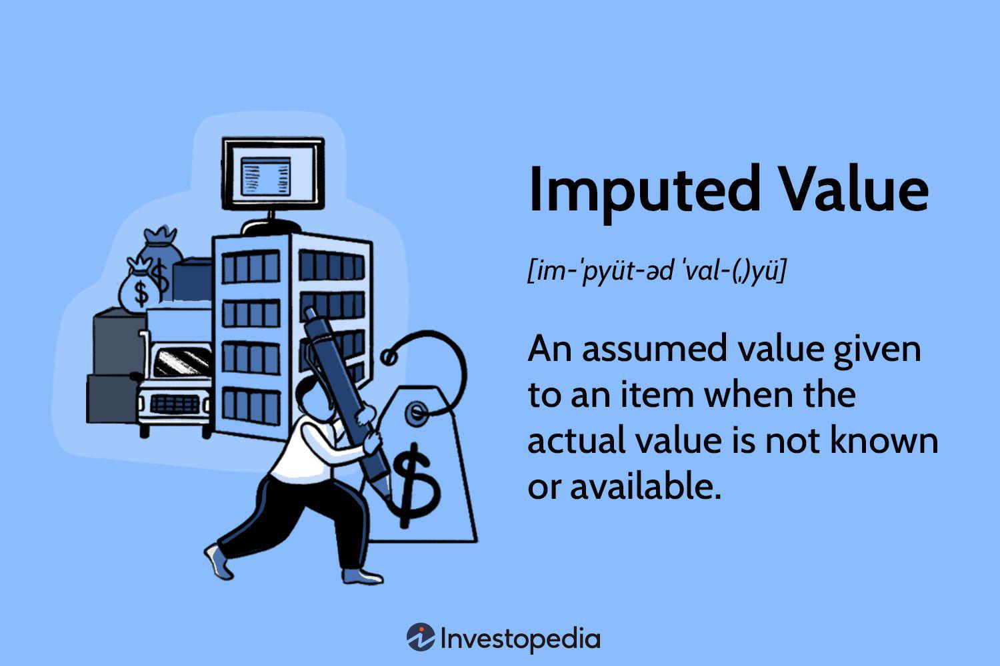

This article examines the intersection of economic value valuation techniques, imputed value, and algorithmic trading, highlighting their essential roles in modern financial markets. Understanding the interaction between these components can significantly enhance investment strategies and risk management frameworks. The purpose here is to elucidate how valuation methods and advanced trading technologies are applied to improve financial decision-making processes.

Economic value valuation techniques offer a foundation for assessing the worth of financial assets and services. These methodologies are critical for investors and analysts aiming to make informed decisions based on a robust understanding of intrinsic value. This entails using both absolute and relative valuation methods, each offering distinct perspectives on market perceptions of value.



Imputed value plays a central role when direct market values are not available. By estimating potential values for intangible assets or historical figures lacking concrete data, imputed values bridge gaps in financial datasets. Such estimates, while inherently subject to assumptions and ambiguities, are indispensable in completing economic analyses.

Algorithmic trading has transformed financial markets by using pre-programmed instructions to execute trades with enhanced speed and precision. This approach reduces human error and integrates real-time data and sophisticated machine learning models to refine trading strategies. Valuation techniques within algorithmic trading systems offer a pathway to optimizing decision-making by leveraging historical data alongside live market conditions.

In exploring these fundamentals, the article aims to provide insights into how these facets of financial analysis and technology coalesce to boost decision-making efficacy. By integrating economic valuation techniques, imputed values, and algorithmic trading, financial practitioners can unlock new dimensions of investment intelligence and adaptability.

## Table of Contents

## Understanding Economic Value Valuation Techniques

Economic value valuation techniques are foundational instruments in finance, used to assess the worth of assets and services. These techniques underpin investment decisions, guiding stakeholders to make informed choices based on comprehensive analysis. Two primary categories of valuation methods—absolute and relative valuation—offer distinct frameworks for evaluating market value and identifying investment opportunities.

Absolute valuation methods focus on determining the intrinsic value of an asset, without necessarily considering current market conditions. One of the most prevalent techniques in this category is the discounted cash flow (DCF) method. The DCF approach estimates the present value of an asset based on its expected future cash flows, discounted back to their present value using a rate that reflects the riskiness of those cash flows. The formula for DCF is:

$$

DCF = \sum_{t=1}^{n} \frac{CF_t}{(1 + r)^t}
$$

where $CF_t$ is the expected cash flow at time $t$, $r$ is the discount rate, and $n$ is the total number of periods. This method is highly valued for its ability to reflect fundamental business performance, although it requires accurate cash flow forecasting and the selection of an appropriate discount rate to yield reliable results.

Relative valuation methods, on the other hand, determine an asset's value by comparing it to similar assets or entities. This method often involves the use of valuation multiples, such as the earnings multiplier, also known as the price-to-earnings (P/E) ratio. The P/E ratio is calculated as:

$$

P/E = \frac{Market \ Price \ per \ Share}{Earnings \ per \ Share \ (EPS)}
$$

This ratio offers investors a quick assessment of how a company's valuation compares to its earnings and, by extension, how it stacks up against industry peers. The earnings multiplier can guide investment decisions, especially when market conditions or industry trends significantly influence asset pricing.

Each valuation method provides unique insights. Absolute valuation reflects intrinsic value and is less influenced by market [volatility](/wiki/volatility-trading-strategies), while relative valuation captures market perceptions and can be more responsive to trends and competitor analysis. Deploying both methods can offer a more balanced view, enabling a comprehensive evaluation that considers both internal performance metrics and external market factors.

In practice, stakeholders often employ a combination of these techniques to reach well-rounded conclusions. By synthesizing absolute and relative valuation insights, investors can better gauge the authenticity of market pricing, ensure financial decisions are solidly grounded, and mitigate the risk of overvaluation or undervaluation. Both methods, when skillfully applied, are crucial in the financial analyst's toolkit, enhancing the robustness of investment assessments.

## The Concept of Imputed Value

Imputed value serves as a critical concept in financial analysis when direct market values are either unavailable or difficult to obtain. This estimation method is integral for filling gaps within financial datasets, providing necessary information to ensure comprehensive financial assessments and decisions. Imputed values play a significant role in areas such as accounting, economic analysis, and market valuation, where exact measurements are challenging to secure.

In economic analysis, imputed values assist in approximating the value of transactions or services that are not directly observable. For instance, the valuation of public goods or household-produced services often requires imputation. Similarly, in national accounting systems, imputed rents for owner-occupied housing are calculated to reflect the economic value of living in one's own home, as there is no actual transaction to record. Such imputations are essential for understanding economic trends and making informed policy decisions.

In the accounting domain, imputed value is pivotal when determining the worth of intangible assets or historical valuations. Intangible assets, such as brand reputation, trademarks, or proprietary methodologies, may not have clear market values. Imputation techniques help estimate their financial worth, thus enabling companies to reflect these assets' value on their balance sheets. For example, if a company were to acquire a patent, the imputed value might be employed to estimate its potential market value based on future revenue projections.

The use of imputed values is not without its challenges. The inherent ambiguity and assumptions required in these estimations can introduce biases and inaccuracies into financial reports. Imputed values rely heavily on proxy data, statistical models, or expert judgment, which may vary in accuracy and reliability. Economists and financial analysts must exercise caution and clearly outline the assumptions and methodologies employed when using imputed values. Transparency in these processes helps stakeholders assess the validity and reliability of the financial insights derived from such valuations.

In conclusion, while imputed values provide a vital tool for economic and financial analysis by compensating for data insufficiencies, they require careful consideration and application. Analysts and accountants must be mindful of the uncertainties and assumptions inherent in these estimates to uphold the integrity of their analyses and decision-making processes.

## Algorithmic Trading: Revolutionizing Financial Markets

Algorithmic trading, often referred to as algo trading, harnesses the power of technology to execute trades with remarkable speed and precision, utilizing pre-programmed instructions and sophisticated valuation models. This modern approach to trading has transformed financial markets, offering significant advantages over traditional trading methods. One of the primary benefits of [algorithmic trading](/wiki/algorithmic-trading) is the significant reduction in human error. By automating the decision-making and execution processes, traders mitigate the risks of emotional and psychological biases that often affect manual trading. This precision ensures that trades are executed at the optimal times and prices, enhancing overall market efficiency.

The integration of real-time data and [machine learning](/wiki/machine-learning) techniques in algorithmic trading enhances the adaptability and accuracy of trading strategies. Real-time data feeds allow algorithms to analyze current market conditions instantaneously, enabling trades to be executed within milliseconds of detecting favorable anomalies or trends. The incorporation of machine learning further refines these strategies by enabling the system to learn from historical data, improving its predictive capabilities. For instance, machine learning models can identify patterns and correlations that human analysis might overlook, thus providing a competitive edge. These models continually adapt to changing market conditions, ensuring that trading strategies remain effective over time.

Valuation techniques play a crucial role in optimizing trading strategies within algorithmic systems. Accurate valuation models serve as the foundation upon which algorithms make trading decisions. Methods such as discounted cash flow (DCF) or earnings multiplier are often integrated into these systems to assess the intrinsic value of stocks, commodities, or other tradable assets. By combining these traditional valuation methods with real-time analytics, algorithmic trading systems can identify undervalued or overvalued assets more efficiently than conventional approaches.

For instance, in Python, a basic framework might involve using a valuation model to determine the fair value of a stock:

```python
def discounted_cash_flow(future_cash_flows, discount_rate):
    """Calculate the present value of future cash flows using DCF method."""
    present_value = sum(cf / (1 + discount_rate) ** i for i, cf in enumerate(future_cash_flows))
    return present_value

# Example usage
future_cash_flows = [100, 110, 120]  # Sample future cash flows
discount_rate = 0.05  # Example discount rate
fair_value = discounted_cash_flow(future_cash_flows, discount_rate)
```

This function calculates the present value of expected future cash flows, helping traders to evaluate whether a stock is currently undervalued or overvalued. This decision-making process is then automated, allowing for rapid execution based on the calculated values.

In summary, algorithmic trading not only enhances the speed and precision of financial transactions but also leverages advanced data analytics and valuation techniques to make informed trading decisions. This integration results in more efficient markets and provides substantial advantages in terms of speed, accuracy, and reduced transaction costs.

## Integrating Valuation Techniques in Algo Trading

The incorporation of valuation techniques into algorithmic trading platforms has the potential to significantly improve decision-making processes by strategically combining historical data insights and real-time market conditions. Algorithmic trading, which involves automated trade executions based on predefined instructions, benefits greatly from the input of precise valuation metrics. By embedding valuation models within algorithms, traders can identify advantageous market opportunities with greater accuracy and timeliness.

Valuation techniques such as discounted cash flow (DCF) analysis and the use of earnings multipliers are integral to this process. When these techniques are programmed into trading algorithms, they allow the system to assess the intrinsic value of stocks or assets continuously. For example, an algorithm might be trained to calculate the present value of expected cash flows using:

$$
\text{DCF} = \sum \frac{CF_t}{(1 + r)^t}
$$

where $CF_t$ represents the cash flows at time $t$, and $r$ is the discount rate. The algorithm can make immediate buy or sell decisions if the current market price diverges significantly from the calculated intrinsic value.

Python, known for its robust library support and ease of use, is extensively employed in developing these trading systems. Libraries such as NumPy and pandas facilitate data manipulation and financial calculations, while machine learning libraries like TensorFlow and scikit-learn enable the integration of predictive analytics based on valuation data. A simple Python snippet to calculate a price-to-earnings (P/E) ratio might look like this:

```python
def calculate_pe_ratio(price_per_share, earnings_per_share):
    pe_ratio = price_per_share / earnings_per_share
    return pe_ratio
```

In practice, valuation metrics are used to train algorithms on historical performance data, which, when combined with live data feeds, enhance the system's ability to predict market movements. For example, algorithms can leverage historical P/E ratios to set benchmarks, alerting traders when current ratios deviate from historical norms.

The synergy between valuation techniques and algorithmic trading also extends to risk management. By continuously evaluating the value derived from both historical trends and present conditions, trading algorithms can adjust strategies dynamically to mitigate potential losses.

Additionally, the versatility of programming languages like Python enables the seamless integration of complex valuation models into diverse trading environments. As these technologies advance, the potential for more sophisticated and adaptive trading systems only grows, promising ever more efficient markets.

## Challenges and Considerations

Valuation techniques, while integral to asset appraisal and investment decision-making, are not immune to challenges posed by market volatility and data incompleteness. The inherent uncertainty in financial markets can lead to fluctuations in asset values, complicating the application of valuation models which often rely on stable assumptions and historical data. For instance, models like the discounted cash flow (DCF) depend heavily on future cash flow projections, which can be difficult to forecast accurately in volatile markets. Additionally, incomplete datasets further compound these challenges, sometimes necessitating reliance on imputed values.

Imputed values, while useful for filling data gaps, introduce potential biases and uncertainties. Imputed valuation hinges on assumptions about missing data points and often relies on estimation techniques, such as regression analysis or interpolation. These assumptions can skew results if underlying data does not adequately represent market conditions. For example, imputing the value of intangible assets like brand equity inherently involves subjectivity, which can lead to discrepancies between calculated and actual market value. Therefore, while imputed valuations provide an avenue to work with incomplete datasets, they require careful scrutiny to avoid biases that could misinform decision-making.

Algorithmic trading, which leverages these valuation techniques, also presents its own set of challenges, both technical and ethical. On the technical side, the high-speed nature of algorithmic trading necessitates robust systems capable of processing vast amounts of data in real-time. However, data incompleteness and inaccuracies can affect algorithm performance. Furthermore, the reliance on algorithm-driven trades increases the risk of systemic issues such as flash crashes, where rapid trading outpaces human intervention.

Ethically, algorithmic trading raises concerns regarding data privacy and market manipulation. As trading algorithms increasingly utilize personal and proprietary data, ensuring compliance with data protection regulations becomes paramount. Violations could undermine trader and consumer trust. Additionally, manipulative practices, such as spoofing—where orders are placed to deceive the market—highlight the potential for ethical lapses in automated trading. These practices can distort market conditions and result in unfair trading environments.

Consequently, stakeholders must balance the precision and efficiency of valuation techniques and algorithmic trading against these challenges. By investing in robust data validation processes, maintaining transparency in algorithmic operations, and adhering to stringent ethical guidelines, they can mitigate these risks while maximizing the benefits of modern valuation and trading innovations.

## Conclusion

The convergence of economic valuation techniques, imputed values, and algorithmic trading has fundamentally reshaped financial decision-making by introducing more precise and dynamic approaches to investment and risk management. Valuation techniques, such as discounted cash flow (DCF) and earnings multipliers, are essential tools that allow investors and analysts to determine the intrinsic value of an asset, even when market data is incomplete or outdated. These methodologies provide a structured framework for evaluating potential investments, ensuring decisions are anchored in systematic analysis rather than speculation.

Imputed values play a critical role in this analytical process, bridging data gaps where market values are absent or difficult to ascertain. By estimating the worth of intangible assets or historical valuations, imputed values enable analysts to construct more comprehensive financial datasets, which are crucial for informed decision-making. However, the inherent assumptions and potential biases in these estimates necessitate careful consideration to avoid skewed results.

Algorithmic trading, leveraging these valuation models, has revolutionized the execution of trade strategies by employing real-time data analysis to identify and capitalize on market inefficiencies with unprecedented speed and accuracy. The integration of algorithmic trading with valuation techniques has reduced human error and enhanced the ability to respond to market changes, leading to more refined and effective trading strategies.

To fully benefit from these advanced financial tools, stakeholders must remain informed and adaptable. As markets evolve and new technologies emerge, continuous learning and adaptation are crucial for maintaining a competitive edge. Future trends suggest ongoing innovation and integration will continue to blur the lines between traditional and algorithmic trading practices, with advances in machine learning and [artificial intelligence](/wiki/ai-artificial-intelligence) pushing the boundaries of what's possible.

In conclusion, the synthesis of valuation techniques, imputed values, and algorithmic trading has optimized financial decision-making processes, offering more nuanced and agile approaches to investment. By staying informed and embracing innovation, financial professionals can capitalize on these strategies to achieve superior outcomes in the complex and rapidly changing financial landscape.

## References & Further Reading

[1]: ["Advances in Financial Machine Learning"](https://www.amazon.com/Advances-Financial-Machine-Learning-Marcos/dp/1119482089) by Marcos Lopez de Prado

[2]: ["Evidence-Based Technical Analysis: Applying the Scientific Method and Statistical Inference to Trading Signals"](https://www.amazon.com/Evidence-Based-Technical-Analysis-Scientific-Statistical/dp/0470008741) by David Aronson

[3]: ["Machine Learning for Algorithmic Trading"](https://github.com/stefan-jansen/machine-learning-for-trading) by Stefan Jansen

[4]: ["Quantitative Trading: How to Build Your Own Algorithmic Trading Business"](https://www.amazon.com/Quantitative-Trading-Build-Algorithmic-Business/dp/1119800064) by Ernest P. Chan

[5]: Damodaran, A. (2002). ["Investment Valuation: Tools and Techniques for Determining the Value of Any Asset"](https://archive.org/details/investmentvaluat0000damo_n6k9). Wiley Finance.

[6]: Hasbrouck, J. (2007). ["Empirical Market Microstructure: The Institutions, Economics, and Econometrics of Securities Trading"](https://academic.oup.com/book/52241). Oxford University Press.