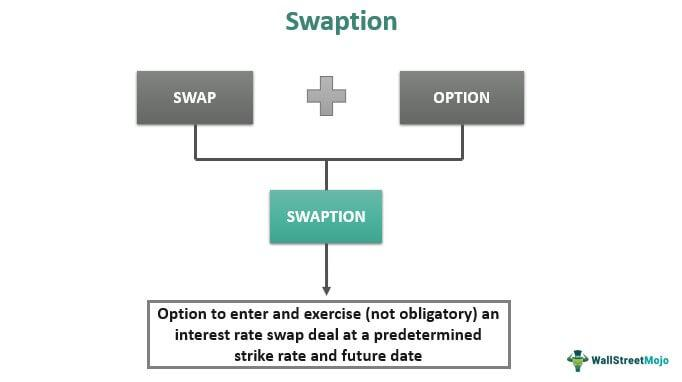

In the fast-paced world of trading, understanding various strategies is crucial for maximizing profits. One such strategy is the 'in and out' mechanism in algorithmic trading. This trading approach is designed to capitalize on short-term price movements within financial markets, allowing traders to execute quick buy-and-sell transactions within the same trading session. The precision and speed required for such transactions often rely on algorithmic trading, which uses computer algorithms to automate trade processes and enhance efficiency.

Algorithmic trading has transformed traditional trading methods by leveraging computational power and advanced algorithms to analyze market trends and execute trades based on predefined criteria. This integration enables traders to operate at a speed and precision level that is unattainable through manual trading. The 'in and out' mechanism benefits significantly from this rapid execution, providing traders with a competitive edge in capturing fleeting market opportunities and maximizing profit potential.



Throughout this article, we will explore the definition and workings of the in and out strategy within the algorithmic trading context. We will examine its advantages, such as potential higher returns, and its inherent risks, like increased exposure to market volatility and transaction costs. Additionally, we will compare it with other trading strategies to illustrate its unique position within the financial landscape. By understanding these elements, traders can better integrate this mechanism into modern trading platforms, optimizing their trading performance and outcomes.

## Table of Contents

## What is the In and Out Mechanism?

The 'in and out' mechanism is a trading strategy that focuses on executing short-term buy and sell positions within a single trading session to take advantage of price volatility. This strategy targets brief price fluctuations of a specific security or currency, allowing traders to profit from small yet frequent price changes. Unlike traditional buy-and-hold strategies, which prioritize long-term capital appreciation, the in and out approach is characterized by its emphasis on rapid transactions and short-term gains.

Traders employing the in and out mechanism often initiate a position by purchasing an asset when they predict an upward price movement and subsequently sell it when the price reaches a target level or shows signs of reversal. This quick succession of buying (entering the market) and selling (exiting the market) demands a high level of market monitoring and responsiveness, typically aligning with day trading practices. The goal is to leverage the speculative nature of the market to secure fast profits from transient market movements.

The strategy's reliance on short-term transactions underscores the necessity for traders to maintain vigilance over market trends and indicators. Technical analysis tools, such as moving averages, Relative Strength Index (RSI), or Bollinger Bands, can aid in identifying entry and [exit](/wiki/exit-strategy) points based on historical price data and patterns. Additionally, adept execution of the in and out strategy benefits from an environment that supports high trading frequency and minimizes latency, reinforcing its popularity among day traders who can manage its speculative dynamics effectively.

Despite its potential for swift capital gains, the success of the in and out mechanism depends on the trader's capacity to navigate market [volatility](/wiki/volatility-trading-strategies) and transaction costs efficiently. Each trade's brief lifespan requires an adept understanding of market conditions and quick decision-making prowess to optimize profit margins while mitigating associated risks.

## The Role of Algorithmic Trading

Algorithmic trading, commonly referred to as 'algo trading', involves the use of sophisticated computer algorithms to automate trading decisions and processes. These algorithms are meticulously coded to analyze large volumes of market data, applying predetermined rules and conditions to execute trades. This strategic approach is crucial for executing the 'in and out' trading mechanism, enhancing both speed and efficiency.

By leveraging [algorithmic trading](/wiki/algorithmic-trading), the 'in and out' mechanism can be executed more swiftly and accurately. Algorithms allow traders to capitalize on fleeting market conditions. Unlike human traders, algorithms can process data and execute trades in milliseconds, ensuring that positions are entered and exited at the most opportune moments. This quick reaction capability is particularly advantageous in high-frequency trading environments, where timing is critical.

One of the primary benefits of algorithmic trading is its ability to minimize human error and emotional decision-making. By adhering strictly to the algorithm's logic, trades are executed based solely on data-driven insights and predefined criteria. This precision enhances the reliability of both trade execution and outcomes.

Furthermore, algorithmic trading systems are designed to react instantaneously to market changes. This real-time responsiveness is critical for adjusting strategies on the fly, adapting to volatile market conditions, or exploiting short-lived trading opportunities. Consequently, algo trading provides an edge in dynamically fluctuating markets where rapid decision-making is paramount.

To illustrate the efficiency of algorithmic trading, consider a simple Python algorithm that buys a stock when its price crosses above a moving average and sells when it crosses below:

```python
import pandas as pd

# Define a function to execute a simple moving average crossover strategy
def moving_average_crossover_strategy(prices, short_window=50):
    signals = pd.DataFrame(index=prices.index)
    signals['price'] = prices

    # Short moving average
    signals['short_mavg'] = prices.rolling(window=short_window, min_periods=1).mean()

    # Generate buy and sell signals
    signals['signal'] = 0.0
    signals['signal'][short_window:] = np.where(
        signals['price'][short_window:] > signals['short_mavg'][short_window:], 1.0, 0.0
    )

    # Calculate positions: 1 signifies holding, 0 signifies not holding
    signals['positions'] = signals['signal'].diff()

    return signals

# Example usage with sample data
prices = pd.Series([101, 102, 103, 104, 105, 106, 107, 104, 100, 102])
signals = moving_average_crossover_strategy(prices)

print(signals)
```

This script serves as an example of how algorithmic processes can be leveraged for efficient trade execution, embodying the essential attributes of speed, precision, and reliability in trading operations. Through such systematic approaches, algorithmic trading empowers traders to achieve optimal results in environments where milliseconds can determine success.

## Key Components of Algo Trading

Algorithmic trading is fundamentally comprised of three primary components: data input, algorithm analysis, and trade execution. These elements collectively enable efficient trading strategies by automating the analysis and execution of trades based on real-time data.

1. **Data Input**: The foundation of algorithmic trading lies in the accurate and timely acquisition of data, which includes market prices, volume, economic indicators, and news sentiment. Real-time market data is fed into the system, providing the essential information needed to analyze and make informed decisions on price movements and trends. The data is often sourced from public exchanges and financial service providers, ensuring that traders receive reliable and up-to-the-minute insights.

2. **Algorithm Analysis**: Once the data is acquired, sophisticated algorithms come into play to analyze this input. These algorithms use a variety of rules and criteria, which may include statistical models, technical indicators, and machine learning techniques, to identify profitable trading opportunities. By assessing historical data patterns, algorithms can predict future price movements and decide on the optimal time to execute trades. This process reduces reliance on human intuition and instead leverages computational power to ensure decisions are based on comprehensive data analysis.

3. **Trade Execution**: The final stage in algorithmic trading is the execution of trades based on the insights derived from the algorithms. Execution engines are specialized components that handle the placement of trade orders with precision and speed. These engines are designed to minimize latency and ensure that trades are completed at the best possible prices, which is crucial in fast-paced markets. Advanced execution strategies, such as slicing large orders into smaller parts to minimize market impact, can also be implemented.

**Backtesting** is another critical function within algorithmic trading, ensuring that the strategies applied are both viable and optimized before being deployed in live markets. By simulating trades using historical data, traders can evaluate the effectiveness of their algorithms and make necessary adjustments to enhance performance.

Additionally, **advanced trading platforms and APIs (Application Programming Interfaces)** play an instrumental role by providing the infrastructure needed for seamless integration and real-time trading capabilities. These platforms offer flexible environments where traders can develop, test, and deploy their algorithms with ease. APIs facilitate direct access to market data and broker systems, allowing algorithms to operate autonomously and efficiently.

Overall, the key components of algorithmic trading work in synergy to streamline the trading process, leveraging technology and data-driven insights to improve speed, accuracy, and ultimately, profitability in the markets.

## Advantages and Risks of In and Out Trading

In and out trading offers significant opportunities for traders aiming to achieve swift capital gains. This strategy's agility allows traders to exploit short-term market movements effectively. By focusing on rapid buy and sell operations within a single trading session, traders can potentially realize profits from the ever-changing price dynamics of securities or currencies. Such a strategy is often attractive during periods of high market volatility, where price swings are more pronounced, providing numerous trading opportunities.

However, the promise of high returns is accompanied by inherent risks. Market volatility, which can be advantageous, also poses one of the strategy's greatest challenges. Unanticipated price movements can lead to significant financial losses if trades are not executed promptly or correctly. Furthermore, frequent trading incurs higher transaction costs, including broker fees and slippage, which can erode profits made from rapid trades.

Effective risk management becomes imperative for those employing this method. Strategies to mitigate risk include setting strict stop-loss orders, diversifying trades to spread exposure, and continuously monitoring market conditions. Tax implications are another consideration, as the frequency of transactions could lead to higher tax burdens due to short-term capital gains. Traders are advised to be aware of the tax structures applicable in their jurisdictions and seek advice to optimize tax efficiency.

The integration of algorithmic trading in in and out strategies provides a solution to some risks. Algo trading enhances precision and eliminates emotional biases, allowing for consistent execution based on predefined rules. For instance, algorithms can systematically trigger trades when specific market conditions are met, ensuring timelines far beyond human capabilities. This technological advancement not only minimizes the likelihood of human error but also optimizes trade execution speed, crucial in high-frequency trading environments where milliseconds can determine profitability.

Overall, in and out trading, when used judiciously within an algorithmic trading framework, can be an effective tool in a trader’s arsenal. However, it requires a combination of skilled risk management, awareness of transaction costs, and strategic use of technology to navigate the complexities and capitalize on its benefits.

## Comparing Trading Strategies

In and out trading distinguishes itself from other strategies through its emphasis on rapid trade execution. Unlike traditional strategies such as [trend following](/wiki/trend-following) and mean reversion, in and out trading aims to exploit short-term price movements within a single trading session. Trend-following strategies, by contrast, capitalize on prolonged market trends, either upwards or downwards, assuming that they will continue for some time. This strategy involves identifying the direction of the prevailing price movement and aligning trades accordingly, often resulting in longer holding periods compared to in and out trading.

Mean reversion strategies are based on the assumption that prices and returns eventually move back towards their historical averages. Traders utilizing this strategy identify securities whose prices have deviated significantly from their mean, betting on a reversal. While in and out trading leverages technical analysis to identify very short-term pricing anomalies, mean reversion and trend following may incorporate both technical and fundamental analyses to discern longer-term investment opportunities.

The choice of trading strategy should consider market conditions, individual risk tolerance, and trading goals. In and out trading's fast-paced nature is well-suited to markets with high volatility and [liquidity](/wiki/liquidity-risk-premium), where rapid price shifts are common. It requires traders to be adept at timing and technical analysis, and it often involves higher transaction costs due to the frequency of trades. Conversely, trend-following and mean reversion strategies may be more suitable for traders who prefer less frequent trades and are comfortable with longer holding periods.

Understanding the unique advantages and context of each strategy allows traders to effectively align their approaches with personal and market objectives. Selecting the right strategy is crucial and entails a comprehensive evaluation of one's risk tolerance and goals, as well as a deep understanding of market conditions. The importance of adapting to the market environment is underscored in the dynamic field of trading, where success often hinges on choosing and executing the most appropriate strategy for the given circumstances.

## Conclusion

The in and out mechanism epitomizes the fluidity and dynamism of modern trading strategies, presenting traders with both significant opportunities and potential hurdles. Leveraging algorithmic trading enhances this strategy by making it more accessible and efficient, thus boosting its appeal among traders seeking rapid capital gains. The automation and precision of algorithmic trading systems allow for quick market entries and exits, minimizing latency and maximizing execution speed, which are crucial in capturing fleeting market fluctuations.

Nevertheless, traders must carefully consider the potential gains of the in and out mechanism against its inherent risks. The volatility of financial markets can lead to both rapid profits and unexpected losses. Hence, a disciplined approach involving rigorous strategy testing and validation is essential for mitigating these risks. Traders must employ [backtesting](/wiki/backtesting) and forward testing to ensure strategy viability and to adapt continuously to evolving market conditions.

As financial markets continue to evolve, it becomes imperative for traders to remain informed about a broad spectrum of trading strategies. This knowledge is vital for maintaining a competitive advantage and for successfully navigating the complexities of diverse trading environments. 

In conclusion, the successful application of the in and out mechanism within algorithmic trading frameworks largely hinges on a trader’s depth of knowledge, technological infrastructure, and adaptability to market changes. These factors collectively determine the potential for achieving sustained success in today's fast-paced trading arenas.

## References & Further Reading

[1]: Aldridge, I. (2013). ["High-Frequency Trading: A Practical Guide to Algorithmic Strategies and Trading Systems."](https://www.amazon.com/High-Frequency-Trading-Practical-Algorithmic-Strategies/dp/1118343506) Wiley.

[2]: Narang, R. K. (2013). ["Inside the Black Box: A Simple Guide to Quantitative and High-Frequency Trading."](https://onlinelibrary.wiley.com/doi/book/10.1002/9781118662717) Wiley.

[3]: Kissell, R. (2014). ["The Science of Algorithmic Trading and Portfolio Management."](https://www.sciencedirect.com/book/9780124016897/the-science-of-algorithmic-trading-and-portfolio-management) Academic Press.

[4]: Cartea, Á., Jaimungal, S., & Penalva, J. (2015). ["Algorithmic and High-Frequency Trading."](https://assets.cambridge.org/97811070/91146/frontmatter/9781107091146_frontmatter.pdf) Cambridge University Press.

[5]: Gomber, P., Arndt, B., Lutat, M., & Uhle, T. (2017). ["High-Frequency Trading."](https://papers.ssrn.com/sol3/papers.cfm?abstract_id=1858626) Journal of Business Economics, 87(5), 637-666.

[6]: ["Advances in Financial Machine Learning"](https://www.amazon.com/Advances-Financial-Machine-Learning-Marcos/dp/1119482089) by Marcos Lopez de Prado.

[7]: Chakraborti, A., Tóth, B., & Palit, I. (2011). ["Statistical Properties of Trade Times in Asset Price Change as a Measure of Market Activity."](https://www.sciencemag.org/lookup/doi/10.1126/science.1201908) Science.