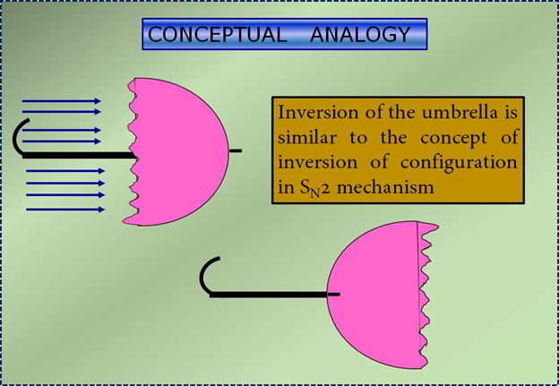

## Table of Contents

## What is the basic concept of 'In And Out' in trading?

The 'In and Out' concept in trading refers to the practice of quickly buying and selling assets to make a profit from short-term price movements. Traders who use this strategy aim to enter a trade (go 'in') when they believe the price of an asset will rise soon, and then exit the trade (go 'out') once the price has increased enough to make a profit. This approach is common in day trading, where traders might make multiple trades within a single day.

The key to successful 'In and Out' trading is timing. Traders need to be able to predict short-term market movements accurately, which can be challenging. They often use technical analysis, looking at charts and patterns to decide when to enter and exit trades. Because this strategy involves quick decisions and actions, it can be risky, but it can also lead to quick profits if done correctly.

## How does the 'In And Out' strategy differ from other trading strategies?

The 'In and Out' strategy is different from other trading strategies because it focuses on making quick trades to take advantage of small price changes. Traders using this method buy an asset and then sell it soon after, often within the same day. This is different from strategies like 'Buy and Hold,' where investors keep their assets for a long time, hoping their value will grow over years or even decades. 'In and Out' traders don't wait for long-term growth; they aim to make small profits from quick trades.

Another way 'In and Out' differs is in the level of activity and risk involved. This strategy requires constant attention to the market, as traders need to watch for the right moments to buy and sell. It's more hands-on than strategies like 'Swing Trading,' where traders might hold onto assets for a few days or weeks. Because 'In and Out' trading happens so quickly, it can be riskier. If a trader's timing is off, they could lose money fast. But if they get it right, they can make profits more quickly than with slower, longer-term strategies.

## What are the key components of the 'In And Out' mechanism?

The 'In and Out' mechanism in trading involves two main actions: buying an asset when its price is low and selling it soon after when the price goes up. Traders using this strategy aim to make small profits from these quick trades. They need to watch the market closely to find the best times to buy and sell. This means they have to be active and make decisions fast.

Timing is very important in the 'In and Out' strategy. Traders often use charts and patterns to guess when the price of an asset will change. They try to buy just before the price goes up and sell before it goes down again. This can be risky because if they guess wrong, they might lose money quickly. But if they get it right, they can make profits faster than with other trading methods that take longer.

## Can you explain the 'In And Out' process step-by-step?

The 'In and Out' process in trading starts with a trader watching the market closely. They look at charts and patterns to find a good time to buy an asset. When they think the price is about to go up, they buy the asset quickly. This is the 'in' part of the strategy. The goal is to buy when the price is low, just before it starts to rise.

Once the trader has bought the asset, they keep watching the market. They are waiting for the price to go up a little bit. When they see that the price has reached a point where they can make a small profit, they sell the asset quickly. This is the 'out' part of the strategy. The whole process can happen very fast, sometimes within minutes or hours, and the trader hopes to make a small profit from each trade.

## What are the common indicators used in the 'In And Out' strategy?

Traders using the 'In and Out' strategy often look at technical indicators to help them decide when to buy and sell. One common indicator is the moving average, which shows the average price of an asset over a certain time. If the price of the asset goes above the moving average, it might be a good time to buy. If the price goes below the moving average, it might be a good time to sell. Another useful indicator is the Relative Strength Index (RSI), which measures how fast the price is changing. If the RSI is low, it might mean the price will go up soon, so it's a good time to buy. If the RSI is high, it might mean the price will go down soon, so it's a good time to sell.

Another important indicator for 'In and Out' traders is the [volume](/wiki/volume-trading-strategy) of trades. High trading volume can mean that many people are buying or selling the asset, which might make the price move more quickly. If the volume is high and the price is going up, it might be a good time to buy. If the volume is high and the price is going down, it might be a good time to sell. By watching these indicators, traders can try to time their buys and sells to make small profits from quick trades.

## How does one identify entry points in the 'In And Out' method?

To identify entry points in the 'In and Out' method, traders look for signs that the price of an asset might go up soon. They often use a tool called the moving average, which shows the average price over a certain time. If the price goes above the moving average, it might be a good time to buy. Another tool they use is the Relative Strength Index (RSI), which tells them how fast the price is changing. If the RSI is low, it might mean the price will go up soon, so that's another good time to buy.

Traders also pay attention to how many people are buying and selling the asset, which is called the trading volume. If the volume is high and the price is going up, it might be a good time to buy because many people are interested in the asset. By watching these signs, traders can try to find the best times to enter a trade and make a quick profit.

## What are the exit strategies in 'In And Out' trading?

In 'In and Out' trading, the [exit](/wiki/exit-strategy) strategy is about deciding when to sell the asset to make a small profit. Traders watch the market closely to see when the price starts to go up after they buy. When the price reaches a point where they can make a little profit, they sell the asset quickly. This is the 'out' part of the strategy. The goal is to sell before the price goes down again, so timing is very important.

Traders often use technical indicators to help them decide when to sell. One common indicator is the Relative Strength Index (RSI). If the RSI is high, it might mean the price will go down soon, so it's a good time to sell. Another indicator is the moving average. If the price goes below the moving average after going up, it might be a good time to sell. By watching these signs, traders can try to sell at the right time to make a quick profit.

## What are the risks associated with the 'In And Out' approach?

The 'In and Out' approach in trading can be risky because it involves making quick trades to take advantage of small price changes. If a trader's timing is off, they might buy an asset just before the price goes down, leading to a loss instead of a profit. Since the trades happen so fast, there's not much time to react if the market moves against them. This means that even small mistakes can lead to big losses, especially if a trader is using a lot of money to make these quick trades.

Another risk with the 'In and Out' strategy is the cost of trading. Every time a trader buys or sells an asset, they have to pay fees, which can add up quickly if they are making a lot of trades in a short time. These fees can eat into the small profits they are trying to make, making it harder to come out ahead. Also, because this strategy requires constant attention to the market, it can be stressful and time-consuming, which can lead to mistakes and burnout.

## How can one optimize the 'In And Out' strategy for different market conditions?

To optimize the 'In and Out' strategy for different market conditions, traders need to pay close attention to how the market is behaving. In a fast-moving market, where prices are changing quickly, traders can use shorter time frames for their moving averages and watch the Relative Strength Index (RSI) more closely. This helps them catch quick price movements and make trades faster. In a slower market, where prices are not changing as much, traders might use longer time frames for their moving averages and be more patient, waiting for clearer signs that the price will go up before they buy.

Another way to optimize the 'In and Out' strategy is by adjusting the size of the trades based on how risky the market feels. In a stable market, traders might feel more confident and use more money for each trade to try to make bigger profits. But in a volatile market, where prices can swing a lot, it's safer to use less money per trade to reduce the risk of big losses. By changing how they use technical indicators and adjusting their trade sizes, traders can adapt the 'In and Out' strategy to work better in different market conditions.

## What are some advanced techniques used in 'In And Out' trading?

Advanced 'In and Out' traders often use a technique called [scalping](/wiki/gamma-scalping), where they make many quick trades in a short time to catch very small price changes. They use very short time frames for their charts, sometimes just a few minutes, to find the best times to buy and sell. They also pay close attention to the bid-ask spread, which is the difference between the highest price someone is willing to pay and the lowest price someone is willing to sell. By trading quickly and watching the spread, they can make small profits from each trade, and those small profits can add up over time.

Another advanced technique is using automated trading systems, or algorithms, to help with the 'In and Out' strategy. These systems can watch the market all the time and make trades faster than a human can. Traders can set up the algorithms to look for certain patterns or signals, like when the price goes above a moving average or the RSI reaches a certain level. This can help them catch more trading opportunities and make more consistent profits, but they still need to keep an eye on the system to make sure it's working well and adjust it as needed.

## How does the 'In And Out' strategy perform in various asset classes?

The 'In and Out' strategy can work differently depending on what kind of asset you're trading. In the stock market, this strategy can be used to trade stocks that move a lot in price during the day. Traders might find it easier to make quick profits from stocks that are popular and have a lot of people buying and selling them. But, it can be harder to use this strategy with stocks that don't move much because there might not be enough price changes to make a profit.

In the [forex](/wiki/forex-system) market, where people trade different currencies, the 'In and Out' strategy can also work well. Currencies can change in value very quickly, so traders can use this strategy to make small profits from these fast changes. But, the forex market can be very risky, and small mistakes can lead to big losses. In the [cryptocurrency](/wiki/cryptocurrency) market, the 'In and Out' strategy can be even more exciting because prices can go up and down a lot in a short time. But, this also means it's very risky, and traders need to be very careful and watch the market closely to make it work.

## Can you discuss case studies or real-world examples of successful 'In And Out' trades?

One famous example of successful 'In and Out' trading is the story of a day trader named Tim Grittani. He started trading with just $1,500 and used the 'In and Out' strategy to quickly buy and sell stocks. He focused on stocks that had a lot of people buying and selling them, which made it easier to make quick profits. Over time, Tim turned his small starting amount into over $1 million by making many small trades every day. His success shows that with the right skills and a lot of hard work, the 'In and Out' strategy can lead to big profits.

Another example comes from the forex market, where a trader named Kathy Lien used the 'In and Out' strategy to trade currencies. She would watch the market closely and make quick trades when she saw the right signs. For example, if the price of a currency went above its moving average, she would buy it and then sell it soon after for a small profit. Kathy's success in the forex market shows that the 'In and Out' strategy can work well in markets where prices change quickly, but it also requires a lot of attention and skill to do it right.

## References & Further Reading

[1]: Aldridge, I. (2013). ["High-Frequency Trading: A Practical Guide to Algorithmic Strategies and Trading Systems."](https://www.amazon.com/High-Frequency-Trading-Practical-Algorithmic-Strategies/dp/1118343506) Wiley.

[2]: Narang, R. K. (2013). ["Inside the Black Box: A Simple Guide to Quantitative and High-Frequency Trading."](https://onlinelibrary.wiley.com/doi/book/10.1002/9781118662717) Wiley.

[3]: Kissell, R. (2014). ["The Science of Algorithmic Trading and Portfolio Management."](https://www.sciencedirect.com/book/9780124016897/the-science-of-algorithmic-trading-and-portfolio-management) Academic Press.

[4]: Cartea, Á., Jaimungal, S., & Penalva, J. (2015). ["Algorithmic and High-Frequency Trading."](https://assets.cambridge.org/97811070/91146/frontmatter/9781107091146_frontmatter.pdf) Cambridge University Press.

[5]: Gomber, P., Arndt, B., Lutat, M., & Uhle, T. (2017). ["High-Frequency Trading."](https://papers.ssrn.com/sol3/papers.cfm?abstract_id=1858626) Journal of Business Economics, 87(5), 637-666.

[6]: ["Advances in Financial Machine Learning"](https://www.amazon.com/Advances-Financial-Machine-Learning-Marcos/dp/1119482089) by Marcos Lopez de Prado.

[7]: Chakraborti, A., Tóth, B., & Palit, I. (2011). ["Statistical Properties of Trade Times in Asset Price Change as a Measure of Market Activity."](https://www.sciencemag.org/lookup/doi/10.1126/science.1201908) Science.