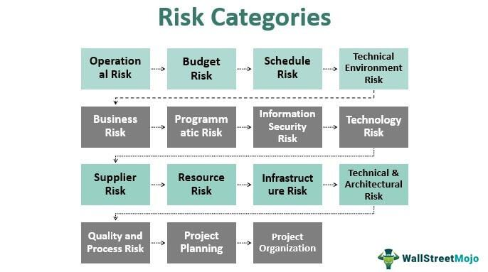

Mobile app commerce has rapidly become a cornerstone of the digital economy, fundamentally altering how consumers interact with businesses and conduct transactions. Unlike traditional commerce channels, mobile commerce leverages the ubiquitous presence of smartphones to facilitate seamless, on-the-go transactions that fit the modern lifestyle. This evolution is driven by the proliferation of mobile apps that cater to a diverse range of services, from simple online shopping to complex activities like banking and stock trading.

In-app purchasing and algorithmic trading are two pivotal components of mobile commerce, each bringing unique functionalities and challenges. In-app purchasing, a feature primarily found in mobile applications, allows users to buy additional content or services within an app. This model has evolved significantly, providing developers with monetization opportunities without requiring upfront payments from end users. On the consumer side, it offers the flexibility of accessing premium features conveniently. However, this ease of access also brings security risks, such as the potential for unauthorized transactions and fraud, making robust security measures crucial.

Algorithmic trading, on the other hand, represents a sophisticated use of mobile technology in finance. It involves the use of algorithms to execute trading strategies at speeds and frequencies that are virtually impossible for human traders to match. The integration of algorithmic trading into mobile platforms democratizes access to financial markets, enabling individual investors to participate alongside institutional players. While this accessibility is advantageous, it introduces potential risks such as algorithmic errors, latency issues, and data breaches, which can have significant financial repercussions if not properly managed.

The objective of this article is to emphasize the security risks associated with mobile app commerce, particularly in the areas of in-app purchasing and algorithmic trading. It aims to provide insights into best practices for safeguarding transactions and user data, thereby enhancing consumer trust and contributing to the stability of mobile commerce ecosystems. By understanding these challenges and implementing effective security measures, both developers and consumers can better navigate the dynamic landscape of mobile commerce.

## Table of Contents

## Understanding In-App Purchasing

In-app purchasing, a critical component of the mobile app economy, refers to the capability embedded within mobile applications that allows users to buy additional features, services, or content directly within the app. This model has transformed the landscape of digital transactions, standing as a pivotal point in the evolution of app monetization strategies.

Originally, mobile applications were either offered for a single purchase price or for free, with optional paid upgrades. However, as mobile app ecosystems matured, developers sought diverse monetization techniques. In-app purchasing emerged as an attractive solution, enabling developers to generate ongoing revenue without necessitating upfront costs from consumers. This model is advantageous as it circumvents the barrier of a high initial purchase price, instead encouraging users to engage with the app first and spend incrementally over time.

For developers, in-app purchasing offers several benefits:
- **Monetization Flexibility**: Developers can employ various strategies such as freemium models, where the app is free to download but charges for premium features or consumable items like game credits.
- **Increased Revenue Potential**: By leveraging a broad user base, developers can achieve significant revenue through micro-transactions, which can cumulatively surpass revenues generated from upfront sales alone.
- **Enhanced User Engagement**: In-app purchases can be tailored to boost user interaction, offering users personalized experiences or content based on their activities and preferences.

Despite these benefits, in-app purchasing introduces security risks that can affect both users and developers. Unauthorized purchases, where malicious actors exploit vulnerabilities to make purchases without user consent, pose a significant threat. This can result from inadequate authentication measures or flaws in transaction processes. Additionally, potential fraud arises when attackers manipulate or mimic legitimate transactions, leading to financial losses and eroded trust in the app.

Effective mitigation of these risks requires robust security protocols. Implementing encryption during data transmission, strong authentication methods, and regular security audits can safeguard against unauthorized access and fraud. Educating users about secure practices and warning them of popular scams further fortifies the overall security posture of in-app purchasing ecosystems.

## Security Risks in In-App Purchasing

Mobile applications offering in-app purchases (IAP) provide a convenient way for users to access premium features or content, enhancing the profitability of mobile ventures. However, this mechanism is fraught with several security risks that can lead to unauthorized purchases and financial fraud. 

### Common Vulnerabilities in In-App Purchases

One of the primary vulnerabilities in apps with IAP functionality is inadequate encryption of data. Encryption is crucial to protect sensitive information, such as user credentials and financial data, from being intercepted by malicious actors. Insufficient encryption can lead to man-in-the-middle attacks, where an attacker intercepts communication between the user and the service provider. This kind of attack can lead to the unauthorized appropriation of purchase data and personal information.

Moreover, the storage of user passwords often poses significant security risks. Many apps neglect to implement strong password hashing algorithms, such as bcrypt or Argon2, opting instead for less secure practices like storing passwords in plain text or using weak hashing functions like MD5. This makes it easier for attackers to gain unauthorized access to user accounts through techniques such as brute force attacks or database leaks.

### High-Profile Incidents of Unauthorized In-App Purchases

Several high-profile incidents have highlighted the dangers associated with insecure in-app purchasing mechanisms. In 2013, Apple faced a costly settlement of $32.5 million with the Federal Trade Commission due to unauthorized in-app purchases made by children in games targeted at younger audiences. The lack of appropriate parental controls and safeguards allowed minors to make purchases without adult consent.

Similarly, in more recent years, numerous mobile games have been targeted by hackers who exploit vulnerabilities in the apps to make unauthorized purchases or drain user accounts. By crafting fake receipts and manipulating app API endpoints, these attackers bypass in-app purchase authentication, causing financial losses for both users and developers.

These incidents underscore the necessity for mobile app developers to prioritize security measures such as implementing advanced encryption protocols, rigorous authentication procedures, and secure password storage. These practices are pivotal not only in protecting users from unauthorized transactions but also in maintaining the integrity and reputation of mobile applications in the digital marketplace.

## Algo Trading in Mobile Apps

Algorithmic trading refers to the use of computer algorithms to automate the execution of financial trades, employing pre-defined rules to make decisions at speeds and frequencies beyond human capability. Historically the domain of institutional investors due to the substantial infrastructure and data processing requirements, [algorithmic trading](/wiki/algorithmic-trading) has increasingly been democratized through the integration into mobile platforms.

Mobile applications enable users to participate in algorithmic trading with unparalleled convenience. The primary advantage of using mobile apps for trading is accessibility. Traders can monitor algorithms and execute trades from virtually anywhere, providing a substantial advantage in managing investments in real-time. Additionally, the instant execution enabled by mobile platforms allows traders to respond to market conditions immediately, capitalizing on opportunities with minimal delay. This immediacy is a crucial component in markets where even microseconds can significantly impact the outcome of a trade.

Despite these advantages, algorithmic trading via mobile apps introduces several potential risks. Algorithmic errors, for one, can propagate rapidly, especially given the high-speed nature of trading algorithms. A flaw in the algorithm can lead to substantial financial losses if not caught in time. Moreover, mobile platforms may encounter latency issues, particularly if the app is not optimized for performance. This latency can impede the app's ability to process trades at optimal prices or react swiftly to market fluctuations, potentially resulting in unfavorable trading outcomes. 

Additionally, mobile trading apps are susceptible to data breaches, where sensitive financial information could be accessed by unauthorized parties. Ensuring robust encryption and secure channels is paramount to protecting user data, but the decentralized nature of mobile networks can sometimes exacerbate vulnerabilities. As such, it is critical for developers and users alike to prioritize security measures to minimize these risks and maintain the integrity of trading activities conducted on mobile platforms.

## Common Security Threats in Algo Trading Apps

Algorithmic trading on mobile platforms has increased accessibility and convenience for traders. However, it has also introduced specific security threats that stakeholders need to address to protect user data and ensure financial integrity. One prominent threat is phishing attacks, where malicious actors attempt to deceive users into revealing sensitive information, such as login credentials or financial data, by impersonating legitimate entities. These attacks can compromise user accounts, leading to unauthorized trades and financial losses.

Fraudulent apps pose another significant risk. These are applications that mimic legitimate trading platforms, often convincing users to download them by using similar names and user interface designs. Once installed, these apps can steal sensitive information or install malware, leading to unauthorized access to financial data and potential monetary loss.

Data interception is a third threat that looms over algorithmic trading apps. This involves unauthorized entities capturing data as it is transmitted over networks, potentially allowing them to access sensitive information such as user credentials, trading data, and financial transactions. To mitigate this risk, encryption protocols like HTTPS are crucial, though they must be properly implemented and maintained.

APIs, or Application Programming Interfaces, play a crucial role in mobile trading apps by enabling different software components to communicate. However, vulnerabilities in APIs, such as insufficient authentication and authorization measures, can be exploited by attackers to gain unauthorized access to systems. For instance, an attacker could execute trades on behalf of a user or extract sensitive data from a trading platform, leading to significant financial risks.

Online account management also presents vulnerabilities. Weak password policies and inadequate security mechanisms can render user accounts susceptible to brute force attacks or unauthorized access. Implementing strong authentication methods like two-[factor](/wiki/factor-investing) authentication (2FA) can help mitigate these risks.

The impact of these security threats extends beyond potential financial losses. They can severely damage consumer trust in mobile trading apps. Once user confidence is eroded, it can result in a diminished user base and negatively influence the perceived legitimacy of algorithmic trading on mobile platforms. Ensuring robust security measures is vital for maintaining consumer trust and sustaining growth in this sector.

## Best Practices for Ensuring Security in Mobile Commerce

Ensuring security in mobile commerce is a multifaceted process that requires the implementation of robust practices by developers and vigilance by consumers. Given the increasing complexity and sophistication of cyber threats, securing mobile commerce platforms is more critical than ever. 

For developers, the cornerstone of mobile app security begins with code security. It is essential to write clean, efficient code that avoids common vulnerabilities such as buffer overflows, SQL injection, and cross-site scripting (XSS). Utilizing tools for static and dynamic code analysis can help identify potential security weaknesses before the application is deployed. Implementing well-established software development practices, such as code reviews and adhering to the principles of least privilege and separation of duties, can further fortify the application's security posture.

Two-factor authentication (2FA) is another vital practice for protecting user accounts. By requiring two forms of verification, such as a password and a temporary code sent to the user's phone, 2FA significantly reduces the threat posed by stolen or guessed passwords. Developers should ensure that their applications support 2FA and encourage users to enable it.

Strong encryption practices are integral to safeguarding sensitive data during transmission and storage. Utilizing end-to-end encryption with protocols such as Transport Layer Security (TLS) ensures data integrity and privacy between the client and server. For data at rest, using strong encryption standards like the Advanced Encryption Standard (AES) can protect user data even in the event of a data breach.

Consumers also play a critical role in mobile commerce security. Using secure and unique passwords for different accounts is a fundamental practice. Password managers can help users manage and generate strong passwords. Moreover, consumers should be cautious of fraudulent apps, which often mimic legitimate apps to deceive users. It is advisable to download apps only from trusted sources like official app stores and to scrutinize app permissions and reviews before installation.

Regulatory and industry guidelines provide an additional layer of security assurance. Compliance with standards such as the Payment Card Industry Data Security Standard (PCI DSS) for financial transactions ensures that applications adhere to best practices for payment security. Furthermore, industry-specific guidelines, such as the OWASP Mobile Security Project, offer comprehensive resources for addressing common security challenges in mobile development.

By integrating these best practices, both developers and consumers can significantly mitigate the security risks associated with mobile commerce. The collaboration between adhering to technical standards and promoting user awareness constitutes a resilient defense against the dynamic threat landscape.

## Case Study: Successful Implementation of Security Measures

Several companies have successfully implemented security measures in mobile app commerce, leading to a noticeable reduction in security incidents and an enhancement in user trust. These real-world examples illustrate the effectiveness of robust security strategies.

One notable example is Starbucks. The Starbucks mobile app has become widely recognized for its secure mobile payment system. In response to security concerns, the company reinforced user authentication processes by introducing two-factor authentication (2FA). This added layer of security has been crucial in minimizing unauthorized access and fraudulent transactions. Additionally, Starbucks implemented end-to-end encryption, ensuring that sensitive user data was protected during transmission. As a result of these measures, Starbucks reported a significant reduction in security breaches, bolstering user confidence in their platform.

Another example is Apple with its App Store ecosystem. Apple has been proactive in establishing stringent security guidelines for mobile app developers, requiring them to adhere to robust encryption standards and secure API configurations. By enforcing a rigorous app review process, Apple has minimized the risk of malicious apps infiltrating the App Store. Furthermore, the introduction of features like App Transport Security (ATS) mandates secure connections for apps, reducing potential vulnerabilities. Apple's commitment to security has fostered an environment of trust, encouraging users to engage with their mobile apps without fear of compromised security.

A third example is Google Play Protect, integrated into Android devices. Google Play Protect actively scans apps for malware and vulnerabilities, providing an additional security layer for users. Google employs [machine learning](/wiki/machine-learning) algorithms to identify potentially harmful applications, removing them from the Play Store upon detection. This proactive approach has significantly reduced the number of malware incidents on Android devices, enhancing user trust in the Android ecosystem.

Lessons learned from these implementations emphasize the importance of multi-layered security strategies. Companies have realized that achieving robust security involves not only technological solutions but also user education. Educating users about safe practices, such as recognizing phishing attempts and using secure passwords, complements technical security measures.

The success of these companies highlights several best practices:
1. **User Authentication**: Implementing strong authentication mechanisms, such as 2FA, to protect user accounts.
2. **Encryption**: Ensuring data is encrypted both at rest and in transit to safeguard sensitive information from breaches.
3. **Regular Audits and Updates**: Conducting frequent security audits and updating security protocols to address emerging threats.
4. **App Review and Monitoring**: Establishing strict app review processes and continuous monitoring for malicious activities.
5. **User Education**: Encouraging users to adopt security best practices, enhancing overall app security posture.

These practices not only minimize security incidents but also contribute to a more secure and trustworthy environment in mobile commerce, setting a benchmark for other industry players to follow.

## Conclusion

In today's digital economy, mobile app commerce plays a crucial role, fundamentally reshaping traditional business models and consumer behaviors. Security within this domain is paramount, particularly given the rise of in-app purchasing and algorithmic trading, two facets that have significantly contributed to the evolution and convenience of mobile commerce. Ensuring the integrity and security of these transactions protects both developers and consumers, fostering trust and facilitating continued growth.

Vigilance and adaptability are essential in tackling the ever-evolving landscape of security threats. As new vulnerabilities and attack vectors emerge, both developers and users must remain informed and responsive to these threats. This dynamic approach ensures that security measures evolve alongside technological advancements, minimizing potential risks associated with unauthorized access and data breaches.

Proactive measures form the cornerstone of robust security practices. Developers should prioritize secure coding practices, employ advanced encryption techniques, and implement multi-factor authentication. These strategies not only safeguard the app’s infrastructure but also enhance the user experience by reducing the likelihood of breaches.

Furthermore, user education is a critical component of an effective security strategy. Consumers must be made aware of the risks associated with mobile commerce and the means to protect themselves, such as recognizing phishing attempts and adopting strong, unique passwords for each of their accounts.

In conclusion, the security of mobile app commerce is a dynamic and crucial field requiring continuous attention from all stakeholders involved. Emphasizing proactive security measures and educating users on best practices can significantly mitigate risks, ensuring a safe and trustworthy environment for economic transactions. By staying informed and adaptive, the industry can continue to build consumer trust and drive innovation in mobile commerce.

## References & Further Reading

[1]: Bergstra, J., Bardenet, R., Bengio, Y., & Kégl, B. (2011). ["Algorithms for Hyper-Parameter Optimization."](https://dl.acm.org/doi/10.5555/2986459.2986743) Advances in Neural Information Processing Systems 24.

[2]: ["Advances in Financial Machine Learning"](https://www.amazon.com/Advances-Financial-Machine-Learning-Marcos/dp/1119482089) by Marcos Lopez de Prado

[3]: ["Evidence-Based Technical Analysis: Applying the Scientific Method and Statistical Inference to Trading Signals"](https://www.amazon.com/Evidence-Based-Technical-Analysis-Scientific-Statistical/dp/0470008741) by David Aronson

[4]: ["Machine Learning for Algorithmic Trading"](https://github.com/stefan-jansen/machine-learning-for-trading) by Stefan Jansen

[5]: ["Quantitative Trading: How to Build Your Own Algorithmic Trading Business"](https://www.amazon.com/Quantitative-Trading-Build-Algorithmic-Business/dp/1119800064) by Ernest P. Chan