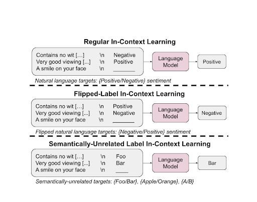

## Table of Contents

## What is In-Context Learning in machine learning?

In-Context Learning is a way for machine learning models, especially large language models, to learn and perform tasks without being specifically trained for them. Imagine you're teaching a friend a new game. Instead of giving them a long set of rules, you show them how to play by doing it a few times. The model does something similar. It looks at a few examples of a task within the text it's given and then tries to do the task itself. This method is useful because it allows the model to adapt quickly to new tasks without needing to be retrained, which can save a lot of time and resources.

For example, if you want a model to translate sentences from English to French, you can give it a few examples of translated sentences. The model then uses these examples to figure out how to translate new sentences. This is different from traditional machine learning, where the model would need to be trained on a large dataset of translations before it could perform the task. In-Context Learning makes the model more flexible and able to handle a wider variety of tasks, making it a powerful tool in the field of machine learning.

## How does In-Context Learning differ from traditional machine learning methods?

In-Context Learning and traditional machine learning methods differ mainly in how they learn and apply knowledge. Traditional machine learning involves training a model on a large dataset to perform a specific task. For example, if you want a model to recognize cats, you would show it thousands of cat pictures and tell it which ones are cats. The model learns from this data and then can identify cats in new pictures. This process requires a lot of data and time, and the model is usually good at one specific task.

On the other hand, In-Context Learning allows a model to learn new tasks quickly by looking at just a few examples within the text it's given. Imagine you want the model to translate sentences from English to French. Instead of training it on a huge dataset of translations, you give it a few examples of translated sentences. The model then uses these examples to figure out how to translate new sentences. This makes the model more flexible and able to handle different tasks without needing to be retrained, which saves time and resources.

## What are the key components of In-Context Learning?

The first key component of In-Context Learning is the few-shot examples. These are a small number of examples that show the model what to do. For instance, if you want the model to translate from English to French, you might give it three or four pairs of sentences, with one sentence in English and its translation in French. The model looks at these examples and figures out how to do the task. This is different from traditional learning, where the model needs many more examples to learn.

The second key component is the model's ability to understand and apply patterns from these few-shot examples. When the model sees the examples, it tries to find patterns and rules that it can use to complete the task. This ability to quickly pick up on patterns makes In-Context Learning very powerful. It allows the model to do new tasks without needing to be retrained, which saves time and effort.

The third key component is the context in which the task is presented. The model doesn't just look at the examples; it also considers the surrounding text or information. This context helps the model understand the task better and apply the examples more effectively. For example, if the task is to answer questions about a specific topic, the model will use the context to focus on that topic and provide relevant answers.

## Can you explain the process of In-Context Learning with an example?

Imagine you have a language model that you want to use to translate sentences from English to French. Instead of training the model on a large dataset of translations, you use In-Context Learning. You give the model a few examples of translated sentences, like "The cat is on the table" and "Le chat est sur la table." The model looks at these examples and tries to figure out how to translate new sentences. This is like showing someone a few examples of a game and then asking them to play it themselves.

Let's say you want the model to translate the sentence "The dog is under the bed." You give the model the few examples of translations and then ask it to translate the new sentence. The model sees the pattern in the examples, where "The" translates to "Le," "is" translates to "est," and so on. Using these patterns, the model translates "The dog is under the bed" to "Le chien est sous le lit." This shows how the model can learn to do a new task quickly by looking at just a few examples, without needing to be trained on a large dataset.

## What types of data are best suited for In-Context Learning?

In-Context Learning works best with data that has clear patterns and examples. For example, if you want to use it for translating languages, you need sentences that show how words and grammar change from one language to another. This type of data is good because the model can easily see the pattern and apply it to new sentences. It's like showing someone a few examples of a math problem and then asking them to solve a similar one. The clearer the examples, the better the model can learn.

Another type of data that works well with In-Context Learning is text that has a lot of context. For instance, if you want the model to answer questions about a specific topic, it helps if the text around the questions gives a lot of information about that topic. This context helps the model understand the task better and use the examples more effectively. It's like reading a story and then answering questions about it; the more details you know from the story, the better you can answer the questions.

## What are the advantages of using In-Context Learning in applications?

In-Context Learning has several advantages that make it very useful for many applications. One big advantage is that it allows models to learn new tasks quickly. Instead of training a model on a huge amount of data, which can take a long time, you can just show it a few examples. This saves a lot of time and resources. For example, if you want a model to translate sentences from English to French, you can give it just a few examples of translations, and it can start translating new sentences right away.

Another advantage is that In-Context Learning makes models more flexible. They can handle many different tasks without needing to be retrained. This means you can use the same model for different things, like translating languages, answering questions, or even writing stories. This flexibility is very helpful because it means you don't need to create a new model every time you want to do something different. Instead, you can just give the model a few examples of the new task, and it will figure out how to do it.

## What are the limitations or challenges faced when implementing In-Context Learning?

One challenge with In-Context Learning is that it can be hard for the model to understand complex tasks from just a few examples. Imagine trying to learn a new game by watching someone play it only a few times. If the game is very complicated, you might not understand all the rules and strategies just from those few examples. Similarly, if the task you want the model to do is very complex, it might not be able to figure it out from the few examples you give it. This can limit how well the model can perform on new tasks.

Another limitation is that the quality of the examples matters a lot. If the examples you give the model are not clear or are not good representations of the task, the model might learn the wrong patterns. For example, if you want the model to translate sentences from English to French, but the examples you give it have mistakes or are not typical translations, the model might make similar mistakes when it tries to translate new sentences. This means you have to be very careful about the examples you choose, which can be time-consuming and difficult.

## How can In-Context Learning be integrated into existing machine learning models?

Integrating In-Context Learning into existing [machine learning](/wiki/machine-learning) models can be done by updating the model's input mechanism to accept and process few-shot examples alongside the regular input data. This means you need to change how the model takes in information so it can look at a few examples and then use them to understand the task. For example, if you have a model that already knows how to do some things, you can teach it a new thing by showing it a few examples of that new thing. The model will then use these examples to figure out how to do the new task, without needing to be completely retrained.

One way to do this is by modifying the model's architecture to include a component that can handle the few-shot examples. This component will look at the examples and find patterns in them, which the model can then use to perform the task. For instance, if you want your model to translate sentences from English to French, you can add a part to the model that looks at a few examples of translations and learns how to translate new sentences. This way, the model can quickly learn new tasks without needing a lot of new training data, making it more flexible and useful for different applications.

## What are some real-world applications of In-Context Learning?

One real-world application of In-Context Learning is in language translation. Imagine you have a smartphone app that can translate text from English to Spanish. With In-Context Learning, you don't need to train the app on a huge database of translations. Instead, you can show it a few examples of translated sentences, like "The cat is on the table" to "El gato está sobre la mesa." The app learns from these examples and can start translating new sentences right away. This makes the app quick to update and easier to use for different languages without needing a lot of data.

Another application is in customer service chatbots. These chatbots can use In-Context Learning to answer new questions without being retrained. For example, if a customer asks about a new product, the chatbot can be shown a few examples of how to answer questions about that product. The chatbot then uses these examples to figure out how to respond to similar questions from other customers. This makes the chatbot more flexible and able to handle a wider range of questions, improving the customer experience.

## How does In-Context Learning impact model performance and efficiency?

In-Context Learning can greatly improve how quickly a model can start doing new tasks. Instead of needing a lot of time to train on a big dataset, a model using In-Context Learning can learn from just a few examples. This makes the model more efficient because it doesn't need to go through a long training process every time it learns something new. For example, if you want a model to translate sentences from English to French, you can show it a few examples of translations, and it can start translating new sentences right away. This saves a lot of time and resources, making the model more useful in situations where you need quick results.

However, the performance of the model can be affected by the quality and clarity of the examples given. If the examples are not good or are confusing, the model might learn the wrong patterns and make mistakes. This means that while In-Context Learning can make a model more efficient, it also depends a lot on how well the examples are chosen. If the examples are clear and represent the task well, the model can perform very well. But if the examples are poor, the model's performance might suffer. So, it's important to be careful about the examples you use when teaching a model with In-Context Learning.

## What are the latest research developments in In-Context Learning?

Recent research in In-Context Learning has focused on improving how models understand and use the examples they are given. One key development is in the area of meta-learning, which helps models learn how to learn from examples more effectively. Researchers are working on algorithms that can make models better at [picking](/wiki/asset-class-picking) up patterns from just a few examples. This is important because it can make In-Context Learning even more powerful and useful for new tasks. For example, some studies are looking at how to make models better at understanding the context around the examples, which can help them perform better on complex tasks.

Another exciting area of research is in multi-task learning, where models are trained to do many different tasks at the same time. This can help models become more flexible and able to switch between tasks more easily. Researchers are finding ways to use In-Context Learning to help models learn new tasks quickly, even when they are already trained on other tasks. This can make models more useful in real-world applications where they need to handle a variety of tasks. Overall, these developments are making In-Context Learning more efficient and effective, opening up new possibilities for how we can use machine learning models.

## How can one evaluate the effectiveness of In-Context Learning in a model?

To evaluate the effectiveness of In-Context Learning in a model, you can look at how well the model performs on new tasks after being shown just a few examples. One way to do this is by using a test set that includes examples of the tasks you want the model to do. You show the model a few examples of each task, and then you see how well it can do the tasks on its own. If the model can do the tasks well, it means In-Context Learning is working effectively. You can measure this by looking at things like accuracy, which is how often the model gets the right answer, or by using other metrics like the F1 score, which balances precision and recall.

Another way to evaluate In-Context Learning is by comparing it to traditional machine learning methods. You can train a model the usual way, with a lot of data, and then see how it performs on the same tasks. Then, you can use In-Context Learning with just a few examples and compare the results. If the model using In-Context Learning performs just as well or even better than the traditionally trained model, it shows that In-Context Learning is effective. This comparison can help you understand how much time and resources In-Context Learning can save while still giving good results.