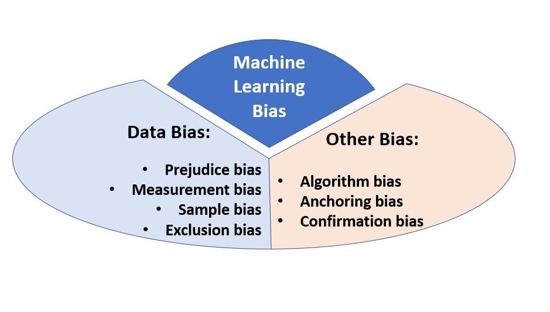

## Table of Contents

## What is in-group bias in the context of machine learning?

In-group bias in machine learning refers to a situation where an algorithm shows favoritism towards certain groups of data over others, often unintentionally. This can happen when the training data used to develop the algorithm is not diverse enough or is biased in some way. For example, if a facial recognition system is mostly trained on images of people with lighter skin tones, it might perform better on those images than on images of people with darker skin tones. This kind of bias can lead to unfair outcomes and perpetuate existing social inequalities.

To address in-group bias, it's important for data scientists to carefully curate their training datasets to ensure they represent a wide variety of groups. Techniques such as data augmentation, where additional data is generated to balance the dataset, can be used to mitigate bias. Additionally, regular audits of machine learning models can help identify and correct any biases that may arise. By taking these steps, we can work towards creating more fair and equitable machine learning systems.

## How does in-group bias manifest in machine learning algorithms?

In-group bias in machine learning happens when an algorithm treats some groups of data better than others. This can occur because the data used to train the algorithm is not varied enough or has some bias. For example, if a machine learning model for loan approvals is mostly trained on data from men, it might not work as well for women. This can lead to unfair decisions, where the model might approve loans more often for men than for women, even if both groups are equally qualified.

To fix in-group bias, it's important to make sure the training data includes a good mix of different groups. This can be done by adding more data to balance out the dataset, a process called data augmentation. Also, checking the machine learning models regularly can help find and fix any biases. By doing these things, we can make machine learning systems fairer and more equal for everyone.

## What are the common sources of in-group bias in training data?

In-group bias in training data often comes from the way data is collected. If the people collecting the data only include certain groups, like people from one country or one age group, the data won't represent everyone. For example, if a company only uses customer data from one region, the [machine learning](/wiki/machine-learning) model might work better for people in that region and not as well for others. This can happen because the company might not have access to data from other places or might not think to include it.

Another source of in-group bias is historical data that already has biases. If a machine learning model is trained on old data where some groups were treated unfairly, the model can learn those unfair patterns. For instance, if past loan data shows that certain groups were less likely to get loans, a model trained on this data might continue to make the same unfair decisions. To fix this, it's important to check the data for biases and try to balance it out before using it to train a model.

## Can you explain the impact of in-group bias on model performance and fairness?

In-group bias can make a machine learning model work better for some people than others. If the data used to train the model only includes certain groups, like people from one country or one age group, the model might not work well for people who are not in those groups. For example, if a model for recognizing faces is mostly trained on pictures of people with light skin, it might have a harder time recognizing people with dark skin. This can lead to the model making mistakes more often for certain groups, which is not fair.

The fairness of a model is also affected by in-group bias. When a model treats some groups better than others, it can make decisions that are unfair. For instance, if a model for approving loans is mostly trained on data from men, it might approve loans more often for men than for women, even if both groups are equally good at paying back loans. This kind of bias can make people feel left out and can make social problems worse. To make models fairer, it's important to use data that includes all kinds of people and to check the models often to fix any biases.

## What are some examples of in-group bias in real-world machine learning applications?

One example of in-group bias in real-world machine learning is in facial recognition technology. If a facial recognition system is mostly trained on pictures of people with light skin, it might not work as well for people with dark skin. This can lead to the system making more mistakes when identifying people with darker skin tones. For instance, a study showed that some facial recognition systems had higher error rates for people with darker skin, which can cause problems in places like airports or police departments where these systems are used.

Another example is in the area of loan approvals. If a machine learning model for approving loans is mostly trained on data from men, it might approve loans more often for men than for women, even if both groups are equally good at paying back loans. This can happen because the data used to train the model might not include enough information about women. As a result, women might have a harder time getting loans, which is not fair and can make it harder for them to start businesses or buy homes.

In healthcare, in-group bias can also be a problem. If a model for predicting health risks is mostly trained on data from one ethnic group, it might not work as well for people from other groups. For example, if a model is trained mostly on data from white patients, it might not predict health risks accurately for Black or Hispanic patients. This can lead to doctors making wrong decisions about treatment, which can harm patients and make health inequalities worse.

## How can in-group bias be detected in machine learning models?

To detect in-group bias in machine learning models, you can start by looking at the data used to train the model. If the data mostly includes one group of people, like people from one country or one age group, there might be in-group bias. You can check this by comparing the performance of the model on different groups. For example, if a model for approving loans works better for men than for women, that could be a sign of in-group bias. You can also use special tools and methods to test the model and see if it treats different groups unfairly.

Another way to detect in-group bias is by using fairness metrics. These are special numbers that help you see if a model is treating all groups the same way. For example, you can use a metric called "equalized odds" to see if the model makes the same number of mistakes for different groups. If the model makes more mistakes for one group than another, that could mean there is in-group bias. By regularly checking these metrics, you can find and fix any biases in the model, making it fairer for everyone.

## What techniques are used to mitigate in-group bias during data collection?

To reduce in-group bias during data collection, it's important to make sure the data includes a good mix of different groups. This can be done by collecting data from many different places and types of people. For example, if you're making a model for a health app, you should gather data from people of different ages, races, and backgrounds. This way, the model will learn from a wide variety of people and be fairer to everyone.

Another technique is to use [data augmentation](/wiki/data-augmentation). This means adding more data to the dataset to make it more balanced. If the data you have mostly includes one group, like men, you can add more data about women to make it more even. This helps the model learn from all groups and reduces the chance of it favoring one group over another. By doing these things, you can collect data that helps create machine learning models that are fair and work well for everyone.

## How can algorithmic adjustments help reduce in-group bias in machine learning models?

Algorithmic adjustments can help reduce in-group bias in machine learning models by changing how the models learn from data. One way to do this is by using fairness constraints. These are rules that make the model treat all groups the same way. For example, if a model for approving loans is more likely to approve loans for men than for women, a fairness constraint can be added to make sure the model looks at both groups the same way. This can help the model make fairer decisions.

Another way to reduce in-group bias is by using techniques like reweighting or resampling. These methods change how much the model pays attention to different parts of the data. If the data has more examples from one group, like people with light skin, reweighting can make the model pay more attention to examples from other groups, like people with dark skin. This helps the model learn from all groups equally and reduces the chance of it favoring one group over another. By making these kinds of adjustments, machine learning models can become fairer and work better for everyone.

## What role does diversity in the development team play in reducing in-group bias?

Having a diverse team of people working on machine learning projects can help reduce in-group bias. When the team includes people from different backgrounds, like different countries, ages, and races, they bring different ideas and experiences to the table. This can help them see biases in the data or the model that others might miss. For example, someone from a different culture might notice that the data doesn't include enough people like them, and they can suggest ways to fix it.

A diverse team can also make better decisions about how to collect and use data. They can think of ways to make sure the data includes all kinds of people, which helps the model learn from everyone equally. This can lead to fairer models that work well for all groups. By working together, a diverse team can create machine learning models that are more fair and useful for everyone.

## What are the ethical considerations surrounding in-group bias in machine learning?

In-group bias in machine learning raises important ethical questions. When a model treats some groups better than others, it can lead to unfair outcomes. For example, if a model for approving loans works better for men than for women, it might approve loans more often for men, even if both groups are equally good at paying back loans. This can make it harder for women to get loans, which is not fair and can make social problems worse. It's important for people who make these models to think about how their work can affect different groups and try to make the models as fair as possible.

To address these ethical issues, it's crucial to use data that includes all kinds of people and to check the models often to fix any biases. This can help make sure the models work well for everyone and don't treat any group unfairly. By being careful about how data is collected and used, and by making sure the team working on the models includes people from different backgrounds, we can create machine learning systems that are more fair and help everyone equally.

## How can ongoing monitoring and evaluation help manage in-group bias in deployed models?

Ongoing monitoring and evaluation are key to managing in-group bias in machine learning models that are already being used. By regularly checking how the model is doing, you can see if it's treating different groups unfairly. For example, if a model for approving loans is working better for men than for women, you can spot this problem early and fix it. This helps make sure the model stays fair and works well for everyone, not just certain groups.

To do this, you can use special tools and methods to keep an eye on the model's performance. You might look at fairness metrics, which are numbers that show if the model is treating all groups the same way. If you find that the model is making more mistakes for one group than another, you can make changes to the model or the data it uses to fix the bias. By doing this regularly, you can keep the model fair and make sure it helps everyone equally.

## What are the latest research advancements in addressing in-group bias in machine learning?

Recent research in addressing in-group bias in machine learning has focused on developing new methods to make models fairer. One key advancement is the use of adversarial training, where another model is used to find and fix biases in the main model. This method helps the main model learn to treat all groups the same way. Another important development is the use of fairness-aware algorithms, which are designed to keep fairness in mind while the model is learning. These algorithms can help reduce bias by making sure the model doesn't favor one group over another.

Another area of research is in improving the data used to train models. Researchers are working on ways to collect more diverse data and use techniques like data augmentation to balance out the dataset. For example, if a model for recognizing faces is mostly trained on pictures of people with light skin, researchers can add more pictures of people with dark skin to make the dataset more balanced. This helps the model learn from all kinds of people and reduces the chance of it making unfair decisions. By combining these new methods and techniques, researchers are making progress in creating machine learning models that are fair and work well for everyone.

## References & Further Reading

[1]: Buolamwini, J., & Gebru, T. (2018). ["Gender Shades: Intersectional Accuracy Disparities in Commercial Gender Classification."](https://www.media.mit.edu/publications/gender-shades-intersectional-accuracy-disparities-in-commercial-gender-classification/) In Conference on Fairness, Accountability, and Transparency (FAT*).

[2]: Barocas, S., Hardt, M., & Narayanan, A. (2019). ["Fairness and Machine Learning."](https://fairmlbook.org/) Book in preparation for publication. Fairness and Machine Learning Draft.

[3]: Mehrabi, N., Morstatter, F., Saxena, N., Lerman, K., & Galstyan, A. (2021). ["A Survey on Bias and Fairness in Machine Learning."](https://arxiv.org/abs/1908.09635) ACM Computing Surveys (CSUR).

[4]: Dastin, J. (2018). ["Amazon Scraps Secret AI Recruiting Tool That Showed Bias Against Women."](https://www.reuters.com/article/world/insight-amazon-scraps-secret-ai-recruiting-tool-that-showed-bias-against-women-idUSKCN1MK0AG/) Reuters.

[5]: Chouldechova, A. (2017). ["Fair Prediction with Disparate Impact: A Study of Bias in Recidivism Prediction Instruments."](https://pubmed.ncbi.nlm.nih.gov/28632438/) Big Data.

[6]: Raji, I. D., & Buolamwini, J. (2019). ["Actionable Auditing: Investigating the Impact of Publicly Naming Biased Performance Results of Commercial AI Products."](https://www.media.mit.edu/publications/actionable-auditing-investigating-the-impact-of-publicly-naming-biased-performance-results-of-commercial-ai-products/) In Proceedings of the 2019 AAAI/ACM Conference on AI, Ethics, and Society.