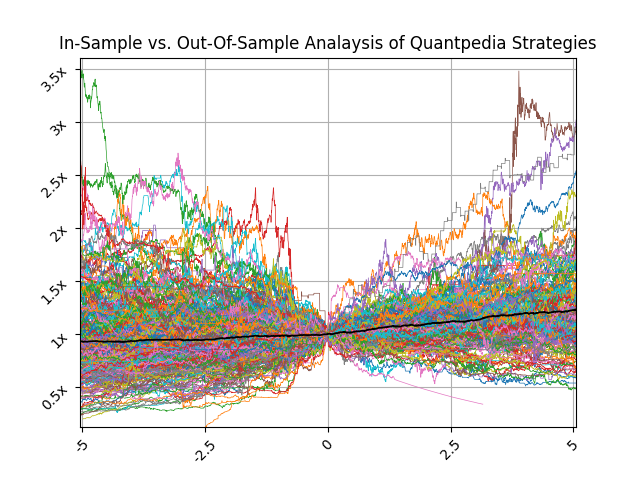

## Table of Contents

## What is in-sample analysis in the context of trading strategies?

In-sample analysis in trading strategies refers to the process of testing a trading strategy using historical data that the strategy was developed on. This means you use the same set of data to create and test your strategy. The goal is to see how well the strategy would have worked in the past. This can help traders understand if their strategy has potential before they use it in real trading.

However, there's a big catch with in-sample analysis. Because the strategy is tested on the same data it was built with, it often looks better than it really is. This is called overfitting. It's like memorizing answers for a test instead of learning the material. When traders rely only on in-sample results, they might be disappointed when the strategy doesn't work as well in the real world, where new and different data comes in every day.

## What is out-of-sample analysis in the context of trading strategies?

Out-of-sample analysis in trading strategies is when you test your strategy on data that it hasn't seen before. This means you use a different set of historical data than the one you used to create your strategy. The purpose is to see how well your strategy would work in situations it hasn't been trained on. This gives you a better idea of how your strategy might perform in the future when real, new data comes in.

This kind of testing is important because it helps you avoid overfitting, which is a common problem in in-sample analysis. Overfitting happens when a strategy works really well on the data it was built with but fails when faced with new data. By using out-of-sample analysis, you get a more realistic picture of how your strategy might perform in the real world. It's like taking a practice test with new questions to see if you really understand the material, not just the answers you've memorized.

## Why is it important to perform both in-sample and out-of-sample analysis?

Performing both in-sample and out-of-sample analysis is important because they each give you different kinds of information about your trading strategy. In-sample analysis lets you see how your strategy works on the data you used to build it. This helps you understand if your ideas make sense and if your strategy can work well with that specific set of data. It's like practicing with the same set of questions over and over to see if you can get them right.

On the other hand, out-of-sample analysis is crucial because it tests your strategy on new data that it hasn't seen before. This gives you a better idea of how your strategy might perform in the real world, where new data comes in every day. It helps you avoid the problem of overfitting, where a strategy might look good on the data it was built with but fails when faced with new situations. It's like taking a new test to see if you really understand the material, not just the answers you've memorized.

## How can in-sample analysis lead to overfitting of trading strategies?

In-sample analysis can lead to overfitting of trading strategies because it uses the same data to both create and test the strategy. When you use the same data, you might adjust your strategy to fit this data perfectly. This means your strategy might work really well on this specific set of data, but it's like memorizing answers for a test. You might get a high score on that one test, but you won't know if you really understand the material.

The problem comes when you try to use this strategy in the real world. Real markets bring new data every day, and your strategy might not work as well with this new data. It's like taking a different test with new questions. If you've only memorized the answers from the first test, you'll struggle with the new questions. That's why a strategy that looks good in in-sample analysis might fail in real trading, because it's been overfitted to the old data and can't handle new situations.

## What are the common methods used for in-sample analysis of trading strategies?

In-sample analysis of trading strategies usually involves backtesting, which means running the strategy on past data to see how it would have done. Traders might use software to go through old price data and see if their strategy would have made money. They can change things like when to buy or sell, how much to trade, and what signals to use. The goal is to see if the strategy works well with this set of data and to make it as good as possible.

Another common method is optimization, where traders try different settings for their strategy to find the best ones. They might change the time periods, the indicators, or the rules for entering and exiting trades. By doing this, they can see which settings make the strategy perform the best on the historical data they are using. But they have to be careful not to make the strategy too perfect for this data, because that can lead to overfitting.

Sometimes, traders also use statistical methods to analyze how well their strategy works. They might look at things like the average return, the risk, and how often the strategy wins or loses. These [statistics](/wiki/bayesian-statistics) help them understand if the strategy is likely to be successful. But like with backtesting and optimization, they need to remember that these results are only for the data they used, and the strategy might not work the same way with new data.

## What are the common methods used for out-of-sample analysis of trading strategies?

Out-of-sample analysis is when you test your trading strategy on new data that it hasn't seen before. The most common way to do this is by using a different set of historical data than the one you used to create your strategy. You might split your total data into two parts: one part for building the strategy (in-sample) and the other part for testing it (out-of-sample). This helps you see how your strategy might work in the real world with new situations. You can use backtesting software to run your strategy on this new data and see how it performs.

Another method is forward testing, where you test your strategy in real-time but with a small amount of money or in a simulated environment. This lets you see how your strategy works with actual, new data as it comes in. It's a good way to check if your strategy can handle the ups and downs of the market without risking a lot of money. Both of these methods help you avoid overfitting and give you a better idea of how your strategy might do in the future.

## How can you validate the robustness of a trading strategy using out-of-sample data?

To validate the robustness of a trading strategy using out-of-sample data, you can start by dividing your historical data into two parts. Use one part to build and optimize your strategy. This is the in-sample data. Then, use the other part, which is the out-of-sample data, to test how well your strategy works on new data that it hasn't seen before. If your strategy still performs well on this new data, it's a good sign that it's robust and can handle different market conditions.

Another way to check the robustness of your strategy is by doing forward testing. This means you use your strategy in real-time but with a small amount of money or in a simulated environment. By doing this, you can see how your strategy reacts to actual market changes as they happen. If your strategy continues to make good decisions and performs well with the new data coming in, you can feel more confident that it's a strong and reliable strategy.

## What are the potential pitfalls of relying solely on in-sample performance?

Relying only on in-sample performance can trick you into thinking your trading strategy is better than it really is. When you test your strategy on the same data you used to build it, you might adjust it to fit that data perfectly. This can make your strategy look great on paper, but it's like memorizing answers for a test. You might get a high score on that one test, but if you take a different test with new questions, you might fail. This is called overfitting, and it's a big problem because your strategy might not work well when you use it in the real world with new data.

Another issue with focusing only on in-sample performance is that you might miss out on important information about how your strategy will handle different market conditions. Real markets change all the time, and your strategy needs to be able to adapt. If you only test it on the same old data, you won't know if it can handle new situations. This can lead to big losses when you start trading for real. That's why it's important to also test your strategy on out-of-sample data, which is new data that it hasn't seen before. This gives you a better idea of how your strategy might perform in the future.

## How do you select the appropriate time frame for out-of-sample testing?

Choosing the right time frame for out-of-sample testing is important to make sure your trading strategy works well in different situations. You want to pick a time frame that is long enough to include different market conditions, like bull markets, bear markets, and times when the market is going sideways. This helps you see how your strategy handles ups and downs. A good rule of thumb is to use at least 2 to 3 years of data for out-of-sample testing. This way, you can be sure that your strategy is tested on a variety of market conditions and is more likely to work well in the future.

It's also important to make sure that the out-of-sample time frame is different from the in-sample time frame. You don't want to accidentally use data that your strategy has already seen. A common way to do this is by using a "walk-forward" method, where you build your strategy on earlier data and then test it on later data. This helps you see how your strategy might perform as time goes on. By [picking](/wiki/asset-class-picking) a good time frame for out-of-sample testing, you can feel more confident that your strategy will work well when you start using it in real trading.

## What statistical measures are important for comparing in-sample and out-of-sample performance?

When comparing in-sample and out-of-sample performance, some important statistical measures to look at are the average return and the risk, measured by things like standard deviation or the Sharpe ratio. The average return tells you how much money your strategy would have made over time. If the average return is similar for both in-sample and out-of-sample data, it's a good sign that your strategy is working well. The risk measures help you understand how much your returns might go up and down. If the risk is a lot higher in out-of-sample testing, it might mean your strategy is not as reliable as it seemed in-sample.

Another important measure is the win rate, which is the percentage of trades that make money. If your strategy has a high win rate in-sample but a much lower win rate out-of-sample, it could be a sign of overfitting. You should also look at the maximum drawdown, which is the biggest loss your strategy might face. If the maximum drawdown is much bigger in out-of-sample testing, it means your strategy might not handle real market changes as well as you thought. By comparing these measures, you can get a better idea of how your strategy might perform in the future.

## How can machine learning techniques be applied to enhance out-of-sample performance?

Machine learning techniques can help improve how well a trading strategy works on new data by finding patterns that are hard for people to see. These techniques can look at a lot of data and learn from it, figuring out what's important and what's not. For example, [machine learning](/wiki/machine-learning) can use algorithms like neural networks or decision trees to find the best times to buy or sell. By training these models on in-sample data and then testing them on out-of-sample data, you can see if they can handle new situations well. This helps avoid overfitting because the models learn to focus on the most important parts of the data, not just memorizing the past.

Another way machine learning can help is by using techniques like cross-validation. This means you split your data into different parts and test your model on each part to see how it does. By doing this, you can make sure your model works well on different sets of data, not just the one you used to build it. Machine learning can also use things like ensemble methods, where you combine several models to make better predictions. This can make your strategy more reliable because it's less likely to fail on new data. By using these machine learning techniques, you can make your trading strategy stronger and more likely to work well in the real world.

## What advanced techniques exist for optimizing the balance between in-sample and out-of-sample analysis in trading strategies?

One advanced technique for optimizing the balance between in-sample and out-of-sample analysis is called walk-forward optimization. This method involves breaking your historical data into smaller time periods. You use one period to build and optimize your strategy (in-sample), and then you test it on the next period (out-of-sample). You keep doing this, moving forward in time, to see how your strategy works over different market conditions. This helps you avoid overfitting because you're always testing your strategy on new data, making sure it can handle changes in the market.

Another technique is using machine learning with cross-validation. Cross-validation means you split your data into different parts and train your model on some parts while testing it on others. This helps you see how well your model works on data it hasn't seen before, which is like out-of-sample testing. By using machine learning, you can find patterns in the data that might be hard to see otherwise. This can make your strategy more robust because it learns from a variety of data, not just the data you used to build it. Both of these techniques help you find a good balance between in-sample and out-of-sample performance, making your trading strategy more likely to succeed in real markets.

## What is the Role of In-Sample Analysis in Algorithm Development?

In-sample testing plays a vital role in the initial stages of algorithm development for trading strategies. It involves using historical data to develop and fine-tune the parameters and rules of a trading model. By leveraging this data, developers can identify potential trading opportunities and refine methodologies to enhance strategy performance. However, there is an inherent risk associated with an over-reliance on in-sample data—overfitting.

Overfitting occurs when a trading model is tailored too closely to the historical data, capturing random noise instead of genuine market patterns. This results in a model that appears highly effective during [backtesting](/wiki/backtesting) but performs poorly when deployed in live trading conditions. Overfitting can be detected through various statistical techniques, such as analyzing the model’s complexity relative to the amount of data used. A model with high complexity relative to the data available is more likely to overfit.

Consider a simple linear regression model that predicts stock prices:

$$
y = \beta_0 + \beta_1 x + \epsilon
$$

Where $y$ is the predicted stock price, $\beta_0$ and $\beta_1$ are the model parameters, $x$ is the independent variable (e.g., time or [volume](/wiki/volume-trading-strategy)), and $\epsilon$ is the error term. In the context of in-sample testing, the parameters $\beta_0$ and $\beta_1$ are optimized to fit the historical data set.

While optimizing these parameters, it is essential to maintain a balance between fitting the data well and avoiding an overly complex model. Techniques such as regularization (e.g., Lasso or Ridge regression) can help prevent overfitting by adding a penalty term to the loss function, thus discouraging overly complex models. In Python, this can be implemented using libraries like scikit-learn:

```python
from sklearn.linear_model import Lasso
import numpy as np

# Sample data
X_train = np.array([[1], [2], [3], [4], [5]])
y_train = np.array([2, 3, 5, 7, 11])

# Lasso model with regularization
lasso = Lasso(alpha=0.1)
lasso.fit(X_train, y_train)
```

In summary, while in-sample analysis is crucial for shaping the preliminary framework of trading strategies, it is important to exercise caution to ensure that models do not fall into the trap of overfitting. Developing a robust strategy involves continuous testing and validation, ultimately requiring a shift to out-of-sample data to confirm the model's predictive power in unseen scenarios.

## References & Further Reading

[1]: Bergstra, J., Bardenet, R., Bengio, Y., & Kégl, B. (2011). ["Algorithms for Hyper-Parameter Optimization."](https://papers.nips.cc/paper/4443-algorithms-for-hyper-parameter-optimization) Advances in Neural Information Processing Systems 24.

[2]: ["Advances in Financial Machine Learning"](https://www.amazon.com/Advances-Financial-Machine-Learning-Marcos/dp/1119482089) by Marcos Lopez de Prado

[3]: ["Evidence-Based Technical Analysis: Applying the Scientific Method and Statistical Inference to Trading Signals"](https://www.amazon.com/Evidence-Based-Technical-Analysis-Scientific-Statistical/dp/0470008741) by David Aronson

[4]: ["Machine Learning for Algorithmic Trading"](https://github.com/stefan-jansen/machine-learning-for-trading) by Stefan Jansen

[5]: ["Quantitative Trading: How to Build Your Own Algorithmic Trading Business"](https://books.google.com/books/about/Quantitative_Trading.html?id=j70yEAAAQBAJ) by Ernest P. Chan

[6]: McLean, R. David, and Jeffrey Pontiff. (2016). ["Does Academic Research Destroy Stock Return Predictability?"](https://onlinelibrary.wiley.com/doi/abs/10.1111/jofi.12365) The Journal of Finance, 71(1), 5-32.