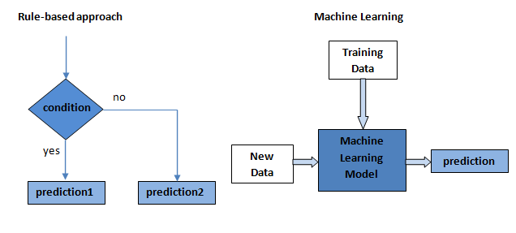

## Table of Contents

## What is an In-Set Condition in the context of machine learning?

An In-Set Condition in machine learning refers to a rule or criterion used during the training of a model to ensure that the model's predictions or decisions stay within a predefined set of acceptable outcomes. For example, if you are training a model to classify images into categories like "dog," "cat," or "bird," an In-Set Condition might be used to make sure the model only predicts one of these three categories and does not output something unexpected like "elephant."

This condition is important because it helps maintain the reliability and accuracy of the model by preventing it from making predictions outside the scope of what it was trained to do. By enforcing such conditions, machine learning practitioners can better control the behavior of their models, ensuring they perform as intended and do not produce erroneous or irrelevant results. In practical terms, implementing an In-Set Condition might involve setting up constraints in the model's architecture or using specific loss functions that penalize predictions outside the desired set.

## How does an In-Set Condition differ from other types of conditions in machine learning?

An In-Set Condition in machine learning is like a rule that keeps a model's predictions within a specific group of allowed outcomes. For example, if a model is meant to classify animals into "dog," "cat," or "bird," an In-Set Condition makes sure it only picks one of those three and not something else like "elephant." This is different from other types of conditions, which might focus on different aspects of the model's performance. For instance, a condition might be about how accurate the model is, or how quickly it can make predictions, but it doesn't necessarily limit the model to a specific set of outcomes.

Other conditions in machine learning might include things like Out-of-Distribution (OOD) detection, where the model is trained to recognize when it's being asked to make predictions on data it hasn't seen before. This is different from an In-Set Condition because it's about identifying when the input data is outside the training data's scope, not about limiting the output to a certain set. Another example is a constraint on model complexity, like limiting the number of parameters in a neural network. This type of condition aims to prevent overfitting by keeping the model simple, but it doesn't directly control what the model's predictions can be. In summary, while an In-Set Condition focuses on keeping predictions within a defined set, other conditions might focus on different aspects like accuracy, speed, or the nature of the input data.

## Can you explain the basic principle behind using In-Set Conditions in machine learning models?

The basic principle behind using In-Set Conditions in [machine learning](/wiki/machine-learning) models is to make sure that the model's predictions stay within a specific set of allowed outcomes. Imagine you're teaching a model to tell the difference between pictures of dogs, cats, and birds. An In-Set Condition would be like telling the model, "You can only choose from these three options: dog, cat, or bird." This helps keep the model's predictions reliable and accurate because it prevents the model from guessing something completely different, like an elephant, when it's not sure.

To implement an In-Set Condition, you might add rules or constraints to the model's training process. For example, you could use a special loss function that penalizes the model if it predicts anything outside the allowed set. This way, the model learns to stick to the options you've given it. By setting these conditions, you help the model perform better and make sure it does what you want it to do, without making unexpected or irrelevant predictions.

## What are some common applications of In-Set Conditions in machine learning?

In-Set Conditions are often used in machine learning when you want to make sure a model's predictions stay within a certain group of options. For example, if you're building a model to help doctors diagnose diseases, you might use an In-Set Condition to make sure the model only predicts from a list of known diseases like "flu," "cold," or "pneumonia." This helps keep the model's predictions useful and reliable because it stops the model from guessing something completely different, like "elephant," when it's not sure.

Another common use of In-Set Conditions is in recommendation systems, like those used by streaming services or online stores. If you're building a model to suggest movies to watch, you might set an In-Set Condition so that the model only recommends movies that are actually available in the service's library. This ensures that the recommendations are always relevant and that users don't get frustrated by being suggested movies they can't watch. By using In-Set Conditions, these systems can provide more accurate and helpful suggestions to their users.

## How can In-Set Conditions be implemented in a machine learning algorithm?

To implement In-Set Conditions in a machine learning algorithm, you can add rules or constraints during the model's training process. For example, if you're training a model to classify images into categories like "dog," "cat," or "bird," you might use a special loss function that penalizes the model if it predicts anything outside these three options. This loss function could be designed to increase the error when the model's output does not match one of the allowed categories, encouraging the model to stick to the set you've defined. By adjusting the training process in this way, the model learns to keep its predictions within the specified set, improving its reliability and accuracy.

In practice, implementing an In-Set Condition might look like this in a [neural network](/wiki/neural-network): You could add a softmax layer at the end of the network to ensure that the output probabilities sum to 1, and then use a categorical cross-entropy loss function to penalize predictions that fall outside the desired categories. For instance, if your categories are encoded as one-hot vectors, the loss function would be minimized when the model's output closely matches one of these vectors. This approach helps the model to focus on the correct set of outcomes and avoid making irrelevant or unexpected predictions.

## What are the advantages of using In-Set Conditions in machine learning models?

Using In-Set Conditions in machine learning models helps keep predictions reliable and accurate. Imagine you're training a model to tell the difference between pictures of dogs, cats, and birds. An In-Set Condition makes sure the model only picks one of those three options. This is helpful because it stops the model from guessing something completely different, like an elephant, when it's not sure. By doing this, the model's predictions stay useful and relevant, making it more trustworthy for users.

Another advantage of In-Set Conditions is that they can make the model easier to use and understand. For example, if you're building a recommendation system for a streaming service, you can use an In-Set Condition to make sure the model only suggests movies that are actually available. This way, users get recommendations that are always relevant and they don't get frustrated by being suggested movies they can't watch. By setting these conditions, you help the model perform better and meet the needs of its users more effectively.

## What are the potential limitations or challenges when using In-Set Conditions?

Using In-Set Conditions in machine learning can sometimes make the model less flexible. Imagine you're training a model to tell the difference between pictures of dogs, cats, and birds. If you use an In-Set Condition to make sure the model only picks one of those three options, it might struggle if it sees a picture of a different animal, like a horse. The model might not know what to do with the picture because it's not allowed to guess anything outside the set of dog, cat, or bird. This can limit the model's ability to learn and adapt to new situations.

Another challenge with In-Set Conditions is that they can make the training process more complicated. For example, if you're using a special loss function to keep the model's predictions within a certain set, you might need to spend more time tweaking the function to get the best results. This can take longer and require more expertise to set up correctly. If the In-Set Condition is too strict, it might also make it harder for the model to learn, because it has less room to explore different possibilities during training.

## How do In-Set Conditions affect the performance and accuracy of a machine learning model?

In-Set Conditions can help improve the accuracy of a machine learning model by making sure its predictions stay within a certain group of options. For example, if you're training a model to tell the difference between pictures of dogs, cats, and birds, an In-Set Condition makes sure the model only picks one of those three options. This can make the model's predictions more reliable because it stops the model from guessing something completely different, like an elephant, when it's not sure. By keeping the predictions within the set you've defined, the model can focus on learning the differences between the allowed options, which can lead to better performance.

However, In-Set Conditions can also make the model less flexible. If the model sees something outside the set, like a picture of a horse, it might not know what to do because it's not allowed to guess anything outside the set of dog, cat, or bird. This can limit the model's ability to learn and adapt to new situations. Additionally, using In-Set Conditions can make the training process more complicated. You might need to use a special loss function to keep the model's predictions within the set, which can take longer to set up and require more expertise. If the In-Set Condition is too strict, it might also make it harder for the model to learn because it has less room to explore different possibilities during training.

## Can you provide an example of a machine learning model that effectively uses In-Set Conditions?

Imagine you're working on a machine learning model for a medical diagnosis app. The app is designed to help doctors figure out if a patient has the flu, a cold, or pneumonia. You use an In-Set Condition to make sure the model only predicts one of these three diseases. This helps the model stay focused on the right options, making its predictions more reliable and useful for doctors. By setting this condition, the model learns to tell the difference between these specific diseases, which can lead to better diagnosis and treatment for patients.

To implement this In-Set Condition, you might use a special loss function in your model's training process. For example, you could use a categorical cross-entropy loss function that penalizes the model if it predicts anything outside the set of flu, cold, or pneumonia. This encourages the model to stick to the options you've given it. By adjusting the training process this way, the model learns to keep its predictions within the specified set, improving its accuracy and reliability for real-world use in medical diagnosis.

## How can the effectiveness of In-Set Conditions be measured and evaluated in machine learning?

The effectiveness of In-Set Conditions in machine learning can be measured by checking how often the model's predictions stay within the allowed set of outcomes. For example, if you're training a model to classify pictures of dogs, cats, and birds, you can count how many times the model correctly picks one of those three options. If the model always picks from the right set, it means the In-Set Condition is working well. You can also compare the model's performance with and without the In-Set Condition to see if it helps improve accuracy and reliability.

Another way to evaluate In-Set Conditions is by looking at the model's performance on different types of data. You might test the model with pictures that are easy to classify, like clear images of dogs, cats, and birds, and also with harder pictures that might confuse the model. By doing this, you can see if the In-Set Condition helps the model make better predictions even when it's unsure. If the model still sticks to the allowed set in tricky situations, it shows that the In-Set Condition is effective and helps the model stay reliable.

## What advanced techniques can be used to optimize In-Set Conditions in complex machine learning scenarios?

In complex machine learning scenarios, one advanced technique to optimize In-Set Conditions is to use a custom loss function that specifically penalizes predictions outside the desired set. For example, if you're training a model to classify images into categories like "dog," "cat," or "bird," you could use a categorical cross-entropy loss function with an additional term that increases the error when the model's output does not match one of these three categories. This encourages the model to focus on the correct set of outcomes and avoid making irrelevant or unexpected predictions. Another technique involves using regularization methods, like L1 or L2 regularization, to constrain the model's parameters in a way that helps maintain the In-Set Condition without overfitting to the training data.

Another approach is to use ensemble methods, where multiple models are trained to make predictions and their outputs are combined to ensure the final prediction stays within the allowed set. For instance, if one model in the ensemble predicts an outcome outside the set, the other models' predictions can help correct this by voting for an in-set outcome. This can be particularly useful in scenarios where individual models might struggle with certain types of data or edge cases. Additionally, advanced techniques like transfer learning can be employed, where a pre-trained model is fine-tuned with an In-Set Condition to adapt to a new, specific task while maintaining the constraint on the output set. By combining these methods, you can enhance the model's ability to adhere to In-Set Conditions, improving its performance and reliability in complex scenarios.

## What future developments or research directions are anticipated for In-Set Conditions in machine learning?

In the future, research on In-Set Conditions in machine learning is likely to focus on making these conditions more flexible and adaptable. Scientists might work on ways to let models learn new categories over time without losing the ability to stick to the original set of options. For example, if a model is trained to recognize dogs, cats, and birds, future developments could allow it to also learn to recognize horses without messing up its predictions for the original three categories. This could involve using advanced techniques like online learning, where the model keeps learning from new data even after it's been deployed, or meta-learning, where the model learns how to learn new tasks quickly.

Another area of research might be about making In-Set Conditions easier to use and set up. Right now, using these conditions can make training a model more complicated because you need special loss functions or other tweaks. Future work could focus on creating tools or frameworks that help people add In-Set Conditions to their models without needing a lot of extra work. This could make machine learning more accessible to people who aren't experts, helping them build models that are reliable and accurate. By improving how In-Set Conditions work and how easy they are to use, researchers can help make machine learning models better at sticking to the right set of predictions, no matter how complex the task gets.

## References & Further Reading

[1]: Guo, Y., & Berkhahn, F. (2016). ["Entity embeddings of categorical variables."](https://arxiv.org/abs/1604.06737) arXiv preprint arXiv:1604.06737.

[2]: Bishop, C. (2006). ["Pattern Recognition and Machine Learning."](https://www.cs.uoi.gr/~arly/courses/ml/tmp/Bishop_book.pdf) Springer.

[3]: Goodfellow, I., Bengio, Y., & Courville, A. (2016). ["Deep Learning."](https://www.deeplearningbook.org/) MIT Press.

[4]: Murphy, K. P. (2012). ["Machine Learning: A Probabilistic Perspective."](https://www.cs.ubc.ca/~murphyk/MLbook/pml-toc-1may12.pdf) MIT Press.

[5]: Zhang, C., Bengio, S., Hardt, M., Recht, B., & Vinyals, O. (2017). ["Understanding deep learning requires rethinking generalization."](https://arxiv.org/abs/1611.03530) arXiv preprint arXiv:1611.03530.