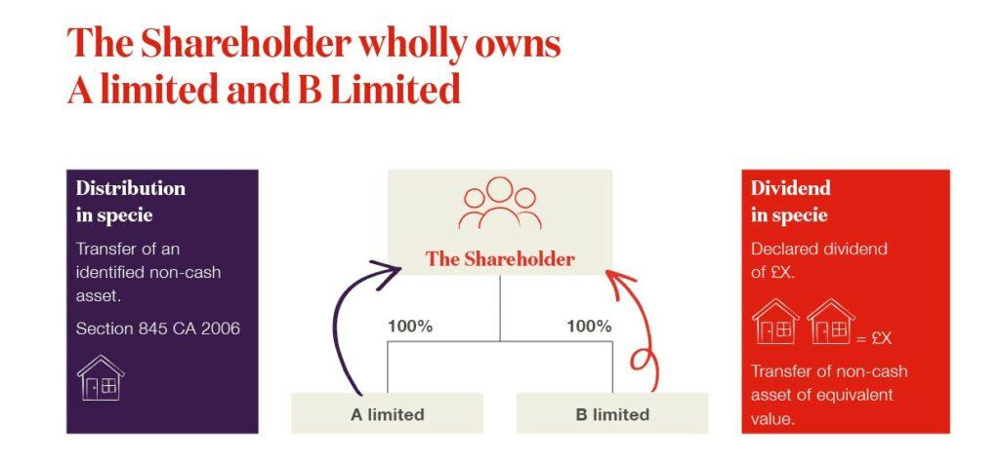

## Table of Contents

## What does 'in specie' mean in the context of asset distributions?

'In specie' is a term used when assets are distributed in their original form, rather than being sold and the money given out. For example, if a company wants to give its shareholders some of its property, it might distribute the property itself instead of selling it and giving the cash. This way, the shareholders get the actual asset, like a piece of land or shares in another company.

This method can be useful for tax reasons or if the asset is expected to increase in value. However, it can also be more complicated because it involves transferring ownership of the asset directly. Not all shareholders might want the asset in its current form, so they need to consider if they can use it or if they would rather sell it themselves.

## How does an in specie distribution differ from a cash distribution?

An in specie distribution is when a company gives out its assets directly to shareholders instead of giving them money. For example, if a company owns shares in another business, it might give those shares to its shareholders. This is different from a cash distribution, where the company sells the assets and then gives the money from the sale to the shareholders. 

In specie distributions can be good if the asset is expected to grow in value or if there are tax benefits. Shareholders get to own the asset directly, which could be more valuable over time. However, it can also be tricky because not everyone might want the asset in its current form. They might need to sell it themselves if they want cash instead. On the other hand, cash distributions are simpler because everyone gets money, which is easy to use or save.

## What are the common types of assets that can be distributed in specie?

Common types of assets that can be distributed in specie include shares in other companies, real estate, and physical goods like machinery or inventory. For example, if a company owns shares in another business, it might decide to give those shares directly to its shareholders instead of selling them and giving out the money. This can be useful if the shares are expected to increase in value or if there are tax advantages to holding onto them.

Real estate is another asset often distributed in specie. A company might own a piece of land or a building and choose to give it to shareholders rather than selling it. This can be beneficial if the property is expected to appreciate in value, but it can also be complicated because not all shareholders might want to own a piece of real estate. They might need to sell it themselves if they prefer cash.

Physical goods like machinery or inventory can also be distributed in specie. If a company has extra machinery or products that it doesn't need, it might give these items directly to shareholders. This can be a good way to distribute value, but it depends on whether the shareholders can use or sell these goods effectively.

## What are the tax implications of receiving an asset in specie?

Receiving an asset in specie can have different tax effects depending on where you live and the type of asset. In many places, when you get an asset in specie, it's seen as if you sold it for its current value. This can mean you have to pay capital gains tax on any profit you made since the company originally bought the asset. For example, if the company bought shares for $10 each and they're now worth $15 when you get them, you might have to pay tax on the $5 difference.

However, there can be tax benefits too. In some countries, getting assets in specie can help you delay paying taxes. Instead of paying tax right away, you might only pay when you sell the asset yourself. This can be good if you think the asset will go up in value or if you want to hold onto it for a while. But, it's important to check the tax rules in your area because they can be different everywhere.

## How do companies decide which assets to distribute in specie?

Companies decide which assets to distribute in specie based on what they think will be best for their shareholders and the company itself. They look at the value of the asset now and what it might be worth in the future. If they think the asset, like shares in another company or a piece of land, will go up in value, they might choose to give it to shareholders directly. This way, shareholders can benefit from the growth of the asset over time.

They also consider what shareholders might want. Not all shareholders will want the same thing. Some might prefer to get cash, while others might like to own part of another business or a piece of property. The company tries to balance these needs. They might also think about tax effects. If giving out an asset in specie can help shareholders save on taxes, that could be a big reason to choose that asset.

Sometimes, the decision also depends on what the company no longer needs. If they have extra machinery or inventory, they might give these to shareholders rather than selling them. This can be a way to distribute value without having to go through the process of selling the items first. The company looks at all these factors to decide which assets to distribute in specie.

## What are the legal requirements for an in specie distribution?

When a company wants to give out assets in specie, it has to follow some legal rules. The company needs to make sure it has the power to do this, usually written in its own rules or the law of the country it's in. They also have to tell shareholders about the plan and sometimes get their okay, especially if it's a big change. The company has to be fair to all shareholders, so everyone gets their fair share of the asset. They also need to follow any special rules about how to transfer the asset, like making sure the right paperwork is done.

Also, the company has to think about tax rules. They need to know how giving out an asset might affect taxes for the company and the shareholders. This can be tricky because tax laws can be different in every country. The company might need to talk to tax experts to make sure they're doing everything right. If they don't follow the rules, they could get in trouble with the law or the tax people. So, it's important to do everything carefully and correctly.

## Can in specie distributions be used as a strategy for corporate restructuring?

Yes, in specie distributions can be used as a strategy for corporate restructuring. When a company wants to change its structure, it might decide to give some of its assets directly to shareholders instead of selling them. This can help the company focus on its main business by getting rid of assets that don't fit anymore. For example, if a company owns a business that's not doing well, it might give that business to shareholders and then focus on its more successful parts.

Using in specie distributions for restructuring can also be good for shareholders. They get to own the asset directly, which could be worth more in the future. This can be a way for the company to return value to shareholders without selling the asset and paying taxes on the sale. But, the company has to be careful to follow all the rules and make sure it's fair to everyone. If done right, in specie distributions can be a smart way to restructure and make the company stronger.

## What are the potential benefits of in specie distributions for shareholders?

In specie distributions can offer shareholders a few important benefits. One big advantage is that shareholders get the asset directly instead of just getting money. This can be good if the asset, like shares in another company or a piece of land, is expected to go up in value. Shareholders can hold onto the asset and maybe make more money from it later. Also, getting an asset in specie might help shareholders save on taxes. Instead of the company selling the asset and giving out the money, which could lead to immediate taxes, shareholders might only pay taxes when they sell the asset themselves. This can be a smart way to delay paying taxes.

Another benefit is that shareholders might get more control over the asset. If they receive shares in another company, they can decide what to do with those shares. They can keep them, sell them when they want, or even get involved in how that other company is run. This can be more appealing than just getting cash, especially if the asset has potential for growth. Overall, in specie distributions give shareholders a chance to own something that could be more valuable in the future and offers them flexibility in managing their investments.

## How do in specie distributions affect a company's balance sheet?

When a company gives out assets in specie, it changes the company's balance sheet. The balance sheet is like a big list that shows what the company owns and what it owes. When the company gives away an asset, like shares or a piece of land, it no longer owns that asset. So, the value of the asset is taken off the balance sheet. This makes the company's total assets go down. At the same time, the company's equity, which is the value of the company to its owners, also goes down because the company is giving away part of its value to shareholders.

This change can be good or bad for the company, depending on what it wants to do. If the company is trying to focus on its main business and get rid of assets it doesn't need, giving them away in specie can make the balance sheet simpler and cleaner. It can show that the company is now more focused on what it does best. But, if the company gives away a lot of its valuable assets, it might make the company look weaker because its total value goes down. So, the company needs to think carefully about how giving away assets in specie will affect its balance sheet and its overall health.

## What are the risks and challenges associated with in specie distributions?

In specie distributions can be tricky for companies and shareholders. One big challenge is making sure everyone gets a fair share of the asset. Not all shareholders might want the asset in its current form, like shares in another company or a piece of land. Some might prefer cash, so they would have to sell the asset themselves, which can be hard and take time. Also, the company has to follow a lot of rules when giving out assets in specie. They need to make sure they have the legal power to do it and tell shareholders about the plan. If they mess up, they could get in trouble with the law or the tax people.

Another risk is how in specie distributions can affect the company's balance sheet. When the company gives away an asset, its total value goes down. This can make the company look weaker if it gives away too much. The company needs to think carefully about which assets to give away and how it will change their financial situation. If they're not careful, it could hurt the company's health and make it harder to do business in the future. So, while in specie distributions can be a good way to return value to shareholders, they come with a lot of risks and challenges that need to be managed carefully.

## How do regulatory frameworks differ globally regarding in specie distributions?

Regulatory frameworks for in specie distributions vary a lot around the world. In some countries, like the United States, companies have to follow strict rules from the Securities and Exchange Commission (SEC) about how they can give out assets. They need to tell shareholders about the plan and sometimes get their approval. In the UK, companies have to follow the Companies Act, which has its own rules about what they can and can't do when distributing assets. Each country has its own set of rules, and companies need to know them well to avoid breaking the law.

In other places, like some European countries, the rules might be less strict, but companies still have to be careful. For example, in Germany, companies need to make sure that in specie distributions are fair to all shareholders and follow tax laws. In Australia, the Australian Securities and Investments Commission (ASIC) oversees these distributions, and companies have to make sure they're doing everything right. The main thing is that no matter where a company is, it has to follow the local rules and make sure it's treating shareholders fairly.

## What advanced strategies can be employed to optimize in specie distributions for tax efficiency?

To make in specie distributions more tax-efficient, companies can use a few smart strategies. One way is to give out assets that have gone up a lot in value. If the company bought shares for a low price and they're now worth a lot more, giving them to shareholders can help delay paying taxes. Instead of selling the shares and paying tax on the profit right away, shareholders only pay when they sell the shares themselves. This can be good if they think the shares will keep going up in value. Also, companies can pick assets that have special tax benefits. For example, some countries give tax breaks for certain types of real estate or investments. By choosing these assets, shareholders can save money on taxes.

Another strategy is to think about the timing of the distribution. If the company knows that tax laws might change soon, it might want to give out assets before the change happens. This can help shareholders avoid higher taxes in the future. Also, companies can work with tax experts to find the best way to give out assets. These experts can help figure out which assets to choose and how to do it to save the most on taxes. By planning carefully and using these strategies, companies can make in specie distributions more tax-efficient for their shareholders.

## References & Further Reading

[1]: ["Advances in Financial Machine Learning"](https://www.amazon.com/Advances-Financial-Machine-Learning-Marcos/dp/1119482089) by Marcos Lopez de Prado

[2]: ["Evidence-Based Technical Analysis: Applying the Scientific Method and Statistical Inference to Trading Signals"](https://www.amazon.com/Evidence-Based-Technical-Analysis-Scientific-Statistical/dp/0470008741) by David Aronson

[3]: ["Machine Learning for Algorithmic Trading"](https://github.com/stefan-jansen/machine-learning-for-trading) by Stefan Jansen

[4]: ["Quantitative Trading: How to Build Your Own Algorithmic Trading Business"](https://www.amazon.com/Quantitative-Trading-Build-Algorithmic-Business/dp/1119800064) by Ernest P. Chan

[5]: Fabozzi, F. J., Focardi, S. M., & Kolm, P. N. (2010). ["Quantitative Equity Investing: Techniques and Strategies."](https://www.semanticscholar.org/paper/Quantitative-Equity-Investing%3A-Techniques-and-Fabozzi-Focardi/1c49a2a53919f7e65cb96f16691b8ff726fd3cd7) John Wiley & Sons.