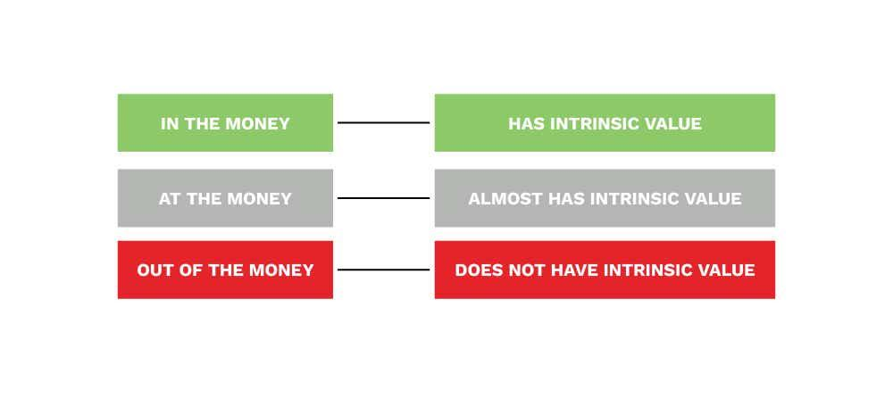

## Table of Contents

## What does 'In The Money' mean in the context of finance?

In the context of finance, 'In The Money' is a term used to describe a situation where an option has intrinsic value. This means that if you have an option to buy or sell a stock, and the current market price of the stock makes it profitable to exercise that option, then the option is 'In The Money'. For example, if you have the right to buy a stock at $50 (the strike price) and the stock is currently trading at $60, your option is 'In The Money' because you can buy the stock for less than its market value.

This term is important for investors because it helps them understand the potential profitability of their options. When an option is 'In The Money', it means there's an immediate financial benefit if the option is exercised. However, just because an option is 'In The Money' doesn't mean it's the best time to exercise it, as the investor might want to wait and see if the stock's price moves even more in their favor.

## How does an option become 'In The Money'?

An option becomes 'In The Money' when the price of the stock it's based on moves in a way that makes the option valuable. For a call option, which gives you the right to buy a stock, it becomes 'In The Money' when the stock's price goes above the strike price. The strike price is the price at which you can buy the stock if you use the option. So, if the strike price is $50 and the stock goes up to $60, the call option is 'In The Money' because you can buy the stock for $50 and then sell it for $60, making a profit.

For a put option, which gives you the right to sell a stock, it becomes 'In The Money' when the stock's price falls below the strike price. If the strike price is $50 and the stock drops to $40, the put option is 'In The Money'. This is because you can buy the stock at the market price of $40 and then use your option to sell it at $50, making a profit. So, an option becomes 'In The Money' when the stock's price moves in a direction that lets you make money by exercising the option.

## Can you explain the difference between 'In The Money', 'At The Money', and 'Out of The Money'?

When we talk about options, we use three terms to describe their value: 'In The Money', 'At The Money', and 'Out of The Money'. 'In The Money' means the option is worth something right now. For a call option, this happens when the stock price is higher than the strike price. For a put option, it's when the stock price is lower than the strike price. If you can make money by using the option right away, it's 'In The Money'.

'At The Money' is when the stock price is the same as the strike price. This means the option doesn't have any immediate value, but it could become valuable if the stock price moves in the right direction. 'Out of The Money' is when the option has no value right now. For a call option, this is when the stock price is lower than the strike price. For a put option, it's when the stock price is higher than the strike price. If using the option would cost you money instead of making you money, it's 'Out of The Money'.

## What are the benefits of exercising an 'In The Money' option?

Exercising an 'In The Money' option means you can make money right away. If you have a call option and the stock price is higher than your strike price, you can buy the stock at the lower strike price and then sell it at the higher market price. This lets you pocket the difference as profit. If you have a put option and the stock price is lower than your strike price, you can buy the stock at the market price and then sell it at the higher strike price, also making a profit.

Sometimes, exercising an 'In The Money' option can be a good way to lock in gains. If you think the stock price might go down soon, exercising the option lets you make money before that happens. But, you don't have to exercise the option right away. You can sell the option itself to someone else, and they might pay you more than the profit you'd make by exercising it. This is because they might think the stock will keep moving in a way that makes the option even more valuable.

## How does being 'In The Money' affect the pricing of options?

When an option is 'In The Money', it means it has real value right now. This value, called intrinsic value, is the difference between the stock price and the strike price. For a call option, if the stock is trading at $60 and the strike price is $50, the option's intrinsic value is $10. This makes the option more expensive because whoever buys it can make $10 right away by exercising it. So, the price of the option will be at least the intrinsic value, but it might be more because people might think the stock will keep going up.

There's also another part of the option's price called time value. Even if an option is 'In The Money', its price can be higher than just the intrinsic value because it still has time left before it expires. People might be willing to pay extra for the chance that the stock will move even more in their favor before the option expires. But as the option gets closer to expiring, the time value goes down. So, being 'In The Money' makes an option more valuable because of its intrinsic value, but the total price also depends on how much time is left and what people think might happen to the stock price.

## What strategies can traders use with 'In The Money' options?

Traders can use 'In The Money' options to make money right away by exercising them. If they have a call option and the stock price is higher than the strike price, they can buy the stock at the strike price and then sell it at the higher market price. This lets them keep the difference as profit. For a put option, if the stock price is lower than the strike price, they can buy the stock at the lower market price and sell it at the higher strike price, also making a profit. This is a good way to lock in gains if they think the stock price might go down soon.

Another strategy is to sell the 'In The Money' option instead of exercising it. The option is worth at least its intrinsic value, which is the difference between the stock price and the strike price. But someone might pay more than that because they think the stock will keep moving in a way that makes the option even more valuable. This can be a smart move if the trader wants to make money without buying or selling the stock itself. It's also a way to take advantage of the time value of the option, which is the extra amount people might pay because the option still has time left before it expires.

A third strategy is using 'In The Money' options for hedging. If a trader owns a stock and is worried about its price going down, they can buy a put option that's 'In The Money'. This put option lets them sell the stock at the higher strike price even if the market price drops. This can protect them from losing too much money if the stock price falls. Similarly, if they want to buy a stock but are waiting for the price to go down, they can buy a call option that's 'In The Money'. This way, they can buy the stock at the lower strike price if the market price goes up before they're ready to buy.

## How does time decay impact 'In The Money' options?

Time decay, also called theta, is how the value of an option goes down as it gets closer to expiring. For 'In The Money' options, time decay affects the part of the option's price called time value. Time value is what people might pay extra for the chance that the stock price will move even more in their favor before the option expires. As the option gets closer to expiring, this time value goes down because there's less time left for the stock price to change. So, even though 'In The Money' options have intrinsic value, which is the real money you can make right now, their total price can still go down because of time decay.

For traders, understanding time decay is important when they're thinking about what to do with 'In The Money' options. If they plan to exercise the option to make money, time decay doesn't matter as much because they can still make the intrinsic value. But if they want to sell the option instead of exercising it, they need to think about time decay. Selling the option earlier can help them get more money because the time value will be higher. Waiting too long means the time value goes down, and they might not get as much money when they sell. So, time decay can make 'In The Money' options less valuable as they get closer to expiring, and traders need to think about this when making their plans.

## What are the tax implications of exercising 'In The Money' options?

When you exercise 'In The Money' options, you need to think about taxes. If you exercise a call option and then sell the stock right away, any profit you make is treated as a short-term capital gain. This means you'll pay taxes on it at your regular income tax rate, which can be high. But if you hold onto the stock for more than a year after exercising the option, any profit you make when you finally sell the stock can be a long-term capital gain. Long-term capital gains have lower tax rates, so this can save you money.

For put options, if you exercise the option and sell the stock right away, any profit is also a short-term capital gain. If you hold the stock for more than a year before selling, it becomes a long-term capital gain. Another thing to know is that if you sell the 'In The Money' option itself instead of exercising it, any profit you make from selling the option is also treated as a short-term capital gain. So, whether you exercise the option or sell it, you need to think about how taxes will affect your profits.

## How do market conditions influence the likelihood of an option being 'In The Money'?

Market conditions play a big role in whether an option ends up being 'In The Money'. If the market is doing well and stock prices are going up, call options have a better chance of becoming 'In The Money'. This is because the stock price might go above the strike price, making the call option valuable. On the other hand, if the market is not doing well and stock prices are falling, put options are more likely to become 'In The Money'. This happens when the stock price drops below the strike price, making the put option valuable. So, what's happening in the market can make a big difference in whether an option ends up being 'In The Money'.

Volatility in the market also affects the chances of an option being 'In The Money'. If the market is very volatile, meaning stock prices are moving a lot, both call and put options have a better chance of becoming 'In The Money'. This is because big price swings can push the stock price past the strike price in either direction. But if the market is calm and prices aren't moving much, it's harder for an option to become 'In The Money' because the stock price might not change enough to go past the strike price. So, traders need to keep an eye on market conditions and volatility when they're thinking about options.

## What are the risks associated with holding 'In The Money' options until expiration?

Holding 'In The Money' options until they expire can be risky. One big risk is time decay. As the option gets closer to expiring, its time value goes down. Even though 'In The Money' options have intrinsic value, which is the real money you can make right away, the total price of the option can still go down because of time decay. If you wait too long to exercise or sell the option, you might end up making less money than if you had acted earlier.

Another risk is that the stock price might change in a way that makes the option worth less or even 'Out of The Money'. For example, if you have a call option and the stock price goes down below the strike price, your option will no longer be 'In The Money'. This means you could lose the chance to make money from it. Also, if the stock price moves a lot right before the option expires, you might not have time to react and make the best decision. So, holding 'In The Money' options until expiration can be risky because of time decay and changes in the stock price.

## How can 'In The Money' options be used in advanced trading strategies like spreads and collars?

'In The Money' options can be used in advanced trading strategies like spreads to manage risk and potentially increase profits. In a spread, a trader might buy an 'In The Money' call option and sell another call option with a higher strike price. This is called a bull call spread. The 'In The Money' option has intrinsic value, which means it's already worth something. By selling the higher strike call option, the trader can use the money from that sale to help pay for the 'In The Money' option. This can limit the amount of money the trader could lose, but it also limits how much they could make if the stock price goes up a lot. So, using 'In The Money' options in a spread can be a way to balance risk and reward.

Another advanced strategy is using 'In The Money' options in a collar. A collar is a way to protect a stock you already own. If you own a stock and you're worried about its price going down, you can buy an 'In The Money' put option. This gives you the right to sell the stock at a higher price than the market if the stock price drops. To help pay for this put option, you can sell an 'Out of The Money' call option on the same stock. This means if the stock price goes up a lot, you might have to sell the stock at a lower price than the market. But the 'In The Money' put option can protect you from losing too much money if the stock price goes down. So, using 'In The Money' options in a collar can be a way to protect your investment while still giving you a chance to make money.

## What historical data or case studies illustrate the effectiveness of trading 'In The Money' options?

One famous example of using 'In The Money' options effectively is the story of Paulson & Co. during the 2007-2008 financial crisis. John Paulson, the founder of Paulson & Co., used 'In The Money' put options on subprime mortgage-backed securities to bet against the housing market. He bought these options when he believed the housing market was about to crash. As the market did indeed collapse, the value of these 'In The Money' put options soared, allowing Paulson to make billions of dollars. This case shows how 'In The Money' options can be used to make big profits if you can predict big market moves correctly.

Another example comes from the tech sector. In the late 1990s, many traders used 'In The Money' call options on tech stocks like Microsoft and Cisco. During the dot-com boom, these stocks were rising fast. Traders who bought 'In The Money' call options on these stocks could make a lot of money as the stock prices kept going up. The intrinsic value of the options grew as the stock prices went above the strike prices, leading to big profits for those who timed their trades well. This shows how 'In The Money' options can be a good way to make money during a strong bull market in specific sectors.

## What is Understanding Options Trading?

Options trading is a sophisticated financial practice that involves the buying and selling of options contracts. An option contract grants the buyer the right, but not the obligation, to purchase or sell an underlying asset at a predetermined price, known as the strike price, within a specific time frame. This predetermined price allows the holder to manage their risk and tailor their investment strategies.

### Options Types: Calls and Puts

Options are primarily categorized into two types: call options and put options. A call option gives the holder the right to buy the underlying asset at the strike price before the expiration date. Investors typically purchase call options when they expect the price of the underlying asset to rise.

Conversely, a put option provides the holder the right to sell the underlying asset at the strike price. Investors usually buy put options when anticipating a decline in the asset's price. This strategic utility makes options versatile tools in various market conditions.

### Key Concept: 'In the Money'

The term 'in the money' (ITM) is crucial in options trading, referring to options with intrinsic value. A call option is ITM if the current price of the underlying asset exceeds the strike price, as exercising the option would be profitable. In formulaic terms, for a call option:

$$
\text{Intrinsic Value} = \max(0, \text{Current Price} - \text{Strike Price})
$$

A put option is ITM if the current price of the underlying asset is below the strike price. For put options, the intrinsic value is:

$$
\text{Intrinsic Value} = \max(0, \text{Strike Price} - \text{Current Price})
$$

Options that are ITM are generally more valuable, as they are closer to yielding a profit upon exercise. As such, they often [carry](/wiki/carry-trading) higher premiums compared to out-of-the-money (OTM) or at-the-money (ATM) options.

### Strike Prices and Expiration Dates

The strike price is a critical component of an options contract, signifying the price at which the holder can exercise the option. This price determines the option's intrinsic value and influences its premiums. Selecting an appropriate strike price is a strategic decision dependent on market expectations and risk tolerance.

Expiration dates are another fundamental feature of options contracts, delineating the time frame within which an option can be exercised. The expiration date significantly impacts the option's time value—a component of its pricing derived from the remaining time until expiration. As the expiration date approaches, options lose time value, a phenomenon known as time decay.

In summary, understanding these foundational elements—calls, puts, strike prices, and expiration dates—is essential for anyone looking to engage in options trading. These concepts collectively form the basis of strategic decision-making in the dynamic world of financial markets.

## What does it mean to be 'In the Money'?

'In the money' (ITM) is a term used in options trading to describe options that possess intrinsic value. For a call option, this means that the current price of the underlying asset exceeds the strike price. Conversely, a put option is considered ITM if the current price of the underlying asset falls below the strike price. Understanding ITM is crucial for assessing the potential profitability and risk of options positions.

When a call option is ITM, the holder has the advantageous position to purchase the underlying asset at a price lower than the market value, which directly translates to intrinsic value. Mathematically, for a call option, this intrinsic value can be expressed as:

$$
\text{Intrinsic Value} = \max(0, S - K)
$$

where $S$ represents the current price of the underlying asset, and $K$ is the strike price of the option. Similarly, for a put option, the intrinsic value is given by:

$$
\text{Intrinsic Value} = \max(0, K - S)
$$

The ITM status of options implies they are 'worth exercising', thus carrying intrinsic value. This intrinsic component contributes to the option's premium, the price paid to purchase the option. ITM options typically command higher premiums compared to 'out of the money' (OTM) or 'at the money' (ATM) options due to the immediate exercisability and lower risk associated with them. Traders and investors are often willing to pay these higher premiums as a trade-off for the lower risk of loss and higher certainty of potential gain.

However, the heightened premiums also reflect perceived risks by the market, such as [volatility](/wiki/volatility-trading-strategies) in the underlying asset's price or the time remaining until expiration, which affect the option's total valuation. As the expiration date approaches, an option's extrinsic value—part of the premium not accounted for by intrinsic value—tends to decay, known as time decay or theta. Thus, traders must consider these variables when evaluating ITM options within their strategies.

## References & Further Reading

[1]: Bergstra, J., Bardenet, R., Bengio, Y., & Kégl, B. (2011). ["Algorithms for Hyper-Parameter Optimization."](https://papers.nips.cc/paper/4443-algorithms-for-hyper-parameter-optimization) Advances in Neural Information Processing Systems 24.

[2]: ["Advances in Financial Machine Learning"](https://www.amazon.com/Advances-Financial-Machine-Learning-Marcos/dp/1119482089) by Marcos Lopez de Prado

[3]: ["Evidence-Based Technical Analysis: Applying the Scientific Method and Statistical Inference to Trading Signals"](https://www.amazon.com/Evidence-Based-Technical-Analysis-Scientific-Statistical/dp/0470008741) by David Aronson

[4]: ["Machine Learning for Algorithmic Trading"](https://github.com/PacktPublishing/Machine-Learning-for-Algorithmic-Trading-Second-Edition) by Stefan Jansen

[5]: ["Quantitative Trading: How to Build Your Own Algorithmic Trading Business"](https://books.google.com/books/about/Quantitative_Trading.html?id=j70yEAAAQBAJ) by Ernest P. Chan