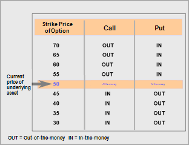

## Table of Contents

## What is an in-the-money option?

An in-the-money option is a term used in trading that means the option has value. For a call option, it's in-the-money if the current price of the stock is higher than the price at which you can buy the stock (the strike price). For a put option, it's in-the-money if the current price of the stock is lower than the price at which you can sell the stock.

This means that if you were to exercise the option right now, you would make a profit. For example, if you have a call option with a strike price of $50 and the stock is currently trading at $60, you could buy the stock at $50 and immediately sell it at $60, making a profit. In-the-money options are valuable because they give the holder the opportunity to make money right away if they choose to exercise the option.

## How does a call option become in-the-money?

A call option becomes in-the-money when the price of the stock it's based on goes above the strike price of the option. The strike price is the price at which you can buy the stock if you exercise the option. For example, if you have a call option with a strike price of $50, and the stock's price goes up to $60, the option is in-the-money because you can buy the stock at $50 and sell it at the higher market price of $60.

Being in-the-money means the option has value because you can make a profit right away if you exercise it. The difference between the stock's current price and the strike price is called the intrinsic value of the option. So, in our example, the intrinsic value of the call option would be $10 ($60 - $50). This intrinsic value is what makes the option in-the-money and valuable to the holder.

## How does a put option become in-the-money?

A put option becomes in-the-money when the price of the stock it's based on falls below the strike price of the option. The strike price is the price at which you can sell the stock if you exercise the option. For example, if you have a put option with a strike price of $50, and the stock's price drops to $40, the option is in-the-money. This is because you can buy the stock at the lower market price of $40 and then sell it at the higher strike price of $50.

Being in-the-money means the put option has value because you can make a profit right away if you exercise it. The difference between the strike price and the stock's current price is called the intrinsic value of the option. In our example, the intrinsic value of the put option would be $10 ($50 - $40). This intrinsic value is what makes the option in-the-money and valuable to the holder.

## What is the difference between in-the-money, at-the-money, and out-of-the-money options?

An in-the-money option is one that has value right now. For a call option, it's in-the-money if the stock price is higher than the strike price. This means you could buy the stock at the lower strike price and sell it at the higher market price to make a profit. For a put option, it's in-the-money if the stock price is lower than the strike price. This means you could buy the stock at the lower market price and sell it at the higher strike price to make a profit. The amount of money you could make right now is called the intrinsic value of the option.

An at-the-money option is one where the stock price is the same as the strike price. For both call and put options, there's no immediate profit to be made if you exercise the option because the buying and selling prices are the same. These options don't have any intrinsic value, but they might still be worth something because of the possibility that the stock price could move in a favorable direction before the option expires.

An out-of-the-money option is one that has no value right now. For a call option, it's out-of-the-money if the stock price is lower than the strike price. This means you would lose money if you bought the stock at the higher strike price and sold it at the lower market price. For a put option, it's out-of-the-money if the stock price is higher than the strike price. This means you would lose money if you bought the stock at the higher market price and sold it at the lower strike price. Out-of-the-money options have no intrinsic value, but they could still gain value if the stock price moves in the right direction before the option expires.

## How can you calculate if an option is in-the-money?

To figure out if a call option is in-the-money, you need to compare the stock's current price to the option's strike price. If the stock's price is higher than the strike price, the call option is in-the-money. For example, if you have a call option with a strike price of $50 and the stock is trading at $60, you can buy the stock at $50 and sell it at $60, making a profit. The difference between the stock's price and the strike price is called the intrinsic value, which in this case is $10 ($60 - $50).

For a put option, you do the opposite. You check if the stock's current price is lower than the strike price. If it is, the put option is in-the-money. For instance, if you have a put option with a strike price of $50 and the stock is trading at $40, you can buy the stock at $40 and sell it at $50, making a profit. The intrinsic value here is also $10 ($50 - $40). So, by comparing the stock's price to the strike price, you can easily tell if an option is in-the-money and how much it's worth right now.

## What are the advantages of trading in-the-money options?

Trading in-the-money options can be a good choice because they have a higher chance of making money. When an option is in-the-money, it means you can make a profit right away if you use it. This makes them less risky than other options because they already have value. For example, if you have a call option that lets you buy a stock at $50 and the stock is now worth $60, you can buy it at $50 and sell it at $60, making a $10 profit per share. This built-in profit, called intrinsic value, makes in-the-money options safer and more likely to be profitable.

Another advantage of in-the-money options is that they can be less affected by time. All options lose value as they get closer to expiring, but in-the-money options lose value more slowly because they already have intrinsic value. This means you have more time to decide what to do with them. Also, in-the-money options can be a good way to control a lot of stock without spending as much money upfront. You only need to pay the option's price, which is usually less than buying the stock outright, giving you more flexibility with your money.

## What are the risks associated with in-the-money options?

Trading in-the-money options can still be risky even though they have a higher chance of making money. One risk is that the stock price might change in a way that makes the option lose its value. For example, if you have a call option that lets you buy a stock at $50 and the stock price drops below $50, your option will no longer be in-the-money. This means you could lose the money you paid for the option if you can't sell it to someone else.

Another risk is that in-the-money options can be more expensive than other options. Because they already have value, you might have to pay more to buy them. This means you need the stock price to move even more in your favor to make a profit. If the stock price doesn't move enough, you might not make as much money as you hoped, or you could even lose money.

Lastly, there's the risk of time decay. All options lose value as they get closer to expiring, and even though in-the-money options lose value more slowly, they still do lose value. If you don't use your option or sell it before it expires, it could become worthless, and you would lose the money you spent on it. So, even though in-the-money options are less risky than other options, they still come with their own set of risks that you need to think about.

## How do in-the-money options affect the pricing of call and put options?

In-the-money options affect the pricing of both call and put options because they have intrinsic value. Intrinsic value is the amount of money you could make right now if you used the option. For a call option, if the stock price is higher than the strike price, the option is in-the-money. The price of the call option will be higher because it already has value. For example, if the stock is worth $60 and the strike price is $50, the call option's price will include the $10 intrinsic value plus any extra value because of time left until it expires. For a put option, if the stock price is lower than the strike price, the option is in-the-money. The price of the put option will be higher because it has intrinsic value too. If the stock is worth $40 and the strike price is $50, the put option's price will include the $10 intrinsic value plus any extra value because of time left.

The extra value that comes from time left until the option expires is called time value. Time value can make the price of an in-the-money option even higher. But as the option gets closer to expiring, the time value goes down, and the option's price becomes more about its intrinsic value. So, in-the-money options are usually more expensive than at-the-money or out-of-the-money options because they already have some value. But the exact price can change because of things like how much time is left, how much the stock price might move, and what people think will happen to the stock price in the future.

## What strategies involve using in-the-money options?

One common strategy that uses in-the-money options is called the covered call. In this strategy, you own the stock and sell someone else a call option on that stock. The call option you sell is in-the-money, which means the stock price is higher than the strike price of the option. By selling the call option, you get some money right away, called the premium. This can help you make a little extra money on the stock you already own. But there's a risk: if the stock price goes up a lot, the person who bought the option might use it to buy your stock at the lower strike price, and you'll have to sell it to them.

Another strategy is called the protective put. In this strategy, you own the stock and buy a put option on that stock. The put option you buy is in-the-money, which means the stock price is lower than the strike price of the option. The put option acts like insurance for your stock. If the stock price goes down, you can use the put option to sell the stock at the higher strike price, which helps you lose less money. This strategy can help you feel safer about owning the stock, but it costs money to buy the put option, so it might lower your overall profit if the stock price stays the same or goes up.

A third strategy is called the married put, which is similar to the protective put. In this strategy, you buy the stock and a put option at the same time. The put option is in-the-money, so it gives you the right to sell the stock at a higher price than it's currently worth. This can be a good way to limit your risk when you're buying a stock, especially if you think the stock might go down in the short term. The put option gives you a safety net, but like the protective put, it costs money, so it might reduce your profit if the stock price goes up.

## How does time decay affect in-the-money options?

Time decay is when an option loses value as it gets closer to expiring. This happens to all options, but it affects in-the-money options a bit differently. In-the-money options have something called intrinsic value, which is the amount of money you could make right now if you used the option. Because they already have this value, in-the-money options lose value more slowly than other options as time goes by. But they still lose some value because of time decay, especially as they get very close to expiring.

Even though in-the-money options lose value more slowly, time decay can still be a problem. If you don't use your option or sell it to someone else before it expires, it could become worthless, and you would lose the money you spent on it. So, it's important to keep an eye on how much time is left on your in-the-money options and decide what to do with them before they expire.

## How do changes in implied volatility impact in-the-money options?

Changes in implied [volatility](/wiki/volatility-trading-strategies) can affect the price of in-the-money options. Implied volatility is a measure of how much people think the stock price might move in the future. When implied volatility goes up, it means people think the stock price could change a lot, so the price of options goes up too. This is because options are more valuable when there's a bigger chance the stock price will move in a way that makes the option worth more. For in-the-money options, an increase in implied volatility can make their price go up even though they already have some value because of their intrinsic value.

On the other hand, when implied volatility goes down, it means people think the stock price won't change as much. This makes options less valuable because there's less chance the stock price will move in a way that makes the option worth more. For in-the-money options, a decrease in implied volatility can make their price go down, but not as much as it would for at-the-money or out-of-the-money options. This is because in-the-money options still have their intrinsic value, which doesn't change with implied volatility. So, while changes in implied volatility can affect the price of in-the-money options, the impact is usually less than it is for other types of options.

## What are advanced techniques for managing in-the-money options positions?

One advanced technique for managing in-the-money options is rolling the position. This means you close your current option and open a new one with a different expiration date or strike price. For example, if you have an in-the-money call option that's about to expire, you might sell it and buy a new call option with a later expiration date. This can help you keep your position in the stock without having to use the option right away. Rolling can also help you adjust your strategy if the stock price moves a lot or if you think it will keep moving in the same direction.

Another technique is using a delta hedge. Delta is a number that shows how much the price of an option changes when the stock price changes. For in-the-money options, the delta is usually close to 1 for call options and close to -1 for put options. By buying or selling the stock in the right amount, you can balance out the changes in the option's price. This can help you manage the risk of your in-the-money options and keep your overall position more stable. It's a bit like insurance that helps you protect your investment from big swings in the stock price.

Lastly, you can use a collar strategy to manage your in-the-money options. This involves buying a put option and selling a call option at the same time. The put option gives you the right to sell the stock at a certain price, which can protect you if the stock price goes down. The call option you sell gives someone else the right to buy the stock from you at a certain price, which can help you make some money if the stock price goes up. By using a collar, you can limit how much you might lose while still having a chance to make some profit. This strategy can be especially useful if you want to keep your in-the-money options but also want to reduce your risk.

## What are In-the-Money Options and How are They Explained?

An in-the-money (ITM) option refers to a scenario where the option possesses intrinsic value due to the relationship between its strike price and the underlying asset's market price. For call options, being in-the-money means that the asset's current market price is above the strike price of the option. Conversely, for put options, ITM status is achieved when the market price is below the strike price. These scenarios provide options holders with immediate benefits should they choose to exercise their options.

### Call and Put Option Characteristics

For a call option, the formula to determine if an option is in-the-money is:

$$
\text{Call ITM} = \text{Market Price} > \text{Strike Price}
$$

For example, if the current market price of a stock is $120 and the call option's strike price is $100, the option is in-the-money, as the holder can purchase the stock at a lower price than its market value.

For a put option, the condition for being in-the-money is:

$$
\text{Put ITM} = \text{Market Price} < \text{Strike Price}
$$

In this instance, if the stock's current market price is $80 while the put option's strike price is $100, the put option is in-the-money. The holder can sell the stock at a price higher than the current market value, thus realizing a profit if exercised.

### Value and Premiums

In-the-money options are considered valuable because they provide an inherent economic advantage, making them attractive to traders. This intrinsic value leads to higher premiums compared to out-of-the-money or at-the-money options. The premium of an option is a sum of its intrinsic value and time value. As such, the intrinsic value can be calculated as follows:

- **For a Call Option**:

  \[ \text{Intrinsic Value of Call} = \max(\text{Market Price} - \text{Strike Price}, 0)
$$

- **For a Put Option**:

  \[ \text{Intrinsic Value of Put} = \max(\text{Strike Price} - \text{Market Price}, 0)
$$

The higher premiums associated with ITM options reflect the greater possibility of exercising these options profitably. This intrinsic value forms a crucial part of strategies for investors aiming to optimize returns or hedge their portfolios against market fluctuations. As such, understanding the dynamics of in-the-money options is vital for any trader seeking to leverage options effectively.

## What are the benefits and risks of in-the-money options?

In-the-money (ITM) options represent a favorable position for investors as they possess intrinsic value. This intrinsic value, defined as the difference between the asset's current market price and the option's strike price, constitutes the primary benefit of ITM options.

For call options, the intrinsic value is calculated as:

$$
\text{Intrinsic Value} = \max(0, \text{Market Price} - \text{Strike Price})
$$

For put options, the intrinsic value is given by:

$$
\text{Intrinsic Value} = \max(0, \text{Strike Price} - \text{Market Price})
$$

These formulas highlight that ITM options possess a tangible worth, given that the calculations yield positive values. This intrinsic value enables investors to capitalize on market opportunities. If the market conditions align favorably, the potential for profit amplifies due to the inherent value already embedded in the options.

However, ITM options come with a higher premium than their out-of-the-money (OTM) or at-the-money (ATM) counterparts, reflecting their potential. The premium consists of intrinsic value and time value, with the former being a significant component in ITM options. Thus, investors must consider the cost of acquiring ITM options—factoring in both premiums and commissions—when gauging the profitability prospects of their trades.

Traders are advised to rigorously account for these costs, as overlooking them can skew profit expectations and impair the strategies employing ITM options. Effective risk management becomes paramount to offset the elevated costs associated with these options. By employing analytical tools and strategies, such as calculating break-even points and conducting scenario analyses, traders can better navigate the complexities of incorporating ITM options into their portfolios.

Furthermore, because ITM options require a larger capital outlay, constructing a viable strategy involves balancing the potential gains against the risks of market fluctuations. This balance can be achieved through a disciplined approach that incorporates comprehensive risk assessment tools and strategic entry and [exit](/wiki/exit-strategy) points.

In summary, ITM options provide strategic advantages through intrinsic value and profitability potential, but they demand judicious risk management and cost consideration to achieve successful outcomes.

## References & Further Reading

[1]: Bergstra, J., Bardenet, R., Bengio, Y., & Kégl, B. (2011). ["Algorithms for Hyper-Parameter Optimization."](https://dl.acm.org/doi/10.5555/2986459.2986743) Advances in Neural Information Processing Systems 24.

[2]: ["Advances in Financial Machine Learning"](https://www.amazon.com/Advances-Financial-Machine-Learning-Marcos/dp/1119482089) by Marcos Lopez de Prado

[3]: ["Evidence-Based Technical Analysis: Applying the Scientific Method and Statistical Inference to Trading Signals"](https://www.amazon.com/Evidence-Based-Technical-Analysis-Scientific-Statistical/dp/0470008741) by David Aronson

[4]: ["Machine Learning for Algorithmic Trading"](https://github.com/stefan-jansen/machine-learning-for-trading) by Stefan Jansen

[5]: ["Quantitative Trading: How to Build Your Own Algorithmic Trading Business"](https://www.amazon.com/Quantitative-Trading-Build-Algorithmic-Business/dp/1119800064) by Ernest P. Chan