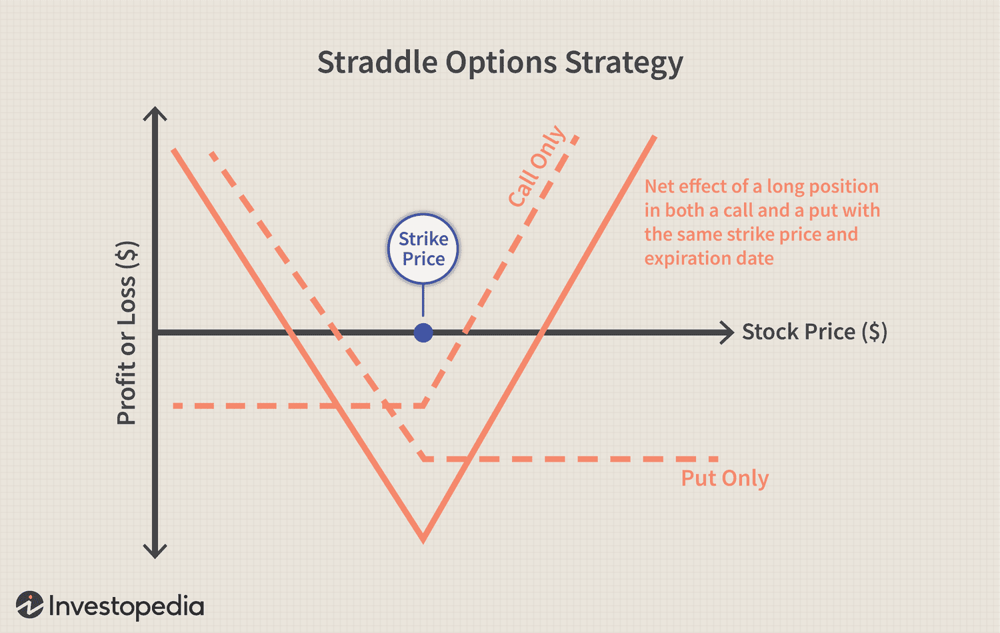

## Table of Contents

## What is a put option?

A put option is a financial contract that gives you the right, but not the obligation, to sell a specific asset, like a stock, at a set price before a certain date. Imagine you own a stock and you think its price might go down. You can buy a put option to protect yourself. If the stock price does drop, you can use the put option to sell the stock at the higher set price, which helps you avoid losing too much money.

Put options are often used as a way to hedge, or protect, against potential losses. For example, if you're worried that the stock market might crash, you could buy put options on a stock index. If the market does crash, the value of your put options would increase, helping to offset the losses from your other investments. However, if the market goes up instead, you would only lose the money you paid for the put options, which is usually less than the potential losses from a market crash.

## What does 'in the money' mean for a put option?

When a put option is 'in the money,' it means that the current price of the stock is below the strike price of the option. The strike price is the price at which you can sell the stock if you use the put option. So, if the stock is trading at a lower price than the strike price, you could buy the stock at the lower market price and then use the put option to sell it at the higher strike price, making a profit.

For example, let's say you have a put option with a strike price of $50. If the stock is currently trading at $45, the put option is in the money by $5. This is because you could buy the stock for $45 and then use the put option to sell it for $50, making a $5 profit per share before considering the cost of the option itself. Being in the money means the put option has some immediate value, even if you decide not to use it right away.

## How is the value of an in the money put option determined?

The value of an in the money put option is made up of two parts: the intrinsic value and the time value. The intrinsic value is how much money you would make if you used the option right now. For a put option, this is the difference between the strike price and the current stock price, but only if the strike price is higher. If the stock is at $45 and the strike price is $50, the intrinsic value is $5 because you could buy the stock for $45 and sell it for $50.

The time value is a bit trickier. It's the extra amount that people are willing to pay for the option because it still has time left before it expires. Even if the option is in the money, the stock price could change a lot before the option expires. If there's more time left, there's more chance for the stock price to move even lower, making the option more valuable. So, the time value depends on how much time is left until the option expires and how much the stock price might move around.

## What are the key factors that affect the premium of an in the money put option?

The premium of an in the money put option is affected by several key factors. The first [factor](/wiki/factor-investing) is the intrinsic value, which is the difference between the strike price and the current stock price. If the stock price is lower than the strike price, the put option has intrinsic value. The bigger this difference, the higher the premium of the option. Another important factor is the time value, which is how much people are willing to pay for the chance that the stock price might drop even more before the option expires. The more time left until the option expires, the higher the time value can be.

Other factors that affect the premium include the [volatility](/wiki/volatility-trading-strategies) of the stock, which is how much the stock price tends to move around. If a stock is very volatile, there's a bigger chance the stock price could drop a lot, making the put option more valuable. Interest rates can also play a role, though usually a smaller one. Higher interest rates can slightly increase the value of a put option. Lastly, dividends can affect the premium. If a stock is about to pay a dividend, its price might drop after the dividend payment, which could increase the value of a put option. All these factors together decide how much someone is willing to pay for an in the money put option.

## How does an investor benefit from holding an in the money put option?

An investor benefits from holding an in the money put option because it gives them the right to sell a stock at a higher price than the market price. This can be useful if they think the stock's price will keep going down. For example, if they have a put option with a strike price of $50 and the stock is now at $45, they can buy the stock at $45 and then use the put option to sell it at $50, making a profit of $5 per share before considering the cost of the option itself. This way, they can make money even when the stock price is falling.

Another benefit is that holding an in the money put option can act like insurance. If an investor owns a stock and is worried its price might drop, they can buy a put option to protect themselves. If the stock price does go down, the put option will increase in value, which can help offset the loss from the stock. If the stock price stays the same or goes up, the investor only loses the money they paid for the put option, which is usually less than the potential loss from the stock falling a lot.

## Can you explain the difference between in the money, at the money, and out of the money put options?

When you have a put option, it can be in three different states: in the money, at the money, or out of the money. An in the money put option means the stock price is lower than the strike price. For example, if you have a put option with a strike price of $50 and the stock is now at $45, your option is in the money. This is good because you could buy the stock for $45 and then use the option to sell it for $50, making a profit before considering the cost of the option itself.

An at the money put option happens when the stock price is the same as the strike price. If you have a put option with a strike price of $50 and the stock is also at $50, your option is at the money. This means the option doesn't have any immediate value because you wouldn't make any money by buying and then selling the stock at the same price. An out of the money put option is when the stock price is higher than the strike price. If your put option has a strike price of $50 but the stock is at $55, your option is out of the money. In this case, you wouldn't want to use the option because you could sell the stock for more on the open market than the strike price of the option.

## What are the risks associated with trading in the money put options?

Trading in the money put options comes with several risks that investors should be aware of. One big risk is that the stock price could go up instead of down. If this happens, the value of your put option will decrease. You might end up losing the money you paid for the option because it won't be worth as much when you try to sell it or let it expire. Another risk is that the stock could drop, but not as much as you thought it would. If the stock price doesn't fall below the strike price by enough, you might not make as much money as you hoped, or you might even lose money after considering the cost of the option.

Another risk to think about is the time value of the option. As the expiration date gets closer, the time value of the option goes down. If the stock price doesn't move enough before the option expires, the option could lose all its value, even if it's in the money. This means you could lose the money you paid for the option. Also, trading options can be complicated, and if you don't understand them well, you might make mistakes that cost you money. It's important to know what you're doing and to be ready for the stock price to move in ways you didn't expect.

## How does time decay impact the value of an in the money put option?

Time decay is like a clock ticking down on your in the money put option. As the expiration date gets closer, the time value of the option starts to shrink. Time value is the extra money people are willing to pay for the option because it still has time left before it expires. The more time left, the more chance the stock price has to move in your favor, making the option more valuable. But as that time runs out, the time value goes down, and the option becomes worth less, even if it's still in the money.

This can be a problem if you're hoping the stock price will drop more before the option expires. If the stock price doesn't move enough before time runs out, the option might lose all its time value, leaving you with just the intrinsic value. Intrinsic value is the difference between the strike price and the current stock price. So, even though your put option is in the money, time decay can eat away at its overall value, making it less profitable or even causing you to lose money if the time value loss is more than the intrinsic value gain.

## What strategies can be used with in the money put options?

One common strategy with in the money put options is called protective putting. Imagine you own a stock and you're worried its price might go down. You can buy an in the money put option to protect yourself. If the stock price does drop, the put option will increase in value, which can help offset the loss from your stock. This is like insurance for your stock. If the stock price stays the same or goes up, you'll only lose the money you paid for the put option, which is usually less than the potential loss from the stock falling a lot.

Another strategy is called selling the put option. If you think the stock price won't drop below the strike price before the option expires, you can sell the in the money put option to someone else. You'll get the premium they pay you, which can be a nice profit if the stock price stays above the strike price. But be careful, if the stock price does drop below the strike price, the buyer of the option might use it, and you'll have to buy the stock at the higher strike price, which could cost you money.

A third strategy is using in the money put options for income. If you own a stock and you think its price will stay the same or go up a little, you can sell in the money put options against your stock. This is called a covered put. You'll get the premium from selling the option, which can give you extra income. If the stock price stays above the strike price, you keep the premium and the stock. But if the stock price drops below the strike price, the buyer might use the option, and you'll have to sell your stock at the strike price, which could be less than what it's worth now.

## How do changes in implied volatility affect in the money put options?

When the implied volatility of a stock goes up, it means people think the stock's price might move around a lot more in the future. This can make in the money put options more valuable. Even though the option is already in the money, higher volatility means there's a bigger chance the stock price could drop even more before the option expires. So, people might be willing to pay more for the option because of this extra risk. This can increase the time value of the option, making its overall price go up.

On the other hand, if the implied volatility goes down, it means people think the stock's price won't move around as much. This can make in the money put options less valuable. Lower volatility means there's less chance the stock price will drop a lot more before the option expires. So, the time value of the option goes down because there's less risk, and the overall price of the option might go down too. But remember, the intrinsic value of the option, which is the difference between the strike price and the current stock price, stays the same no matter what happens with volatility.

## What are the tax implications of trading in the money put options?

When you trade in the money put options, you need to think about taxes. If you make money from trading these options, you'll have to pay taxes on your profits. The tax rate depends on how long you held the option before selling it or letting it expire. If you held the option for less than a year, any profit you make is considered a short-term capital gain, and you'll pay your regular income tax rate on it. If you held the option for more than a year, the profit is a long-term capital gain, and you'll pay a lower tax rate, usually between 0% and 20%, depending on your income.

If you lose money on your in the money put options, you can use those losses to reduce your taxes. You can subtract your losses from any gains you made from other investments. If your losses are more than your gains, you can use up to $3,000 of those losses to lower your taxable income for the year. If you still have losses left over after that, you can [carry](/wiki/carry-trading) them over to future years to use against future gains or income. It's a good idea to keep good records of all your trades and talk to a tax professional to make sure you're doing everything right.

## How can an investor use in the money put options as part of a hedging strategy?

An investor can use in the money put options to protect their investments from big drops in stock prices. Imagine you own a stock and you're worried its price might go down. You can buy an in the money put option, which gives you the right to sell the stock at a higher price than it's currently trading. If the stock price does drop, you can use the put option to sell the stock at the higher strike price, which helps you avoid losing too much money. This is like buying insurance for your stock. If the stock price stays the same or goes up, you'll only lose the money you paid for the put option, which is usually less than the potential loss from the stock falling a lot.

Another way to use in the money put options for hedging is if you're worried about the whole stock market going down. You can buy put options on a stock index, like the S&P 500. If the market does crash, the value of your put options will go up, which can help offset the losses from your other investments. This way, you're protecting your portfolio from big market drops. If the market goes up instead, you'll only lose the money you paid for the put options, which is a smaller risk compared to the potential losses from a market crash.

## What does it mean to understand 'In the Money' Put Options?

A put option becomes 'in the money' (ITM) when the strike price surpasses the market price of the underlying asset. This status provides traders a strategic advantage, allowing them to sell the asset at the higher strike price, irrespective of the current lower market price. This scenario opens pathways for realizing profits, especially when executed with precision and foresight.

ITM put options serve dual purposes. Firstly, they are leveraged as a hedging tool against potential market declines. Investors anticipate downturns to protect their portfolios, thereby employing ITM put options to offset potential losses. Secondly, these options are instrumental for speculating on bearish market conditions. Investors expecting a significant drop in an asset's price may purchase ITM put options as part of a broader investment strategy to capitalize on these anticipated downturns.

Mathematically, the intrinsic value of an ITM put option can be expressed as:

$$
\text{Intrinsic Value} = \text{Strike Price} - \text{Market Price}
$$

Here, the intrinsic value represents the actual potential profit if the option were exercised at that moment. For example, if the strike price is $60 and the market price is $50, the intrinsic value of the put option is $10, reflecting the immediate gain available from executing the option.

Proficient use of ITM put options requires assessing market trends, understanding economic indicators, and executing trades with calculated timing to maximize return on investment. This involves a comprehensive analysis and sometimes an integration of algorithmic strategies to manage these transactions effectively in dynamic market environments.

## How do put options work?

Put options provide the holder the right to sell a designated quantity of an underlying asset at a predetermined strike price at any point before or on the option's expiration date. This financial instrument is a strategic tool for investors anticipating a decline in the asset's market price. By securing the sale price through a put option, investors can mitigate potential losses or even profit from anticipated downward movements.

### Intrinsic Value Calculation

The intrinsic value of a put option, crucial for assessing its potential profitability, is determined by the formula:

$$
\text{Intrinsic Value} = \max(0, K - S)
$$

where $K$ is the strike price and $S$ is the current market price of the underlying asset. For an option to be "in the money" (ITM), the strike price must exceed the market price ($K > S$), indicating that selling the asset at the strike price would be more advantageous than the current market rate.

### Premium and Cost

Purchasing put options involves paying a premium, which is the market price for the option itself. This cost compensates the option writer (seller) for the potential risks associated with fulfilling the option under adverse market conditions. The premium comprises the intrinsic value and the time value, which reflects the probability of achieving finishing in the money before expiration.

For example, consider a put option for a stock where the strike price ($K$) is $100, and the market price ($S$) is $95. The intrinsic value is $5, representing an immediate unrealized gain to the option holder. However, if the market price was $105, the intrinsic value would be $0, as exercising the option would yield no benefit above simply selling the asset on the open market.

In summary, put options can be instrumental for investors seeking to protect against downside risks or to capitalize on anticipated declines in asset prices. Understanding the underlying mechanics, including intrinsic value calculations and cost implications, is essential for effectively leveraging this financial instrument.

## What is an example of an ITM Put Option Strategy?

In a hypothetical scenario, an investor anticipates a decline in the price of a particular stock currently trading at $50. They decide to purchase an "in the money" (ITM) put option with a strike price of $55, which is higher than the current market price. This put option gives the investor the right, but not the obligation, to sell the stock at $55 before the option's expiration date, regardless of the market price.

Suppose the stock's market price falls to $45 before the expiration date. The intrinsic value of the put option is calculated as the difference between the strike price and the market price, given by:

$$
\text{Intrinsic Value} = \text{Strike Price} - \text{Market Price} = 55 - 45 = 10
$$

In this situation, the investor can exercise the option, selling the stock at the strike price of $55. The profit from exercising this ITM put option would be the difference between the strike price and the market price, reduced by the premium paid to acquire the option initially. If the premium paid was, say, $3 per share, the total profit per share would be:

$$
\text{Profit per Share} = (55 - 45) - 3 = 7
$$

This example illustrates how an ITM put option can be a strategic tool for capitalizing on anticipated downward movements in stock prices, providing an opportunity to profit by exercising the option when the stock price falls below the strike price. This form of trading allows investors to hedge against market downturns effectively, offering a cushion against losses while still maintaining the potential for gains.

## References & Further Reading

[1]: Hull, J. (2018). ["Options, Futures, and Other Derivatives"](https://www.semanticscholar.org/paper/Options%2C-Futures%2C-and-Other-Derivatives-Hull/89bdee500c8623864fc9eb7a471546aa713acc44) (9th ed.). Pearson Education.

[2]: Lopez de Prado, M. (2018). ["Advances in Financial Machine Learning"](https://books.google.com/books/about/Advances_in_Financial_Machine_Learning.html?id=oU9KDwAAQBAJ). Wiley.

[3]: Chan, E. P. (2009). ["Quantitative Trading: How to Build Your Own Algorithmic Trading Business"](https://github.com/ftvision/quant_trading_echan_book). Wiley.

[4]: Jansen, S. (2020). ["Machine Learning for Algorithmic Trading"](https://github.com/stefan-jansen/machine-learning-for-trading). 

[5]: Aronson, D. (2007). ["Evidence-Based Technical Analysis: Applying the Scientific Method and Statistical Inference to Trading Signals"](https://www.amazon.com/Evidence-Based-Technical-Analysis-Scientific-Statistical/dp/0470008741). Wiley.

[6]: Black, F., & Scholes, M. (1973). ["The Pricing of Options and Corporate Liabilities."](https://www.cs.princeton.edu/courses/archive/fall09/cos323/papers/black_scholes73.pdf) Journal of Political Economy, 81(3), 637-654.