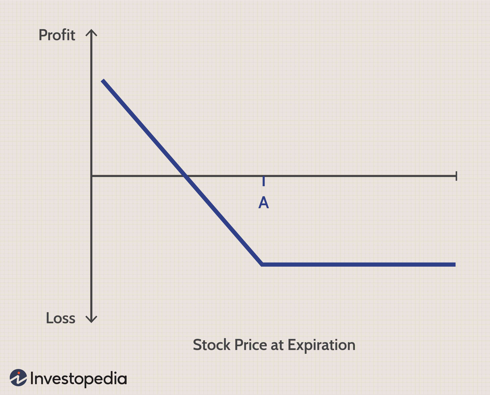

Options trading is recognized as a sophisticated investment strategy, involving contracts known as options, which grant the buyer the right, but not the obligation, to buy or sell a security at a predetermined price before a specified expiration date. Fundamental to understanding options trading are terms like "in the money" (ITM) put options. An ITM put option occurs when the market price of the underlying security is lower than the option's strike price, offering the holder an intrinsic value. This intrinsic value is calculated as the difference between the strike price and the current market price of the underlying asset, provided this results in a positive number. This characteristic makes ITM put options a valuable tool for traders looking to hedge against declines in asset prices or speculate on bearish market movements.

In recent years, the integration of technology within trading platforms has led to the rise of algorithmic trading, a process in which computer algorithms create, control, and execute trades automatically. Algorithmic trading has revolutionized the handling of trading strategies by enhancing precision, efficiency, and speed, which are crucial in the fast-paced world of options trading. Algorithms are capable of analyzing vast amounts of market data in real-time, identifying patterns that human traders might overlook, and executing trades at optimal times, all without the psychological biases that might affect human decision-making.



This article examines how these technological advancements intersect with the use of ITM put options, exploring the role of algorithmic trading in enhancing the management of these instruments. By automating trading strategies, traders can potentially optimize their options trading operations, leveraging the benefits of both ITM put options and algorithmic systems to mitigate risks and maximize profitability.

## Table of Contents

## Understanding 'In the Money' Put Options

A put option becomes 'in the money' (ITM) when the strike price surpasses the market price of the underlying asset. This status provides traders a strategic advantage, allowing them to sell the asset at the higher strike price, irrespective of the current lower market price. This scenario opens pathways for realizing profits, especially when executed with precision and foresight.

ITM put options serve dual purposes. Firstly, they are leveraged as a hedging tool against potential market declines. Investors anticipate downturns to protect their portfolios, thereby employing ITM put options to offset potential losses. Secondly, these options are instrumental for speculating on bearish market conditions. Investors expecting a significant drop in an asset's price may purchase ITM put options as part of a broader investment strategy to capitalize on these anticipated downturns.

Mathematically, the intrinsic value of an ITM put option can be expressed as:

$$
\text{Intrinsic Value} = \text{Strike Price} - \text{Market Price}
$$

Here, the intrinsic value represents the actual potential profit if the option were exercised at that moment. For example, if the strike price is $60 and the market price is $50, the intrinsic value of the put option is $10, reflecting the immediate gain available from executing the option.

Proficient use of ITM put options requires assessing market trends, understanding economic indicators, and executing trades with calculated timing to maximize return on investment. This involves a comprehensive analysis and sometimes an integration of algorithmic strategies to manage these transactions effectively in dynamic market environments.

## How Put Options Work

Put options provide the holder the right to sell a designated quantity of an underlying asset at a predetermined strike price at any point before or on the option's expiration date. This financial instrument is a strategic tool for investors anticipating a decline in the asset's market price. By securing the sale price through a put option, investors can mitigate potential losses or even profit from anticipated downward movements.

### Intrinsic Value Calculation

The intrinsic value of a put option, crucial for assessing its potential profitability, is determined by the formula:

$$
\text{Intrinsic Value} = \max(0, K - S)
$$

where $K$ is the strike price and $S$ is the current market price of the underlying asset. For an option to be "in the money" (ITM), the strike price must exceed the market price ($K > S$), indicating that selling the asset at the strike price would be more advantageous than the current market rate.

### Premium and Cost

Purchasing put options involves paying a premium, which is the market price for the option itself. This cost compensates the option writer (seller) for the potential risks associated with fulfilling the option under adverse market conditions. The premium comprises the intrinsic value and the time value, which reflects the probability of achieving finishing in the money before expiration.

For example, consider a put option for a stock where the strike price ($K$) is $100, and the market price ($S$) is $95. The intrinsic value is $5, representing an immediate unrealized gain to the option holder. However, if the market price was $105, the intrinsic value would be $0, as exercising the option would yield no benefit above simply selling the asset on the open market.

In summary, put options can be instrumental for investors seeking to protect against downside risks or to capitalize on anticipated declines in asset prices. Understanding the underlying mechanics, including intrinsic value calculations and cost implications, is essential for effectively leveraging this financial instrument.

## Leveraging Algorithmic Trading with Put Options

Algorithmic trading has revolutionized the process of buying and selling financial instruments, including options trades such as "in the money" (ITM) put options. The primary advantage of integrating [algorithmic trading](/wiki/algorithmic-trading) with put options is the automation of trading strategies, which eliminates human biases and significantly enhances trading speed and efficiency. Automation minimizes errors associated with manual trading and leverages high-frequency data analysis for informed decision-making.

Algorithms are designed to analyze vast amounts of market data in real time, identifying trends and opportunities with a speed unattainable by humans. In the context of options trading, this includes evaluating factors such as price movements, [volatility](/wiki/volatility-trading-strategies), and market sentiment. Through intelligent algorithms, traders can manage risk by setting parameters for automatic stop-loss levels or adjusting positions in response to market fluctuations.

For example, consider a Python-based algorithm that executes put options when specific market conditions are met:

```python
def execute_put_option(market_price, strike_price, volatility_threshold):
    if market_price < strike_price and analyze_volatility() > volatility_threshold:
        place_order('sell', 'put_option')

def analyze_volatility():
    # Hypothetical function to calculate market volatility
    import random
    return random.uniform(0, 1)

# Variables
current_market_price = 95
desired_strike_price = 100
volatility_threshold = 0.7

# Execute the trading strategy
execute_put_option(current_market_price, desired_strike_price, volatility_threshold)
```

Furthermore, algorithmic systems enable the execution of complex strategies such as dynamic hedging and trading based on volatility skew. Dynamic hedging involves continuously adjusting the hedge ratio as market conditions change, allowing traders to maintain an optimal balance between risk and reward. Volatility skew strategies capitalize on the differences in implied volatility across various strike prices, which is critical in options pricing and risk management.

By leveraging algorithmic trading, market participants can not only react to market dynamics more swiftly but also structure trades that might be too complex to manage manually. This advancement offers significant opportunities to enhance returns and reduce risk, underscoring the pivotal role algorithms play in modern options trading strategies.

## Benefits of Algo Trading in Handling ITM Put Options

Algorithmic trading, particularly in the handling of In the Money (ITM) put options, offers substantial advantages due to its inherent qualities of automation and precision. Automation ensures that trading activities are carried out with remarkable speed and efficiency, which is crucial for executing timely trades in the fast-paced financial markets. The swift execution of trades minimizes the latency that can occur in manual trading, thereby reducing the likelihood of slippage, which refers to the difference between the expected price of a trade and the actual price.

Furthermore, algorithmic trading systems are adept at managing directional risk, which is the risk associated with the movement of the underlying asset's price. By employing predefined stop-loss levels, algorithms can automatically sell a security when its price reaches a certain threshold, thus limiting potential losses. Additionally, these systems can dynamically adjust positions in response to market movements, recalibrating portfolios to maintain desired risk levels.

Advanced algorithms go beyond simple order execution; they identify patterns and opportunities that may not be immediately obvious to human traders. By analyzing large datasets in real-time, these algorithms can detect market anomalies, trends, and volatility patterns, executing trades at times that optimize potential returns. The incorporation of [machine learning](/wiki/machine-learning) techniques enhances the ability of algorithms to improve their predictive accuracy over time.

Consider the use of a Python-based framework for trading ITM put options. An algorithm might be designed to monitor market indicators, such as moving averages or volatility indices, and execute trades based on a set of conditions. Here is an illustrative Python snippet for a basic strategy:

```python
import numpy as np

def simple_moving_average(data, window_size):
    return np.convolve(data, np.ones(window_size)/window_size, mode='valid')

def execute_trade(option, current_price, stop_loss, target_profit):
    if current_price <= stop_loss:
        return f"Sell to stop loss at {current_price}"
    elif current_price >= target_profit:
        return f"Sell to take profit at {current_price}"
    else:
        return "Hold position"

# Example data
price_data = np.array([100, 98, 97, 95, 96, 92, 91])
sma = simple_moving_average(price_data, window_size=3)
current_price = 90
stop_loss = 85
target_profit = 105

# Trading decision
trade_decision = execute_trade("ITM put option", current_price, stop_loss, target_profit)
print(trade_decision)
```

In this snippet, a simple moving average helps determine the trend of the stock price, guiding trading decisions. If the current price hits the stop-loss level or exceeds the targeted profit, the algorithm dictates an appropriate action, showcasing how algorithmic methods encapsulate speed, calculated risk management, and the execution of trades at optimal moments.

## Example of an ITM Put Option Strategy

In a hypothetical scenario, an investor anticipates a decline in the price of a particular stock currently trading at $50. They decide to purchase an "in the money" (ITM) put option with a strike price of $55, which is higher than the current market price. This put option gives the investor the right, but not the obligation, to sell the stock at $55 before the option's expiration date, regardless of the market price.

Suppose the stock's market price falls to $45 before the expiration date. The intrinsic value of the put option is calculated as the difference between the strike price and the market price, given by:

$$
\text{Intrinsic Value} = \text{Strike Price} - \text{Market Price} = 55 - 45 = 10
$$

In this situation, the investor can exercise the option, selling the stock at the strike price of $55. The profit from exercising this ITM put option would be the difference between the strike price and the market price, reduced by the premium paid to acquire the option initially. If the premium paid was, say, $3 per share, the total profit per share would be:

$$
\text{Profit per Share} = (55 - 45) - 3 = 7
$$

This example illustrates how an ITM put option can be a strategic tool for capitalizing on anticipated downward movements in stock prices, providing an opportunity to profit by exercising the option when the stock price falls below the strike price. This form of trading allows investors to hedge against market downturns effectively, offering a cushion against losses while still maintaining the potential for gains.

## Challenges in Algorithmic Options Trading

Algorithmic options trading presents numerous advantages, yet it also comes with a set of challenges that traders must navigate. One of the primary issues is technical glitches, which can arise from software malfunctions, network disruptions, or hardware failures. These glitches can lead to unintended trades, loss of trading opportunities, or even significant financial losses if they occur at critical moments.

Model risk represents another substantial challenge in algorithmic options trading. This type of risk emerges when the mathematical models and assumptions used to develop trading algorithms do not accurately reflect real market conditions. Such discrepancies can lead to incorrect pricing of options, misguided trading signals, and potential financial setbacks. Assessing and continuously updating models is crucial to minimize model risk.

Fat-tail events, which are rare but extreme market movements, can also pose significant threats. Standard models often underestimate the probability of these events, leading to substantial losses. For example, during a market crash, options prices can deviate far from predictions, causing an algorithm designed under normal conditions to perform poorly. Properly managing these risks requires incorporating stress testing and scenario analysis into the algorithmic strategy development process.

Unforeseen market conditions further compound these challenges. Markets are dynamic and can be influenced by geopolitical events, policy changes, or sudden economic shifts. Algorithms not equipped to adapt to changing market landscapes may fail, resulting in missed opportunities or considerable losses. To combat this, traders should implement adaptive algorithms capable of learning from new data, adjusting strategies in real-time, and incorporating machine learning techniques to enhance predictive accuracy.

To mitigate these risks, traders should emphasize robustness and flexibility in algorithm design, incorporating comprehensive risk management strategies. Regular back-testing using historical data and simulating different market scenarios can help identify potential vulnerabilities before they lead to substantial losses. Additionally, setting stop-loss limits and position size controls can further protect against the negative impacts of technical and market-related challenges.

## Conclusion: The Way Forward

Combining algorithmic trading with ITM put options constitutes a strategic approach to both risk management and profit optimization. Algorithmic trading systems facilitate rapid and accurate execution of trading strategies, a crucial element when dealing with the potentially fast-changing dynamics of ITM put options. These automated systems are not only capable of executing complex strategies like dynamic hedging but are also instrumental in identifying timely market opportunities.

When employing algorithms for trading ITM put options, traders have the advantage of removing human emotional biases, thus making decisions based solely on pre-defined criteria and real-time data analysis. This objectivity can be vital for maintaining consistency and accuracy, especially in volatile market conditions.

However, the success of this strategy hinges on the precision of the algorithms used. Traders need to thoroughly test and refine these algorithms to ensure they function optimally under various market conditions. Backtesting strategies on historical data can help identify potential weaknesses, while forward testing strategies in live markets can further affirm their efficacy. Continual improvement of these algorithms can be achieved through machine learning techniques, which analyze patterns and adapt to new data over time.

A critical aspect of refining these systems involves addressing potential risks such as technical glitches, model risks, and the unpredictability of fat-tail events. Implementing robust risk management protocols, like setting stop-loss orders and employing risk-adjusted return metrics, can help mitigate these risks.

Ultimately, the integration of algorithmic trading with ITM put options affords traders a competitive edge, enabling them to respond swiftly to market changes and capitalize on investment opportunities efficiently. Through rigorous testing and fine-tuning, traders can enhance the performance of their algorithms, thereby optimizing decision-making and ensuring long-term success in options trading.

## References & Further Reading

[1]: Hull, J. (2018). ["Options, Futures, and Other Derivatives"](https://www.semanticscholar.org/paper/Options%2C-Futures%2C-and-Other-Derivatives-Hull/89bdee500c8623864fc9eb7a471546aa713acc44) (9th ed.). Pearson Education.

[2]: Lopez de Prado, M. (2018). ["Advances in Financial Machine Learning"](https://books.google.com/books/about/Advances_in_Financial_Machine_Learning.html?id=oU9KDwAAQBAJ). Wiley.

[3]: Chan, E. P. (2009). ["Quantitative Trading: How to Build Your Own Algorithmic Trading Business"](https://github.com/ftvision/quant_trading_echan_book). Wiley.

[4]: Jansen, S. (2020). ["Machine Learning for Algorithmic Trading"](https://github.com/stefan-jansen/machine-learning-for-trading). 

[5]: Aronson, D. (2007). ["Evidence-Based Technical Analysis: Applying the Scientific Method and Statistical Inference to Trading Signals"](https://www.amazon.com/Evidence-Based-Technical-Analysis-Scientific-Statistical/dp/0470008741). Wiley.

[6]: Black, F., & Scholes, M. (1973). ["The Pricing of Options and Corporate Liabilities."](https://www.cs.princeton.edu/courses/archive/fall09/cos323/papers/black_scholes73.pdf) Journal of Political Economy, 81(3), 637-654.