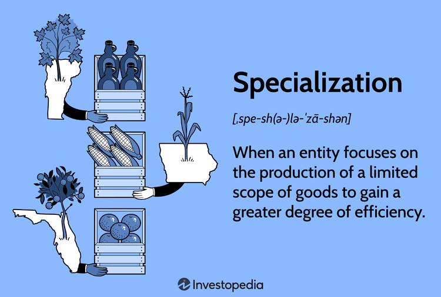

The world of financial markets is constantly evolving, driven by technological advancements that have introduced methodologies such as algorithmic trading. This article examines the term 'in the tank,' its significance within trading contexts, and its interplay with algorithmic trading. We will explore the origin of the phrase 'in the tank' and its implications in trading dialogues, as well as the role algorithmic trading plays in today's financial landscape.

The objective is to clarify the meaning and utility of these concepts and assess their influence on trading strategies. By understanding both 'in the tank' and algorithmic trading, we can better appreciate how they impact financial decisions and market behaviors. Through this analysis, we aim to illustrate how these elements interact to shape modern trading environments, providing insights into algorithmic trading's ability to navigate periods of market underperformance and optimize investment strategies.



## Table of Contents

## Understanding 'In the Tank' in Financial Contexts

"In the tank" is a colloquial expression widely used in financial circles to describe prolonged poor performance in financial markets. This term can apply to the downturn of a specific stock, an entire sector, or even a broader economy. When an asset is considered "in the tank," it is experiencing a sustained period of poor performance, often with minimal signs of a quick or imminent recovery. Such conditions often require strategic reassessment by investors to manage risk effectively and adjust portfolios accordingly.

In practical terms, when an investment is "in the tank," it implies that the security is trading below its intrinsic value over an extended period. This prolonged underperformance may be due to various factors, such as adverse economic indicators, company-specific issues, or broader market conditions. As a result, these investments might attract negative sentiment among investors and analysts, further suppressing their potential recovery.

The term "in the tank" is frequently used in media coverage and casual discussions surrounding financial markets. By articulating the concept of underperformance in a straightforward manner, it enhances understanding among market participants and observers. For example, headlines such as "Tech Stocks in the Tank Following Poor Earnings Reports" succinctly convey the message of continuous poor performance within that sector.

For investors, grasping the implications of "in the tank" is vital for risk assessment and strategic decision-making. It facilitates the evaluation of current holdings, encouraging a re-examination of investment choices under prevailing market conditions. Investors might employ [fundamental analysis](/wiki/fundamental-analysis) to assess the true value of an "in the tank" asset, helping differentiate between a temporary setback and a long-term decline. Furthermore, understanding this concept is crucial for developing strategies to mitigate potential losses and seize opportunities. Strategies could involve reallocating funds, implementing stop-loss orders, or even adopting a contrarian approach by seeking value in undervalued stocks deemed "in the tank."

In summary, the phrase "in the tank" offers a concise means of describing sustained market underperformance. As such, it serves as an essential consideration within the financial analysis, risk management, and strategic planning processes.

## Algorithmic Trading: A Brief Overview

Algorithmic trading, commonly known as algo trading, refers to the use of computer programs and algorithms to execute trading orders with considerable speed and efficiency. These systems are designed to follow a set of predefined instructions which consider variables such as timing, price, and [volume](/wiki/volume-trading-strategy) to achieve optimal trading outcomes. By automating the trading process, algo trading minimizes the influence of human emotions, thereby enhancing decision-making precision and efficiency.

The core advantage of algo trading lies in its ability to execute complex trading strategies that are beyond the reach of manual trading processes. This includes strategies such as trend-following, which involves analyzing market trends to make buy or sell decisions, and [arbitrage](/wiki/arbitrage), where traders take advantage of price differences between markets or securities before these discrepancies are corrected. These strategies depend heavily on mathematical models and are executed by automated systems.

Mathematically, algo trading often involves techniques like linear regression, time series analysis, and [machine learning](/wiki/machine-learning) algorithms to predict market movements and optimize trades. For example, a simple moving average crossover strategy might use the formula:

$$
\text{SMA} = \frac{P_1 + P_2 + \cdots + P_n}{n}
$$

Where $P$ represents the price points over the period $n$. Traders can set an algorithm to initiate a buy order when a short-term moving average exceeds a long-term moving average, indicating an upward trend.

Python is frequently used for developing these algorithmic strategies because of its extensive libraries, such as NumPy, pandas, and scikit-learn, which facilitate data handling, analysis, and modeling. An example of a basic algorithm in Python is:

```python
import pandas as pd

# Load historical price data
data = pd.read_csv('price_data.csv')

# Calculate short and long moving averages
data['SMA_short'] = data['Close'].rolling(window=50).mean()
data['SMA_long'] = data['Close'].rolling(window=200).mean()

# Generate signals
data['Signal'] = 0
data['Signal'][50:] = np.where(data['SMA_short'][50:] > data['SMA_long'][50:], 1, 0)

# Compute trading positions
data['Position'] = data['Signal'].diff()

# Output
print(data[['Close', 'SMA_short', 'SMA_long', 'Signal', 'Position']].dropna())
```

This example demonstrates how a basic moving average crossover strategy can be implemented to signal potential trading opportunities. The signal generated will prompt the trader or system to buy when the short-term average surpasses the long-term average.

Overall, [algorithmic trading](/wiki/algorithmic-trading) has a transformative impact on financial markets by offering numerous advantages, including reduced transaction costs, enhanced order execution, and the capacity to back-test strategies on historical data. However, it also introduces challenges related to technological failures and the need for significant investment in infrastructure and regulatory compliance. Nonetheless, as technology continues to evolve, algorithmic trading holds great potential to further innovate and enhance trading performance.

## Functionality of Algo Trading

Algorithmic trading operates by leveraging the capabilities of computer algorithms to scan and process large datasets, identifying trading opportunities based on predefined rules and parameters. These algorithms are crafted by traders and financial engineers to perform transactions with speed and efficiency that surpass human abilities. 

Key to algo trading is its automation. The set rules—often grounded in complex quantitative methods—dictate when trades should be made, removing human emotion from decision-making processes. Automation ensures that trades are executed exactly at the right time when certain market conditions align with the criteria programmed into the algorithm.

### Python Example Code
Here's a simplified example of how an algorithm might be coded in Python to execute a trade based on moving averages:

```python
# Sample Moving Average Crossover Strategy
import pandas as pd

# Load market data
data = pd.read_csv('market_data.csv')
short_window = 40
long_window = 100

# Calculate moving averages
data['short_mavg'] = data['Close'].rolling(window=short_window, min_periods=1).mean()
data['long_mavg'] = data['Close'].rolling(window=long_window, min_periods=1).mean()

# Generate trading signals
data['signal'] = 0.0
data['signal'][short_window:] = np.where(data['short_mavg'][short_window:] > data['long_mavg'][short_window:], 1.0, 0.0)

# Calculate positions
data['positions'] = data['signal'].diff()

# Output
print(data[['Date', 'short_mavg', 'long_mavg', 'signal', 'positions']])
```

### Backtesting 
An essential step in algorithmic trading is [backtesting](/wiki/backtesting), wherein the algorithm is applied to historical data to check how a strategy would have performed in the past. This process helps validate and refine the strategy before it is deployed in real-time trading. By analyzing past performance, traders can adjust their strategies to mitigate risk and enhance potential returns.

### Scalability
A notable advantage of algorithmic trading is its scalability. It can simultaneously manage numerous trades across different asset classes and markets without the fatigue or error associated with manual trading. This scalability allows large volumes of data to be processed quickly, facilitating trades in fractions of a second—a capability critical in volatile markets.

### Conclusion
The functionality of algorithmic trading lies in its capacity to analyze vast datasets rapidly, optimizing trade executions based on sophisticated mathematical models. Its ability to automate trading decisions, backtest strategies, and scale across multiple markets highlights its transformative role in modern finance.

## Implications of 'In the Tank' Phenomena on Algo Trading

Algo trading strategies often integrate mechanisms to manage investments that are 'in the tank', signifying prolonged underperformance. Algorithms can be programmed to respond actively to these scenarios, helping to mitigate potential losses or identify opportunities amidst downturns.

### Asset Liquidation

One approach is designing algorithms that automatically sell assets when they drop beyond a specified threshold. This mechanism is known as a stop-loss strategy. By establishing a predefined price point at which to [exit](/wiki/exit-strategy) a position, the algorithm minimizes further exposure to declining assets. For instance, the algorithm may incorporate a rule such as:

```python
def stop_loss(price, threshold):
    if price < threshold:
        execute_sell_order()
```

This simple rule-based structure allows real-time decisions, providing a safeguard against drastic losses during market downturns.

### Contrarian Strategies

Conversely, some algorithmic strategies aim to capitalize on stocks that are 'in the tank' by identifying potential undervalued assets. These contrarian strategies operate on the premise that markets may overreact to negative news, creating opportunities to acquire assets expected to rebound.

By implementing algorithms that assess valuation metrics, such as the Price-to-Earnings (P/E) ratio, the system can identify and recommend buying signals for undervalued stocks:

```python
def find_value_buys(stock_data):
    for stock in stock_data:
        if stock.pe_ratio < average_pe - margin_of_safety:
            execute_buy_order(stock)
```

### Exploiting Market Inefficiencies

Algorithmic trading excels in its capacity to exploit market inefficiencies, particularly during periods of instability. Algorithms that utilize mean reversion techniques assume that asset prices will return to their historical averages. Hence, when an asset deviates significantly from its mean, the algorithm takes positions anticipating a corrective movement:

```python
def mean_reversion_trade(current_price, historic_mean):
    if current_price < historic_mean - deviation_limit:
        execute_buy_order()
    elif current_price > historic_mean + deviation_limit:
        execute_sell_order()
```

These strategies employ statistical analysis to determine the expected range of price movements, adjusting trades as conditions fluctuate.

### Integration of Algorithmic Solutions

The interplay between recognizing distressed assets and deploying algorithmic tools highlights the advantages of algorithmic trading: precision, speed, and adaptability. As algorithms evolve, they incorporate diverse datasets and analytical techniques to refine actions during volatile times. The real-time processing capabilities of algorithms ensure market responses are timely and data-driven, potentially uncovering gains amidst challenging periods.

Ultimately, the integration of algorithmic solutions with an understanding of 'in the tank' investments exemplifies how technology enhances the capability to manage financial portfolios, safeguarding against downturns while scouting for new investment prospects.

## Challenges and Opportunities in Algo Trading

Algo trading, while providing numerous benefits, is not without its challenges. One of the primary challenges is technical failure. Trading platforms can experience outages or bugs, leading to unintended trades or missed opportunities. These technical issues can significantly impact trading strategies, especially when large volumes are involved, potentially causing market instability.

Another concern in algo trading is overfitting. This occurs when algorithms are excessively fine-tuned to past data, making them less adaptable to unexpected market variations. Overfitting can result in models that perform well historically but falter under new market conditions, leading to poor trading outcomes. This issue underscores the importance of robust model evaluation and validation techniques to ensure algorithms perform correctly in real-world scenarios.

Infrastructure costs also pose a significant barrier. High-frequency trading systems require substantial investment in technology infrastructure, including powerful computing resources and fast data feeds. These costs can be prohibitive for smaller traders or firms. Additionally, regulatory compliance can add to the financial burden, as traders must adhere to various regulatory mandates aimed at maintaining market integrity and protecting investors.

On the opportunity side, advancements in [artificial intelligence](/wiki/ai-artificial-intelligence) (AI) are revolutionizing algo trading. AI and machine learning offer enhanced pattern recognition capabilities, enabling the development of more sophisticated algorithms that can adapt and respond to changing market dynamics. These technologies can lead to improved performance and efficiency in executing trading strategies.

Staying updated on technological advancements is crucial for traders aiming to fully leverage the benefits of algo trading. Continuous education and adaptation to new tools and methodologies are essential. For instance, incorporating AI into algo trading requires not only technical expertise but also a deep understanding of financial markets and regulatory environments. By embracing these challenges and opportunities, traders can enhance their trading strategies and potentially achieve better financial outcomes.

## Conclusion

The concepts of 'in the tank' and algorithmic trading are essential for understanding market dynamics and devising effective investment strategies. The term 'in the tank' denotes a phase of prolonged poor performance in financial markets, symbolizing declines in specific stocks or economic sectors. Conversely, algorithmic trading provides a robust framework to tackle these challenges by facilitating precise, automated trading decisions. This methodology leverages vast datasets and intricate models, enabling traders to execute transactions with minimal human intervention and emotion.

Incorporating algorithmic trading into strategic planning allows professionals to manage risks associated with market downturns. Algorithms can be programmed to recognize and react to downtrends, such as selling off underperforming assets or identifying potential value opportunities in stagnating stocks. These capabilities emphasize the importance of a clear understanding of declining market conditions and the use of algorithmic methods to adapt to such environments.

By mastering these concepts, traders can make more informed decisions, optimizing their financial results. They can efficiently adjust their strategies to align with current market realities, mitigating potential losses and capitalizing on emerging opportunities. Consequently, consultation with financial advisors is highly recommended to navigate the intricacies of algorithmic trading and market declines effectively. These advisors can provide tailored insights and guidance, ensuring that trading strategies are both innovative and compliant with regulatory standards.

## References & Further Reading

[1]: Bergstra, J., Bardenet, R., Bengio, Y., & Kégl, B. (2011). ["Algorithms for Hyper-Parameter Optimization."](https://dl.acm.org/doi/10.5555/2986459.2986743) Advances in Neural Information Processing Systems 24.

[2]: ["Advances in Financial Machine Learning"](https://www.amazon.com/Advances-Financial-Machine-Learning-Marcos/dp/1119482089) by Marcos Lopez de Prado

[3]: ["Evidence-Based Technical Analysis: Applying the Scientific Method and Statistical Inference to Trading Signals"](https://www.amazon.com/Evidence-Based-Technical-Analysis-Scientific-Statistical/dp/0470008741) by David Aronson

[4]: ["Machine Learning for Algorithmic Trading"](https://github.com/stefan-jansen/machine-learning-for-trading) by Stefan Jansen

[5]: ["Quantitative Trading: How to Build Your Own Algorithmic Trading Business"](https://www.amazon.com/Quantitative-Trading-Build-Algorithmic-Business/dp/1119800064) by Ernest P. Chan