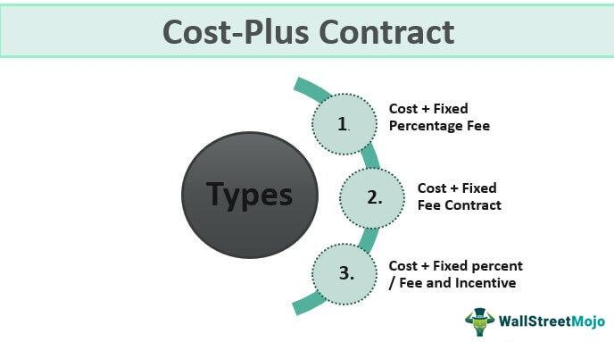

The financial sector employs a variety of fees designed to manage and optimize fund performance, ensuring alignment between fund managers and investors. Among these is the incentive fee, a performance-based compensation mechanism frequently utilized in hedge funds and algorithmic trading (algo trading). This article elucidates the concept of incentive fees, focusing on calculation methods and illustrative examples to provide clarity. Additionally, the implications of these fees for algo trading and financial management will be explored. A comprehensive understanding of incentive fees equips investors and fund managers with the acumen necessary to make informed financial decisions, balancing the potential for higher returns with an understanding of associated risks.

## Table of Contents



## Understanding Incentive Fees

An incentive fee is a performance-based remuneration model paid to fund managers for generating higher returns for investors. It is structured to motivate fund managers to outperform a predetermined benchmark, thereby aligning their interests with those of the investors. This alignment ensures that fund managers strive to meet or exceed performance targets, ultimately benefiting the investors. 

The typical calculation of an incentive fee involves a comparison of the fund's performance against a benchmark index or target return. If, for instance, a hedge fund establishes a benchmark return of 8% annually, any returns above this threshold might be subject to an incentive fee. The fee is commonly expressed as a percentage of the profit exceeding this benchmark. For example, if a fund surpasses its benchmark by $500,000 and the incentive fee is set at 20%, then the fund manager earns $100,000 as an incentive fee.

This fee structure incentivizes fund managers to pursue higher returns but may also encourage greater risk-taking. In their quest to surpass benchmarks and earn incentive fees, managers might adopt more aggressive investment strategies. While these strategies have the potential to yield substantial returns, they also increase the possibility of significant losses, which could adversely affect investors. 

In essence, while incentive fees aim to drive fund managers to achieve superior fund performance, they come with the inherent risk of increased [volatility](/wiki/volatility-trading-strategies) and potential misalignment with long-term investor priorities.

## Calculation Methods

Several methods exist for calculating incentive fees in investment funds, each designed to align the interests of fund managers and investors. One common approach is to calculate the incentive fee as a flat percentage of the fund's net asset value (NAV) growth. For instance, if a fund grows by $500,000 and the incentive fee is set at 20%, the fund manager receives $100,000 as the performance fee.

Alternatively, incentive fees can be connected to realized or unrealized gains. Realized gains refer to profits made from investments that have been sold, while unrealized gains are based on investments still held by the fund. This distinction can impact the timing and amount of fees collected.

Additionally, many funds utilize a hurdle rate as a threshold that must be exceeded before any incentive fees are payable. The hurdle rate often reflects the minimum acceptable return, typically tied to a benchmark or a fixed percentage. For example, if a fund achieves a return of 8% and the hurdle rate is 5%, incentive fees are only charged on the 3% excess return.

High-water marks play a crucial role in the calculation of incentive fees by ensuring that fund managers only receive performance fees on new gains above previous peaks. If a fund experiences a loss and then recovers, incentive fees are not charged until the NAV surpasses the previous high-water mark. This approach protects investors from paying fees on recovered losses and aligns managerial incentives with investor interests.

These methods offer transparency and fairness by ensuring the fund's performance truly benefits both the manager and the investor before fees are deducted. Calculation methods vary among funds, but the principles of aligning interests and safeguarding against excessive fees remain consistent across the industry.

## Incentive Fee Examples

Imagine an investor places $10 million with a [hedge fund](/wiki/hedge-fund-trading-strategies). With the fund achieving a net asset value (NAV) growth of $1 million, the incentive fee structure becomes crucial for calculating the fund manager's earnings. Typically, fund managers might receive 20% of this growth, resulting in a $200,000 fee. This scenario illustrates a straightforward calculation, but several additional components often influence the actual incentive fee.

Performance fees are generally charged only on gains surpassing a predefined hurdle rate. A hurdle rate represents a minimum return level that a fund must achieve before incentive fees are levied. For example, if the hurdle rate is set at 5%, the fund needs to grow by at least $500,000 (5% of $10 million) before any performance fee on the additional gains is applicable.

High-water mark regulations further ensure managers collect fees solely on new performance gains. This is designed to prevent managers from [earning](/wiki/earning-announcement) incentive fees when recovering from previous losses. If the NAV had previously decreased below $10 million and then rebounded to $11 million, fees would only be assessed on the amount exceeding the previous peak value.

These examples underscore the significance of carefully structured fee agreements in investment strategies. Investors are advised to understand these elements, as they directly impact the manager's compensation and, subsequently, their motivation and trading strategies. Accordingly, both investors and fund managers must agree on clear and transparent fee structures to align their interests effectively.

## Implications for Algo Trading

Algo trading, or [algorithmic trading](/wiki/algorithmic-trading), leverages algorithms to automate and optimize trading decisions based on predefined criteria. The integration of incentive fees in algo trading can significantly influence the behavior of both traders and the algorithms themselves. As these fees are performance-based, they are designed to reward fund managers for surpassing certain benchmarks. This structure inherently motivates traders to adopt more aggressive trading strategies to achieve above-average returns and maximize their incentive compensation.

The presence of high incentive fees can lead to increased risk-taking as fund managers tweak trading algorithms to exploit short-term market opportunities, potentially resulting in volatile trading environments. Traders might enhance algorithmic parameters to increase potential returns within a short period, thus aligning their activities with the higher fee structures. A common practice might involve increasing the frequency of trades or leveraging larger positions, both of which can heighten the overall risk level.

On the other hand, incentive fees may also push managers to focus on short-term gains at the expense of long-term stability. The pressure to surpass performance benchmarks can direct managers toward strategies that yield immediate profit, sometimes neglecting the broader market trends and stability. Such a focus can eventually lead to detrimental consequences if market conditions turn unfavorable, as algorithms designed for short-term success may not adapt well to longer-term market shifts.

To navigate the implications of incentive fees effectively, traders employing algorithmic systems should have a profound understanding of both the technical and financial landscapes. A critical approach involves balancing aggressive strategies geared toward short-term gains with the necessity for long-term risk management and stable returns. 

Engaging in comprehensive [backtesting](/wiki/backtesting) and scenario analysis can serve as a valuable strategy for mitigation. For instance, traders can simulate both aggressive and conservative strategies across various market conditions to assess potential outcomes. A simple Python example to evaluate the effect of a hypothetical incentive fee of 20% on a trading strategy return could look like this:

```python
def calculate_incentive_fee(return_before_fee, incentive_rate=0.20):
    return return_before_fee * (1 - incentive_rate)

# Simulating returns
returns = [0.05, 0.10, 0.15, -0.05, 0.12]  # hypothetical monthly returns

net_returns = [calculate_incentive_fee(r) for r in returns]
print("Net Returns after Incentive Fees:", net_returns)
```

By applying a systematic approach to understand the influence of incentive fees, both fund managers and investors can align their objectives with sound financial practices and achieve a more stable return profile, thus fostering a sustainable trading ecosystem.

## Criticism and Considerations

Critics of incentive fees in the financial sector, particularly within hedge funds and algorithmic trading, argue that these fees can promote excessive risk-taking by fund managers. The fundamental concern is that incentive fees, which reward managers based on performance gains, can lead to a misalignment of interests between managers and investors. While managers stand to gain substantially from upsides, they are not penalized for losses, potentially encouraging more aggressive strategies that may not always align with investors' risk tolerance.

One notable critic of traditional incentive fee structures is Warren Buffett. Buffett, a staunch advocate for investor protection, argues for more balanced fee models that align the interests of fund managers with those of investors over the long term. He suggests that fee structures should reflect not just performance gains but also consider long-term value creation and risk management.

For investors, it is crucial to conduct a thorough examination of a fund's fee architecture before committing capital. Understanding how these fees are structured and how they might impact the fund's trading strategies is essential for making sound investment decisions. Aspects such as the presence of high-water marks or hurdle rates can significantly influence the net gain an investor might expect and should be carefully evaluated.

Additionally, proper regulation and transparency in the financial industry are critical to maintaining investor trust. Transparent reporting of fee structures and performance metrics helps investors understand the incentives driving fund managers' decisions. Regulatory bodies are increasingly focusing on ensuring that fee disclosures are clear and comprehensive, thereby safeguarding investors from potential conflicts of interest that may arise from poorly structured incentive fees.

In summary, while incentive fees are designed to motivate fund managers, they require careful design and regulation to prevent misaligned incentives that could lead to undesirable financial outcomes. 

## Conclusion

Incentive fees significantly influence the motivation and actions of fund managers. These fees, structured to align managers' interests with those of investors, serve as a financial motivator, encouraging fund managers to achieve superior returns on investment. By comprehending the intricacies of incentive fee structures and their potential impact, investors can make more informed decisions regarding fund selection and investment strategy.

An in-depth analysis of calculation methods, such as flat percentage of net asset value (NAV) growth, realized or unrealized gains, hurdle rates, and high-water marks, provides stakeholders with critical insights into how these fees are determined. For instance, employing a high-water mark ensures that managers are rewarded only for new profits, ensuring that investors do not pay fees on recovered losses.

Understanding the practical examples of incentive fees, like an investor placing $10 million with a hedge fund and observing how fees are calculated on the growth of NAV, illustrates the real-world implications of these fee structures. Stakeholders armed with this knowledge are better equipped to navigate the intricacies of the financial markets.

Ultimately, raising awareness and enhancing education around incentive fees are vital for promoting strategic and balanced investment practices. By demystifying these fees and fostering transparency, investors and fund managers alike can cultivate a more equitable and efficient investment environment, leading to better outcomes for all parties involved.

## References & Further Reading

[1]: Lowenstein, R. (2001). ["When Genius Failed: The Rise and Fall of Long-Term Capital Management."](https://www.amazon.com/When-Genius-Failed-Long-Term-Management/dp/0375758259) Random House.

[2]: ["Hedge Funds: An Analytic Perspective"](https://www.jstor.org/stable/j.ctt7rq28) by Andrew W. Lo

[3]: Maginn, J. L., Tuttle, D. L., McLeavey, D. W., & Pinto, J. E. (2007). ["Managing Investment Portfolios: A Dynamic Process."](https://www.amazon.com/Managing-Investment-Portfolios-Dynamic-Process/dp/0470080140) John Wiley & Sons.

[4]: Focardi, S. M., & Fabozzi, F. J. (2004). ["The Mathematics of Financial Modeling and Investment Management."](https://archive.org/details/mathematicsoffin0000foca) Wiley Finance.

[5]: ["Principles: Life and Work"](https://www.amazon.com/Principles-Life-Work-Ray-Dalio/dp/1501124021) by Ray Dalio