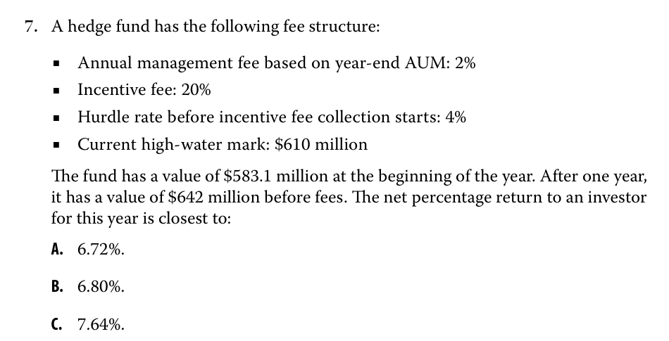

## Table of Contents

## What is an incentive fee?

An incentive fee is a type of payment that someone gets for doing a good job. It is often used in businesses to reward employees, managers, or investment managers when they perform well. For example, if a manager helps a company make more money than expected, they might get an incentive fee as a bonus.

In the world of investments, incentive fees are common in hedge funds and private equity. The fee is usually a percentage of the profits made by the fund. This encourages the managers to work hard to make the best returns for their investors. However, it's important that the fee structure is clear so everyone knows what to expect.

## Why are incentive fees used in investment management?

Incentive fees are used in investment management to motivate managers to do a good job. When managers know they can earn extra money by making their clients more money, they work harder and make smarter choices. This is good for the people who invest their money in the fund because they want their investments to grow.

These fees also help align the interests of the managers with those of the investors. If the fund does well, both the managers and the investors benefit. This encourages the managers to focus on making the best possible returns, rather than just trying to collect regular fees. However, it's important that the rules about how these fees are calculated are clear and fair to everyone involved.

## How do incentive fees differ from management fees?

Incentive fees and management fees are two different kinds of payments that investment managers can get. A management fee is a regular payment that the manager gets just for doing their job. It's usually a percentage of the total amount of money in the fund, and it's paid no matter how well the fund is doing. This fee helps cover the costs of running the fund, like paying for staff and office space.

On the other hand, an incentive fee is a special payment that the manager gets only if the fund does really well. It's like a bonus for making more money for the investors. The incentive fee is usually a percentage of the profits the fund makes. This fee encourages the manager to work hard and make smart choices to grow the fund's value.

Both types of fees are important in investment management. Management fees make sure the fund can keep running smoothly, while incentive fees push managers to aim for the best results. Together, they help balance the need to cover costs with the goal of making more money for investors.

## What are the common structures of incentive fees?

Incentive fees usually come in a few common forms. One popular way is the "high-water mark" system. This means the manager only gets the incentive fee if the fund's value goes above the highest point it reached before. This makes sure the manager is rewarded for new gains, not just for bouncing back from losses. Another common structure is the "hurdle rate." Here, the manager only gets the fee if the fund's returns are better than a certain target rate, like the return from a safe investment like a government bond.

Another structure is the "catch-up" system. In this setup, once the fund beats the hurdle rate, the manager gets to keep all the extra profits until they catch up to a certain share of the total profits. After that, the profits are split between the manager and the investors. These structures are designed to make sure the manager is motivated to do a good job and that the investors also see good returns on their money.

## Can you explain the 'high water mark' concept in relation to incentive fees?

The 'high water mark' is a way to make sure that managers get paid for new gains, not just for recovering old losses. Imagine you have a bucket of water, and the water level is the value of your investment fund. The highest point the water ever reached is called the 'high water mark.' If the water level goes down and then comes back up to where it was before, the manager doesn't get an incentive fee. They only get the fee when the water level goes above the highest point it's ever been.

This system is important because it makes sure the manager is working hard to make new money for the investors, not just trying to get back what was lost. It's fair to everyone because the manager only gets rewarded for making the fund grow beyond what it's done before. This encourages the manager to keep pushing for better results and helps protect the investors from paying fees for just getting back to even.

## How is an incentive fee typically calculated?

An incentive fee is usually calculated as a percentage of the profits that an investment fund makes. For example, if a fund makes a profit of $100,000 and the incentive fee is set at 20%, the manager would get $20,000 as their incentive fee. This percentage can vary depending on the agreement between the manager and the investors, but it's often around 20% in many investment funds.

To make sure the fee is fair, many funds use a system called a 'high water mark.' This means the manager only gets the fee if the fund's value goes above the highest point it reached before. So, if the fund lost money and then got back to its old high, the manager wouldn't get a fee until the fund's value went even higher. This helps make sure the manager is rewarded for making new gains, not just for recovering from losses.

## What is the 'hurdle rate' and how does it affect incentive fee calculations?

A 'hurdle rate' is a target return that an investment fund needs to reach before the manager can get an incentive fee. It's like a goal that the fund has to hit before the manager gets any extra money. For example, if the hurdle rate is set at 5%, the fund needs to make at least 5% before the manager can start [earning](/wiki/earning-announcement) their incentive fee.

Once the fund beats the hurdle rate, the manager can then get a percentage of the profits above that rate. This makes sure that the manager is only rewarded for doing better than a certain level, which can be based on things like the return from a safe investment like a government bond. Using a hurdle rate helps make sure the manager works hard to give the investors a good return on their money, not just any return.

## Are there any regulatory considerations for incentive fees?

Yes, there are rules that investment managers need to follow when it comes to incentive fees. These rules come from government agencies like the Securities and Exchange Commission (SEC) in the United States. The main goal of these rules is to make sure that the fees are fair and clear to everyone. Managers have to tell investors exactly how the fees are calculated and what they can expect to pay. This helps prevent any surprises and keeps things honest.

Different countries might have their own rules about incentive fees. For example, in the European Union, there are strict rules to protect investors and make sure that fees are reasonable. Managers have to follow these rules closely or they could get in trouble. The idea is to make sure that everyone understands the fees and that they are not too high or unfair. By having these rules, regulators hope to keep the investment world safe and trustworthy for everyone involved.

## How do different asset classes impact the application of incentive fees?

Different types of investments, or asset classes, can change how incentive fees work. For example, in stock funds, where the value can go up and down a lot, managers might get bigger incentive fees because they're taking more risks. But in bond funds, which are usually safer, the incentive fees might be smaller because the returns are more predictable. The kind of asset class matters because it affects how much risk the manager is taking and how much reward they might get.

In real estate funds, the way incentive fees are set up can be different too. Real estate deals can take a long time to make money, so managers might get their fees based on when properties are sold or rented out. This is different from stock funds, where fees might be based on how the stocks are doing every day or every month. So, the type of asset class can really change how and when managers earn their incentive fees, making sure the fees match the kind of work and risk involved.

## What are the potential drawbacks of incentive fees for investors?

Incentive fees can have some downsides for investors. One big problem is that these fees can make managers take too many risks. If a manager knows they'll get a big bonus for making a lot of money, they might try risky things to get that bonus. This can be bad for investors because if the risky move doesn't work out, they could lose a lot of money.

Another issue is that incentive fees can be hard to understand. Sometimes, the rules for how these fees are calculated are complicated. This can make it tough for investors to know exactly what they're paying. If the fees are not clear, investors might feel like they're not getting a fair deal. It's important for investors to really understand how these fees work so they can make good choices about where to put their money.

## How can performance be measured accurately for the purpose of calculating incentive fees?

Measuring performance for calculating incentive fees needs to be done carefully and clearly. One common way is to look at the total return of the fund, which is how much money the fund made or lost over a certain time. This can be compared to a benchmark, like a stock market index, to see if the fund did better or worse than the market. Using a high water mark helps make sure the manager is only rewarded for new gains, not just for getting back to where the fund was before.

Another important thing to consider is the time period over which performance is measured. Some funds might look at performance over a year, while others might use shorter or longer periods. It's also important to think about any costs or fees that come out of the fund's returns before calculating the incentive fee. By using clear and fair ways to measure performance, investors can feel confident that the incentive fees they pay are based on real, good results from the manager.

## What advanced strategies can fund managers use to optimize incentive fee structures?

Fund managers can use a few smart strategies to make incentive fee structures work better for everyone. One way is to use a tiered fee system. This means the manager gets a bigger percentage of the profits if the fund does really well, but a smaller percentage if the returns are just okay. This encourages the manager to aim for the best results without taking too many risks. Another strategy is to set up different performance hurdles for different types of investments within the fund. For example, stocks might have a higher hurdle rate than bonds because they're riskier. This makes sure the fees match the kind of work and risk involved in managing different parts of the fund.

Another advanced strategy is to use a 'clawback' system. This means if the fund loses money after the manager has already gotten an incentive fee, the manager has to give some of that fee back. This keeps the manager focused on long-term success, not just short-term gains. By using these strategies, fund managers can create a fee structure that rewards them for doing a great job while also being fair to investors. This helps build trust and makes sure everyone's interests are aligned.

## References & Further Reading

[1]: Lowenstein, R. (2001). ["When Genius Failed: The Rise and Fall of Long-Term Capital Management."](https://www.amazon.com/When-Genius-Failed-Long-Term-Management/dp/0375758259) Random House.

[2]: ["Hedge Funds: An Analytic Perspective"](https://www.jstor.org/stable/j.ctt7rq28) by Andrew W. Lo

[3]: Maginn, J. L., Tuttle, D. L., McLeavey, D. W., & Pinto, J. E. (2007). ["Managing Investment Portfolios: A Dynamic Process."](https://www.amazon.com/Managing-Investment-Portfolios-Dynamic-Process/dp/0470080140) John Wiley & Sons.

[4]: Focardi, S. M., & Fabozzi, F. J. (2004). ["The Mathematics of Financial Modeling and Investment Management."](https://archive.org/details/mathematicsoffin0000foca) Wiley Finance.

[5]: ["Principles: Life and Work"](https://www.amazon.com/Principles-Life-Work-Ray-Dalio/dp/1501124021) by Ray Dalio