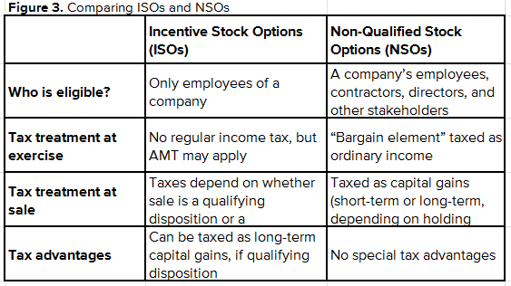

## Table of Contents

## What are Incentive Stock Options (ISOs)?

Incentive Stock Options (ISOs) are a type of employee stock option that companies offer to their employees as part of their compensation package. ISOs are different from other types of stock options because they offer special tax benefits. When an employee exercises ISOs, they don't have to pay regular income tax on the difference between the stock's market value and the exercise price. Instead, this gain is considered a preference item for the Alternative Minimum Tax (AMT), which might require the employee to pay some tax.

To qualify for these tax benefits, ISOs must meet certain rules set by the IRS. For example, the option must be granted with an exercise price at least equal to the stock's fair market value on the grant date. Also, the employee must hold the stock for at least one year after exercising the option and two years after the option was granted. If these rules are followed, when the employee eventually sells the stock, any profit is taxed at the long-term capital gains rate, which is usually lower than the regular income tax rate.

## How do ISOs differ from Non-Qualified Stock Options (NSOs)?

ISOs and NSOs are both ways for companies to give their employees a chance to buy company stock, but they have some big differences. ISOs, or Incentive Stock Options, come with special tax benefits. When you use ISOs to buy stock, you don't have to pay regular income tax right away on the difference between what you paid and what the stock is worth. Instead, you might have to pay something called the Alternative Minimum Tax (AMT). But if you hold onto the stock for a certain amount of time, when you sell it later, you'll only pay a lower tax rate called the long-term capital gains rate.

On the other hand, NSOs, or Non-Qualified Stock Options, don't have these special tax rules. When you use NSOs to buy stock, you have to pay regular income tax on the difference between the price you paid and the stock's value at the time you bought it. This tax is taken out of your paycheck right away. NSOs are simpler because they don't have the extra rules that ISOs do, like holding the stock for a certain time before selling it. But because of this, you end up paying more in taxes when you use NSOs compared to ISOs if you follow the rules correctly.

## Who is eligible to receive ISOs?

Only employees of a company can get ISOs. This means that people who work for the company, but are not considered employees, like independent contractors or consultants, cannot receive ISOs. The company decides who among its employees can get these options, often based on their position or performance.

There are also some rules about how many ISOs a person can get. The total value of ISOs that can be granted to one employee in a year cannot be more than $100,000. This value is based on the stock's price when the options are given out. If someone gets more than this, the extra options will be treated as NSOs instead.

## What are the tax implications of exercising ISOs?

When you exercise ISOs, you don't have to pay regular income tax right away on the difference between what you paid and what the stock is worth. Instead, this difference might make you have to pay something called the Alternative Minimum Tax (AMT). The AMT is a different way of calculating your taxes that can sometimes make you pay more than you would with regular income tax. You'll need to figure out if exercising your ISOs will make you owe AMT, and if so, how much.

If you hold onto the stock you got from exercising your ISOs for at least one year after you bought it, and two years after the options were granted, you can get a big tax break. When you sell the stock after holding it for this long, any profit you make is taxed at the long-term capital gains rate, which is usually lower than the regular income tax rate. But if you sell the stock before meeting these time rules, you'll lose the special tax treatment and have to pay regular income tax on the difference between the stock's value when you exercised the options and what you paid for it, plus any additional profit you made since then.

## How does the Alternative Minimum Tax (AMT) affect ISOs?

When you use ISOs to buy stock, you don't have to pay regular income tax right away on the difference between the price you paid and what the stock is worth. But, this difference might make you have to pay the Alternative Minimum Tax (AMT). AMT is a different way to calculate your taxes that can sometimes make you pay more than you would with regular income tax. You need to figure out if using your ISOs will make you owe AMT and how much.

If you hold onto the stock you got from exercising your ISOs for at least one year after you bought it, and two years after the options were granted, you can avoid paying AMT on the stock's value when you sell it. Instead, any profit you make when you sell the stock will be taxed at the long-term capital gains rate, which is usually lower than the regular income tax rate. But if you sell the stock before meeting these time rules, you'll have to pay AMT on the difference between the stock's value when you exercised the options and what you paid for it, plus any additional profit you made since then.

## What is the holding period requirement for ISOs to receive favorable tax treatment?

To get the special tax benefits from ISOs, you need to hold onto the stock for a certain amount of time. You have to keep the stock for at least one year after you buy it using your ISOs. Also, you need to wait at least two years from the date the options were given to you before selling the stock.

If you follow these rules, when you sell the stock, you'll only have to pay a lower tax called the long-term capital gains tax on any profit you make. But if you sell the stock before you've held it for these required times, you won't get these tax benefits. Instead, you might have to pay the Alternative Minimum Tax (AMT) on the difference between what you paid for the stock and its value when you bought it, plus regular income tax on any additional profit you made since then.

## Can ISOs be transferred or sold?

ISOs are usually meant just for the person who gets them and can't be given to someone else or sold. This rule is set to make sure the special tax benefits stay with the employee who was given the options. But, there's one exception: if the person who got the ISOs passes away, their family or heirs can get the ISOs and use them.

So, if you're thinking about what to do with your ISOs, remember you can't sell them or give them away while you're alive. You have to use them yourself to buy the company's stock. If you do decide to use them, make sure to keep the stock for the right amount of time to get the best tax deal.

## What happens to ISOs if an employee leaves the company?

When an employee leaves a company, what happens to their ISOs depends on the company's specific rules. Usually, the employee has a certain amount of time after leaving to use their ISOs. This time period is often called the "post-termination exercise period," and it can last from a few months to a year, depending on the company's plan. If the employee doesn't use their ISOs within this time, they will lose them.

After leaving the company, if the employee does use their ISOs within the allowed time, they still need to follow the holding period rules to get the special tax benefits. This means they must hold the stock for at least one year after buying it and two years after the options were granted. If they sell the stock before these times are up, they won't get the tax benefits and might have to pay the Alternative Minimum Tax (AMT) and regular income tax on any profit.

## How are ISOs reported on tax returns?

When you exercise ISOs, you don't pay regular income tax right away, but you might have to pay the Alternative Minimum Tax (AMT). To figure out if you owe AMT, you need to fill out Form 6251. On this form, you'll report the difference between what you paid for the stock and its market value when you bought it as a "preference item." This can increase your taxable income for AMT purposes. If you owe AMT, you'll report it on your Form 1040 and pay it with your regular taxes.

If you hold onto the stock for at least one year after buying it with your ISOs, and two years after the options were granted, you can get a big tax break. When you sell the stock after holding it for this long, you report the sale on Schedule D of your Form 1040. Any profit you make is taxed at the long-term capital gains rate, which is usually lower than the regular income tax rate. But if you sell the stock before meeting these time rules, you'll lose the special tax treatment. You'll have to report the difference between the stock's value when you exercised the options and what you paid for it as regular income on your Form 1040, and any additional profit since then on Schedule D.

## What strategies can be used to minimize tax liabilities with ISOs?

One way to minimize tax liabilities with ISOs is to carefully plan when you exercise them and sell the stock. If you can afford to, it's best to exercise your ISOs and then hold onto the stock for at least one year after buying it and two years after the options were granted. This way, when you sell the stock, you'll only have to pay the lower long-term capital gains tax on any profit you make, instead of the higher regular income tax or AMT. But remember, you might still have to pay AMT when you exercise the options, so make sure you have enough money set aside to cover that tax.

Another strategy is to exercise your ISOs early, right after they're granted, if the stock's market value is close to the exercise price. This can help you start the clock on the holding period sooner, and it might keep the AMT you have to pay lower because the difference between the exercise price and the market value will be smaller. Just be aware that if the stock price goes down after you exercise, you could lose money. Also, if you're planning to leave the company, make sure you exercise your ISOs before you go, within the time allowed by the company's plan, to avoid losing them.

## How do ISOs impact financial planning and estate planning?

ISOs can be a big part of your financial planning because they give you a chance to own part of your company and maybe make money if the stock price goes up. When you get ISOs, you need to think about when to use them and when to sell the stock to get the best tax deal. If you can hold onto the stock for at least one year after buying it and two years after the options were given to you, you'll pay less tax on any profit you make. But you might have to pay something called the Alternative Minimum Tax (AMT) when you use your ISOs, so you need to plan for that too. It's a good idea to talk to a financial advisor to figure out the best time to use your ISOs and sell the stock to help grow your savings and reach your money goals.

ISOs can also affect your estate planning. If you pass away, your family or heirs can get your ISOs and use them. This means that ISOs can be part of what you leave behind for your loved ones. But, they'll need to use the ISOs within a certain time after you're gone, or they'll lose them. Also, if your heirs use the ISOs and then sell the stock, they'll have to think about the tax rules too. So, when you're planning your estate, it's important to think about how your ISOs might help your family and to make sure they know what to do with them. Talking to an estate planning expert can help you make the best choices for your family's future.

## What are the potential risks and rewards associated with ISOs?

ISOs can be a great reward for employees because they give you a chance to buy your company's stock at a lower price than what it's worth now. If the stock price goes up after you buy it, you could make a lot of money when you sell it later. Plus, if you hold onto the stock for the right amount of time, you'll pay less tax on the profit. This can really help you grow your savings and reach your financial goals. But, ISOs also come with some special tax rules that can be tricky. You might have to pay the Alternative Minimum Tax (AMT) when you use your ISOs, which could mean a big tax bill right away. It's important to plan carefully and maybe talk to a tax advisor to make sure you're ready for this.

There are also risks with ISOs. The biggest risk is that the stock price might go down after you buy it. If that happens, you could lose money. Also, if you leave your job, you might not have much time to use your ISOs before you lose them. And if you sell the stock before holding it for the right amount of time, you'll miss out on the special tax benefits and might have to pay more in taxes. So, it's really important to think about these risks and rewards when deciding what to do with your ISOs. Talking to a financial advisor can help you make the best choices for your situation.

## What are potential strategies for combining ISOs and algorithmic trading?

Leveraging algorithmic trading can significantly enhance decision-making regarding the timing of exercising Incentive Stock Options (ISOs). By employing advanced technologies and data analysis, participants can optimize their strategies to maximize the financial benefits of ISOs. Here, we explore potential strategies and models that can be implemented:

### Developing Risk Models

One key strategy is to develop risk models that specifically account for the unique characteristics of ISO trading. These models should incorporate various factors, including:

- **Volatility Analysis:** Measure the historical volatility of the company's stock to forecast potential price movements. A common approach for this is to calculate the standard deviation of returns:
$$
  \sigma = \sqrt{\frac{1}{N-1} \sum_{i=1}^{N} (R_i - \bar{R})^2}

$$

  Where $R_i$ is the return at time $i$, $\bar{R}$ is the mean return, and $N$ is the total number of observations.

- **Tax Implications:** Consider the tax impact, particularly the Alternative Minimum Tax (AMT) for ISOs. Creating a model to simulate different scenarios can help in understanding the tax burden.

- **Time Decay (Theta):** Assess how the time decay of options affects the optimal exercise strategy. This involves quantitative analysis of how option value diminishes as expiration approaches.

### Creating Dynamic Strategies

Dynamic strategies can exploit favorable market conditions by using algorithms to optimize ISO benefits. Some potential approaches include:

- **Market Trend Analysis:** Utilize algorithms to detect trends or momentum in the stock market that could indicate an optimal time to exercise options. For instance, implementing machine learning models that predict stock movements based on past data.

- **Exercise Timing Algorithms:** Develop algorithms to suggest the best timing for exercising ISOs based on real-time data. This can include the use of moving averages or other technical indicators to make decisions:

  ```python
  def moving_average(data, window_size):
      return [sum(data[i:i+window_size])/window_size for i in range(len(data)-window_size+1)]

  stock_prices = [120, 122, 121, 125, 130, 128, 135]
  ma = moving_average(stock_prices, 3)
  print(ma)
  ```

  The above code calculates a simple moving average, which can be part of a more complex decision-making algorithm for exercising ISOs.

### Adaptive Hedging

Hedging strategies can be employed to mitigate risks associated with holding ISOs. This can involve using options or other derivatives to protect against downside risk. The Black-Scholes model can be utilized to price these options accurately, giving insight into the cost and effectiveness of hedging:

$$
C = S_0 N(d_1) - X e^{-rt} N(d_2)
$$

Where:
- $S_0$ is the current stock price
- $X$ is the strike price
- $t$ is the time to expiration
- $r$ is the risk-free interest rate
- $N$ is the cumulative distribution function of the standard normal distribution

In conclusion, combining ISOs with algorithmic trading offers strategic advantages by enhancing decision-making processes. With careful implementation of risk models and dynamic strategies, stakeholders can capitalize more effectively on their stock options.

## References & Further Reading

[1]: Pratt, S. P., & Grabowski, R. J. (2014). ["Cost of Capital: Applications and Examples."](https://onlinelibrary.wiley.com/doi/book/10.1002/9781118846780) Wiley.

[2]: Cornell, B. (2006). ["The Equity Risk Premium: The Long-Run Future of the Stock Market."](https://books.google.com/books/about/The_Equity_Risk_Premium.html?id=wNqhV_FRfmEC) Wiley Finance.

[3]: Natenberg, S. (1994). ["Option Volatility and Pricing: Advanced Trading Strategies and Techniques."](https://archive.org/details/optionvolatility00shel) McGraw-Hill Professional.

[4]: Hull, J. C. (2014). ["Options, Futures, and Other Derivatives."](https://www.amazon.com/Options-Futures-Other-Derivatives-9th/dp/0133456315) Pearson.

[5]: Fabozzi, F. J., Kolm, P. N., & Pachamanova, D. A. (2010). ["Robust Portfolio Optimization and Management."](https://onlinelibrary.wiley.com/doi/book/10.1002/9781119202172) Wiley.