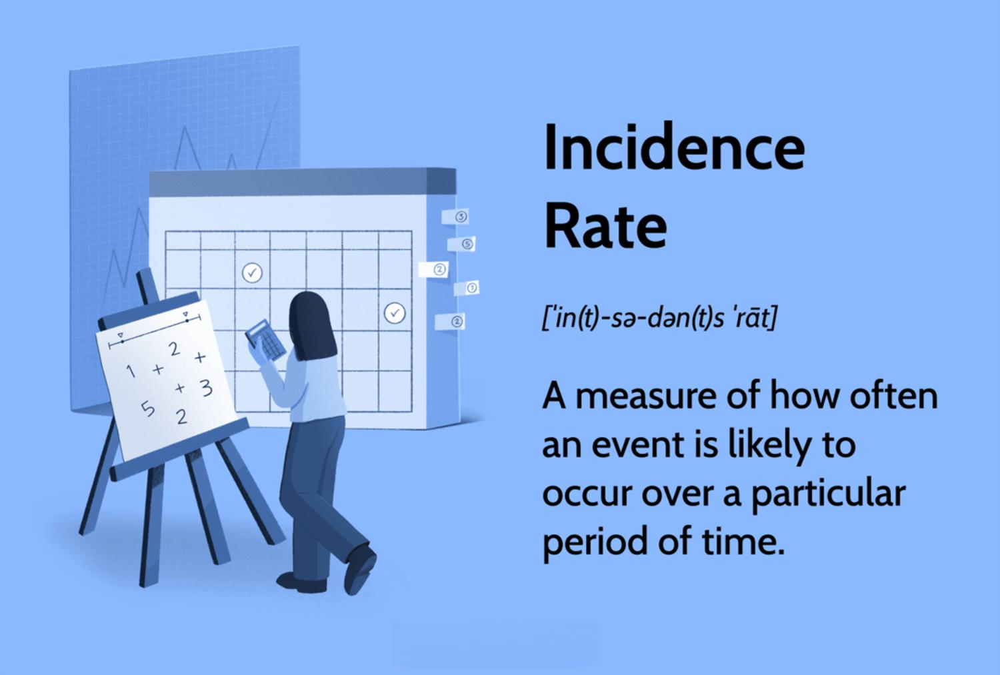

## Table of Contents

## What is the incidence rate?

The incidence rate is a measure used to understand how often a new case of a disease or condition happens in a specific group of people over a certain time period. It helps us know how quickly a disease is spreading or how many new cases are appearing. For example, if you want to know how many people are getting the flu in a city each month, the incidence rate would tell you that.

To calculate the incidence rate, you count the number of new cases of the disease during a specific time and divide it by the number of people at risk during that time. Then, you usually multiply this number by a larger figure, like 1,000 or 100,000, to make it easier to understand and compare. This way, you can see if the rate is going up or down and compare it with other places or times.

## Why is the incidence rate important in public health?

The incidence rate is important in public health because it helps us understand how fast a disease is spreading. When doctors and health officials know the incidence rate, they can see if more people are getting sick quickly or if the number of new cases is staying the same. This information is crucial for deciding if they need to take action, like starting a vaccination program or warning the public to be careful.

Knowing the incidence rate also helps public health experts compare different places or times. For example, they can see if a disease is spreading faster in one city than another, or if the number of new cases is going up or down over time. This helps them figure out where to focus their efforts and resources to stop the disease from spreading more.

## How do you calculate the incidence rate?

To calculate the incidence rate, you need to count the number of new cases of a disease that happen during a certain time. Then, you divide this number by the total number of people who could get the disease during that same time. This group of people is called the "at-risk population." For example, if you're looking at a new flu case, the at-risk population would be everyone who hasn't had the flu yet.

After you divide the number of new cases by the at-risk population, you usually multiply the result by a bigger number, like 1,000 or 100,000. This makes the number easier to understand and compare. So, if you had 50 new cases of the flu in a city of 50,000 people, you would divide 50 by 50,000 to get 0.001. Then, you would multiply 0.001 by 100,000 to get an incidence rate of 100 per 100,000 people. This means out of every 100,000 people, 100 got the flu during that time.

## What is the difference between incidence rate and prevalence?

Incidence rate and prevalence are two different ways to talk about diseases in a group of people. Incidence rate is about new cases. It tells you how many new people are getting a disease over a certain time. For example, if you want to know how many people got the flu last month in your city, you would use the incidence rate. It helps you see if a disease is spreading quickly or slowly.

Prevalence, on the other hand, is about all cases, both new and old. It tells you how many people have a disease at a specific time, no matter when they got it. For example, if you want to know how many people in your city have diabetes right now, you would use prevalence. It gives you a snapshot of how common a disease is in a group of people at one moment.

So, incidence rate focuses on new cases and how fast a disease is spreading, while prevalence looks at all cases and how common a disease is at a certain time. Both are important for understanding and managing health issues in a community.

## Can you provide a simple example of calculating incidence rate?

Imagine a small town with 1,000 people. Over the course of one month, 10 people in this town get the flu for the first time. To find the incidence rate of the flu in this town, you first count the number of new cases, which is 10. Then, you divide this number by the total number of people who could still get the flu, which is 1,000. This gives you 10 divided by 1,000, which equals 0.01.

Next, to make the number easier to understand, you multiply 0.01 by 1,000. This gives you an incidence rate of 10 per 1,000 people. So, in this town, 10 out of every 1,000 people got the flu in that month. This tells you how quickly the flu is spreading in the town.

## What are the units of measurement for incidence rate?

The units of measurement for incidence rate tell us how many new cases of a disease happen in a group of people over a certain time. The basic unit is the number of new cases divided by the number of people at risk. This gives you a rate like 0.01, which means 1 new case for every 100 people at risk.

To make this number easier to understand, we often multiply it by a bigger number like 1,000 or 100,000. So, if you multiply 0.01 by 1,000, you get an incidence rate of 10 per 1,000 people. This means out of every 1,000 people, 10 got the disease during the time you looked at. This way, you can see how quickly a disease is spreading in a way that's easy to compare with other places or times.

## How does the size of the population affect the incidence rate?

The size of the population can affect the incidence rate in a big way. When you calculate the incidence rate, you divide the number of new cases by the size of the population at risk. If the population is very large, even a small number of new cases can make the incidence rate look low. But if the population is small, just a few new cases can make the incidence rate seem much higher. So, the size of the population helps decide how the incidence rate looks.

This is important because it can change how we understand the spread of a disease. For example, if a small town has 5 new cases of a disease, the incidence rate might be high because the population is small. But if a big city has the same 5 new cases, the incidence rate would be much lower because the population is so much larger. This is why we often use bigger numbers like 1,000 or 100,000 to make the incidence rate easier to compare across different sizes of populations.

## What are common sources of data for calculating incidence rates?

Common sources of data for calculating incidence rates come from health records and surveys. Hospitals and clinics keep track of patients who come in with new cases of a disease. This information is often put into big databases where public health workers can look at it to see how many new cases there are. Doctors and nurses fill out forms when someone gets sick, and these forms help build the data that is used to calculate incidence rates.

Another source of data is from public health surveys. Governments and health organizations sometimes ask people questions about their health to find out how many new cases of a disease there are. These surveys can be done over the phone, online, or in person. The answers help create a picture of how a disease is spreading in a community. Both health records and surveys are important because they give us different ways to check the numbers and make sure they are correct.

## How can incidence rates be used to compare disease frequency across different populations?

Incidence rates help us see how fast a disease is spreading in different groups of people. When we know the incidence rate, we can compare how many new cases of a disease happen in one place to how many happen in another place. For example, if the incidence rate of the flu in one city is 50 per 100,000 people and in another city it's 100 per 100,000 people, we can see that the flu is spreading faster in the second city. This helps health workers decide where to focus their efforts to stop the disease from spreading more.

We also use incidence rates to compare different groups of people over time. If we see that the incidence rate of a disease is going up in one group but staying the same in another group, it tells us that something might be different between these groups. Maybe one group is not getting enough vaccinations or maybe there's something in the environment making the disease spread more. By looking at these rates, we can figure out where to put more resources and how to help people stay healthy.

## What are the limitations and potential biases in calculating incidence rates?

Calculating incidence rates can have some problems. One big issue is that the data might not be perfect. Sometimes, people don't go to the doctor when they get sick, so their case isn't counted. This can make the incidence rate seem lower than it really is. Also, if the people collecting the data make mistakes or if the data is old, it can mess up the numbers. Another problem is that different places might use different ways to count cases, which can make it hard to compare incidence rates between them.

Another limitation is that incidence rates can be affected by biases. For example, if a disease is more common in one group of people, like older folks, but the data only looks at younger people, the incidence rate might not show the full picture. There can also be biases in how data is collected. If surveys are only done in certain areas or if some people are more likely to answer health questions, the numbers might not be right for everyone. These biases can make it hard to get a true understanding of how a disease is spreading.

## How can incidence rates be adjusted for age or other demographic factors?

Incidence rates can be adjusted for age or other demographic factors to make sure we're comparing apples to apples. When we look at how many new cases of a disease happen, we might see different numbers in different age groups. For example, older people might get sick more often than younger people. To fix this, we can use something called age standardization. This means we take the incidence rates from different age groups and adjust them so they look like they would if everyone was the same age. This way, we can compare the rates between different places or groups more fairly.

Another way to adjust incidence rates is by looking at other demographic factors like gender, race, or income. Just like with age, these factors can change how many new cases of a disease we see. For example, if a disease is more common in men than women, we might want to adjust the rates to see what they would look like if the population had the same number of men and women. By doing this, we can get a clearer picture of how a disease is spreading across different groups of people. This helps us understand the true impact of the disease and make better decisions about how to stop it from spreading.

## Can you discuss a complex case study where incidence rate calculation was crucial for public health decision-making?

In 2003, a new disease called SARS (Severe Acute Respiratory Syndrome) started spreading in China. Health workers needed to know how fast it was spreading to decide what to do. They calculated the incidence rate to see how many new cases were happening each day. They found out that the incidence rate was very high in some places, like Hong Kong, where it was spreading quickly. This helped them understand that they needed to take strong action, like putting people in quarantine and closing schools, to stop the disease from spreading more.

The incidence rate was also important for comparing different places. For example, the rate was much lower in places like Canada compared to Hong Kong. This told health workers that the disease was not spreading as fast in Canada, but they still needed to be careful. By looking at the incidence rates, they could see where the disease was a bigger problem and where they needed to focus their efforts. This helped them make smart decisions about where to send help and how to protect people from getting sick.

## What is the Importance of Incidence Rate in Algo Trading?

Understanding incidence rates in [algorithmic trading](/wiki/algorithmic-trading) is crucial for both risk management and the optimization of trading strategies. An incidence rate provides traders with a quantitative measure of how often certain trading events occur, which in turn helps them to model the likelihood of future outcomes.

Firstly, by quantifying the probability of trading events, incidence rates allow traders to refine their strategies. For instance, if an algorithm is designed to buy a stock whenever its price drops by a specific percentage, calculating the incidence rate of such price drops helps in predicting how often such buying opportunities might arise. A high incidence rate may suggest frequent trading opportunities, while a low rate could indicate infrequent but perhaps more significant opportunities.

Furthermore, traders and investors can enhance their decision-making processes by utilizing incidence rate data. This data acts as a statistical backbone that informs more efficient trading decisions. For example, knowing the incidence rate of stop-loss triggers being activated over a certain period can signal whether current risk thresholds are set appropriately, thereby enabling traders to adjust these levels to optimize returns or minimize losses.

The formula for calculating the incidence rate in the context of trading can be expressed as:

$$

\text{Incidence Rate} = \frac{\text{Number of New Events}}{\text{Total Time or Opportunities for Events to Happen}} 
$$

In practice, this might look like a trader calculating the number of times a particular market signal is triggered divided by the number of trading sessions observed.

Efficiently implementing incidence rate analysis across varying trading scenarios necessitates a comprehensive understanding of market dynamics and a methodical approach to data analysis. By integrating these calculations with algorithmic strategies, traders are better positioned to anticipate market movements and adapt their strategies accordingly, ultimately leading to improved trading efficiency and performance.

## How do you calculate incidence rates?

The calculation of incidence rates in algorithmic trading requires dividing the number of new occurrences of a particular trading event by the population at risk during a specified period. This metric is crucial for quantifying the frequency of events like price movements or trade executions within a defined timeframe, thus offering traders a clearer understanding of market dynamics.

For instance, consider a scenario where a trader wants to determine the incidence rate of a stock's price reaching a predefined threshold. To achieve this, the trader would tally the total occurrences of the stock price hitting the threshold during the designated trading period. This count is then divided by the total number of trading days observed. This can be expressed as follows:

$$
\text{Incidence Rate} = \frac{\text{Number of occurrences of event}}{\text{Total trading days observed}}
$$

The expression of incidence rates is typically standardized per large units, such as per 100,000 trading days, to provide a broader perspective of the occurrence frequency. This normalization allows traders to compare incidence rates across different timeframes or market conditions efficiently.

In practice, calculating these rates can become more complex when dealing with large datasets or multiple trading events. Traders often employ programming languages like Python to automate these calculations, leveraging libraries such as pandas for data manipulation and analysis. Here's a simple Python example illustrating how one might calculate the incidence rate of an event using pandas:

```python
import pandas as pd

# Sample data: Date and a binary indicator for the occurrence of an event
data = {
    'Date': pd.date_range(start='2023-01-01', periods=10, freq='D'),
    'Event_Occurred': [0, 1, 0, 1, 1, 0, 1, 0, 0, 1]
}

df = pd.DataFrame(data)

# Calculate the number of occurrences
event_count = df['Event_Occurred'].sum()

# Calculate the total number of trading days observed
total_days = df.shape[0]

# Calculate incidence rate per 100 trading days
incidence_rate_per_100_days = (event_count / total_days) * 100

print(f"Incidence Rate per 100 trading days: {incidence_rate_per_100_days}")
```

This approach ensures precision and efficiency, allowing traders to focus on strategy development using informative metrics derived from incidence rates.

## What are some examples of incidence rate calculations in algo trading?

In algorithmic trading, calculating incidence rates can be crucial for understanding the frequency of specific trading events, which can inform strategic decisions. A common example is when a trading algorithm is programmed to trigger trades once a stock price exceeds specified levels, often termed "breakouts." To calculate the incidence rate of such an event over a month, a trader would count the number of [breakout](/wiki/breakout-trading) occurrences and divide it by the total trading sessions within that month. This can be mathematically expressed as:

$$
\text{Incidence Rate} = \frac{\text{Number of Breakout Events}}{\text{Total Trading Days in the Month}}
$$

For instance, if a stock hits new highs triggering the algorithm ten times in a month with 20 trading days, the incidence rate is 0.5, indicating that, on average, the algorithm triggers once every two days.

Another example involves stop-loss triggers, a safety mechanism to limit losses by selling a security once it drops to a certain price. Calculating the incidence rate of stop-loss activations within a portfolio over a quarter can provide insights into market [volatility](/wiki/volatility-trading-strategies) and the effectiveness of the set thresholds. For example, if stop-loss levels are breached 15 times over a 60-[day trading](/wiki/day-trading-spy) quarter, the incidence rate would be calculated as follows:

$$
\text{Incidence Rate} = \frac{15}{60} = 0.25
$$

This indicates that the stop-loss mechanism was activated on one out of every four trading days, prompting a reevaluation of risk management practices. These calculations are crucial for optimizing trading strategies and adjusting parameters to ensure that automated trading systems perform as expected in various market conditions.

## References & Further Reading

[1]: Bergstra, J., Bardenet, R., Bengio, Y., & Kégl, B. (2011). ["Algorithms for Hyper-Parameter Optimization."](https://dl.acm.org/doi/10.5555/2986459.2986743) Advances in Neural Information Processing Systems 24.

[2]: ["Advances in Financial Machine Learning"](https://www.amazon.com/Advances-Financial-Machine-Learning-Marcos/dp/1119482089) by Marcos Lopez de Prado

[3]: ["Evidence-Based Technical Analysis: Applying the Scientific Method and Statistical Inference to Trading Signals"](https://www.amazon.com/Evidence-Based-Technical-Analysis-Scientific-Statistical/dp/0470008741) by David Aronson

[4]: ["Machine Learning for Algorithmic Trading"](https://github.com/PacktPublishing/Machine-Learning-for-Algorithmic-Trading-Second-Edition) by Stefan Jansen

[5]: ["Quantitative Trading: How to Build Your Own Algorithmic Trading Business"](https://books.google.com/books/about/Quantitative_Trading.html?id=j70yEAAAQBAJ) by Ernest P. Chan