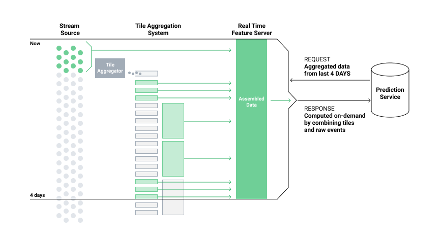

## Table of Contents

## What is an Incident Aggregation Model in machine learning?

An Incident Aggregation Model in machine learning is a system designed to collect, analyze, and group similar incidents or events into categories. This helps in understanding patterns and trends, making it easier to manage and respond to incidents effectively. For example, in cybersecurity, such a model can group various alerts into meaningful categories like phishing attempts or malware attacks, which helps security teams prioritize their responses.

These models use various machine learning techniques, such as clustering algorithms, to automatically categorize incidents based on their features. The goal is to reduce the noise from numerous individual incidents and provide a clearer picture of what is happening. By doing so, organizations can improve their incident response strategies and allocate resources more efficiently.

## Why are Incident Aggregation Models important in data analysis?

Incident Aggregation Models are important in data analysis because they help make sense of large amounts of data by grouping similar incidents together. Imagine you have thousands of alerts or events happening every day. It's hard to look at each one and decide what to do. An Incident Aggregation Model uses machine learning to find patterns and group these incidents into categories. This way, instead of dealing with each alert one by one, you can focus on the bigger picture and see what types of incidents are happening most often.

By using these models, organizations can respond to problems more quickly and effectively. For example, in a hospital, if many patients show similar symptoms, the model can group these cases together and help doctors see if there's an outbreak. This can save time and help make better decisions. Also, by understanding the patterns, companies can use their resources better and plan for the future, making sure they are ready for similar incidents that might happen again.

## What are the basic components of an Incident Aggregation Model?

The basic components of an Incident Aggregation Model include data collection, feature extraction, and a [machine learning](/wiki/machine-learning) algorithm. Data collection involves gathering all the incidents or events from various sources. This could be from logs, sensors, or user reports. Once the data is collected, feature extraction comes into play. This step involves pulling out important details from each incident, like time, location, and type of incident. These features help the model understand what's important about each event.

The machine learning algorithm is the heart of the Incident Aggregation Model. It uses the extracted features to group similar incidents together. Common algorithms include clustering methods like K-means or hierarchical clustering. These algorithms look at the features and decide which incidents are similar enough to be put in the same group. Once the incidents are grouped, the model can show patterns and trends, making it easier for people to understand what's happening and respond effectively.

In practice, an Incident Aggregation Model also needs a way to show the results to users. This could be through dashboards or reports. The model might also include feedback loops, where users can tell the model if the groupings are correct or not. This helps the model learn and get better over time. By using these components together, an Incident Aggregation Model can turn a lot of confusing data into clear, actionable information.

## How does the GRLIA model work in incident aggregation?

The GRLIA model, which stands for Graph-based Representation Learning for Incident Aggregation, uses graphs to understand and group incidents. Imagine incidents as points on a graph, and the connections between them show how similar they are. The GRLIA model looks at these connections and uses them to find patterns. It starts by turning each incident into a point on the graph, with lines connecting points that are similar. Then, it uses a special math trick called graph representation learning to figure out which points should be grouped together. This helps the model see the big picture of what's happening with all the incidents.

Once the GRLIA model has grouped the incidents, it can show these groups to people in a way that's easy to understand. For example, it might show that many incidents are happening in one part of a city or that certain types of incidents always happen together. By using graphs, the GRLIA model can find patterns that other methods might miss. This makes it really helpful for things like managing traffic, responding to emergencies, or keeping computer systems safe. The model keeps learning as it gets more data, so it gets better at grouping incidents over time.

## What types of data are typically used in Incident Aggregation Models?

Incident Aggregation Models usually use data from logs, sensors, and user reports. Logs are records of what happens in a system, like a computer or a website. They show things like errors, user actions, or system events. Sensors might be used in places like hospitals or factories to keep track of things like temperature, movement, or health signs. User reports are when people tell about something they saw or experienced, like a problem with a product or a strange event.

All this data helps the model understand what's happening. For example, in a hospital, the model might use data from patient health monitors and staff reports to group similar health issues together. In a computer system, it might use log data to find patterns in errors or security threats. By looking at all these different types of data, the model can see the big picture and help people respond to incidents better.

## What are the common challenges faced when implementing Incident Aggregation Models?

One of the main challenges when implementing Incident Aggregation Models is dealing with a lot of data. These models need to handle data from many different places, like logs, sensors, and user reports. Sometimes the data is messy or missing important details, which makes it hard for the model to group incidents correctly. Also, the data can be very big, and it takes a lot of computer power to process it all. This can slow things down and make it hard to get quick results.

Another challenge is choosing the right machine learning algorithm. Different algorithms work better for different types of data and problems. For example, some might be good at finding patterns in time, while others are better at understanding how things are connected. Picking the wrong algorithm can lead to bad groupings and make the model less useful. It's also important to keep the model learning and getting better over time, which can be tricky and needs a lot of work.

Lastly, showing the results in a way that people can understand is tough. The model might find interesting patterns, but if it can't show them clearly, it won't help much. Making good dashboards or reports takes time and skill. Also, getting feedback from users to help the model improve can be hard, especially if people don't understand what the model is doing or how to give good feedback.

## How can Incident Aggregation Models improve incident response times?

Incident Aggregation Models can improve incident response times by quickly grouping similar incidents together. Imagine you have a lot of alerts coming in all at once. It's hard to look at each one and decide what to do. But with an Incident Aggregation Model, the computer can automatically sort these alerts into groups based on what they have in common. This way, instead of dealing with each alert one by one, you can see the big picture and focus on the most important groups first. This saves time because you don't have to go through every single incident by yourself.

Also, these models can help find patterns in incidents that might not be easy to see otherwise. For example, if there are many similar incidents happening in one area, the model can show this quickly. This helps people respond faster because they know where to focus their efforts. By understanding these patterns, teams can plan better and get ready for similar incidents in the future. This means they can act more quickly and effectively when something new happens.

## What are the key performance metrics for evaluating Incident Aggregation Models?

Key performance metrics for evaluating Incident Aggregation Models include accuracy, precision, recall, and F1 score. Accuracy measures how often the model groups incidents correctly. Precision looks at how many of the incidents grouped together are actually similar, while recall checks how many similar incidents the model manages to group together. The F1 score is a way to balance precision and recall into one number, which is helpful when you want to see how well the model is doing overall. These metrics help understand if the model is good at finding patterns and grouping incidents in a useful way.

Another important metric is the time it takes for the model to process data and group incidents. This is called latency. If the model is too slow, it won't help much in real situations where quick responses are needed. Also, the model's ability to handle a lot of data, known as scalability, is key. If the model can't deal with big amounts of data, it won't be useful for large organizations. Finally, the model's ability to keep learning and getting better, or its adaptability, is crucial. This means it should improve over time as it sees more data and gets feedback from users.

## How does feature selection impact the performance of Incident Aggregation Models?

Feature selection is really important for Incident Aggregation Models because it decides which pieces of information the model will use to group incidents together. If you pick the right features, like time, location, or type of incident, the model can find patterns more easily. This makes the model better at putting similar incidents in the same group. But if you pick the wrong features, the model might get confused and group incidents in a way that doesn't make sense. So, choosing the right features helps the model work better and give more useful results.

The impact of feature selection can be seen in how well the model groups incidents. If the features are good, the model's accuracy, precision, and recall will be higher. This means the model will group incidents correctly more often and miss fewer important patterns. For example, if you're looking at traffic incidents, using features like the time of day and the type of road can help the model see that rush hour accidents are different from accidents on highways. By focusing on the right features, the model can respond faster and help people make better decisions about how to handle incidents.

## What advanced techniques can be applied to enhance the accuracy of GRLIA models?

To enhance the accuracy of GRLIA models, one advanced technique is to use more sophisticated graph embedding methods. These methods help the model understand the connections between incidents better. For example, instead of using simple graph embeddings, you can use techniques like Graph Neural Networks (GNNs) or DeepWalk. These methods learn to represent each incident in a way that captures more details about how incidents are related. By using these advanced embeddings, the GRLIA model can group incidents more accurately and find patterns that might be missed with simpler methods.

Another technique to improve GRLIA models is to incorporate domain knowledge into the model. This means using what experts know about the types of incidents to help the model group them better. For instance, if you know that certain types of incidents often happen together, you can tell the model to look for these patterns. This can be done by adding special features or by adjusting how the model weighs different connections in the graph. By combining machine learning with expert knowledge, the GRLIA model can become more accurate and useful for real-world applications.

## How do Incident Aggregation Models integrate with existing IT systems?

Incident Aggregation Models can be integrated with existing IT systems by connecting to the data sources these systems use. For example, if a company has a system that logs all network activity, the Incident Aggregation Model can be set up to pull data from these logs. This might involve setting up an API or a direct database connection to get the data in real-time. Once the data is collected, the model processes it to group similar incidents together. This integration helps the IT team see patterns and respond to incidents more quickly, without having to change their existing systems too much.

To make sure the integration works smoothly, it's important to make sure the data from the IT systems is in a format that the Incident Aggregation Model can understand. Sometimes, this means adding a step to clean or transform the data before it goes into the model. Also, the model needs to be able to send its results back to the IT systems, so people can see the grouped incidents on their usual dashboards or reports. By working together like this, the Incident Aggregation Model can help the IT team manage incidents better, without needing to replace their current tools.

## What are the future trends and developments expected in Incident Aggregation Modeling?

In the future, Incident Aggregation Models are expected to become even smarter and more useful. One big trend is the use of more advanced machine learning methods, like [deep learning](/wiki/deep-learning) and neural networks. These methods can help the models understand the data better and find patterns that are hard to see with simpler methods. Another trend is the use of real-time data. As more devices and systems connect to the internet, Incident Aggregation Models can get new data quickly and respond to incidents faster. This means the models can help people make decisions in real-time, which is really important in areas like cybersecurity or emergency response.

Another development we might see is the integration of these models with other AI technologies, like natural language processing. This could help the models understand user reports better, making them more accurate at grouping incidents. Also, as these models get better at learning from data, they will become more personalized. This means they can be adjusted to fit the specific needs of different organizations or industries. By using these advanced techniques and working with other technologies, Incident Aggregation Models will become a key tool for managing and responding to incidents in the future.

## References & Further Reading

[1]: Aggarwal, C. C., & Reddy, C. K. (2013). ["Data Clustering: Algorithms and Applications."](https://www.researchgate.net/publication/331534089_DATA_CLUSTERING_Algorithms_and_Applications) CRC Press.

[2]: Leskovec, J., Rajaraman, A., & Ullman, J. D. (2020). ["Mining of Massive Datasets."](http://infolab.stanford.edu/~ullman/mmds/book.pdf) Cambridge University Press.

[3]: Fortunato, S. (2010). ["Community detection in graphs."](https://arxiv.org/abs/0906.0612) Physics Reports, 486(3-5), 75-174.

[4]: Goodfellow, I., Bengio, Y., & Courville, A. (2016). ["Deep Learning."](https://www.deeplearningbook.org/) MIT Press.

[5]: Wu, Z., Pan, S., Chen, F., Long, G., Zhang, C., & Yu, P. S. (2020). ["A Comprehensive Survey on Graph Neural Networks."](https://arxiv.org/abs/1901.00596) IEEE Transactions on Neural Networks and Learning Systems.