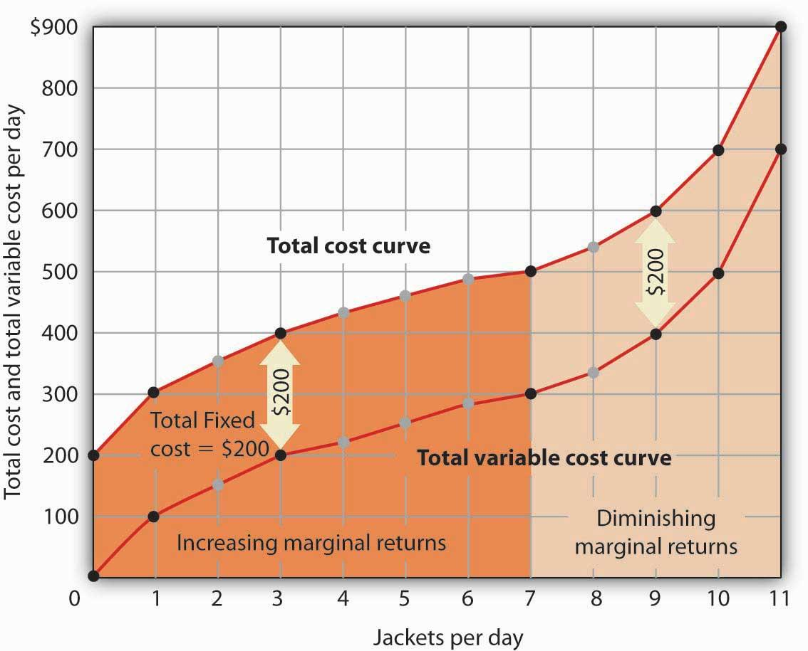

In the fast-paced world of algorithmic trading, understanding cost structures is essential for profitability. Algorithmic trading integrates complex mathematical models and speedy computations to execute trades within milliseconds. In this context, the interplay of variable, fixed, and production costs significantly affects trading strategies. Fixed costs, such as software licenses and infrastructure expenses, do not fluctuate with trading volume, providing a stable baseline for financial planning. Variable costs, including transaction fees and brokerage commissions, directly correlate with trading activity and require careful management to avoid erosion of profits. Production costs encompass a broader spectrum, combining both fixed and variable costs associated with creating the trading algorithms and maintaining the requisite systems.

This article aims to elucidate these cost components and their impacts on algorithmic trading operations. Successful traders must keenly analyze these expenses, developing strategies that optimize trading efficiency and enhance returns. By effectively managing these costs, traders can bolster their competitive edge, adapting swiftly to the ever-changing financial markets. Understanding these foundational elements is critical, not just for sustaining profitability, but for thriving in the dynamic landscape of algorithmic trading.



## Table of Contents

## Understanding Production Costs

Production costs encompass all expenses associated with producing goods and services, categorized into fixed and variable costs. Fixed costs are expenditures that remain constant regardless of the production output, including items like rent, insurance, and salaried wages. These costs are unavoidable and do not fluctuate with the level of production, providing predictability in budgeting. For instance, whether a factory produces 10 or 10,000 units, the rent for the facility will remain unchanged.

On the other hand, variable costs fluctuate in direct proportion to production levels. They include costs like raw materials, direct labor tied to production hours, and utilities used in the manufacturing process. Variable costs are often expressed on a per-unit basis, which allows businesses to calculate the total variable cost by multiplying the cost per unit by the number of units produced. For example, if the cost to produce one unit is $5 in variable costs, producing 1,000 units would result in $5,000 of total variable costs.

Understanding the distinction between fixed and variable costs is crucial for businesses as it aids in establishing appropriate pricing strategies and managing profitability. By analyzing these costs, businesses can determine the breakeven point — the production level at which total revenues equal total costs. The formula for the breakeven point in units is given by:

$$
\text{Breakeven Point (units)} = \frac{\text{Total Fixed Costs}}{\text{Price per Unit} - \text{Variable Cost per Unit}}
$$

This analysis helps businesses set prices that cover costs and contribute to profits, enabling informed strategic decisions. Additionally, it aids in identifying efficiency improvements and optimizing operational budgeting. Understanding production costs and their implications on pricing strategies is a fundamental aspect of maintaining competitiveness and ensuring long-term profitability.

## Fixed Costs in Algorithmic Trading

Fixed costs in [algorithmic trading](/wiki/algorithmic-trading) are financial obligations that remain constant regardless of the trading [volume](/wiki/volume-trading-strategy) or frequency. These costs are an integral part of any trading operation and include essential services such as software subscriptions, data feed services, and hardware maintenance.

Software subscriptions often cover trading platforms and analysis tools crucial for algorithm development and [backtesting](/wiki/backtesting). These platforms require periodic payments, usually on a monthly or annual basis, and provide essential features that facilitate the trading process, such as real-time data analysis and order execution capabilities. Data feed services offer the constant stream of market data necessary for making informed trading decisions. These services ensure that trading algorithms have access to up-to-date and accurate market information, which is vital for the execution of trading strategies. Hardware maintenance pertains to the upkeep of physical trading infrastructure, such as servers and networking equipment, which supports the execution and monitoring of trades.

To manage these fixed costs effectively, traders need a well-defined financial plan that anticipates these expenses. Having a predictable and stable cost structure allows traders to focus on their strategies without the distractions of fluctuating expenses. This stability is vital for maintaining consistent trading operations and for ensuring the overall viability of long-term trading strategies. Without effective management of these costs, the financial sustainability of an algorithmic trading operation could be compromised, potentially impacting profitability.

In summary, managing fixed costs is a critical component of maintaining and improving profitability in algorithmic trading. By understanding and planning for these expenses, traders can ensure that their operations remain efficient and focused on generating returns without unexpected financial disruptions.

## Variable Costs in Algorithmic Trading

Variable costs in algorithmic trading are expenses that fluctuate in direct correlation with trading activity levels. These costs can be significant and unpredictable, impacting the overall profitability of trading strategies. Some primary components of variable costs include transaction fees, brokerage commissions, and regulatory charges.

Transaction fees are incurred every time a trade is executed. These fees vary depending on the volume and frequency of trades, as well as the specific financial instruments being traded. For instance, trading stocks might incur different transaction fees compared to futures or options. The formula for a simple calculation of transaction costs can be represented as:

$$
\text{Transaction Cost} = \text{Number of Trades} \times \text{Cost per Trade}
$$

Brokerage commissions form another substantial part of variable costs. These are the fees charged by a brokerage firm for executing trades on behalf of clients. The commission structure can be fixed per trade or a percentage of the trade’s value. Choosing a brokerage with competitive rates is crucial for traders looking to minimize these expenses.

Regulatory charges are mandatory fees imposed by financial authorities to maintain market integrity and compliance. These charges can include a variety of trading-related taxes and levies. They fluctuate based on the legislative requirements in each jurisdiction.

Effective management of variable costs is essential for boosting trade profitability. Traders implement several strategies to minimize these costs. One approach is optimizing trade frequency and volume; by analyzing the trade-to-cost ratio, traders can determine the most profitable trading intervals. The use of technology, such as algorithmic adjustments that target low-cost trading windows, is another method to reduce variable expenditures.

Furthermore, adopting cost-efficient trading practices, such as reducing unnecessary trades and employing advanced data analytics to inform decision-making, can help in curtailing variable costs. Algorithmic traders often rely on these methods to ensure their strategies remain financially viable and competitive in the constantly evolving trading environment.

## Cost Comparisons: Fixed vs. Variable Costs

Differentiating between fixed and variable costs is crucial for forming effective algorithmic trading strategies. Fixed costs, such as costs for software subscriptions and data feeds, provide a stable financial foundation as these expenses do not fluctuate with changes in trading activity. This stability allows traders to plan long-term strategies without the immediate pressures to adjust their operations based on short-term performance metrics.

In contrast, variable costs, including transaction fees and brokerage commissions, fluctuate with trading volume. While they offer flexibility, these costs necessitate vigilant management to ensure that they do not erode trading profits. For instance, higher trading volumes can drive up variable costs, but potentially spread these costs over a larger number of trades if managed properly. The ability to predict and control these expenses can markedly influence a trader’s bottom line.

Analyzing both fixed and variable costs aids traders in aligning trading volumes with profitability objectives. A clear understanding allows for informed decisions about scaling operations and adjusting trade frequencies. Spreadsheet modeling and other analytical tools can be employed to simulate various trading scenarios, offering insights into how different cost structures impact overall profitability. For example, traders can use the following Python sample code to assess cost impacts:

```python
def calculate_total_costs(fixed_costs, variable_cost_per_trade, num_trades):
    return fixed_costs + (variable_cost_per_trade * num_trades)

fixed_costs = 1000  # Example fixed costs in USD
variable_cost_per_trade = 2  # Example variable cost per trade in USD
num_trades = 500  # Number of trades

total_costs = calculate_total_costs(fixed_costs, variable_cost_per_trade, num_trades)
print(f"Total trading costs: ${total_costs}")
```

This function allows traders to evaluate how different scenarios impact their cost structures, facilitating strategic adjustments. By incorporating robust tools and techniques, traders can effectively navigate the challenges and opportunities presented by the interplay of fixed and variable costs, thus steering their operations towards heightened efficiency and better profitability.

## Strategies for Cost Optimization in Algorithmic Trading

Efficient cost management in algorithmic trading is crucial for maintaining a competitive advantage and maximizing profitability. By strategically leveraging technology and automation, traders can effectively reduce both fixed and variable costs, thereby optimizing their operations.

Automation, through algorithm implementation, reduces human intervention, lowering the risk of errors and the need for extensive personnel resources. For instance, automation can minimize transaction costs by optimizing order execution, thus improving the cost-effectiveness of trades. Moreover, using algorithms for transaction cost analysis (TCA) enables traders to measure and mitigate the costs associated with market impact and slippage.

Investing in cloud computing and scalable data solutions offers significant opportunities for resource optimization. Cloud platforms provide on-demand computational power and storage, allowing traders to efficiently scale operations without substantial upfront infrastructure costs. This scalability is particularly beneficial for backtesting trading strategies across vast historical data sets. By utilizing cloud resources, firms can adapt to varying workloads and only pay for the resources they utilize, effectively transforming fixed costs into variable ones.

Cost optimization also involves strategic data management. Leveraging real-time data analytics allows traders to make informed decisions swiftly, improving trading strategies and reducing unnecessary expenditures. Additionally, advanced data compression techniques can decrease data storage costs while ensuring high-speed access to essential information.

Adaptation to market fluctuations is essential for sustainability and growth in trading. Employing sophisticated risk management algorithms can dynamically adjust trading positions in response to market changes, mitigating potential losses and preserving capital. This adaptability helps firms navigate volatile conditions while maintaining a robust financial posture.

For comprehensive cost management, firms should deploy analytical tools and models that provide insights into cost structures. For example, spreadsheet modeling can help evaluate the impact of different cost components on overall profitability. By continuously analyzing cost metrics, traders can identify inefficiencies and implement targeted improvements. 

In summary, by embracing technological advancements and adopting strategic cost management practices, firms in algorithmic trading can significantly enhance profitability and sustain a competitive edge in a rapidly evolving market landscape.

## Conclusion

The intricate balance between variable and fixed costs is central to the success of algorithmic trading strategies. Understanding these cost structures is critical for enhancing operational efficiency and ensuring profitability. Fixed costs, such as software subscriptions and data feed services, provide a consistent operational baseline that necessitates careful planning and financial stability. Meanwhile, variable costs, including transaction fees and brokerage commissions, directly correlate with trading activities and demand strategic management to avoid compromising profitability.

Traders are advised to continuously analyze their cost structures, as this practice helps identify optimization opportunities that can lead to improved financial outcomes. This constant evaluation is crucial for adjusting cost strategies in response to fluctuating market conditions and trading volumes. By doing so, traders can better align their financial objectives with operational capabilities, ensuring that costs do not erode profit margins.

Staying informed about industry trends and technological advancements is equally important for sustained success. Innovations in algorithmic trading, such as enhanced data analysis tools and cloud-based computing solutions, can offer new avenues for cost reduction and efficiency improvements. Embracing these advancements enables traders to maintain a competitive edge by optimizing resources and adapting to the dynamic nature of financial markets.

In conclusion, a well-rounded comprehension and management of both fixed and variable costs form the groundwork of robust trading strategies. By adopting a proactive approach in cost analysis and staying attuned to industry developments, traders can enhance their operational efficiency and secure long-term profitability.

## References & Further Reading

Investopedia offers a comprehensive overview of production costs, breaking them down into fixed and variable categories. Fixed costs, such as rent and insurance, do not change regardless of the production volume. Conversely, variable costs fluctuate with output levels and typically include materials and labor expenses. Understanding these cost structures is crucial for setting effective pricing strategies and ensuring business profitability.

“Advances in Financial Machine Learning” by Marcos Lopez de Prado provides valuable insights into managing costs within algorithmic trading. The book emphasizes the importance of machine learning techniques in optimizing trading strategies and highlights cost management as a critical component for enhancing trading performance. By employing advanced data analysis and predictive modeling, traders can efficiently handle transactions and operational costs, leading to better financial outcomes.

Ernest P. Chan's book, “Quantitative Trading: How to Build Your Own Algorithmic Trading Business,” explores practical strategies for optimizing trading operations. It covers the foundational aspects of establishing an algorithmic trading business, focusing on cost management techniques that can lead to improved profitability. Chan's insights guide traders in navigating various trading challenges, including the careful management of both fixed and variable costs, to build a sustainable and profitable trading enterprise.