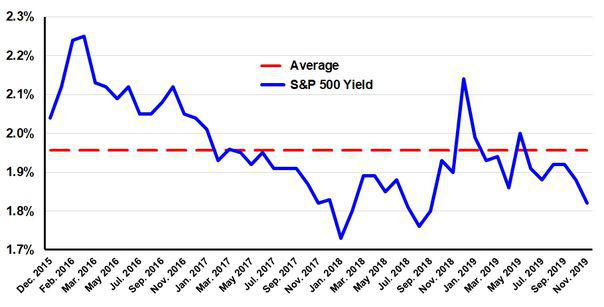

In the rapidly evolving world of finance, investors are continually seeking innovative strategies to maximize their returns. One strategy that has gained significant attention is algorithmic trading, particularly when applied to dividend stock indices like the S&P 500. Dividend stocks represent shares in companies that consistently pay dividends to shareholders, offering both a source of regular income and potential for capital appreciation. The S&P 500 index, a market-capitalization-weighted index, consists of 500 of the largest publicly traded companies in the United States and is widely regarded as a benchmark for the overall stock market. 

Combining dividend stock investments with algorithmic trading strategies can enhance portfolio performance in several ways. Algorithmic trading involves using computer algorithms to automatically execute trades based on pre-defined criteria, such as price, timing, and volume. This allows for increased precision, speed, and the ability to capitalize on market inefficiencies. In the context of dividend stocks, algorithmic trading can be used to optimize trading strategies around dividend announcement dates, thus capturing dividend payments efficiently.



The integration of algorithmic trading with dividend stock investments also brings forth significant benefits and potential pitfalls. For instance, the automated nature of algorithmic trading reduces human errors and biases associated with decision-making. It also facilitates back-testing of strategies and diversification across global markets. However, the complexities of developing robust algorithms that adapt to market changes present a notable challenge. Furthermore, technological failures and flash crashes highlight the need for robust risk management practices.

As we explore these critical aspects, the role of the S&P 500 index in shaping dividend stock trading strategies deserves attention. This index not only influences the selection of dividend stocks but also serves as a foundation for constructing algorithmic trading strategies aimed at optimizing returns. Understanding this synergy between dividend stock investing and algorithmic trading could potentially redefine investment approaches, creating avenues for more consistent returns and optimized portfolio performance.

## Table of Contents

## Understanding Dividend Stocks and the S&P 500 Index

Dividend stocks are a popular investment choice for those looking for both steady income and potential capital gains. These stocks, issued by companies opting to distribute a portion of their earnings to shareholders, provide regular dividends. This income can come in varying forms such as cash payments or additional shares. The allure of dividend stocks lies not only in their ability to yield consistent returns but also in their potential to appreciate in value over time, thus offering a dual advantage to investors.

A crucial platform for dividend stock trading is the S&P 500, which is a market-capitalization-weighted index comprising 500 of the largest publicly traded companies in the United States. This index serves as a benchmark for the US stock market and is often used by investors to gauge the performance of their portfolios. Within the S&P 500, many companies have long histories of paying dividends, making them attractive options for investors aiming for income stability and growth. By investing in dividend-paying stocks within this index, investors can benefit from a combination of established corporate credibility and the potential for stock value appreciation.

The composition and structure of the S&P 500 facilitates a balance of stability and growth. Companies included in the index are leaders in their industries, often with vast resources and established market positions. As such, investing in dividend stocks within the S&P 500 can provide investors with the confidence that comes with investing in well-capitalized firms while also gaining the regular income that dividends offer. Moreover, income-focused investors find dividends particularly appealing as they provide a relatively predictable revenue stream, regardless of market conditions.

Examining the historical performance of dividend stocks in the S&P 500 reveals notable trends that have reinforced their reputation as reliable investment vehicles. Historically, stocks with a strong track record of paying dividends have generally exhibited lower [volatility](/wiki/volatility-trading-strategies) compared to non-dividend-paying stocks. During periods of market downturns, dividend stocks have often demonstrated resilience due to their established nature and the continuous demand for dividend income. This stability is critical for investors seeking to preserve capital while [earning](/wiki/earning-announcement) returns.

Furthermore, the S&P 500's impact on the stock market is significant, with fluctuations in the index serving as a proxy for market trends. Movements in the S&P 500 often influence investor confidence and sentiment, impacting investment strategies broadly. For dividend stock investors, tracking the S&P 500 can provide insights into broader economic conditions and help inform decisions regarding the timing and selection of investments within the index. Additionally, the diversification inherent in the S&P 500, across various sectors, can mitigate risks associated with individual stock performance, thus enhancing the stability of a dividend-focused portfolio.

In summary, understanding how dividend stocks operate within the framework of the S&P 500 gives investors valuable insight into crafting their investment strategies. By leveraging the stability and growth potential offered by these stocks, investors can optimize their portfolios for income generation and long-term capital appreciation.

## The Rise of Algorithmic Trading in Stock Markets

Algorithmic trading, often referred to as algo trading, utilizes computer algorithms to automatically conduct trades based on predefined parameters, such as price, timing, and [volume](/wiki/volume-trading-strategy). The system's core relies on the precise instructions embedded within the code, which dictate market entry or [exit](/wiki/exit-strategy) strategies aimed at leveraging market conditions quickly and efficiently.

In recent years, [algorithmic trading](/wiki/algorithmic-trading) has transformed the financial industry by facilitating higher-speed transactions and minimizing human error. Traditional trading, hampered by slower execution speeds and emotional biases, has increasingly given way to algorithm-driven models, especially as technological infrastructure has advanced. Within milliseconds, algorithms can initiate and complete trades that might take humans significantly longer, a vital advantage in rapidly fluctuating markets.

At its foundation, algorithmic trading encompasses a few crucial principles:

1. **Speed and Precision**: Algorithms can be executed in less than a second, allowing traders to capture momentary market inefficiencies.

2. **Accuracy**: By relying on a set of coded instructions, algorithms reduce the risk of human error prevalent in manual trading.

3. **Backtesting**: Before execution, algorithms can be tested on historical data to predict potential effectiveness, offering traders a level of foresight not easily available through traditional trading methods.

Various types of algorithms cater to different trading strategies. Market-making algorithms focus on providing [liquidity](/wiki/liquidity-risk-premium) by offering to buy and sell activity around a stock’s bid-ask spread. Meanwhile, [arbitrage](/wiki/arbitrage) strategies exploit price discrepancies across different markets or instruments to generate profit. Momentum trading systems capitalize on market trends, riding stock movements until a reversal occurs.

The prominence of algo trading among dividend stock traders is rising due to several factors. Algorithms provide tools to effectively manage and optimize around dividend events that can affect stock prices. For instance, an algorithm can be designed to recognize and act upon changes in a company’s financial health, predicting dividend announcements or cuts, and adjusting trading strategies accordingly. This advantage helps traders maximize returns by not only focusing on price movements but also incorporating dividend data into trading decisions. 

Furthermore, the appeal of algo trading lies in its potential to enhance portfolio performance. Dividend-focused traders often use algorithms to achieve an ideal balance between income generation and capital growth. The automatic execution of strategies considering dividend reinvestment allows for the compounding of returns, thus aligning well with long-term wealth accumulation goals.

In summary, algorithmic trading has risen as an indispensable tool for contemporary traders, especially within the sphere of dividend stocks. By harnessing speed, precision, and the ability to process vast quantities of data, algorithmic trading opens doors to new levels of trading opportunities and portfolio management that were previously unattainable through conventional means.

## Benefits of Algo Trading for Dividend Stock Portfolios

Integrating algorithmic trading with dividend stock portfolios can offer several advantages to investors, beginning with quick decision-making capabilities that reduce human errors and emotional biases. By automating the trading process, algorithms can execute trades at speeds that surpass human capabilities, ensuring that orders are filled at optima market conditions. This capability is crucial in dividend stock trading, where timing can significantly impact the collection of dividend income and capital gains.

One of the key benefits of algorithmic trading is improved market liquidity. Automated trading strategies increase the number of participants in the market, thus enhancing liquidity and making it easier to buy and sell assets quickly without causing significant price changes. This is particularly beneficial for investors in dividend stocks, which may not always exhibit the same liquidity as more volatile [growth stocks](/wiki/growth-stocks).

Algorithmic trading facilitates the back-testing of strategies using historical data. Investors can simulate trades using past market data to evaluate how their trading strategies might perform in different market conditions. This ability is invaluable for dividend stock portfolios, where consistent assessment can help optimize strategies around dividend announcement dates to capture potential stock price changes or arbitrage opportunities. For example, an algorithm could be designed to identify patterns or trends when companies traditionally increase dividends, allowing pre-emptive positioning.

Moreover, algorithmic trading enables diversification across global markets, reducing portfolio risk. Through the use of sophisticated algorithms, investors can manage multiple dividend stock positions across different countries and time zones, optimizing dividend capture and balancing risks across various economic regions.

Algorithms can also be specifically tailored to capture dividend payments efficiently. By focusing trading activities around ex-dividend dates and factoring in specific dividend yields and payout histories, traders can potentially enhance returns. Algorithms may be designed to evaluate the expected impact of dividend announcements on stock prices, allowing investors to adjust their portfolios proactively.

In summary, the benefits of integrating algorithmic trading into dividend stock portfolios are multifaceted, supporting market liquidity, improving strategy validation through back-testing, enabling diversification, and optimizing dividend capturing mechanisms. These advantages can lead to enhanced portfolio performance and more consistent returns, offering investors a robust tool for navigating the complexities of dividend stock markets.

## Challenges and Risks of Algorithmic Trading with Dividend Stocks

Algorithmic trading, while offering numerous advantages, presents various risks and challenges that investors must recognize, especially when applied to dividend stocks. One of the primary concerns is technological failure. This can arise from hardware or software malfunctions, leading to unintended trades or, in some cases, significant financial losses. The reliability of the technology infrastructure used in algorithmic trading is crucial. Computational errors or delays due to server failures can distort the execution of trading strategies.

Flash crashes represent another significant risk associated with algorithmic trading. These occur when automated trading programs execute large volumes of trades in a very short period, leading to rapid price declines and market disruptions. Flash crashes highlight the vulnerabilities introduced by high-frequency trading systems, which are often utilized in algorithmic strategies.

Developing effective trading algorithms is inherently complex. These algorithms must be continuously refined to adapt to changing market conditions, which involves a deep understanding of both market trends and the mathematical models that underpin the algorithms. This complexity often demands significant expertise and resources, which can be a barrier for individual investors or smaller institutions.

The regulatory environment further complicates algorithmic trading strategies. Regulatory bodies, such as the Securities and Exchange Commission (SEC) in the United States, impose rules to ensure market stability and protect investors. These regulations can impact how algorithms are designed and implemented. For instance, restrictions on trading volumes or timing could affect the performance of algorithms tailored for dividend stock trading, which may rely on specific market behaviors to optimize returns.

Market conditions themselves can rapidly change due to economic news, geopolitical events, or natural disasters, which can skew expected outcomes from algorithmic strategies. Trading algorithms must incorporate flexible models capable of responding to unforeseen shifts in the market, necessitating continuous algorithmic adjustments.

Risk management is paramount in mitigating the challenges of algorithmic trading. This involves implementing strategies to hedge against potential losses and establishing protocols to halt trading when systems detect anomalies, such as a sudden drop in stock prices potentially indicative of a flash crash. Moreover, employing [machine learning](/wiki/machine-learning) techniques could enhance algorithms' ability to predict and adapt to market changes dynamically.

Understanding and addressing these challenges is crucial for investors engaging in algorithmic trading with dividend stocks. By proactively managing technological, market, and regulatory risks, traders can optimize their strategies and enhance the resilience of their investment portfolios.

## Strategies for Successful Algo Trading in Dividend Stocks

Implementing successful algorithmic trading strategies in dividend stocks requires a thorough understanding of market dynamics and the specific characteristics of dividend-yielding equities. Dividend stocks, often sought for their stability and income generation, provide unique opportunities for algorithmic trading by exploiting predictable price movements around dividend events.

One practical approach is the mean reversion strategy. This strategy exploits the tendency of stock prices to revert to their historical mean after deviating from it. Dividend stocks, particularly those in the S&P 500, often experience price fluctuations around dividend declaration dates due to changes in investor sentiment and expectations. By identifying these deviations using historical price data and statistical analysis, algorithms can be programmed to execute buy or sell orders when prices exceed predetermined thresholds, anticipating a reversion to the average. This strategy can be enhanced using statistical models such as the Ornstein-Uhlenbeck process, which is well-suited for modeling mean-reverting behavior:

$$
dX_t = \theta (\mu - X_t) dt + \sigma dW_t
$$

where $X_t$ is the stock price at time $t$, $\theta$ represents the speed of reversion, $\mu$ is the long-term mean, $\sigma$ is the volatility, and $W_t$ is a Wiener process.

Trend-following strategies are another effective approach, leveraging the [momentum](/wiki/momentum) that can occur after dividend announcements and other corporate events. These strategies involve algorithms that identify and follow the direction of price trends over specified periods. By utilizing moving averages, such as Exponential Moving Averages (EMAs), algorithms can detect upward or downward patterns, allowing traders to capitalize on sustained movements. A moving average crossover strategy, where short-term moving averages cross above long-term averages, signals potential buy opportunities, while the reverse indicates sell signals.

Seasonal patterns exploitation is particularly relevant in dividend stock trading. Dividend declarations often follow predictable annual cycles, creating anticipated patterns in trading volume and price movements. Algorithms can be programmed to recognize and exploit these recurring opportunities. Implementing seasonal indicators can provide additional insights into expected stock behavior during these periods.

Developing and testing algorithmic trading strategies require robust back-testing frameworks to ensure the strategies perform well under varying market conditions. Back-testing involves simulating the strategy against historical data to evaluate its performance by considering transaction costs, slippage, and market impact. Python, with its extensive libraries such as Pandas, NumPy, and Backtrader, is often used to construct and evaluate these algorithms. Below is a simple Python snippet to illustrate the back-testing process using a mean reversion strategy:

```python
import pandas as pd
import numpy as np
import backtrader as bt

class MeanReversion(bt.Strategy):
    params = (('window', 20), ('threshold', 1.5),)

    def __init__(self):
        self.dataclose = self.datas[0].close
        self.sma = bt.indicators.MovingAverageSimple(self.datas[0], period=self.params.window)
        self.bbands = bt.indicators.BollingerBands(self.datas[0], period=self.params.window)

    def next(self):
        if self.dataclose < self.bbands.lines.bot and self.dataclose.mean() < self.params.threshold:
            self.buy()
        elif self.dataclose > self.bbands.lines.top:
            self.sell()

data = bt.feeds.YahooFinanceData(dataname='AAPL', fromdate=pd.Timestamp('2020-01-01'), todate=pd.Timestamp('2021-01-01'))
cerebro = bt.Cerebro()
cerebro.adddata(data)
cerebro.addstrategy(MeanReversion)
cerebro.run()
```

Incorporating machine learning techniques can significantly enhance predictive analysis and trend forecasting in dividend stock algorithmic trading. Machine learning models, such as regression analysis, decision trees, and neural networks, can be trained on historical price and dividend data to predict future stock movements. By identifying complex patterns and correlations that are not immediately apparent through traditional analysis, these models can improve the accuracy of trading algorithms.

In summary, implementing effective algorithmic trading strategies for dividend stocks involves utilizing mean reversion, trend-following, and seasonality, supported by rigorous back-testing and machine learning techniques. By integrating these strategies, investors can better navigate the complexities of dividend stock trading and potentially achieve superior returns.

## Conclusion: Future Outlook and Opportunities

As technology continues to transform financial markets, algorithmic trading, especially when applied to dividend stocks, shows significant promise. The dynamic combination of algorithmic trading strategies with dividend stock investments has the potential to redefine traditional investment approaches and introduce innovative practices for optimizing returns.

Artificial intelligence (AI) is poised to become a substantial force in future algorithmic trading strategies. AI can enhance the sophistication and predictive power of trading algorithms, enabling them to process vast datasets and identify complex patterns that human analysts might overlook. This capability is particularly relevant for dividend stocks, where predicting future dividend payouts and understanding market sentiment around dividend announcements can lead to informed trading decisions. Machine learning models, such as neural networks, can be employed to anticipate stock price movements based on historical data, offering a strategic edge to investors aiming to maximize dividend yield.

Another emerging trend is the increasing importance of sustainable dividends. As investors grow more environmentally and socially conscious, there is a shift towards companies that not only promise regular dividend payments but also adhere to sustainable practices. Algorithmic trading systems can be programmed to prioritize stocks meeting specific Environmental, Social, and Governance ([ESG](/wiki/esg-investing)) criteria, aligning investment objectives with broader ethical considerations. By incorporating ESG data into algorithms, traders can capitalize on the growing preference for sustainable investments and potentially benefit from favorable market responses to companies deemed socially responsible.

The integration of these advanced technologies represents a model shift in how investors approach dividend stocks. As algorithms become more adept at handling real-time data and complex financial scenarios, traders can anticipate a future where investment strategies are increasingly data-driven. This transition may unlock new avenues for achieving steady growth and mitigating risks associated with market volatility.

For investors navigating this evolving landscape, the strategies and insights discussed in the earlier sections of this article provide a foundation for building robust, algorithmically-enhanced portfolios. From understanding the nuances of dividend stocks to leveraging the speed and accuracy of algorithmic trading, this knowledge equips investors to make informed decisions in a rapidly advancing field.

The digital transformation of trading is set to continue, with opportunities expanding as technology evolves. By embracing these innovations, investors can potentially enhance their investment strategies, paving the way for diversified and resilient portfolio performance in the years to come.

## References & Further Reading

[1]: Bergstra, J., Bardenet, R., Bengio, Y., & Kégl, B. (2011). ["Algorithms for Hyper-Parameter Optimization."](https://papers.nips.cc/paper/4443-algorithms-for-hyper-parameter-optimization) Advances in Neural Information Processing Systems 24.

[2]: ["Advances in Financial Machine Learning"](https://www.amazon.com/Advances-Financial-Machine-Learning-Marcos/dp/1119482089) by Marcos Lopez de Prado

[3]: ["Evidence-Based Technical Analysis: Applying the Scientific Method and Statistical Inference to Trading Signals"](https://www.amazon.com/Evidence-Based-Technical-Analysis-Scientific-Statistical/dp/0470008741) by David Aronson

[4]: ["Machine Learning for Algorithmic Trading"](https://github.com/stefan-jansen/machine-learning-for-trading) by Stefan Jansen

[5]: ["Quantitative Trading: How to Build Your Own Algorithmic Trading Business"](https://www.amazon.com/Quantitative-Trading-Build-Algorithmic-Business/dp/0470284889) by Ernest P. Chan