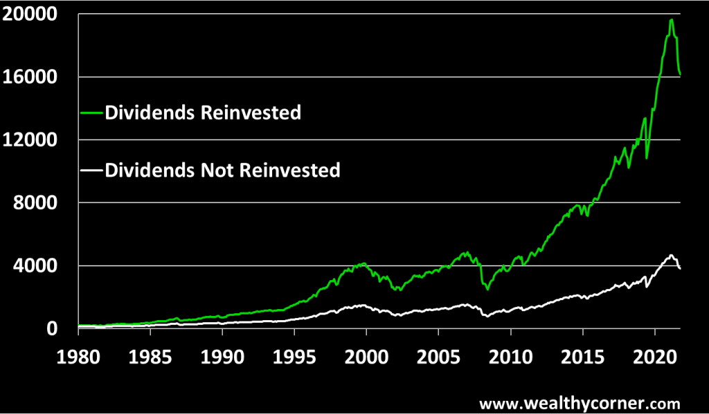

## Table of Contents

## What is the S&P 500 Index?

The S&P 500 Index is a stock market index that measures the performance of 500 large companies in the United States. It is often used as a way to see how the overall stock market is doing. The companies in the S&P 500 are chosen by a company called Standard & Poor's, and they come from many different industries, like technology, healthcare, and finance. This makes the S&P 500 a good way to get a broad view of the U.S. economy.

People who want to invest in the stock market often use the S&P 500 as a benchmark. This means they compare their own investments to how the S&P 500 is doing. If their investments are doing better than the S&P 500, they are happy. If their investments are doing worse, they might want to change their strategy. Many people also invest in funds that try to match the performance of the S&P 500, which is a simple way to invest in a big part of the U.S. economy.

## What are dividends and why are they important?

Dividends are payments that companies give to their shareholders, usually from the company's profits. When you own a stock, you might get a dividend every few months or once a year. It's like getting a little reward for owning part of the company. Not all companies pay dividends, though. Some companies, especially newer ones, might use their profits to grow the business instead of paying dividends.

Dividends are important for a few reasons. First, they can give you extra money without having to sell your stocks. This can be really helpful if you're saving for something or need income. Second, dividends can show that a company is doing well and making money. If a company keeps paying dividends, it might mean they are stable and successful. This can make investors feel more confident about the company.

## How are dividends typically paid out to shareholders?

Dividends are usually paid out to shareholders in one of two ways: by check or by direct deposit into their bank account. If a company decides to pay a dividend, they will announce the amount and the date it will be paid. Shareholders who own the stock on a certain date, called the record date, will get the dividend. After the record date, the company will send out the payments on the payment date.

Sometimes, companies offer a choice called a dividend reinvestment plan, or DRIP. With a DRIP, instead of getting cash, shareholders can choose to use their dividend to buy more shares of the company's stock. This can be a good way to grow your investment over time without having to spend more money. It's like using your dividend to buy more of the company, which might lead to even bigger dividends in the future.

## Are dividends included in the S&P 500 Index's performance?

The S&P 500 Index measures the stock prices of 500 big companies in the U.S. When you look at the S&P 500's performance, it shows how the prices of these stocks have changed over time. The index does not include the dividends that these companies pay out to their shareholders. So, if you just look at the S&P 500's performance, you're only seeing the change in stock prices, not the extra money from dividends.

However, there is another way to measure the S&P 500's performance that does include dividends. It's called the total return of the S&P 500. The total return adds up the change in stock prices plus all the dividends paid out. This gives you a fuller picture of how much money you could have made from investing in the S&P 500, including both the growth in stock value and the income from dividends.

## How does the inclusion of dividends affect the total return of the S&P 500?

Including dividends in the total return of the S&P 500 makes a big difference. When you only look at the price changes of the stocks in the S&P 500, you miss out on the extra money that comes from dividends. Over time, these dividends can add up to a lot of money. For example, if you had invested in the S&P 500 a long time ago, the dividends you received would have made your investment grow even more than just the rise in stock prices.

The total return of the S&P 500, which includes both the price changes and the dividends, gives you a better idea of how well the index has done. It shows you the full picture of what you could have earned from your investment. This is important because many people invest in the S&P 500 not just to see their stocks go up in value, but also to get regular income from dividends. So, when you look at the total return, you see how powerful dividends can be in growing your money over the long term.

## What is the difference between price return and total return for the S&P 500?

The price return of the S&P 500 looks only at how the prices of the stocks in the index go up or down. It's like watching the value of your house go up over time. If you just look at the price return, you're missing out on something important: the money you get from dividends. Dividends are like extra cash you get from owning the stocks, and the price return doesn't include this extra money.

The total return of the S&P 500, on the other hand, includes both the price changes and the dividends. It's a more complete way to see how much money you could make from investing in the S&P 500. Over time, those dividends can add up to a lot of money, making your investment grow even more than just the rise in stock prices. So, the total return gives you a fuller picture of how well the S&P 500 has done, showing you the real power of your investment.

## How can investors track the S&P 500's performance including dividends?

Investors can track the S&P 500's performance including dividends by looking at the total return of the index. The total return shows both the changes in the stock prices and the money from dividends. Many financial websites and investment apps have tools that let you see the total return of the S&P 500 over different time periods. This gives you a complete picture of how much money you could have made from investing in the S&P 500, not just from the stocks going up in value but also from the regular payments you get from dividends.

Another way to track the S&P 500's performance with dividends is by investing in a fund that tries to match the total return of the S&P 500. These funds are called total return funds or dividend reinvestment funds. When you invest in these funds, they automatically reinvest the dividends you get back into more shares of the fund. This means your investment grows not just from the stocks going up but also from buying more shares with the dividend money. By looking at how these funds perform, you can see the full impact of the S&P 500's total return, including dividends.

## What are the historical trends of dividend yields in the S&P 500?

The dividend yield of the S&P 500 has changed a lot over time. The dividend yield is the percentage of the stock price that you get back as dividends each year. In the past, like in the 1950s and 1960s, the dividend yield was pretty high, often around 4% to 6%. This meant that if you owned stocks in the S&P 500, you were getting a good amount of money back from dividends every year. But as time went on, the dividend yield started to go down. By the 1990s and 2000s, it was usually around 2% or less. This happened because stock prices went up a lot, making the dividend payments seem smaller compared to the price of the stocks.

Even though the dividend yield has been lower in recent years, dividends are still a big part of the S&P 500's total return. Over the long term, dividends have added a lot of value to the S&P 500. For example, from 1930 to now, dividends have made up about one-third of the total return of the S&P 500. This shows that even though the dividend yield might be lower now, the money you get from dividends can still help your investment grow over time. So, while the dividend yield has changed a lot, dividends are still important for investors looking at the S&P 500.

## How do reinvested dividends impact long-term investment growth in the S&P 500?

When you reinvest your dividends from the S&P 500, it's like using the money you get to buy more shares of the stocks in the index. This can make a big difference over the long term because it helps your investment grow even more. Imagine you get $100 in dividends every year. If you reinvest that money, you buy more shares, and the next year, you might get dividends on those new shares too. Over many years, this can add up, making your investment much bigger than if you just kept the dividends as cash.

Reinvesting dividends can turn small amounts into big gains over time. For example, if you had invested in the S&P 500 a long time ago and always reinvested your dividends, your investment would have grown a lot more than just from the rise in stock prices. This is because you're not only getting the benefit of the stocks going up in value, but you're also buying more and more shares with your dividends. Over decades, this can lead to a much larger total return, showing how powerful reinvesting dividends can be for long-term growth in the S&P 500.

## What are the tax implications of dividends received from S&P 500 companies?

When you get dividends from companies in the S&P 500, you usually have to pay taxes on that money. The tax rate depends on whether the dividends are qualified or non-qualified. Qualified dividends are taxed at a lower rate, which can be 0%, 15%, or 20%, depending on your income. Non-qualified dividends are taxed at your regular income tax rate, which can be higher. To be considered qualified, the dividends need to meet certain rules, like the company being based in the U.S. and you holding the stock for a certain amount of time.

If you reinvest your dividends instead of taking them as cash, you still have to pay taxes on them. This means you need to report the dividends on your tax return and pay the tax, even though you're using the money to buy more shares. Over time, this can affect how much your investment grows because you're paying taxes on money you're not actually getting in your pocket. It's important to keep track of your dividends and understand how they'll be taxed so you can plan your investments better.

## How do different sectors within the S&P 500 contribute to the overall dividend yield?

Different sectors in the S&P 500 have different habits when it comes to paying dividends. Some sectors, like utilities and consumer staples, usually pay higher dividends. These companies often have steady profits and don't need to spend a lot on growing their business, so they can afford to give more money back to shareholders. On the other hand, sectors like technology and biotech often pay lower dividends or none at all. These companies might be growing quickly and use their profits to invest in new projects or research instead of paying dividends.

The mix of these sectors in the S&P 500 affects the overall dividend yield. If there are more companies from high-dividend sectors, the overall yield of the S&P 500 will be higher. If there are more companies from low-dividend or no-dividend sectors, the yield will be lower. Over time, the balance between these sectors can change, which is why the dividend yield of the S&P 500 can go up or down. This mix is important for investors to understand because it helps them see where their dividend income is coming from and how it might change in the future.

## What strategies can investors use to optimize their returns from S&P 500 dividends?

Investors can optimize their returns from S&P 500 dividends by focusing on reinvesting those dividends. When you reinvest dividends, you use the money you get to buy more shares of the S&P 500. Over time, this can make your investment grow a lot more because you're not just relying on the stock prices going up. You're also getting more and more shares, which means more dividends in the future. This snowball effect can turn small amounts into big gains over many years.

Another strategy is to pay attention to the sectors within the S&P 500 that pay higher dividends, like utilities and consumer staples. By investing more in these sectors, you can increase the overall dividend yield of your portfolio. It's also important to keep an eye on the tax implications of your dividends. Understanding whether your dividends are qualified or non-qualified can help you plan better, as qualified dividends are taxed at a lower rate. By combining these strategies—reinvesting dividends, focusing on high-dividend sectors, and being smart about taxes—investors can make the most out of their S&P 500 dividends.

## What are the strategies for successful algo trading in dividend stocks?

Implementing successful algorithmic trading strategies in dividend stocks requires a thorough understanding of market dynamics and the specific characteristics of dividend-yielding equities. Dividend stocks, often sought for their stability and income generation, provide unique opportunities for algorithmic trading by exploiting predictable price movements around dividend events.

One practical approach is the mean reversion strategy. This strategy exploits the tendency of stock prices to revert to their historical mean after deviating from it. Dividend stocks, particularly those in the S&P 500, often experience price fluctuations around dividend declaration dates due to changes in investor sentiment and expectations. By identifying these deviations using historical price data and statistical analysis, algorithms can be programmed to execute buy or sell orders when prices exceed predetermined thresholds, anticipating a reversion to the average. This strategy can be enhanced using statistical models such as the Ornstein-Uhlenbeck process, which is well-suited for modeling mean-reverting behavior:

$$
dX_t = \theta (\mu - X_t) dt + \sigma dW_t
$$

where $X_t$ is the stock price at time $t$, $\theta$ represents the speed of reversion, $\mu$ is the long-term mean, $\sigma$ is the volatility, and $W_t$ is a Wiener process.

Trend-following strategies are another effective approach, leveraging the [momentum](/wiki/momentum) that can occur after dividend announcements and other corporate events. These strategies involve algorithms that identify and follow the direction of price trends over specified periods. By utilizing moving averages, such as Exponential Moving Averages (EMAs), algorithms can detect upward or downward patterns, allowing traders to capitalize on sustained movements. A moving average crossover strategy, where short-term moving averages cross above long-term averages, signals potential buy opportunities, while the reverse indicates sell signals.

Seasonal patterns exploitation is particularly relevant in dividend stock trading. Dividend declarations often follow predictable annual cycles, creating anticipated patterns in trading volume and price movements. Algorithms can be programmed to recognize and exploit these recurring opportunities. Implementing seasonal indicators can provide additional insights into expected stock behavior during these periods.

Developing and testing algorithmic trading strategies require robust back-testing frameworks to ensure the strategies perform well under varying market conditions. Back-testing involves simulating the strategy against historical data to evaluate its performance by considering transaction costs, slippage, and market impact. Python, with its extensive libraries such as Pandas, NumPy, and Backtrader, is often used to construct and evaluate these algorithms. Below is a simple Python snippet to illustrate the back-testing process using a mean reversion strategy:

```python
import pandas as pd
import numpy as np
import backtrader as bt

class MeanReversion(bt.Strategy):
    params = (('window', 20), ('threshold', 1.5),)

    def __init__(self):
        self.dataclose = self.datas[0].close
        self.sma = bt.indicators.MovingAverageSimple(self.datas[0], period=self.params.window)
        self.bbands = bt.indicators.BollingerBands(self.datas[0], period=self.params.window)

    def next(self):
        if self.dataclose < self.bbands.lines.bot and self.dataclose.mean() < self.params.threshold:
            self.buy()
        elif self.dataclose > self.bbands.lines.top:
            self.sell()

data = bt.feeds.YahooFinanceData(dataname='AAPL', fromdate=pd.Timestamp('2020-01-01'), todate=pd.Timestamp('2021-01-01'))
cerebro = bt.Cerebro()
cerebro.adddata(data)
cerebro.addstrategy(MeanReversion)
cerebro.run()
```

Incorporating machine learning techniques can significantly enhance predictive analysis and trend forecasting in dividend stock algorithmic trading. Machine learning models, such as regression analysis, decision trees, and neural networks, can be trained on historical price and dividend data to predict future stock movements. By identifying complex patterns and correlations that are not immediately apparent through traditional analysis, these models can improve the accuracy of trading algorithms.

In summary, implementing effective algorithmic trading strategies for dividend stocks involves utilizing mean reversion, trend-following, and seasonality, supported by rigorous back-testing and machine learning techniques. By integrating these strategies, investors can better navigate the complexities of dividend stock trading and potentially achieve superior returns.

## References & Further Reading

[1]: Bergstra, J., Bardenet, R., Bengio, Y., & Kégl, B. (2011). ["Algorithms for Hyper-Parameter Optimization."](https://papers.nips.cc/paper/4443-algorithms-for-hyper-parameter-optimization) Advances in Neural Information Processing Systems 24.

[2]: ["Advances in Financial Machine Learning"](https://www.amazon.com/Advances-Financial-Machine-Learning-Marcos/dp/1119482089) by Marcos Lopez de Prado

[3]: ["Evidence-Based Technical Analysis: Applying the Scientific Method and Statistical Inference to Trading Signals"](https://www.amazon.com/Evidence-Based-Technical-Analysis-Scientific-Statistical/dp/0470008741) by David Aronson

[4]: ["Machine Learning for Algorithmic Trading"](https://github.com/stefan-jansen/machine-learning-for-trading) by Stefan Jansen

[5]: ["Quantitative Trading: How to Build Your Own Algorithmic Trading Business"](https://www.amazon.com/Quantitative-Trading-Build-Algorithmic-Business/dp/0470284889) by Ernest P. Chan