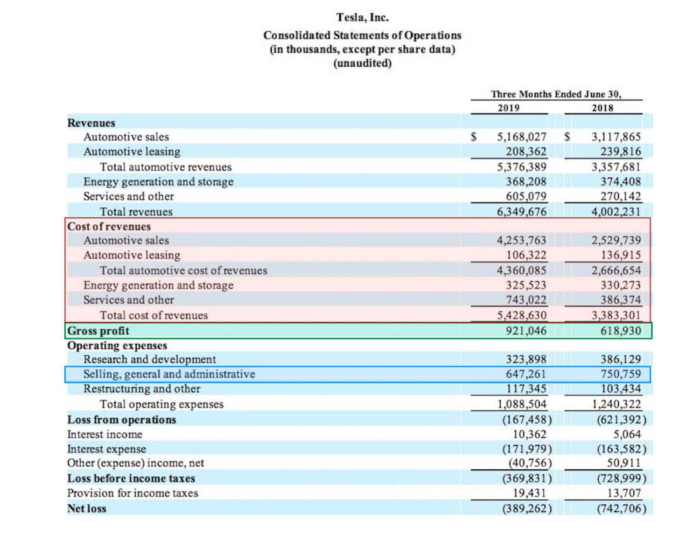

## Table of Contents

## What is gross profit and why is it important?

Gross profit is the money a business makes after it subtracts the cost of making or buying the products it sells. This is different from the total revenue, which is all the money coming in before any costs are taken out. To find the gross profit, you take the total revenue and subtract the cost of goods sold (COGS). For example, if a store sells t-shirts for $20 each and it costs them $10 to buy each t-shirt, the gross profit per t-shirt is $10.

Gross profit is important because it shows how well a business is doing at making money from its main activities. It helps business owners see if they are pricing their products correctly and if they are managing their costs well. If the gross profit is high, it means the business is doing a good job at earning more than it spends on products. This extra money can be used to pay for other expenses like rent, salaries, and marketing, or it can be saved or reinvested in the business to help it grow.

## How are labor costs typically defined in a business?

Labor costs in a business are the total amount of money a company spends on paying its employees. This includes the wages or salaries they earn, as well as any additional costs like overtime pay, bonuses, and benefits such as health insurance or retirement plans. These costs can be for full-time, part-time, or temporary workers, and they are usually one of the biggest expenses for a business.

Understanding labor costs is important because it helps a business know how much it spends on its workforce. This information can be used to see if the business can afford to hire more people, give raises, or offer better benefits. It also helps in setting prices for products or services to make sure the business can cover these costs and still make a profit. Keeping track of labor costs helps a business stay financially healthy.

## What are overhead costs and what do they include?

Overhead costs are the expenses a business has to pay that are not directly tied to making or selling a product. These are the costs that keep the business running day to day. Things like rent for the office or store, utilities like electricity and water, and insurance are all part of overhead costs. Even if a business isn't making or selling anything, it still has to pay these bills.

Overhead costs also include salaries for people who don't make the product, like managers or administrative staff. Other examples are office supplies, like paper and pens, and any fees for services like accounting or legal help. Keeping track of overhead costs is important because they can add up quickly and affect how much profit a business makes. If overhead costs are too high, a business might need to find ways to cut back or it could struggle to stay profitable.

## Why is it important to include labor and overhead in gross profit calculations?

Including labor and overhead costs in gross profit calculations is important because it gives a more complete picture of how much it really costs to make and sell products. Gross profit is usually just the total sales minus the cost of goods sold, but this doesn't tell the whole story. Labor costs, like the money paid to workers who make the products, and overhead costs, like rent and utilities, are also part of the total cost of doing business. If these costs are not included, a business might think it's making more profit than it really is.

By including labor and overhead in gross profit calculations, a business can make better decisions about pricing and managing costs. If the gross profit doesn't cover these extra costs, the business might need to raise prices, find ways to cut costs, or both. Knowing the true gross profit helps a business stay financially healthy and plan for the future. It's like looking at the whole picture instead of just a small part, which helps the business make smart choices.

## How do you calculate gross profit when including labor and overhead?

To calculate gross profit including labor and overhead, you start with the total revenue from sales. This is all the money that comes in from selling your products. Next, you subtract the cost of goods sold (COGS), which is the cost to make or buy the products you sell. After you subtract COGS, you get the traditional gross profit. But to get a fuller picture, you need to also subtract the labor costs. These are the wages and benefits you pay to the workers who make your products. Finally, subtract the overhead costs, which include things like rent, utilities, and other expenses that keep your business running but aren't directly tied to making the product.

When you include labor and overhead in your gross profit calculation, you end up with a number that shows how much money your business really makes after all the main costs are covered. This is important because it helps you see if your business is truly profitable. If your gross profit after subtracting labor and overhead is positive, that means you're making more than it costs to run your business. If it's negative, you might need to raise prices, cut costs, or find other ways to improve your financial health. This fuller calculation gives you a clearer idea of your business's performance and helps you make better decisions.

## What are the common methods for allocating overhead costs to products or services?

One common way to allocate overhead costs to products or services is by using a single overhead rate. This means figuring out the total overhead costs for the whole business and then dividing it by a base, like total direct labor hours or total machine hours used to make all the products. For example, if the total overhead costs are $100,000 and the total direct labor hours for all products are 50,000 hours, the overhead rate would be $2 per labor hour. Then, for each product, you multiply the number of labor hours it took to make it by this rate to find out how much overhead to allocate to that product.

Another method is using activity-based costing (ABC). This approach looks at the different activities that cause overhead costs and tries to link those costs more directly to the products or services that use those activities. For example, if setting up machines is an activity that causes overhead, you might track how many setups are needed for each product and then allocate the setup costs based on that. ABC can be more accurate than using a single rate because it tries to match the costs more closely with what actually causes them, but it can also be more complicated to set up and keep track of.

Both methods have their uses, and the choice often depends on how detailed the business wants to be with its cost tracking and how much time and resources it has to spend on the process. A simple overhead rate is easier to use but might not give as accurate a picture of costs for each product. Activity-based costing takes more work but can help businesses understand their costs better and make better pricing and production decisions.

## How can the inclusion of labor and overhead affect pricing strategies?

Including labor and overhead costs in your calculations can really change how you set prices for your products or services. If you only look at the cost of making the product and ignore labor and overhead, you might set prices too low. This is because you're not thinking about all the money it takes to run your business, like paying your workers and keeping the lights on. If you don't include these costs, you could end up losing money because the price you charge doesn't cover everything you need to pay for.

When you do include labor and overhead in your pricing, you get a better idea of what you need to charge to make a profit. You might need to raise your prices to cover these extra costs. This can help make sure your business stays healthy and can keep running. It also helps you see if there are ways to cut costs or if you need to find other ways to make more money. By understanding the full cost of your products, you can make smarter choices about how to price them and keep your business strong.

## What are the challenges in accurately measuring labor and overhead costs?

Measuring labor and overhead costs accurately can be tricky. For labor costs, it's hard because workers might do different jobs at different times. Some might work on making products, while others might help with other things like selling or managing the business. It's tough to figure out exactly how much of their time and pay should be counted as part of the cost of making the product. Also, if workers get bonuses or overtime, it can make the labor costs change a lot from month to month, making it harder to predict and plan.

Overhead costs are also challenging to measure because they include so many different things like rent, utilities, and office supplies. It's not always clear how much of these costs should be added to the price of each product. For example, if you have one big electricity bill for the whole building, how do you decide how much of that bill should be counted for each product you make? Plus, some overhead costs can change a lot, like if the price of electricity goes up or if you need to buy more office supplies than usual. This makes it hard to keep track of and plan for these costs accurately.

## How does the inclusion of labor and overhead in gross profit calculations vary by industry?

The way businesses include labor and overhead in their gross profit calculations can be different depending on the industry they are in. For example, in manufacturing, where making products is the main thing, labor costs are usually a big part of the cost to make those products. So, it's important to include the wages of the workers who make the products in the gross profit calculation. Overhead costs like the cost of running the factory, like electricity and rent, are also important. These costs can be a big part of what it takes to make the products, so they need to be included to get a true picture of the profit.

In service industries, like restaurants or consulting, the way labor and overhead are included can be a bit different. In a restaurant, the chefs and servers are part of the labor cost, but so are the people who clean and manage the place. Overhead costs like rent, utilities, and supplies are also important. But in these industries, it might be harder to split these costs up because the service is what's being sold, not a physical product. In consulting, the main cost is often the time of the consultants, so labor costs are very important, while overhead might be things like office rent and software subscriptions. Each industry has its own way of figuring out how to include these costs to see if they are making a profit.

## What are the best practices for tracking and managing labor and overhead costs?

To track and manage labor and overhead costs well, it's important to keep good records. This means writing down all the money spent on paying workers and keeping the business running. Using software or apps can help make this easier. These tools can keep track of how much time workers spend on different tasks and how much money is spent on things like rent and utilities. It's also a good idea to check these records often to make sure they are correct and to see if there are ways to save money. For example, if you see that the electricity bill is too high, you might find ways to use less power.

Another good practice is to set a budget for labor and overhead costs. This helps you plan how much money you can spend and helps you stick to that plan. If you find that you are spending more than you planned, you can look for ways to cut back. Maybe you can find cheaper supplies or see if there are tasks that don't need as many workers. Talking to your team about these costs can also help. They might have ideas on how to save money or work more efficiently. By keeping a close eye on labor and overhead costs and planning carefully, you can make sure your business stays healthy and profitable.

## How can software tools assist in the inclusion of labor and overhead in gross profit calculations?

Software tools can really help businesses figure out how much money they make after paying for labor and overhead costs. These tools can keep track of how much time workers spend on making products or doing other jobs. They can also add up all the costs like rent, electricity, and supplies. By putting all this information together, the software can show you the true cost of making your products, which helps you see if you're making a profit or not.

Using software makes it easier to see where your money is going and helps you plan better. You can set up the software to show you reports that tell you how much you're spending on labor and overhead each month. This way, you can quickly see if these costs are going up or down and make changes if you need to. It's like having a helper that keeps everything organized and helps you make smart decisions about your business.

## What advanced analytical techniques can be used to optimize the inclusion of labor and overhead in gross profit calculations?

One advanced way to figure out how much labor and overhead costs affect your gross profit is by using something called regression analysis. This is a fancy way of looking at data to see how different things, like the number of hours workers spend making products or the cost of electricity, change your profit. By using regression analysis, you can find out which costs have the biggest impact on your profit and focus on managing those costs better. It's like using a magnifying glass to see the details that you might miss otherwise.

Another useful technique is cost-[volume](/wiki/volume-trading-strategy)-profit (CVP) analysis. This helps you understand how changes in the amount you sell, your costs, and your prices affect your profit. With CVP analysis, you can play around with different scenarios to see what happens if you raise prices, cut labor costs, or sell more products. It's like a game where you can try different moves to see which ones help you make more money. By using these advanced techniques, you can make smarter decisions about how to manage your labor and overhead costs to keep your business healthy and profitable.

## What is the role of gross profit in algo trading?

Gross profit, defined as the difference between revenue and the cost of goods or services sold, is a fundamental metric for assessing the financial health of any business operation, including [algorithmic trading](/wiki/algorithmic-trading). In algo trading, gross profit analysis is pivotal in evaluating the success and profitability of trading algorithms and strategies. It serves as a benchmark for determining how efficiently a trading strategy converts investment into profit.

Gross profit is calculated using the formula:

$$
\text{Gross Profit} = \text{Revenue} - \text{Cost of Goods Sold (COGS)}
$$

In the context of algorithmic trading, COGS encompasses various expenditures such as transaction fees, market data subscriptions, and infrastructure costs. Revenue is typically derived from the returns generated by the trading strategies.

Analyzing gross profit in algo trading allows traders to dissect the elements contributing to profitability. By understanding this financial component, traders can determine which strategies are performing well and which require optimization or replacement. Gross profit analysis can guide strategic decisions, such as reallocating resources to more profitable strategies or adjusting algorithm parameters to enhance performance.

Moreover, understanding the relationship between trading costs and gross profit is crucial for strategy optimization. As trading costs directly impact gross profit, minimizing these costs can significantly improve the overall profitability of a trading strategy. Traders can utilize cost-benefit analyses to assess the trade-offs between high-frequency trading strategies that may incur higher transaction costs versus those with longer holding periods and lower transaction costs.

In optimizing their operations, algo traders can employ various techniques to enhance gross profit margins. For example, using advanced computational techniques, such as [machine learning](/wiki/machine-learning), can help refine algorithms to execute trades more efficiently. Additionally, improving latency and execution speed can enhance trading outcomes, thereby bolstering gross profit margins.

Python offers many tools for performing such analysis, and traders can write scripts to automate profitability assessments. For example:

```python
def calculate_gross_profit(revenue, cogs):
    return revenue - cogs

# Example data
trading_revenue = 10000  # Example revenue
trading_cogs = 2000     # Example trading costs

gross_profit = calculate_gross_profit(trading_revenue, trading_cogs)
print(f'Gross Profit: ${gross_profit}')
```

In summary, gross profit not only measures the current financial performance of a trading strategy but also serves as a vital input for strategic decision-making and operational optimization. By continuously analyzing gross profit and its components, traders can enhance their strategies, reduce costs, and achieve sustained profitability in algorithmic trading.

## References & Further Reading

[1]: Bergstra, J., Bardenet, R., Bengio, Y., & Kégl, B. (2011). ["Algorithms for Hyper-Parameter Optimization."](https://dl.acm.org/doi/10.5555/2986459.2986743) Advances in Neural Information Processing Systems 24.

[2]: ["Advances in Financial Machine Learning"](https://www.amazon.com/Advances-Financial-Machine-Learning-Marcos/dp/1119482089) by Marcos Lopez de Prado

[3]: ["Evidence-Based Technical Analysis: Applying the Scientific Method and Statistical Inference to Trading Signals"](https://www.amazon.com/Evidence-Based-Technical-Analysis-Scientific-Statistical/dp/0470008741) by David Aronson

[4]: ["Machine Learning for Algorithmic Trading"](https://github.com/stefan-jansen/machine-learning-for-trading) by Stefan Jansen

[5]: ["Quantitative Trading: How to Build Your Own Algorithmic Trading Business"](https://www.amazon.com/Quantitative-Trading-Build-Algorithmic-Business/dp/1119800064) by Ernest P. Chan