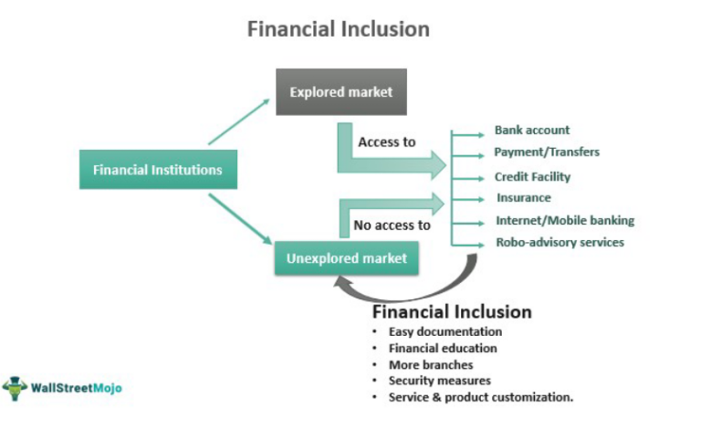

## Table of Contents

## What is working capital?

Working capital is the money a business has available to use for its day-to-day operations. It is calculated by taking the company's current assets, like cash and inventory, and subtracting its current liabilities, which are the debts and bills that need to be paid soon. Having enough working capital is important because it helps a business keep running smoothly, pay its bills on time, and take advantage of new opportunities.

If a business has too little working capital, it might struggle to buy the things it needs or pay its employees, which can lead to problems. On the other hand, having too much working capital means the business might not be using its money efficiently. It could be investing that extra money to grow the business instead of just keeping it as cash. Managing working capital well is key to keeping a business healthy and able to grow.

## What are the components of working capital?

Working capital is made up of two main parts: current assets and current liabilities. Current assets are things a business owns that can be turned into cash within a year. These include cash in the bank, money that customers owe the business (accounts receivable), and items the business has in stock to sell (inventory). Current liabilities are the bills and debts a business needs to pay within a year. This includes money the business owes to suppliers (accounts payable), short-term loans, and other immediate expenses like wages and taxes.

The difference between current assets and current liabilities gives you the working capital. If a business has more current assets than current liabilities, it has positive working capital, which means it can easily pay its short-term bills. If the current liabilities are more than the current assets, the business has negative working capital, and it might struggle to pay its bills on time. Keeping a good balance between these two parts is important for a business to operate smoothly and grow.

## Why is working capital important for a business?

Working capital is important for a business because it helps keep the business running smoothly every day. It's like the money a business uses to buy things it needs right away, like supplies or to pay workers. If a business has enough working capital, it can pay its bills on time and keep everything going without any big problems. This makes sure that the business can keep making and selling its products or services without stopping.

Having the right amount of working capital also helps a business grow. If a business has extra money, it can use that to buy new things or try new ideas to make the business bigger. But if a business doesn't have enough working capital, it might have to stop buying things it needs or even stop working for a while. This can make it hard for the business to keep going and can stop it from growing. So, managing working capital well is really important for a business to stay healthy and get bigger.

## What is the definition of salary in the context of a business?

A salary is the fixed amount of money that an employee gets paid by their employer, usually every month. It's different from hourly wages because it doesn't change based on how many hours the employee works. Instead, it's a set amount that stays the same as long as the employee keeps their job.

Salaries are important for businesses because they help attract and keep good workers. When a business offers a good salary, it can make people want to work there. Also, knowing they will get the same amount of money every month helps employees plan their lives and feel more secure. This can make them happier and more likely to stay with the company for a long time.

## Can salaries be considered part of working capital?

Salaries are not usually considered part of working capital. Working capital is about the money a business has to use every day, like cash and what it can quickly turn into cash. Salaries are what a business pays its workers, and this money goes out of the business, not into it. So, salaries are more like a part of the business's expenses, not its working capital.

However, salaries can affect working capital indirectly. If a business has to pay a lot of salaries, it might use up a lot of its cash. This can make the working capital go down because there's less money left for other things the business needs. So, while salaries themselves are not part of working capital, how much a business pays in salaries can change how much working capital it has.

## How do salaries impact the cash flow of a business?

Salaries have a big effect on a business's cash flow. Cash flow is all about the money coming in and going out of a business. When a business pays salaries, it's sending money out. This means less cash is left in the business to use for other things. If a business has to pay a lot of salaries, it might find it harder to have enough cash to buy things it needs or to pay other bills on time.

But salaries are also important for keeping a business running smoothly. If a business can pay its workers well and on time, the workers will be happy and likely to stay. Happy workers can help the business do better and maybe even bring in more money. So, while paying salaries takes money out of the business, it can also help the business make more money in the long run. It's all about finding a good balance so the business can keep its cash flow healthy.

## What are the accounting treatments for salaries in working capital?

When it comes to accounting for salaries in working capital, it's important to understand that salaries are an expense, not an asset. This means they are not included in the calculation of working capital, which is current assets minus current liabilities. Salaries are paid out of the business's cash, which is a current asset, so when salaries are paid, the cash balance goes down. This can affect the working capital indirectly because less cash means fewer current assets.

However, salaries that have been earned by employees but not yet paid are recorded as a liability on the balance sheet. These are called accrued salaries or wages payable. This liability is a current liability because it needs to be paid within a year. When you calculate working capital, you subtract current liabilities from current assets. So, if there are a lot of accrued salaries, this can lower the working capital because it increases the current liabilities. Keeping track of these numbers helps a business manage its cash flow and make sure it has enough money to keep running smoothly.

## How do different accounting standards treat the inclusion of salaries in working capital?

Different accounting standards, like GAAP (Generally Accepted Accounting Principles) and IFRS (International Financial Reporting Standards), treat the inclusion of salaries in working capital in a similar way. Both standards see salaries as an expense, not an asset. This means salaries are not directly part of working capital, which is calculated as current assets minus current liabilities. When a business pays salaries, it uses up its cash, which is a current asset. So, paying salaries can lower the cash balance and indirectly affect working capital.

However, both GAAP and IFRS require businesses to record salaries that have been earned by employees but not yet paid as a liability on the balance sheet. These are called accrued salaries or wages payable, and they are considered current liabilities because they need to be paid within a year. When calculating working capital, you subtract these current liabilities from current assets. So, if there are a lot of accrued salaries, it can lower the working capital because it increases the current liabilities. Both standards focus on accurately showing how salaries affect a business's cash flow and working capital.

## What are the implications of including salaries in working capital for financial analysis?

Including salaries in working capital can make financial analysis more complicated. Salaries are expenses, not assets, so they are not part of the working capital calculation. But, when a business pays salaries, it uses up its cash, which is a current asset. This can make the working capital go down because there's less cash left. If a business has a lot of salaries to pay, it might struggle to have enough working capital to keep things running smoothly. So, when looking at a business's financial health, it's important to think about how salaries affect the cash the business has.

Also, salaries that are earned but not yet paid are shown as a liability on the balance sheet. These are called accrued salaries and they count as current liabilities. When you figure out working capital, you take away current liabilities from current assets. So, if there are a lot of accrued salaries, this can lower the working capital because it makes the current liabilities bigger. Understanding how salaries affect working capital helps people see if a business has enough money to pay its bills and keep going. This is a key part of financial analysis that helps make smart decisions about the business.

## How can businesses manage salaries effectively within their working capital?

Businesses can manage salaries effectively within their working capital by planning carefully and keeping track of their cash flow. They need to make sure they have enough money to pay their workers on time. This means they should look at how much money is coming in and going out each month. If they see they might not have enough cash to cover salaries, they can try to find ways to bring in more money or cut down on other costs. Good planning helps a business keep its working capital healthy and make sure everyone gets paid when they should.

Another way to manage salaries is by spreading out when they are paid. Instead of paying everyone at the same time, a business could pay different groups of workers on different days. This can help keep more cash in the business at any one time. Also, businesses can look at how much they are paying in salaries and see if there are ways to make it more fair or efficient. By doing this, they can make sure they are using their working capital in the best way possible, keeping enough money to run the business and grow it in the future.

## What are the best practices for forecasting salary expenses in working capital management?

To forecast salary expenses effectively in working capital management, businesses need to start by looking at past data. They should see how much they paid in salaries over the last year or two. This helps them guess how much they might need to pay in the future. Businesses should also think about any changes that might happen, like hiring new people or giving raises. By looking at these things, they can make a good guess about future salary costs. This helps them plan their cash flow better and make sure they always have enough money to pay their workers on time.

Another important thing is to keep an eye on the business's growth plans. If a business is planning to grow, it might need to hire more people or pay higher salaries. By including these plans in their forecasts, businesses can make sure they have enough working capital to support their growth. It's also a good idea to update these forecasts regularly. Things can change, like if someone leaves the company or if there's a big project that needs more workers. By keeping their forecasts up to date, businesses can manage their working capital better and make sure they can always pay their salaries without any problems.

## How do advanced financial models account for the variability of salaries in working capital calculations?

Advanced financial models help businesses predict how much they need to pay in salaries and how this affects their working capital. These models look at past salary data and use it to guess what future salary costs might be. They also consider things like new hires, raises, and bonuses. By including these factors, the models can show how salaries might change over time and how this impacts the amount of cash a business has to work with. This helps businesses plan better and make sure they have enough money to pay their workers, even if salaries go up or down.

These models also take into account the timing of salary payments. For example, if a business pays salaries at the end of the month, the model will show how this affects the cash balance at that time. By looking at different scenarios, like paying salaries on different days or adjusting the amount paid, businesses can see how these changes affect their working capital. This kind of planning helps them keep enough cash on hand to cover all their costs and still have money left to grow the business.

## What is Understanding Business Finance and Working Capital?

Business finance represents the backbone of any company, ensuring that it can sustain operations, support growth, and meet financial obligations. This area of finance covers a broad spectrum of activities, which include managing the acquisition of funds, resource allocation, and monetary control to achieve the firm's goals. 

Working capital management is a critical aspect of business finance, focusing on maintaining an optimal balance between a company's current assets and current liabilities. The formula for calculating working capital is:

$$
\text{Working Capital} = \text{Current Assets} - \text{Current Liabilities}
$$

Current assets are those assets that are expected to be transformed into cash, sold, or consumed within a year. These typically include cash, accounts receivable, inventory, and marketable securities. Conversely, current liabilities are obligations a company expects to settle within the same time frame, which include accounts payable, short-term debt, and other accrued liabilities.

Effective management of working capital ensures that a business can meet its short-term liabilities and continue its operations efficiently. This necessitates maintaining a sufficient level of cash flow to meet financial obligations as they come due and involves strategies like inventory management, accounts receivable and payable management, and maintaining cash reserves. A well-managed working capital allows a company to reduce borrowing costs, enhance profitability, and maintain a strong financial position.

Companies that manage working capital efficiently can generate cash more rapidly than they need to pay it to their creditors, thus providing the funds necessary for long-term investment and growth. The ability to maintain [liquidity](/wiki/liquidity-risk-premium) allows a company to operate without disruptions, invest in innovative projects, manage economic downturns, and take advantage of strategic opportunities. 

On the other hand, mismanagement can lead to financial distress, inability to meet short-term obligations, and potentially, business insolvency. Therefore, working capital is not just a buffer for daily operations but a pivotal [factor](/wiki/factor-investing) in maintaining the overall financial health and competitive edge of a business.

## What is the role of salaries in working capital?

Salaries constitute a significant portion of a company's operational expenditures and play a vital role in the management of working capital. Working capital is calculated as the difference between current assets and current liabilities, a metric essential for assessing a company’s short-term financial health. Paid salaries, while essential for maintaining employee morale and productivity, do not form part of current liabilities and thus are not included in working capital considerations once they have been disbursed. This distinction is crucial because it frees up current liabilities once the salaries have been paid, allowing for a clearer assessment of the company's immediate financial obligations.

On the other hand, unpaid salaries are classified as current liabilities. This classification is because these unpaid amounts represent an obligation that the company needs to settle within a short period. Unpaid salaries, if outstanding, reduce the net working capital available to the business. The formula to compute working capital is:

$$
\text{Working Capital} = \text{Current Assets} - \text{Current Liabilities}
$$

When unpaid salaries increase, the current liabilities part of the equation enlarges, diminishing the working capital. This decrease emphasizes the importance for businesses to manage salary payments diligently to avoid liquidity constraints.

Effective management of salary obligations is part of prudent working capital management. If companies delay salary payments, they may temporarily improve liquidity but risk employee dissatisfaction and increased turnover, which can be costlier in the long term. Therefore, businesses often aim to balance the timing of cash flows carefully to ensure that they maintain sufficient working capital without deferring essential operational expenditures like salaries.

## References & Further Reading

[1]: Pereira-López, X., Mestre, M., & Moreno, C. (2018). [Working Capital Management and SMES Profitability: Spanish Evidence](https://www.researchgate.net/publication/362482529_Working_capital_management_in_SMEs). Business and Economic Horizons, 14(3).

[2]: ["Advances in Financial Machine Learning"](https://www.amazon.com/Advances-Financial-Machine-Learning-Marcos/dp/1119482089) by Marcos Lopez de Prado

[3]: Werner, R. A. (2014). [Can banks individually create money out of nothing? — The theories and the empirical evidence](https://www.sciencedirect.com/science/article/pii/S1057521914001070). International Review of Financial Analysis, 36.

[4]: ["Quantitative Trading: How to Build Your Own Algorithmic Trading Business"](https://www.amazon.com/Quantitative-Trading-Build-Algorithmic-Business/dp/1119800064) by Ernest P. Chan

[5]: Filbeck, G., & Krueger, T. M. (2005). [An analysis of working capital management results across industries](https://www.emerald.com/insight/content/doi/10.1108/19355181200500007/full/html). Mid-American Journal of Business, 20(2).

[6]: ["Machine Learning for Algorithmic Trading"](https://github.com/stefan-jansen/machine-learning-for-trading) by Stefan Jansen