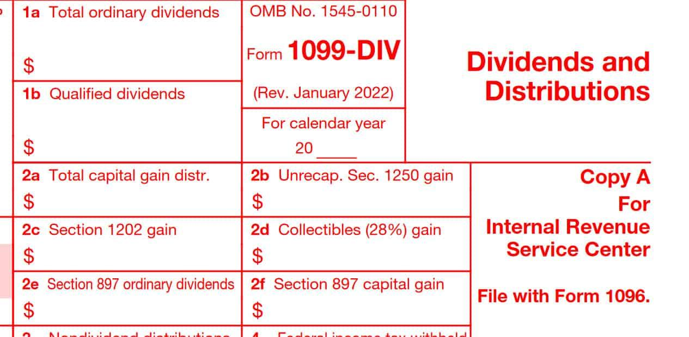

## Table of Contents

## What are qualified dividends?

Qualified dividends are a type of dividend that is taxed at a lower rate than ordinary income. They come from stocks of companies that are based in the United States or from certain foreign companies that meet specific criteria. To be considered qualified, the dividends must be held for a certain period of time, usually more than 60 days during the 121-day period that begins 60 days before the ex-dividend date.

The tax rate for qualified dividends can be 0%, 15%, or 20%, depending on your taxable income and filing status. This is much lower than the tax rate for ordinary income, which can go up to 37%. Because of this lower tax rate, qualified dividends can be a good way to earn money from investments, especially if you are in a higher tax bracket. It's important to keep track of which dividends are qualified and which are not, so you can report them correctly on your tax return.

## What are ordinary dividends?

Ordinary dividends are payments that companies make to their shareholders from their profits. These dividends are taxed at the same rate as your regular income, like the money you earn from your job. This tax rate can be as high as 37%, depending on how much money you make in a year.

Unlike qualified dividends, which have special rules and lower tax rates, ordinary dividends don't need to meet any special conditions. They are the most common type of dividend you might receive if you own stocks. When you get your tax forms at the end of the year, ordinary dividends will be listed on your Form 1099-DIV, and you'll need to report them on your tax return.

## How are qualified dividends taxed differently from ordinary dividends?

Qualified dividends and ordinary dividends are taxed differently. Qualified dividends are taxed at a lower rate than ordinary dividends. The tax rate for qualified dividends can be 0%, 15%, or 20%, depending on your income and how you file your taxes. This is much lower than the tax rate for ordinary dividends, which are taxed at the same rate as your regular income, like money from your job. The highest tax rate for ordinary dividends can be as high as 37%.

To be considered a qualified dividend, the dividend must come from a U.S. company or a qualifying foreign company, and you must hold the stock for a certain amount of time. This is usually more than 60 days during a specific period around the ex-dividend date. Ordinary dividends don't have these special rules. They are just payments from a company's profits to its shareholders, and they are taxed at your regular income tax rate. Knowing the difference between these two types of dividends can help you plan your investments and taxes better.

## Why is it important to include qualified dividends in ordinary dividends for tax reporting?

When you report your taxes, you need to include both qualified and ordinary dividends together on your tax form. This is because the IRS wants to know all the money you made from dividends, no matter what kind they are. You'll report this total on your Form 1099-DIV, which you get from your broker or the company that paid you the dividends. 

Even though you add them together for reporting, you still need to know which dividends are qualified and which are ordinary. This is important because qualified dividends get a special, lower tax rate. When you file your taxes, you'll use this information to figure out how much tax you owe. If you don't separate them correctly, you might end up paying more tax than you need to.

## What are the criteria for a dividend to be considered qualified?

For a dividend to be considered qualified, it must come from a U.S. company or a qualifying foreign company. A qualifying foreign company is one that is based in a country that has a tax treaty with the U.S. or one that is easily traded on a major U.S. stock exchange. The company also needs to have enough of its business in the U.S. or the country where it's based.

Another important rule is that you must hold the stock for a certain amount of time. Usually, this means you need to own the stock for more than 60 days during the 121-day period that starts 60 days before the ex-dividend date. The ex-dividend date is the first day the stock trades without the dividend. If you meet these rules, the dividend can be considered qualified and taxed at a lower rate.

## How do you report qualified dividends on your tax return?

When you get your tax forms at the end of the year, you'll see all your dividends listed on Form 1099-DIV. This form shows both your ordinary dividends and your qualified dividends. You need to add these two types of dividends together and report the total on your tax return. You'll put this total on Schedule B, which is where you list all your interest and dividend income.

Even though you add them together for reporting, you still need to know which dividends are qualified. This is because qualified dividends get a special, lower tax rate. On your tax return, you'll use the qualified dividends amount to figure out how much tax you owe. You'll report this on Form 1040, where you'll see a line for qualified dividends. By separating them correctly, you can make sure you're paying the right amount of tax and not more than you need to.

## What forms do you need to report qualified dividends?

To report qualified dividends, you'll need Form 1099-DIV. This form comes from your broker or the company that paid you the dividends. It shows all your dividends, both ordinary and qualified. You need to add these two types of dividends together and report the total on your tax return. You'll put this total on Schedule B, which is where you list all your interest and dividend income.

Even though you add them together for reporting, you still need to know which dividends are qualified. This is because qualified dividends get a special, lower tax rate. On your tax return, you'll use the qualified dividends amount to figure out how much tax you owe. You'll report this on Form 1040, where you'll see a line for qualified dividends. By separating them correctly, you can make sure you're paying the right amount of tax and not more than you need to.

## Can the inclusion of qualified dividends affect your tax bracket?

Yes, including qualified dividends in your income can affect your tax bracket. When you add up all your income, including your salary, interest, and dividends, it might push you into a higher tax bracket. If your total income goes over a certain amount, you'll have to pay a higher tax rate on the part of your income that's in the new, higher bracket.

But, qualified dividends are taxed at a lower rate than ordinary income. So, even if your total income goes up and puts you in a higher tax bracket, the qualified dividends part of your income will still be taxed at the lower rate of 0%, 15%, or 20%. This can help lower the overall amount of tax you have to pay, even if you're in a higher tax bracket because of your total income.

## What are the common mistakes people make when reporting qualified dividends?

One common mistake people make when reporting qualified dividends is mixing them up with ordinary dividends. They add up all their dividends without separating the qualified ones. This can lead to paying more tax than they need to because qualified dividends have a lower tax rate. It's important to look at Form 1099-DIV, which shows both types of dividends, and report them correctly on Schedule B and Form 1040.

Another mistake is not holding the stock for the required time to make the dividends qualified. To get the lower tax rate, you need to own the stock for more than 60 days during the 121-day period that starts 60 days before the ex-dividend date. If you sell the stock too soon, the dividends won't be qualified, and you'll pay a higher tax rate. It's helpful to keep track of when you buy and sell stocks to make sure you meet this rule.

## How do holding periods impact the qualification of dividends?

The time you hold a stock is really important for deciding if the dividends you get are qualified or not. For a dividend to be qualified, you need to own the stock for more than 60 days during a special time. This special time is 121 days long and starts 60 days before the ex-dividend date. The ex-dividend date is the first day the stock trades without the dividend. If you don't hold the stock long enough, the dividends won't be qualified, and you'll have to pay a higher tax rate on them.

Keeping track of when you buy and sell your stocks is a good idea. This helps make sure your dividends can be qualified and taxed at a lower rate. If you sell the stock too soon, you might miss out on the lower tax rate for qualified dividends. So, it's important to know these rules and follow them to save money on taxes.

## What are the implications of foreign dividends being qualified?

Foreign dividends can be qualified if they come from a company based in a country that has a tax treaty with the U.S. or if the company's stock is easily traded on a major U.S. stock exchange. Also, the company needs to do enough business in the U.S. or its home country. If these rules are met, the dividends can be taxed at a lower rate, just like dividends from U.S. companies.

Having foreign dividends be qualified can save you money on taxes. Instead of paying the higher tax rate for ordinary income, you'll pay the lower rate of 0%, 15%, or 20%, depending on your income. This can make a big difference, especially if you get a lot of dividends from foreign companies. Just remember, you still need to hold the stock for more than 60 days during the right time to make sure the dividends are qualified.

## How do changes in tax laws affect the reporting of qualified dividends?

Changes in tax laws can change how you report qualified dividends. When the government changes the rules about taxes, it might change what counts as a qualified dividend or how much tax you have to pay on them. For example, if the law changes the holding period needed for dividends to be qualified, you'll need to follow the new rule to get the lower tax rate. Also, if the tax rates for qualified dividends change, you'll need to use the new rates when you do your taxes.

It's important to keep up with these changes so you report your dividends correctly. If you don't, you might pay too much or too little tax. You can find out about new tax laws from the IRS website or by talking to a tax professional. They can help you understand the new rules and make sure you're doing everything right on your tax return.

## References & Further Reading

[1]: ["The Taxation of Dividends Under the Jobs and Growth Tax Relief Reconciliation Act of 2003"](https://www.investopedia.com/terms/j/jgtrra.asp) - Tax Policy Center.

[2]: ["Understanding the Taxation of Dividends – Important Considerations for Investors" (PDF)](https://crsreports.congress.gov/product/pdf/R/R43418) by Michael Kitces.

[3]: ["Algorithmic Trading: Winning Strategies and Their Rationale"](https://www.amazon.com/Algorithmic-Trading-Winning-Strategies-Rationale-ebook/dp/B00CY5HC0U) by Ernest P. Chan.

[4]: ["Dividends and Taxes - The Harvard Law School Forum on Corporate Governance"](https://hls.harvard.edu/areas-of-interest/tax-law-and-policy/) by Mihir A. Desai and Dhammika Dharmapala.

[5]: ["The Financial Crisis and the Paradox of Modern Banking System"](https://journals.sagepub.com/doi/full/10.1177/1611894420974252) by M. Richard as published in the Economic Review.