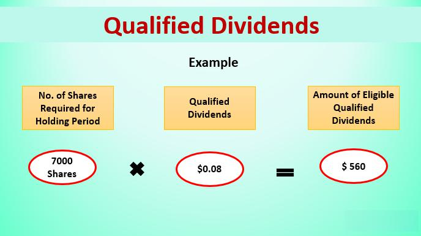

Understanding the nuances of dividend taxation is crucial for effective financial planning, especially for algorithmic traders who rely heavily on dividends as a source of returns. Algorithmic trading, characterized by the use of complex mathematical models and automated systems to execute trades at high speeds, has become an integral component of modern investing. The practice leverages technology to analyze market data and execute orders, often times capitalizing on small price discrepancies. For traders engaged in this sophisticated domain, dividends can constitute a significant portion of their investment returns. Therefore, optimizing dividend taxation is essential to maximize profitability.

Dividends, generally classified into two categories—qualified and ordinary—are subject to different tax treatments, influencing an investor's net return from dividend income. Understanding these differences is paramount for traders to effectively strategize their investments and minimize tax liabilities. Qualified dividends usually benefit from a lower tax rate, akin to long-term capital gains, thereby presenting a strategic advantage. In contrast, ordinary dividends are taxed at the individual's normal income tax rate, potentially leading to a higher tax burden. Differentiating and making informed decisions in accordance with these distinctions is vital for tax optimization.



Algorithmic trading strategies can significantly benefit from this knowledge, as taxes can affect the net profitability of trades. Aligning trading strategies with tax-efficient practices involves incorporating dividend tax implications into algorithmic trading models, leading to enhanced decision making that considers the potential tax burden alongside expected returns.

The contemporary financial landscape necessitates an acute awareness of these taxation principles for those engaging in algorithmic trading. Through strategic planning and a deep understanding of qualified versus ordinary dividends, traders can effectively align their activities with tax regulations, ultimately improving their overall financial outcomes.

## Table of Contents

## What Are Qualified Dividends?

Qualified dividends are a category of dividends that enjoy preferential tax treatment under specific conditions, distinguishing them from ordinary dividends, which are taxed at regular income tax rates. A qualified dividend is essentially a payment made by a corporation to its shareholders, recognized by tax authorities as deserving of capital gains tax rates, which are typically lower than ordinary income tax rates.

To be classified as qualified under U.S. tax law, dividends must fulfill certain criteria:

1. **Corporate Origin**: The dividends must be distributed by a U.S. corporation or a qualified foreign corporation. A qualified foreign corporation includes those located in countries having a comprehensive tax treaty with the United States or those incorporated in a U.S. possession. Examples of tax treaty countries include the United Kingdom and Canada.

2. **Holding Period Requirement**: The shareholder must have held the stock for more than 60 days within the 121-day period that begins 60 days before the ex-dividend date, which is the cutoff date established by the company issuing the dividend. For dividends on preferred stock, the holding period is extended to more than 90 days during the 181-day period that begins 90 days before the ex-dividend date if the dividends are due to periods totaling more than 366 days.

These conditions are put in place to discourage short-term trading strategies that seek to capture dividend income without a long-term investment commitment, thereby stabilizing the market and encouraging investment.

The benefit of qualifying dividends as opposed to ordinary dividends lies in their tax treatment. While ordinary dividends are taxed at the individual's marginal income tax rate, which can be as high as 37% for high earners, qualified dividends are taxed at more favorable long-term capital gains rates, which are 0%, 15%, or 20%, depending on the taxpayer's income level. Thus, investors in higher tax brackets gain a substantial advantage from [earning](/wiki/earning-announcement) qualified dividends. 

For example, if an investor in the 35% income tax bracket receives $1,000 in dividends, having them considered as qualified could save $200 in taxes, assuming their capital gains tax rate is 15%, as opposed to paying $350 if they were taxed as ordinary income.

In summary, qualified dividends provide substantial tax savings and can significantly enhance an investor's after-tax return. This tax efficiency is pivotal for investors, including algorithmic traders, who seek to optimize their investment strategies and improve overall profitability by leveraging the lower tax rates assigned to qualified dividends.

## Applicable Tax Rates

The taxation of qualified dividends is an integral aspect of financial planning due to its preferential treatment under the United States tax code. Qualified dividends are taxed at the capital gains tax rates, which are significantly lower than the ordinary income tax rates. This preferential treatment can lead to substantial tax savings for investors.

As of the most recent tax laws, the tax rates on qualified dividends are structured in accordance with an individual’s taxable income and filing status. The United States tax code delineates three primary capital gains tax rates for qualified dividends: 0%, 15%, and 20%.

1. **0% Tax Rate**: This rate applies to individuals who fall within the lower income tax brackets. For the tax year 2023, single filers with taxable income up to $41,675 and married couples filing jointly with income up to $83,350 are eligible for this rate. Therefore, qualified dividends received by individuals within this bracket are essentially tax-free, enhancing the attractiveness of dividend-paying stocks for low-income investors.

2. **15% Tax Rate**: This is the most common tax rate for qualified dividends, applicable to a broad range of middle-income taxpayers. Single filers with taxable incomes between $41,676 and $459,750, and married couples filing jointly with incomes ranging from $83,351 to $517,200, benefit from this intermediate tax rate during the tax year 2023. This provides significant tax savings compared to ordinary income tax rates, which can reach up to 37%.

3. **20% Tax Rate**: The highest rate is reserved for high-income earners. For the tax year 2023, it applies to single filers with taxable income exceeding $459,750 and married couples filing jointly with income over $517,200. Despite being the highest capital gains rate, it remains substantially lower than the top ordinary income tax rate.

In contrast, ordinary dividends—which do not meet the criteria to be classified as qualified—are taxed at the individual's ordinary income tax rates. These rates are based on progressive tax brackets ranging from 10% to 37% for the tax year 2023, making non-qualified dividends potentially less beneficial from a tax perspective compared to their qualified counterparts.

For example, consider two investors: Investor A in the 22% ordinary income tax bracket with a taxable income of $60,000, and Investor B in the 35% bracket with a taxable income of $250,000. Suppose both receive $5,000 in dividends. For Investor A, if the dividends are qualified, they would be taxed at 15%, amounting to $750 in taxes, whereas if they were ordinary, the tax would be $1,100. For Investor B, the qualified dividends would incur $750 in taxes (15% of $5,000), while ordinary dividends would result in $1,750 in taxes (35% of $5,000).

Understanding these tax rate differentials highlights the importance of strategic investment planning, especially for algorithmic traders whose decision-making processes can be optimized by factoring in the tax implications of dividend income.

## Non-Qualified Dividends

Non-qualified dividends, sometimes referred to as ordinary dividends, encompass dividends that do not satisfy the criteria to be treated as qualified dividends. Unlike qualified dividends, non-qualified dividends are taxed at ordinary income tax rates, which are generally higher than the preferential tax rates applied to qualified dividends.

To qualify as non-eligible for lower tax rates, dividends do not meet the specific requirements set forth by tax authorities to be considered qualified. These requirements usually include the need for dividends to be paid by a U.S. corporation or a qualified foreign corporation, alongside meeting holding period requirements. When these conditions are not met, dividends are classified as non-qualified. As a result, they are subject to taxation under the standard rates that apply to an individual’s ordinary income.

For instance, a domestic company’s distribution from its earnings that fails the holding period rule or comes from certain types of real estate investment trusts (REITs) and master limited partnerships (MLPs) will likely result in non-qualified dividends. Moreover, dividends paid on shares in employee stock ownership plans (ESOPs) also typically fall into the non-qualified category.

Taxpayers recognize non-qualified dividends as part of their regular income. The ordinary income tax rates for the 2023 tax year in the United States range from 10% to 37%, depending on the taxpayer's annual income and filing status. Compared to the favorable rates applying to qualified dividends, typically set at 0%, 15%, or 20%, non-qualified dividends can result in substantial tax liabilities, especially for individuals in higher tax brackets.

Here’s an example to illustrate the tax implication:
1. Suppose an individual in the 35% tax bracket receives $1,000 as non-qualified dividends in a fiscal year. Subject to ordinary income tax rates, they would owe $350 in taxes on these dividends.
2. On the other hand, if these dividends were classified as qualified, taxed at a maximum rate of 20% for such a bracket, the tax liability would be reduced to $200.

Recognizing the difference between qualified and non-qualified dividends is hence pivotal for investors aiming to optimize their tax liabilities. For algorithmic traders who might deal with high-frequency trading and short-term holds, inadvertently accumulating non-qualified dividends could significantly impact overall returns due to their taxing treatment at ordinary income tax levels.

## Tax Reporting for Dividends

Reporting dividends accurately is a critical aspect of tax compliance for investors, including algorithmic traders. The primary document for reporting both qualified and ordinary dividends is the IRS Form 1099-DIV. This form is issued by brokers and must be used when filing annual tax returns, detailing the total dividends received.

### Form 1099-DIV Reporting

Form 1099-DIV serves to notify the IRS and the taxpayer about various types of dividends received during the tax year. It includes separate boxes for different categories, with Box 1a showing total ordinary dividends and Box 1b indicating the subset of these that qualify as qualified dividends. 

Qualified dividends, being a subset of ordinary dividends, are typically reported in Box 1b if they meet specific criteria, including being paid by a U.S. corporation or qualifying foreign entity and fulfilling the holding period requirements. The preferential tax treatment of qualified dividends reflects their integral role in tax optimization strategies.

### Impact on Adjusted Gross Income

Qualified dividends are taxed at the long-term capital gains rate, which is lower than ordinary income rates, providing a tax advantage that can significantly affect an investor's taxable income and overall tax liability. However, while qualified dividends are taxed favorably, they still contribute to the taxpayer's adjusted gross income (AGI). A high AGI can potentially lead to phase-outs of certain deductions and credits, subjecting individuals to the Net Investment Income Tax (NIIT).

### Optimization Tips for Algorithmic Traders

Algorithmic traders, who often handle large volumes of trades, must pay careful attention to their dividend income's tax reporting. Here are some tips to optimize tax reporting:

1. **Accurate Record-Keeping:**
   Maintain detailed records of all dividends received, ensuring you can distinguish between qualified and ordinary dividends. This information is crucial when cross-referencing 1099-DIV forms.

2. **Utilizing Software Tools:**
   Leverage tax preparation software that can import data directly from brokers and investment platforms to reduce errors in reporting and ensure that all qualified dividends are correctly classified.

3. **Strategic Holding Periods:**
   Implement strategies to meet the holding periods required for dividends to qualify for the reduced tax rates. This involves ensuring that stock positions are held for more than 60 days during the 121-day period surrounding the ex-dividend date.

4. **Consult Tax Professionals:**
   Engaging tax professionals familiar with the nuances of dividend taxation can result in better tax treatments and strategic planning, potentially uncovering opportunities for tax savings.

5. **Review Broker Reports:**
   Regularly review reports from brokers to ensure all reported figures align with personal records. Discrepancies can lead to incorrect tax filings, prompting audits or penalties.

For algorithmic traders, understanding and optimizing the reporting of dividend income can bolster their investment returns by minimizing tax liabilities and ensuring compliance with IRS regulations. Proper use of Form 1099-DIV and strategic tax planning are essential components of this process.

## Implications for Algorithmic Trading

Algorithmic trading has revolutionized the financial markets by enabling investors to execute trades with speed, precision, and efficiency. Dividends, while often seen as a traditional source of income, play a significant role in [algorithmic trading](/wiki/algorithmic-trading) strategies. Understanding the tax implications of dividends is crucial for optimizing these strategies and ensuring maximum profitability.

Dividends can be integral components of algorithmic models, particularly those that focus on long-term holding strategies or incorporate [fundamental analysis](/wiki/fundamental-analysis). When designing algorithms, traders may consider the anticipated dividend yield of a stock, the frequency of dividend payments, and the historical growth of dividends. These factors can inform decisions about asset selection and portfolio balancing.

The tax treatment of dividends directly affects the net returns of these trades. Qualified dividends benefit from lower tax rates, typically aligning with long-term capital gains tax rates. Conversely, non-qualified dividends are taxed at ordinary income tax rates, which can substantially erode profits for high-frequency traders or those in higher tax brackets. Therefore, differentiating between qualified and ordinary dividends becomes pivotal. Algorithmic traders must account for these differences to maintain the profitability of their strategies.

To manage the tax impact of dividends, algorithmic traders can implement several strategies. One approach is to develop algorithms that prioritize stocks with high qualified dividend yields. By holding these stocks long enough to meet the IRS's holding period requirement, traders can ensure that the dividends received are taxed at the lower qualified dividend rate. This approach involves incorporating a module within the algorithm that tracks the holding period and adjusts the trading strategy accordingly.

Here's a simple Python snippet that illustrates how an algorithm could filter stocks based on dividend characteristics:

```python
def filter_qualified_dividend_stocks(stock_list):
    qualified_stocks = []
    for stock in stock_list:
        # Assuming stock has attributes 'dividend_yield', 'holding_period', and 'is_us_corporation'
        if stock.dividend_yield > threshold_yield and \
           stock.holding_period >= min_holding_period and \
           stock.is_us_corporation:
            qualified_stocks.append(stock)
    return qualified_stocks
```

Another strategy is tax loss harvesting, where traders realize losses on certain positions to offset the taxable gains from dividends. This can be challenging in algorithmic trading due to the automated nature and frequency of trades, but it can be incorporated into the trading logic by identifying positions that have unrealized losses and executing trades to realize those losses strategically.

The integration of these tax strategies into an algorithmic trading model requires careful consideration of the timing and execution of trades. Algorithms can be programmed to automatically adjust positions around ex-dividend dates to capture dividends or avoid unnecessary tax liabilities.

In conclusion, the tax treatment of dividends has a pronounced impact on algorithmic trading profitability. By strategically incorporating dividend tax considerations into algorithmic models, traders can enhance their returns while navigating the complexities of modern financial markets.

## Tax Strategies for Dividend Investors

Investors seeking to minimize tax liabilities on dividend income can employ several effective strategies. A primary method is ensuring that dividends qualify for preferential tax treatment by adhering to holding period requirements. For a dividend to be classified as qualified, shares must typically be held for more than 60 days during the 121-day period beginning 60 days before the ex-dividend date. Doing so allows investors to benefit from the lower tax rates applied to qualified dividends, which are generally the same as the long-term capital gains tax rates.

An additional strategy is tax loss harvesting, which involves selling securities at a loss to offset capital gains and taxable income. This technique can be particularly beneficial when applied to dividend investing. For instance, an investor can realize losses from underperforming stocks to counterbalance the taxes on dividend income. However, it's essential to be aware of the wash-sale rule, which disallows a tax deduction if an identical or substantially identical security is purchased within 30 days of the sale.

By leveraging these approaches, investors can effectively reduce their tax burden while maximizing their after-tax returns on dividend investments.

## Conclusion

In concluding our examination of dividend taxation, it is essential to underscore the pivotal differences between qualified and ordinary dividends. Qualified dividends enjoy favorable tax treatment akin to capital gains, providing investors with potential tax savings. In contrast, ordinary dividends are taxed at the standard income rates, which can be notably higher depending on the investor's tax bracket.

Strategic tax planning becomes paramount for investors, particularly algorithmic traders, who must navigate these distinctions to enhance their returns. By understanding the qualification criteria, including the required holding period and corporate classification, investors can position themselves to take full advantage of the lower tax rates afforded to qualified dividends.

Algorithmic trading, which often involves high-frequency transactions and dividend-reliant strategies, necessitates an acute awareness of the tax implications on portfolio profitability. Integrating tax considerations into trading models can yield substantial benefits, ensuring that the net returns from dividend strategies are maximized.

As the tax landscape continues to evolve, staying informed and adaptable is crucial for dividend investors. Legislative changes and market dynamics can influence tax policies, requiring ongoing evaluation of investment strategies. By remaining vigilant and proactive, investors can not only safeguard their returns from unnecessary taxation but also seize opportunities for enhanced profitability in an ever-changing financial environment.

## References & Further Reading

[1]: ["The Taxation of Dividends Under the Jobs and Growth Tax Relief Reconciliation Act of 2003"](https://www.investopedia.com/terms/j/jgtrra.asp) - Tax Policy Center.

[2]: ["Understanding the Taxation of Dividends – Important Considerations for Investors" (PDF)](https://crsreports.congress.gov/product/pdf/R/R43418) by Michael Kitces.

[3]: ["Algorithmic Trading: Winning Strategies and Their Rationale"](https://www.amazon.com/Algorithmic-Trading-Winning-Strategies-Rationale-ebook/dp/B00CY5HC0U) by Ernest P. Chan.

[4]: ["Dividends and Taxes - The Harvard Law School Forum on Corporate Governance"](https://hls.harvard.edu/areas-of-interest/tax-law-and-policy/) by Mihir A. Desai and Dhammika Dharmapala.

[5]: ["The Financial Crisis and the Paradox of Modern Banking System"](https://journals.sagepub.com/doi/full/10.1177/1611894420974252) by M. Richard as published in the Economic Review.