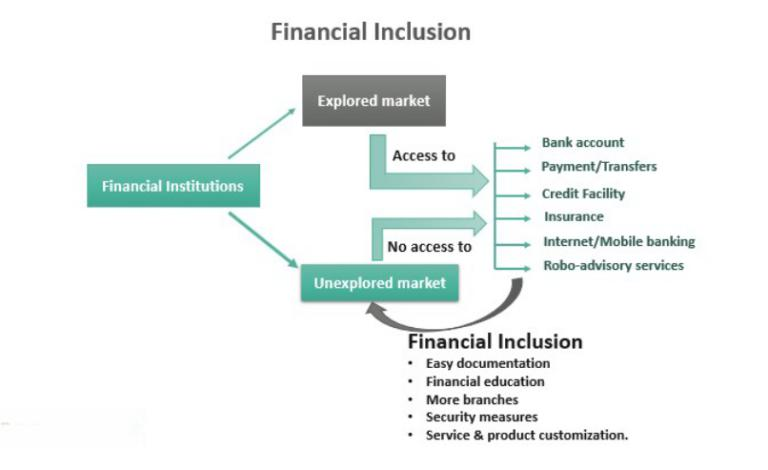

In today's dynamic business environment, understanding the intersections of financial disciplines such as subsidiaries corporate accounting, financial statements, and algorithmic trading is crucial. These elements are integral to both the financial stability of corporations and the strategic approaches in financial markets. The necessity of an accurate representation of financial affairs is vital for corporations, particularly when dealing with complex structures involving subsidiaries. By providing a comprehensive view through consolidated financial statements, corporations can ensure transparency and uphold stakeholder trust.

Incorporating subsidiaries into financial reports requires meticulous attention to detail, as it influences how investors perceive a corporation's health and potential growth. Algorithmic trading, which relies heavily on real-time financial data, underscores the importance of precise and prompt disclosures in corporate accounting. This method of automated trading uses algorithms to make high-frequency trades that depend on the latest financial reports, highlighting the need for rigorous financial practices.

The intersection of accurate accounting and algorithmic trading demonstrates how modern corporations can use innovative techniques to maintain a competitive edge in financial markets. The implications of these financial elements extend to corporate governance, where they ensure compliance with regulations and support decision-making processes, ultimately contributing to market stability and efficiency. Maintaining reliable financial records and leveraging advanced trading technologies are fundamental strategies for businesses aiming to succeed in today’s complex financial landscape.

## Table of Contents

## Understanding Subsidiaries in Corporate Accounting

Subsidiaries play a significant role in corporate accounting, serving as entities controlled by a parent company. A subsidiary can be created internally or acquired externally, allowing the parent company to manage its business operations more effectively. An essential advantage of subsidiaries is the ability they provide corporations to manage risks by segregating different aspects of business operations. This segregation allows companies to isolate financial risks to specific subsidiaries rather than affecting the entire corporations' financial standing.

Additionally, subsidiaries enable access to new markets, providing a strategic advantage. Corporations can utilize subsidiaries to penetrate new geographic regions or industry sectors, often maintaining separate brand identities to cater to varying customer preferences. For instance, a parent company operating in diverse markets can benefit from tailoring its products or services to meet local demands through distinct subsidiaries. This strategic maneuver not only aids in expanding market reach but also helps in adapting to local regulations and cultural nuances.

In corporate accounting, subsidiaries are integral to presenting a comprehensive financial picture. The consolidation of financial statements is a process that requires the parent company to merge its financial data with that of its subsidiaries. This consolidation ensures that all financial activities across the entire corporate group are accurately represented in the parent company’s financial reports. 

The process of consolidating financial statements involves several key steps. First, the balance sheets, income statements, and cash flow statements of the parent company and its subsidiaries are amalgamated. During this merger, intercompany transactions—financial activities occurring between the parent and subsidiary companies—must be eliminated to avoid double counting and distorted financial data. These transactions could include intercompany sales, loans, or dividends, which, if not appropriately adjusted, could lead to an inflated representation of the financial health of the company.

For example, if a parent company sells goods to its subsidiary, this transaction is recorded as revenue for the parent and a purchase for the subsidiary. In the consolidated financial statement, this intergroup sale must be eliminated as the conglomerate did not generate external revenue from it. The formula for elimination can be demonstrated as follows:

$$

\text{Consolidated Revenue} = \text{Parent Revenue} + \text{Subsidiary Revenue} - \text{Intercompany Sales}
$$

This process allows stakeholders, investors, and regulators to understand the company's economic position as a single economic entity rather than as individual distinct entities. The consolidated financial statement provides a holistic view of the parent's overall corporate health, balancing the various individual performances of its subsidiaries with intercompany dynamics to depict an accurate financial condition.

Through such mechanisms, subsidiaries in corporate accounting help ensure financial transparency and accuracy, contributing to strategic business planning and informed decision-making processes. Understanding their utility and effective incorporation in accounting frameworks is crucial for accurate financial management and reporting.

## Role of Financial Statements

Financial statements are critical tools for assessing a company's financial health, providing a structured overview of assets, liabilities, income, and cash flows. These statements include the balance sheet, income statement, and cash flow statement, each serving a unique purpose. The balance sheet offers a snapshot of a company's financial position at a specific point in time, detailing what the company owns (assets) and owes (liabilities and equity). The income statement, on the other hand, summarizes revenue, expenses, and profits over a specific period, providing insights into operational performance. Finally, the cash flow statement tracks the flow of cash in and out of the business, reflecting the company's [liquidity](/wiki/liquidity-risk-premium) and financial flexibility.

In corporate groups, the complexity of financial statements increases significantly. When dealing with a parent company and its subsidiaries, individual financial statements must be consolidated to present a cohesive picture of the entire corporate entity's financial condition. Consolidation is essential as it eliminates intercompany transactions and balances, which ensures the financial statements reflect the economic reality of the group as a single entity rather than a collection of separate firms. This requires meticulous accounting to maintain accuracy and consistency, especially when diverse accounting policies and currencies are involved.

The integrity of financial statements is contingent upon adherence to rigorous accounting standards like the International Financial Reporting Standards (IFRS) or Generally Accepted Accounting Principles (GAAP). These standards dictate the methodology for preparing and reporting financial data, establishing a framework that enhances reliability and comparability across different industries and jurisdictions. Compliance with these standards ensures transparent reporting, fostering stakeholder trust and confidence in the company's disclosed financial performance.

The necessity for adhering to these standards becomes even more pressing given the sophisticated analyses conducted by investors and analysts in contemporary financial markets. The provision of detailed, standardized financial information enables stakeholders to undertake meaningful evaluations, identify trends, and make informed investment decisions. Thus, the preparation and interpretation of financial statements not only mirror a company's present financial status but also significantly influence its market valuation and strategic trajectory.

## Consolidation Practices for Accurate Reporting

Consolidation in corporate accounting encompasses the integration of financial statements from a parent company and its subsidiaries, providing a unified view of the financial health of the entire corporate group. This process ensures stakeholders receive a comprehensive picture of a corporation's financial position.

Consolidation methods vary based on the degree of control a parent company has over its subsidiaries. The full consolidation method is applied when the parent company exercises control, typically defined as owning more than 50% of the subsidiary's voting rights. In this approach, 100% of the subsidiary's financial results are incorporated into the parent company's financial statements, with minority interests accounted for separately.

Proportional consolidation, once more prevalent, is now less common due to the adoption of IFRS 11, which favors the equity method for joint ventures. In proportional consolidation, the parent company includes its proportionate share of a subsidiary’s assets, liabilities, income, and expenses while excluding minority interests.

The equity method is used when the parent company exercises significant influence over, but does not control, a subsidiary, often interpreted as holding 20% to 50% of voting power. Here, the investment is initially recorded at cost and subsequently adjusted to reflect the investor’s share of the subsidiary’s profit or loss.

Consolidation poses specific challenges, foremost among them the elimination of intercompany transactions. These transactions, which occur between companies within the same consolidated entity, must be removed to avoid inflating revenues, expenses, assets, and liabilities. For example, if a parent company sells goods to a subsidiary, any outstanding balances and related income must be eliminated from the consolidated statements.

Additionally, aligning accounting policies of different entities is crucial. Parent companies must ensure that subsidiaries adhere to consistent accounting methods, facilitating accurate consolidation. Disparities in accounting treatments can arise from varying local practices, which must be reconciled to present a coherent financial statement.

The consolidation process demands meticulous attention to detail, adherence to accounting standards such as IFRS or GAAP, and often involves robust financial systems to manage complex data seamlessly across an organization. These practices underpin the reliability and transparency of financial reporting in a corporate structure encompassing multiple entities.

## Integration of Algo Trading with Financial Statements

Algorithmic trading, also known as algo trading, leverages computer algorithms to execute trading decisions based on pre-defined criteria, relying heavily on financial data derived from corporate financial statements. Accurate and timely financial disclosures in these statements are crucial as they serve as the bedrock for these trading algorithms. 

Incorporated data from balance sheets, income statements, and cash flow statements enables algorithms to evaluate a company's financial health and market potential. This evaluation often involves intricate calculations, such as the comparison of key financial ratios or the assessment of [earning](/wiki/earning-announcement) forecasts. Algorithms, through such evaluations, can trigger trade executions automatically if certain thresholds or conditions are met. For example, if an algorithm is designed to buy a stock if the net profit margin surpasses 15%, the execution depends on the accuracy of this figure in the company's financial statement.

The demand for swift and accurate financial reports is amplified with the expansion of algo trading. The traditional financial reporting cycles may not suffice due to the algorithms' requirement for real-time data analysis. This demand necessitates corporations to adopt real-time financial reporting mechanisms and advanced accounting systems that ensure transparency and precision in data dissemination. A lapse in accurate reporting could lead not only to poor trading decisions but also erode market trust, highlighting the importance of rigorous accounting practices.

Moreover, the integration of [algorithmic trading](/wiki/algorithmic-trading) with financial statements supports market efficiency by reflecting true corporate performance in trade activities. Automation in trading processes reduces human errors and biases, further enhancing the decisions made based on financial reports. As the influence of algorithmic trading continues to grow, corporations are encouraged to maintain stringent accounting practices, supported by standardized reporting frameworks, to align with the dynamic needs of modern trading technologies. This integration stands as a testament to the evolution of financial markets, driven by technology and data reliability.

## Challenges and Opportunities in Financial Reporting

Ensuring accuracy and consistency in financial reporting is critical for corporations, particularly those operating with diverse and geographically dispersed subsidiaries. This complexity arises from various regulatory environments, distinct local accounting practices, and currency fluctuations, which can affect the financial representation and necessitate accurate consolidation processes. These challenges can result in increased risk of errors, delays in reporting, and impaired decision-making capabilities.

Technological advancements offer significant opportunities to address these challenges. Enterprise Resource Planning (ERP) systems have become integral tools in achieving more efficient and reliable financial reporting. By centralizing data from various subsidiaries, ERPs streamline the data collection and consolidation processes. They facilitate real-time financial data tracking, reducing manual errors and ensuring swift integration of financial reports.

Moreover, the integration of [machine learning](/wiki/machine-learning) algorithms is another promising development. These algorithms can identify patterns and anomalies in financial data, improving the accuracy of reports through advanced data analysis techniques. Machine learning can also predict financial trends and outcomes, providing valuable insights for strategic decision-making.

Standardization efforts, such as harmonizing International Financial Reporting Standards (IFRS) and Generally Accepted Accounting Principles (GAAP), play a crucial role in this scenario. These efforts aim to ensure uniformity across financial reporting, enhancing comparability and clarity for stakeholders worldwide. By aligning these standards, companies can reduce the complexities associated with reconciling multiple accounting frameworks, thereby fostering a more coherent understanding of financial information among global investors and regulators.

In conclusion, the combination of technological advancements and accounting standard harmonization presents a dual pathway to overcoming challenges in financial reporting. By embracing these opportunities, organizations can achieve more accurate and timely financial disclosures, ultimately supporting informed decision-making and maintaining investor confidence.

## Conclusion

Consolidated financial statements and algorithmic trading represent a crucial linkage between precise financial reporting and dynamic market activities. Corporations embracing accurate and transparent financial reporting foster stakeholder trust, enhancing market stability and confidence. The intersection of stringent accounting standards with advanced trading technologies provides a roadmap for managing contemporary financial complexities.

The role of consolidated financial statements cannot be underestimated as they furnish a clear depiction of the overall financial health of corporate groups. By integrating subsidiaries into a cohesive financial narrative, these statements ensure that stakeholders have access to comprehensive information, crucial for informed decision-making.

Simultaneously, algorithmic trading demands precise and rapidly updated financial data to execute trades efficiently. The algorithms rely heavily on the integrity of financial reports, underscoring the necessity for corporations to maintain rigorous accounting practices. This interplay emphasizes the need for timely disclosures that meet the exacting requirements of automated trading systems. 

Corporations must adapt to evolving financial landscapes by implementing robust financial reporting frameworks and embracing advancements in trading technologies. The successful merger of these elements supports not only the strategic goals of individual companies but also the broader objectives of market stability and economic growth.

## References & Further Reading

[1]: ["International Financial Reporting Standards (IFRS)."](https://www.ifrs.org/content/dam/ifrs/publications/pdf-standards/english/2021/issued/part-a/ifrs-1-first-time-adoption-of-international-financial-reporting-standards.pdf) IFRS Foundation.

[2]: [Harris, R. (2018). "Consolidated Financial Statements: A Century of Development."](https://en.wikipedia.org/wiki/2018_Arizona_State_House_of_Representatives_election) Journal of Business Finance & Accounting.

[3]: ["Advances in Financial Machine Learning"](https://www.amazon.com/Advances-Financial-Machine-Learning-Marcos/dp/1119482089) by Marcos Lopez de Prado.

[4]: ["Understanding Consolidated Financial Statements: A Perspective from Corporate Finance"](https://www.investopedia.com/terms/c/consolidatedfinancialstatement.asp) by John D. Wilson.

[5]: ["Algorithmic Trading: Winning Strategies and Their Rationale"](https://www.amazon.com/Algorithmic-Trading-Winning-Strategies-Rationale-ebook/dp/B00CY5HC0U) by Ernest P. Chan.