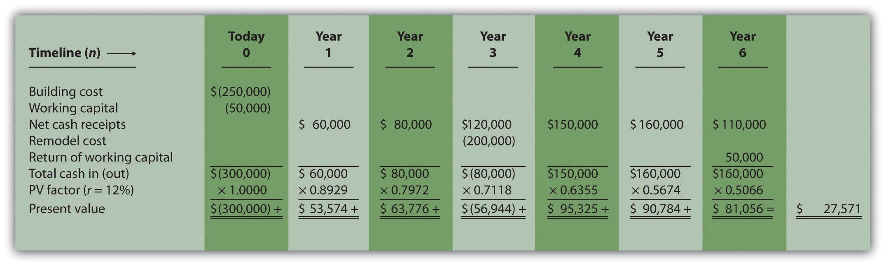

Net Present Value (NPV) analysis is a fundamental financial tool used to evaluate the profitability of investments. By comparing the present value of future cash flows generated by an investment to its initial cost, NPV analysis helps in determining whether an investment will yield positive returns. When the NPV is positive, it suggests that the expected earnings, adjusted for the time value of money, exceed the costs, making it a viable financial decision. This makes NPV a preferred method for financial decision-making, as it provides a clear metric for assessing the potential success of investments.

Working capital plays a crucial role in the daily operations of a business. Defined as the difference between a company's current assets and current liabilities, it indicates the short-term financial health and operational efficiency of the business. Effective working capital management ensures that a company can meet its short-term liabilities and operational expenses, maintaining smooth business operations.



The concept of net present value is central to evaluating investment opportunities as it accounts for the time value of money. This principle recognizes that a specific amount of money today is worth more than the same amount in the future due to its potential earning capacity. The formula for NPV is:

$$
\text{NPV} = \sum \left( \frac{C_t}{(1 + r)^t} \right) - C_0
$$

where $C_t$ is the cash flow at time $t$, $r$ is the discount rate, and $C_0$ is the initial investment cost. This calculates the present value of future cash flows, helping businesses compare and prioritize projects based on their respective NPVs.

Algorithmic trading, commonly referred to as algo trading, has become increasingly prominent in modern financial markets. It involves the use of computer algorithms to execute trades at speeds and frequencies that human traders cannot match. These algorithms can analyze vast data sets and execute orders based on predefined criteria, enhancing market efficiency. Algo trading includes various strategies such as high-frequency trading (HFT) and market-making, offering advantages like speed, accuracy, and reduced human error. However, it also comes with challenges, including market volatility and regulatory scrutiny.

This article aims to explore the intersections between NPV analysis, working capital management, and the emerging field of algorithmic trading. By understanding these concepts and their interplay, businesses and investors can leverage advanced financial strategies to enhance decision-making and maximize investment value.

## Table of Contents

## Understanding NPV Analysis

Net Present Value (NPV) is a fundamental financial metric used to evaluate the profitability of an investment or project. It represents the difference between the present value of cash inflows and the present value of cash outflows over a period of time. By determining this net value, investors can assess whether a project is likely to generate more value than the cost involved, which is crucial in making informed financial decisions.

The methodology for calculating NPV involves projecting future cash flows and applying a discount rate to calculate their present value. The formula for NPV is:

$$
NPV = \sum \left( \frac{C_t}{(1 + r)^t} \right) - C_0
$$

where:
- $C_t$ is the cash inflow during the period $t$,
- $r$ is the discount rate,
- $t$ is the number of time periods,
- $C_0$ is the initial investment cost.

For example, consider a project that requires an initial investment of $100,000 and is expected to generate cash inflows of $30,000 annually for five years. Assuming a discount rate of 10%, the NPV calculation would be as follows:

$$
NPV = \left( \frac{30,000}{(1+0.10)^1} + \frac{30,000}{(1+0.10)^2} + \frac{30,000}{(1+0.10)^3} + \frac{30,000}{(1+0.10)^4} + \frac{30,000}{(1+0.10)^5} \right) - 100,000
$$

Solving this yields:

$$
NPV = (27,273 + 24,793 + 22,539 + 20,490 + 18,627) - 100,000 = 13,722
$$

The positive NPV of $13,722 indicates that the project is likely to generate more value than its cost, making it potentially profitable.

NPV is favored over other investment appraisal techniques such as the payback period or internal rate of return (IRR) for several reasons. Unlike the payback period, which merely calculates how long it takes to recover the initial investment without accounting for the time value of money, NPV provides a value that considers both the magnitude and timing of cash flows. Meanwhile, the IRR method, while useful in determining the rate of return at which NPV equals zero, may lead to misleading results in cases of non-conventional cash flows or multiple IRRs. NPV's absolute measure helps investors compare projects of differing sizes and durations and aligns with the objective of wealth maximization.

In summary, NPV is a reliable and comprehensive tool for assessing investment profitability, enabling businesses to prioritize and select projects that promise superior returns relative to their costs.

## The Role of Working Capital in NPV Analysis

Working capital represents the difference between a company's current assets and current liabilities. It is a crucial measure of a company's operational [liquidity](/wiki/liquidity-risk-premium) and short-term financial health. Current assets typically include cash, accounts receivable, and inventory, while current liabilities comprise obligations such as accounts payable and short-term debt. Maintaining an optimal level of working capital is necessary for a business to meet its operational needs and invest in growth opportunities.

Changes in working capital directly influence a project's net present value (NPV). NPV assesses the profitability of an investment by evaluating the difference between the present value of cash inflows and outflows over time, with adjustments for working capital changes essential. An increase in working capital signifies that more funds are tied up in operations, reducing available cash flows for investment purposes, thereby decreasing NPV. Conversely, a reduction in working capital releases cash that can be used for growth, potentially increasing NPV.

Managing working capital efficiently involves several strategies. Companies can accelerate receivables collections, negotiate better payment terms with suppliers, or optimize inventory levels to ensure liquidity. Such measures enhance cash flow, thus influencing NPV positively. For instance, a hypothetical manufacturing company that optimizes its inventory turnover could reduce its working capital requirement, thereby enhancing its NPV and investment returns.

To illustrate, consider a project with an initial investment of $500,000 and expected annual cash inflows of $150,000 over five years. Assume the working capital requirement is $50,000 initially, increasing to $60,000 over the project term. The discount rate is 10%. The project's NPV can be calculated considering these working capital changes, influencing the investor's decision on the project's viability. Efficient working capital management, in this case, could involve maintaining the working capital at $50,000, subsequently improving the project's cash flow profile and increasing the NPV.

In conclusion, changes in working capital are integral to assessing the net present value of projects. By managing working capital prudently, companies can enhance liquidity, optimize cash flows, and increase the overall value and profitability of their investments.

## Net Present Value in Investment Decisions

Net Present Value (NPV) plays a crucial role in making informed investment decisions by providing a clear, quantifiable metric to evaluate the profitability of potential projects or investments. It facilitates the comparison of various investment opportunities, allowing decision-makers to assess which projects are likely to yield greater returns over time.

### Comparing Investment Opportunities

NPV allows investors to compare different projects by evaluating the expected net cash flows they generate, discounted back to present value terms. This comparison is essential because it accounts for the time value of money, a fundamental principle in finance that reflects the fact that a dollar today is worth more than a dollar in the future. The NPV of a project is given by:

$$
\text{NPV} = \sum_{t=0}^{n} \frac{C_t}{(1 + r)^t} - C_0
$$

where $C_t$ is the cash inflow during period $t$, $r$ is the discount rate, $n$ is the total number of periods, and $C_0$ is the initial investment. By computing the NPV for multiple projects, investors can objectively rank them and choose the one with the highest NPV, indicating the greatest potential for profit.

### Risk Assessment and Discount Rate Adjustment

Risk assessment significantly impacts NPV analysis. Since future cash flows are uncertain, adjusting the discount rate to reflect various risk levels is crucial. Higher-risk projects typically require a higher discount rate, which reduces the present value of future cash inflows, subsequently affecting the NPV. This adjustment helps investors [factor](/wiki/factor-investing) in uncertainty, making their analyses more conservative and reliable.

For example, consider two projects with identical cash flows but different risk profiles. The higher-risk project's NPV might be lower due to a higher discount rate, leading investors to prefer the project with the lower risk and higher NPV when other factors are equal.

### Positive NPV and Profitable Investments

A positive NPV indicates that the projected earnings, in present value terms, exceed the initial costs, suggesting a potentially profitable investment. It reflects that the project is expected to generate more wealth than it consumes, thereby increasing the firm's value. In contrast, a negative NPV suggests that the investment would result in a net loss, and thus, it is typically unadvisable to undertake. Therefore, NPV is a vital tool for steering investment decisions towards projects that promise value addition to the business.

In summary, NPV offers a comprehensive framework for evaluating investments, encapsulating both the cash flow magnitude and timing. It aids in distinguishing high-value projects, adjusting for risk, and ultimately ensuring that resources are allocated to the most promising opportunities.

## Algo Trading: Revolutionizing Financial Markets

Algorithmic trading, often referred to as algo trading, involves the use of computer programs to execute financial transactions at high speeds and volumes. It is a methodology in which trading instructions are fed into a computer model or algorithm, often with specific parameters such as timing, price, or [volume](/wiki/volume-trading-strategy). The rapid advancements in technology and computational power have accelerated the adoption of algo trading in global financial markets, making it a critical component of modern trading strategies.

One of the primary strategies within algo trading is high-frequency trading ([HFT](/wiki/high-frequency-trading-strategies)). HFT involves executing a large number of orders at extremely high speeds, often within milliseconds. By leveraging speed, algorithmic traders can exploit minute price discrepancies in the market, which are usually invisible to the human eye. Another popular strategy is market-making, where traders provide liquidity to the market by continuously buying and selling financial instruments, profiting from the bid-ask spread.

The advantages of [algorithmic trading](/wiki/algorithmic-trading) are numerous. Speed is one of the most significant benefits, as algorithms can execute orders in fractions of a second. This speed ensures the most advantageous prices and removes the latency associated with human decision-making. Additionally, algo trading is highly accurate, as it eliminates the errors that might arise from manual entry. The systematic nature of these algorithms ensures consistency in following prescribed trading strategies, reducing human biases and emotional influences.

Despite these advantages, algorithmic trading presents several challenges and risks. The increased speed and automation can lead to market [volatility](/wiki/volatility-trading-strategies), as seen in instances like the "Flash Crash" of 2010, where the Dow Jones Industrial Average plummeted before rapidly rebounding within minutes. The reliance on complex algorithms also raises operational risks due to possible technical failures or errors in code. Regulatory concerns are another significant consideration, as market regulators must balance the benefits of technological advancements with the need to ensure fair and orderly markets. Consequently, algorithms must comply with strict rules and guidelines to avoid manipulative or destabilizing behavior.

The integration of algo trading into financial practices continues to shape the future of the markets. While speed and efficiency are forefront, ongoing development in risk management and regulatory frameworks is essential to curb potential adverse effects, laying the groundwork for a more resilient financial trading landscape.

## Integrating NPV Analysis with Algo Trading

Integrating NPV analysis into algorithmic trading strategies can significantly enhance decision-making by bridging detailed financial evaluation techniques with automated trading systems. Net Present Value (NPV) analysis is a financial metric used to assess the profitability of investments by considering the projected cash flows, both incoming and outgoing, and discounting them to determine their present value. In algorithmic trading, this analysis can be embedded within algorithms to evaluate and select investment opportunities that promise higher long-term returns.

One example of an algorithm that incorporates NPV calculations in its decision-making process is a long-term investment strategy algorithm. Such algorithms are designed to identify undervalued assets by estimating their intrinsic value through NPV analysis. By continuously adjusting the estimates of future cash flows based on real-time data, the algorithm can make informed decisions about when to enter or [exit](/wiki/exit-strategy) positions. The algorithm might be coded in Python like this:

```python
def calculate_npv(rate, cash_flows):
    return sum(cash_flow / (1 + rate)**t for t, cash_flow in enumerate(cash_flows))

def evaluate_investment(strategy_data):
    for asset in strategy_data:
        npv_value = calculate_npv(asset['discount_rate'], asset['expected_cash_flows'])
        if npv_value > asset['current_market_price']:
            execute_buy_order(asset)
        elif npv_value < asset['current_market_price']:
            execute_sell_order(asset)
```

In this hypothetical example, `strategy_data` is a dataset containing asset-specific information such as `discount_rate`, expected `cash_flows`, and `current_market_price`. The algorithm evaluates the Net Present Value for each asset to determine whether to buy or sell based on market comparisons.

To facilitate the integration of NPV and related financial models into trading systems, several tools and technologies can be employed. Advanced data analytics platforms like MATLAB and Python libraries (e.g., NumPy, Pandas) are widely utilized to perform complex calculations and data manipulations. Additionally, trading platforms like MetaTrader and Bloomberg Terminal allow for algorithm customization, providing a comprehensive environment to implement these strategies.

Real-world case studies and theoretical models can demonstrate successful integration of NPV in algo trading. For instance, a trading firm might develop a model that uses NPV to prioritize investment in technology stocks, leveraging historical data and financial forecasts. Utilizing a [backtesting](/wiki/backtesting) framework, they can simulate trading strategies incorporating NPV, assessing their effectiveness over historical market conditions. Such models highlight the potential benefits of integrating sophisticated financial metrics into trading algorithms to enhance their predictive accuracy and investment performance.

By combining NPV analysis with automatable trading strategies, investors can gain a competitive edge, leveraging both quantitative analysis and the speed of algorithmic systems to maximize investment returns while minimizing risks.

## Conclusion

Combining NPV analysis, working capital management, and algorithmic trading presents a potent strategy for maximizing investment returns. NPV analysis provides a robust framework for evaluating the profitability of investments by assessing future cash flows relative to a project’s cost. Efficient working capital management ensures that sufficient resources are available to sustain business operations, impacting the net present value by influencing cash flow timing and the discount rate. Algorithmic trading enhances this analytical approach by introducing precision, speed, and the ability to process vast amounts of data to execute trades with minimized human error.

As investment strategies continue to evolve, integrating NPV analysis with algorithmic trading holds significant promise. These strategies can lead to more informed, data-driven decisions that better account for market dynamics and investment risks. The use of algorithmic trading to incorporate NPV insights allows investors to optimize asset allocation and dynamically adjust portfolios according to changing market conditions and evolving business environments.

The benefits of using data-driven approaches, such as algorithmic trading, are manifold. They include increased accuracy in decision-making, efficient handling of complex data sets, and the agility to respond quickly to market signals. This creates opportunities for investors to achieve superior returns while managing market risks more effectively.

Further exploration and study into advanced financial modeling techniques are crucial for adapting to the increasingly complex financial markets. Embracing innovations that integrate traditional financial analyses with cutting-edge technology can offer investors a competitive edge, enhancing their ability to make strategic, well-informed investment decisions in a rapidly changing financial landscape.

## References & Further Reading

[1]: Damodaran, A. (2012). ["Investment Valuation: Tools and Techniques for Determining the Value of Any Asset."](https://books.google.com/books/about/Investment_Valuation.html?id=5SRHAAAAQBAJ) Wiley Finance.

[2]: Fabozzi, F. J., & Markowitz, H. M. (2011). ["Equity Valuation and Portfolio Management."](https://onlinelibrary.wiley.com/doi/book/10.1002/9781118267028) Wiley.

[3]: Hull, J. C. (2018). ["Options, Futures, and Other Derivatives."](https://www.semanticscholar.org/paper/Options%2C-Futures%2C-and-Other-Derivatives-Hull/89bdee500c8623864fc9eb7a471546aa713acc44) Pearson.

[4]: Pástor, Ľ., & Stambaugh, R. F. (2002). ["Liquidity Risk and Expected Stock Returns."](https://www.cis.upenn.edu/~mkearns/finread/pastor.pdf) The Journal of Political Economy, 111(3), 642-685.

[5]: Narang, R. K. (2013). ["Inside the Black Box: A Simple Guide to Quantitative and High-Frequency Trading."](https://onlinelibrary.wiley.com/doi/book/10.1002/9781118662717) Wiley Trading.