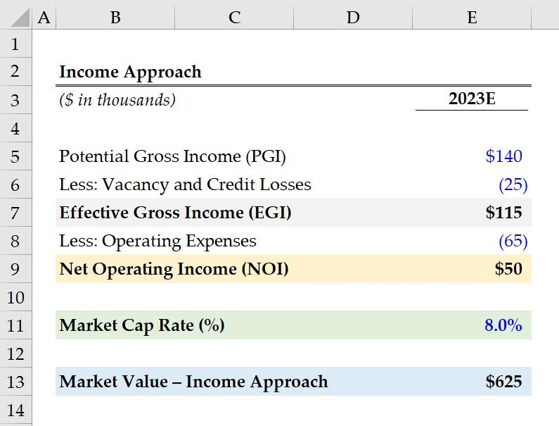

## Table of Contents

## What is the income approach in valuation?

The income approach in valuation is a method used to figure out how much a business or property is worth by looking at the money it makes. This approach focuses on the future earnings that the business or property is expected to bring in. It's like trying to guess how much money you'll make from an investment in the future. By using this method, you can see if buying a business or property is a good idea by comparing the expected earnings to the price you have to pay.

One common way to use the income approach is called the discounted cash flow (DCF) method. With DCF, you predict the future cash flows of the business or property and then figure out what those future earnings are worth today. This is done by using a discount rate, which is like an interest rate that shows how risky the investment is. If the present value of those future earnings is higher than the cost of the investment, it might be a good deal. This method helps investors make smart choices by focusing on the money they expect to earn over time.

## How does the income approach differ from other valuation methods?

The income approach to valuation focuses on the money a business or property is expected to make in the future. It's different from other methods because it looks at earnings over time, not just the current value. For example, the market approach compares the business or property to similar ones that have been sold recently. It's like looking at the price of houses in a neighborhood to guess the value of your own house. On the other hand, the cost approach looks at how much it would cost to replace the business or property if it were new. This is useful for things like buildings or machinery, where you can estimate the cost to build or buy them again.

The income approach is unique because it tries to predict future earnings and then figures out what those earnings are worth today. This is done using methods like discounted cash flow (DCF), where future cash flows are discounted back to the present. Other methods, like the market approach, don't consider future earnings; they just look at what similar things are selling for right now. The cost approach also doesn't focus on earnings; it's more about the cost to replace what you have. So, the income approach is best when you want to understand the value of future income, while the market and cost approaches are better for understanding current market value or replacement cost.

## What are the key components of the income approach?

The income approach to valuation looks at how much money a business or property will make in the future. The main part of this approach is figuring out the future cash flows. This means guessing how much money the business or property will bring in over time. You have to think about things like how much money will come in from sales, how much it will cost to run the business, and how long the business will keep making money.

Once you have an idea of the future cash flows, the next step is to find out what those future earnings are worth today. This is done using something called a discount rate. The discount rate is like an [interest rate](/wiki/interest-rate-trading-strategies) that shows how risky the investment is. If the investment is risky, you use a higher discount rate, which makes the future earnings worth less today. By using the discount rate, you can figure out the present value of the future cash flows. If this present value is more than what you have to pay for the business or property, it might be a good investment.

Putting these parts together, the income approach helps you decide if buying a business or property is a smart choice. It's all about comparing the price you have to pay with the money you expect to earn in the future. This method is especially useful when you want to understand the value of future income, which is why it's different from other methods that might look at current market prices or replacement costs.

## Can you explain the difference between net income and gross income in the context of valuation?

In the context of valuation, gross income is the total amount of money a business or property makes before any expenses are taken out. It's like the total sales or revenue that comes in from selling products or services. When you're trying to figure out the value of a business or property, gross income gives you an idea of how much money is coming in the door, but it doesn't tell you the whole story because it doesn't account for the costs of running the business.

Net income, on the other hand, is what's left after you subtract all the expenses from the gross income. These expenses can include things like the cost of goods sold, salaries, rent, and other operating costs. In valuation, net income is really important because it shows you how much profit the business or property is actually making. When you use the income approach to value a business, you often look at net income to understand the true [earning](/wiki/earning-announcement) potential, because it reflects the money that can be reinvested or distributed to owners after all costs are covered.

## What is the capitalization rate and how is it used in the income approach?

The capitalization rate, or cap rate, is a number used in the income approach to help figure out how much a property or business is worth. It's like a percentage that shows how much money you can expect to make from an investment each year compared to how much you paid for it. The cap rate is found by taking the net income of the property or business and dividing it by the price you paid or the value you want to find.

In the income approach, the cap rate is used to turn the yearly net income into a value for the whole property or business. If you know the net income and the cap rate, you can find the value by dividing the net income by the cap rate. For example, if a property makes $100,000 a year and has a cap rate of 5%, its value would be $2,000,000. This method is simple and quick, but it assumes that the income and expenses will stay the same, which might not always be true.

## How do you calculate the present value of future cash flows using the income approach?

To calculate the present value of future cash flows using the income approach, you start by predicting how much money the business or property will make in the future. This means guessing the cash flows for each year over a certain period. You need to think about how much money will come in from sales and how much it will cost to run the business. Once you have these future cash flow estimates, you add them up to get a total for the period you're looking at.

Next, you need to figure out what those future cash flows are worth today. This is done using a discount rate, which is like an interest rate that shows how risky the investment is. If the investment is risky, you use a higher discount rate. To find the present value, you take each year's cash flow and divide it by one plus the discount rate raised to the power of the number of years into the future. For example, if you expect to get $100 in one year and the discount rate is 10%, you would divide $100 by 1.10 to get the present value of about $90.91. You do this for each year's cash flow and then add them all up to get the total present value of the future cash flows.

## What role does the discount rate play in the income approach?

The discount rate is really important when you use the income approach to figure out how much a business or property is worth. It's like an interest rate that shows how risky the investment is. If the investment is risky, you use a higher discount rate. This rate helps you turn the money you expect to make in the future into what it's worth today. By using the discount rate, you can see if buying the business or property is a good deal by comparing the price you have to pay with the money you expect to earn.

When you're calculating the present value of future cash flows, the discount rate is the key. You take each year's expected cash flow and divide it by one plus the discount rate raised to the power of the number of years into the future. This makes future money worth less today, which is why a higher discount rate means the future earnings are worth less right now. By adding up all these present values, you get the total value of the future cash flows, which helps you decide if the investment is worth it.

## How can the income approach be applied to different types of assets, such as real estate or businesses?

The income approach can be used to value different kinds of assets, like real estate or businesses, by looking at the money they make. For real estate, you start by figuring out how much rent the property can bring in each year. This is called the net operating income (NOI), which is the rent minus the costs of running the property, like maintenance and taxes. You then use a capitalization rate, or cap rate, to turn this yearly income into a value for the whole property. The cap rate is like a percentage that shows how much money you can expect to make from the property each year compared to how much you paid for it. If a property makes $50,000 a year and has a cap rate of 5%, its value would be $1,000,000.

For businesses, the income approach works a bit differently but still focuses on future earnings. You start by predicting how much money the business will make in the future, called cash flows. These predictions need to account for how much money will come in from sales and how much it will cost to run the business. Then, you use a discount rate to figure out what those future earnings are worth today. The discount rate is like an interest rate that shows how risky the investment is. If the business is expected to make $100,000 next year and the discount rate is 10%, the present value of that $100,000 would be about $90,909. You do this for each year's cash flow and add them up to get the total value of the business. This method helps you see if buying the business is a good idea by comparing the price you have to pay with the money you expect to earn.

## What are the common challenges and pitfalls when using the income approach?

One big challenge with the income approach is guessing future earnings right. You have to predict how much money a business or property will make in the future, and that's not easy. Things can change, like the economy or how much people want to buy what the business sells. If your guesses are wrong, the value you come up with won't be right. Another problem is [picking](/wiki/asset-class-picking) the right discount rate. This rate shows how risky the investment is, and if you use the wrong one, you might think the investment is worth more or less than it really is.

Another pitfall is that the income approach assumes things will stay the same, which isn't always true. For example, the cost to run a business can go up, or the rent you can charge for a property might change. If you don't think about these changes, your valuation could be off. Also, this method can be hard to use for businesses or properties that don't have a steady income, like startups or properties that are empty a lot. In these cases, it's tough to predict future earnings, so the income approach might not be the best way to figure out their value.

## How do market conditions affect the income approach to valuation?

Market conditions can have a big impact on the income approach to valuation. This method looks at how much money a business or property is expected to make in the future. If the market is doing well, people might be willing to pay more for what the business sells or rent the property for more money. This means the future earnings could be higher, which would make the business or property worth more. On the other hand, if the market is struggling, people might not want to buy as much or might not be able to afford high rents. This could lower the future earnings, making the business or property less valuable.

Another way market conditions affect the income approach is through the discount rate. The discount rate is like an interest rate that shows how risky an investment is. When the market is doing well, investors might feel more confident and use a lower discount rate, which makes future earnings worth more today. But if the market is shaky, investors might feel more nervous and use a higher discount rate, which makes future earnings worth less today. So, market conditions can change both the future earnings and how much those earnings are worth right now, which can really affect the value you come up with using the income approach.

## Can you discuss advanced techniques in the income approach, such as multi-period discounting?

Multi-period discounting is a fancy way of figuring out the value of a business or property by looking at the money it will make over many years. Instead of just guessing the earnings for one year and using a simple cap rate, multi-period discounting looks at the earnings for each year separately. You predict how much money the business or property will make each year and then use a discount rate to figure out what those future earnings are worth today. This method is more detailed because it takes into account that the money made in the first year is worth more than the money made in later years, since you can use that money sooner.

This technique is really helpful when the earnings of a business or property are expected to change a lot over time. For example, a new business might not make much money at first but could grow a lot later on. By using multi-period discounting, you can see how the value changes as the business grows. It's also good for properties where the rent might go up or down over time. Even though it's more work to predict earnings for many years and use a discount rate for each one, multi-period discounting can give you a more accurate picture of the value because it looks at the whole story of the business or property's earnings.

## How can sensitivity analysis be used to enhance the accuracy of valuations using the income approach?

Sensitivity analysis is a way to check how changes in your guesses can affect the value of a business or property when using the income approach. It's like seeing what happens if you're a little off with your predictions about future earnings or the discount rate. By changing these numbers a bit and seeing how the final value changes, you can understand which parts of your valuation are most important and where you need to be really careful with your guesses. This helps make your valuation more accurate because you can see how sensitive the value is to different assumptions.

For example, if you guess that a business will make $100,000 next year but you're not sure, you can use sensitivity analysis to see what happens if it makes $90,000 or $110,000 instead. You can also change the discount rate to see how that affects the value. By doing this, you get a range of possible values instead of just one number. This range helps you see the best and worst cases, which makes your valuation more reliable. It's a good way to be ready for different situations and make better decisions about whether to buy a business or property.

## What is the Income Approach in Real Estate Appraisal and how is it understood?

The Income Approach is a fundamental method in real estate appraisal, primarily employed to estimate the value of income-producing properties. This method derives a property's value based on the anticipated income it will generate, typically through rentals or leases. The principle of anticipation underpins this approach, positing that the value of a property is intrinsically linked to its expected future benefits, or income streams.

In application, the Income Approach evaluates the income-generating potential of a property, which involves estimating the net operating income (NOI). This figure is calculated by deducting operating expenses from the total income generated by the property. The capitalization rate, or cap rate, plays a critical role in this approach. The cap rate is a rate of return on a real estate investment property based on the income that the property is expected to generate. It is used to convert the NOI into an estimate of the property’s market value. The formula is articulated as follows:

$$
\text{Property Value} = \frac{\text{Net Operating Income (NOI)}}{\text{Capitalization Rate}}
$$

Cap rates are influenced by factors such as property location, market conditions, and property-specific risks. A lower cap rate indicates a higher property value, reflecting lower risk and potentially higher demand, while a higher cap rate indicates higher risk.

Properties best suited for the Income Approach typically include commercial real estate such as office buildings, shopping centers, and apartment complexes. These types of properties generate consistent and predictable income streams, making them ideal candidates for valuation through this method.

By focusing on the income production capability, the Income Approach provides a clear picture of an investment’s potential, enabling investors to make informed decisions based on both current and foresightful income possibilities.

## References & Further Reading

[1]: Bergstra, J., Bardenet, R., Bengio, Y., & Kégl, B. (2011). ["Algorithms for Hyper-Parameter Optimization."](https://dl.acm.org/doi/10.5555/2986459.2986743) Advances in Neural Information Processing Systems 24.

[2]: ["Advances in Financial Machine Learning"](https://www.amazon.com/Advances-Financial-Machine-Learning-Marcos/dp/1119482089) by Marcos Lopez de Prado

[3]: ["Evidence-Based Technical Analysis: Applying the Scientific Method and Statistical Inference to Trading Signals"](https://www.amazon.com/Evidence-Based-Technical-Analysis-Scientific-Statistical/dp/0470008741) by David Aronson

[4]: ["Machine Learning for Algorithmic Trading"](https://github.com/PacktPublishing/Machine-Learning-for-Algorithmic-Trading-Second-Edition) by Stefan Jansen

[5]: ["Quantitative Trading: How to Build Your Own Algorithmic Trading Business"](https://books.google.com/books/about/Quantitative_Trading.html?id=j70yEAAAQBAJ) by Ernest P. Chan