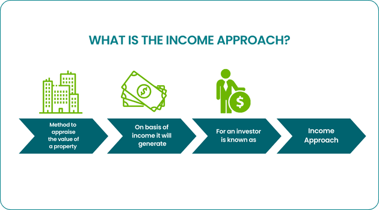

Real estate appraisal, also known as property valuation, is the process of determining the value of real estate. It is crucial in the property market as it forms the basis for mortgage lending, investment analysis, property insurance, and taxation. Accurate appraisals ensure that properties sell within a reasonable time and at fair prices, maintaining market balance. Various valuation methods are employed in real estate transactions to assess property value effectively. These include the Sales Comparison Approach, the Cost Approach, and the Income Approach, each offering unique advantages depending on property type and contextual factors.

The Sales Comparison Approach involves comparing a property with similar recently sold properties, adjusting for differences in features, conditions, and other variables. This method is widely used for residential properties. The Cost Approach evaluates the cost of replacing a property, subtracting depreciation, and is primarily used for unique or new properties where there is little market activity. Meanwhile, the Income Approach is pivotal for valuation in properties that generate income, such as commercial real estate. It assesses value based on anticipated future income streams, providing a robust framework for evaluating investment properties.



The Income Approach involves estimating potential rental income, deducting operation expenses, and determining net operating income (NOI). The formula for property value (V) in the Income Approach can be expressed as:

$$
V = \frac{\text{NOI}}{\text{Capitalization Rate}}
$$

where the capitalization rate reflects the investor's desired rate of return, encompassing risk considerations. This method is particularly significant in commercial real estate and multi-family residential properties where income potential directly correlates with investment decisions.

Real estate valuation has increasingly intersected with algorithmic trading, a method predominantly utilized in financial markets for automated trading decisions based on complex algorithms. The integration of algorithmic trading techniques in real estate offers a significant evolution, providing enhanced data analysis and decision-making speed, crucial in a dynamic property market.

Algorithms can process vast amounts of data swiftly, identifying undervalued properties and predicting market trends with incredible accuracy. This intersection holds the promise of revolutionizing real estate valuation, enabling investors to make informed decisions based on real-time data analytics and sophisticated forecasting models.

This article will explore the integration of the Income Approach in property valuation with algorithmic trading, showcasing how this modern synthesis can enhance real estate investment strategies, fostering innovative opportunities in the property market.

## Table of Contents

## Understanding the Income Approach in Real Estate Appraisal

The Income Approach is a fundamental method in real estate appraisal, primarily employed to estimate the value of income-producing properties. This method derives a property's value based on the anticipated income it will generate, typically through rentals or leases. The principle of anticipation underpins this approach, positing that the value of a property is intrinsically linked to its expected future benefits, or income streams.

In application, the Income Approach evaluates the income-generating potential of a property, which involves estimating the net operating income (NOI). This figure is calculated by deducting operating expenses from the total income generated by the property. The capitalization rate, or cap rate, plays a critical role in this approach. The cap rate is a rate of return on a real estate investment property based on the income that the property is expected to generate. It is used to convert the NOI into an estimate of the property’s market value. The formula is articulated as follows:

$$
\text{Property Value} = \frac{\text{Net Operating Income (NOI)}}{\text{Capitalization Rate}}
$$

Cap rates are influenced by factors such as property location, market conditions, and property-specific risks. A lower cap rate indicates a higher property value, reflecting lower risk and potentially higher demand, while a higher cap rate indicates higher risk.

Properties best suited for the Income Approach typically include commercial real estate such as office buildings, shopping centers, and apartment complexes. These types of properties generate consistent and predictable income streams, making them ideal candidates for valuation through this method.

By focusing on the income production capability, the Income Approach provides a clear picture of an investment’s potential, enabling investors to make informed decisions based on both current and foresightful income possibilities.

## Algorithmic Trading: An Overview

Algorithmic trading, often referred to as algo-trading, involves the use of computer algorithms to automate trading orders based on predefined criteria. These criteria can range from timing, price, quantity, or any mathematical model that dictates trading opportunities. It is a dominant force in financial markets due to its ability to execute trades with speed and precision, far surpassing human capabilities. 

The benefits of [algorithmic trading](/wiki/algorithmic-trading) are numerous. Algorithms enable traders to make data-driven decisions by analyzing vast amounts of market data in real time. This allows for the identification of subtle market patterns that would be too complex or time-consuming for manual analysis. Through the use of sophisticated algorithms, traders can respond to market conditions with high accuracy and efficiency, thereby reducing risks associated with emotional decision-making.

Speed is another cornerstone of algorithmic trading. Algorithms process market data and execute trades in fractions of a second, a feat unachievable by human traders. This rapid response to market changes is crucial in high-frequency trading ([HFT](/wiki/high-frequency-trading-strategies)), where the ability to enter and [exit](/wiki/exit-strategy) positions quickly can determine profitability. 

Algorithmic trading strategies are constructed through a blend of technical analysis, statistical modeling, and computational algorithms. These strategies include trend-following, [arbitrage](/wiki/arbitrage) opportunities, and [market making](/wiki/market-making), among others. For instance, a simple moving average crossover strategy might look at two moving averages, a short-term and a long-term one. The algorithm would execute a buy signal when the short-term average crosses above the long-term average and a sell signal when it crosses below.

```python
def moving_average_crossover(prices, short_window, long_window):
    short_ma = prices.rolling(window=short_window, min_periods=1).mean()
    long_ma = prices.rolling(window=long_window, min_periods=1).mean()
    signal = (short_ma > long_ma).astype(int)
    return signal
```

This Python code snippet shows a basic implementation of an algorithmic trading strategy based on moving average crossovers. 

In the context of real estate investment, algorithmic trading strategies can be adapted to analyze property equities, Real Estate Investment Trusts (REITs), or derivatives tied to real estate assets. The integration of such strategies enables investors to capitalize on inefficiencies in real estate markets, similar to those exploited in traditional financial markets. As the real estate sector gradually incorporates more data analytics and real-time data feeds, the application of algorithmic trading represents an innovative frontier for real estate investors, offering a systematic and quantitative approach to investment decisions.

## Integrating the Income Approach with Algorithmic Trading

Integrating real estate valuation methods like the Income Approach with algorithmic trading offers significant advantages to investors seeking to optimize property investments. By leveraging computational prowess, algorithms can enhance the accuracy and timeliness of property appraisals, which is crucial for making informed investment decisions. The Income Approach, a valuation method centered on anticipated future income, is particularly well-suited for this integration due to its reliance on quantifiable data such as rental income and capitalization rates.

Algorithms can effectively utilize the Income Approach to identify undervalued properties by rapidly analyzing large datasets to uncover patterns and anomalies that may indicate value discrepancies. For instance, an algorithm can assess a property's expected income against comparable properties, factoring in current market conditions. This analysis can pinpoint properties that are priced below their income-generating potential, providing opportunities for savvy investments.

Moreover, algorithms can incorporate dynamic market data, such as real-time rental trends and interest rates, to refine property valuations continually. A change in rental rates can significantly impact a property's income potential, and algorithms can adjust valuations accordingly. Likewise, fluctuations in interest rates, which affect investors' cost of capital, can be integrated to provide a more accurate valuation outlook.

There have been successful applications of this integration in the market. For example, some tech-driven real estate platforms have started utilizing algorithms to provide real-time property valuations, incorporating both traditional appraisal methods and dynamic market data. These platforms not only streamline the investment process but also reduce the risk of human error and bias, providing more consistent and objective investment analyses.

The integration's effectiveness hinges on the accuracy and quality of the underlying data. Any inaccuracy in data inputs can compound through algorithmic processes, leading to erroneous valuations and suboptimal investment decisions. Thus, maintaining high data quality, with rigorous validation and verification, is crucial for success.

In conclusion, integrating the Income Approach with algorithmic trading can significantly enhance real estate appraisal and investment processes by leveraging the strength of algorithms in handling complex datasets and dynamic market conditions. However, the success of this approach depends on the deployment of high-quality data and robust algorithmic models to realize its full potential.

## Challenges and Considerations

Utilizing algorithmic trading for real estate valuation presents several challenges and considerations. One primary area of concern is the technological and data-related hurdles that need to be addressed. Algorithmic trading systems heavily rely on vast amounts of accurate data to function effectively. In real estate, data can include property prices, rental income, market trends, and economic indicators. Ensuring the accuracy, timeliness, and completeness of this data is crucial for the algorithms to produce reliable valuations. Data discrepancies, missing information, or outdated datasets can lead to erroneous valuations and misguided investment decisions.

Another significant challenge lies in market [volatility](/wiki/volatility-trading-strategies) and its impact on algorithmic strategies. Real estate markets can experience fluctuations due to varying economic conditions, interest rates, and demographic shifts. Algorithms must be capable of adapting to such changes while maintaining their predictive accuracy. Volatile markets can lead to increased risks, making it essential for algorithms to incorporate mechanisms for risk management and sensitivity to unforeseen market shifts.

Legal and regulatory aspects also play a crucial role in the use of algorithmic trading strategies in real estate. Different jurisdictions may have varying regulations concerning data privacy, market operations, and financial transactions. Algorithms must comply with these regulations, necessitating legal oversight and regular updates to ensure adherence. Additionally, transparency in algorithmic processes is essential to meet regulatory standards and gain the trust of stakeholders.

To mitigate these challenges, several recommendations can be put forward. Enhancing data accuracy and quality is foundational. This can be achieved by integrating advanced data analytics and [machine learning](/wiki/machine-learning) techniques that continuously validate and update datasets. Developing robust algorithms capable of handling real-time data and adapting to market volatility is also crucial. This may involve incorporating features such as real-time data feeds, scenario analysis, and dynamic parameter adjustments.

Furthermore, establishing a strong governance framework to oversee compliance with legal and regulatory requirements is necessary. Regular audits and updates of algorithmic systems can ensure alignment with existing laws and anticipate changes in regulations. Building a multidisciplinary team, including data scientists, financial analysts, and legal experts, can facilitate a comprehensive approach to addressing these challenges.

Overall, while the integration of algorithmic trading with real estate valuation holds promise, careful consideration of these challenges is essential to fully leverage the potential advantages of this synergy.

## Future Trends and Implications

The future of real estate appraisal and investment is being reshaped by advancements in both real estate technology (proptech) and financial technology (fintech). These innovations are introducing more sophisticated valuation methods and reshaping investment strategies. Key trends include the growing application of data analytics, machine learning, and blockchain technology to streamline and enhance property valuation processes.

One significant trend is the development of algorithms capable of handling increasingly complex valuation scenarios. These algorithms are designed to incorporate vast and varied datasets, including real-time market trends, economic indicators, and consumer behavior patterns. For example, machine learning models can be trained on historical and current data to predict future property values with greater accuracy than traditional methods. This capability is crucial for investors seeking to identify undervalued properties or to anticipate market shifts.

The implications for real estate investors and stakeholders are profound. Enhanced algorithmic models enable investors to make more informed decisions, leading to optimized investment portfolios and potentially higher returns. Real-time data processing allows for faster transaction times and reduced operational costs. Additionally, these technologies offer increased transparency and accessibility of information, empowering a broader range of investors to participate in the market.

As these trends evolve, they are likely to redefine the landscape of real estate investing. Increased automation and data-driven insights could lead to more stable markets by reducing information asymmetries and mitigating risks. The integration of advanced technologies might also result in the creation of new financial instruments and investment vehicles tailored to specific risk profiles and market conditions.

Artificial intelligence and machine learning are particularly pivotal in enhancing the integration of new technologies with traditional real estate valuation methods. Machine learning algorithms, for example, can continuously improve as they process more data, leading to increasingly accurate and efficient valuations. These technologies can also adapt to changing market conditions by dynamically updating valuation models based on the latest data, offering a competitive edge to early adopters.

In summary, the integration of advanced algorithms, [artificial intelligence](/wiki/ai-artificial-intelligence), and machine learning is set to transform real estate appraisal and investment. These technologies promise to provide more precise and dynamic valuations, optimize investment strategies, and democratize access to real estate markets. As these innovations continue to unfold, they will undoubtedly shape the future of real estate, offering new opportunities and challenges for investors and other stakeholders in the industry.

## Conclusion

In this article, we have explored the potential synergy between the Income Approach in real estate appraisal and algorithmic trading. The integration of these two methodologies stands to offer significant benefits by enhancing the precision and efficiency of property valuation. By employing the Income Approach, which is fundamentally based on the anticipation of future income, algorithmic trading systems can dynamically evaluate a property's value through data-driven insights, considering factors such as rental income and capitalization rates.

Real estate professionals are encouraged to embrace these advanced techniques, as they present opportunities for more informed decision-making and the identification of undervalued properties. As the real estate industry experiences a digital transformation, staying abreast of technological advancements in algorithmic trading and property valuation becomes crucial.

Looking ahead, the evolution of real estate appraisal and investment strategies will likely be shaped by further refinement and adoption of these modern methods. The ongoing development of artificial intelligence and machine learning technologies promises to revolutionize property valuation, enabling systems that can handle increasingly complex scenarios. This progress will afford investors and stakeholders new avenues for enhancing their investment strategies and maintaining a competitive edge in the market.

## References & Further Reading

[1]: Bergstra, J., Bardenet, R., Bengio, Y., & Kégl, B. (2011). ["Algorithms for Hyper-Parameter Optimization."](https://dl.acm.org/doi/10.5555/2986459.2986743) Advances in Neural Information Processing Systems 24.

[2]: ["Advances in Financial Machine Learning"](https://www.amazon.com/Advances-Financial-Machine-Learning-Marcos/dp/1119482089) by Marcos Lopez de Prado

[3]: ["Evidence-Based Technical Analysis: Applying the Scientific Method and Statistical Inference to Trading Signals"](https://www.amazon.com/Evidence-Based-Technical-Analysis-Scientific-Statistical/dp/0470008741) by David Aronson

[4]: ["Machine Learning for Algorithmic Trading"](https://github.com/PacktPublishing/Machine-Learning-for-Algorithmic-Trading-Second-Edition) by Stefan Jansen

[5]: ["Quantitative Trading: How to Build Your Own Algorithmic Trading Business"](https://books.google.com/books/about/Quantitative_Trading.html?id=j70yEAAAQBAJ) by Ernest P. Chan