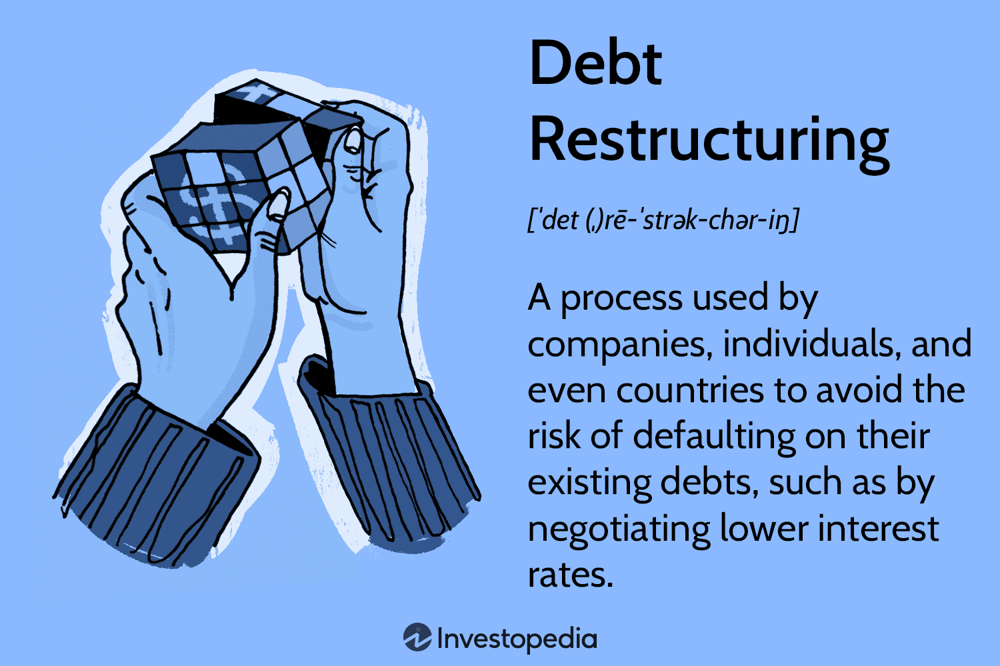

The world of finance is intricate, with numerous instruments offering varied benefits and risks. Companies often employ specific financial instruments to navigate their complex environments effectively. Among these, income bonds and debt restructuring are pivotal tools, especially for companies facing financial difficulties. These instruments play a crucial role by providing flexibility and easing financial pressures that might otherwise lead to insolvency or severe financial hardship.

Income bonds stand out as unique debt securities. They assure the repayment of their face value, yet the interest payment is contingent upon the issuer's capacity to generate earnings. This characteristic makes them distinct from traditional bonds which have fixed coupon payments. Income bonds are beneficial during periods of corporate restructuring, such as Chapter 11 bankruptcy, allowing companies breathing room to redirect their financial resources without the pressing obligation of mandatory interest payments.

Concurrently, debt restructuring is a significant process for companies striving to overcome financial strain. By modifying the terms of existing debt agreements, organizations can adapt their financial obligations to align better with their current capabilities. This might involve extending the maturity period of loans or renegotiating interest rates, ultimately helping maintain operations and financial stability.

Moreover, the rise of algorithmic trading has revolutionized access to financial markets. By automating trade execution with computer programs based on pre-set criteria, algorithmic trading enhances efficiency and participation across market segments. Its role in fixed-income markets, where income bonds are traded, allows for enhanced analysis and decision-making through rapid processing of data and predictive analytics.

As financial markets evolve, the intersection of algorithmic trading with income bonds and debt restructuring signifies a shift toward more data-driven, strategic approaches in corporate finance. Understanding these instruments is critical for comprehending the broader financial landscape. The importance of adopting an informed, analytical approach aided by advanced technological tools is evident as financial markets become increasingly digitalized. This evolving landscape necessitates that industry professionals remain adaptable and well-versed in leveraging both traditional and innovative financial strategies for sustainable success.

## Table of Contents

## Understanding Financial Instruments: Income Bonds

Income bonds are a type of debt security with distinct characteristics compared to traditional bonds. These bonds promise to repay the principal value at maturity but have interest payments that depend on the issuer's earnings. Such an arrangement makes them a flexible financial tool, particularly beneficial for companies experiencing fiscal difficulties.

Traditional bonds typically require issuers to make fixed interest payments, regardless of their financial performance. In contrast, income bonds do not mandate fixed coupon payments. Instead, they allow issuers to pay interest based only on their ability to generate earnings. This mechanism is particularly valuable for companies undergoing financial distress or corporate restructuring. For instance, during Chapter 11 bankruptcy proceedings, income bonds can provide companies with the flexibility they need to manage cash flow effectively without the pressure of fixed interest commitments.

The primary attraction of income bonds lies in their potential to provide stability during uncertain economic conditions. They offer issuers the opportunity to reallocate financial resources and prioritize other pressing financial obligations without the burden of unfaltering interest payments. For investors, these bonds present an opportunity to earn interest that correlates with the issuer's financial success. However, this comes with the trade-off of uncertain income, as interest is not guaranteed and is instead contingent upon the issuer's profitability.

Income bonds are therefore highly appealing to organizations that prioritize cash flow management. They enable companies to focus on operational recovery and strategic investments while maintaining a manageable level of debt servicing. For investors who are willing to accept the variability in income, these bonds offer a way to invest in a company's potential recovery and success, aligning their returns with the issuer's financial health. 

By incorporating income bonds into their capital structure, organizations can effectively navigate periods of financial strain, using the flexibility of these instruments to ensure alignment between their debt obligations and revenue-generating capabilities.

## Debt Restructuring and Its Implications

Debt restructuring is a fundamental process for companies experiencing financial distress. By modifying the terms of existing debt, firms can alleviate immediate financial pressures and stabilize operations. A primary objective of debt restructuring is to adjust payment schedules or interest obligations to maintain the company's cash flow and operational viability.

In reshaping debt obligations, a company can renegotiate conditions such as reducing interest rates or extending the maturity period of loans. This flexibility is crucial, enabling companies to manage [liquidity](/wiki/liquidity-risk-premium) constraints more effectively. For instance, a firm paying $P \times r$ as an annual interest for a debt of amount $P$ at an [interest rate](/wiki/interest-rate-trading-strategies) $r$, could renegotiate $r$ to a lower value, thus reducing annual interest costs.

The issuance of income bonds is an integral aspect of this process. These bonds allow companies to link interest payments to earnings, providing the issuer with breathing space during periods of uncertain revenue. Because these bonds do not mandate fixed coupon payments, they offer an advantageous tool for companies needing to reallocate financial resources to essential operations during restructuring. This mechanism can cushion financial pressures and assist companies in avoiding insolvency by providing a flexible repayment structure.

Effective debt restructuring extends beyond mere modifications of financial terms. It involves a comprehensive evaluation and strategic planning to ensure alignment with both creditor interests and business continuity goals. Such strategic realignment can protect company assets and enhance long-term viability. When done successfully, it mitigates the risk of bankruptcy and supports gradual recovery to financial stability.

Crafting a successful restructuring strategy requires meticulous planning, including analyzing cash flows, assessing asset values, and projecting future revenue streams. It also necessitates negotiations with creditors to reach mutually beneficial terms. Incorporating these elements helps create a restructuring plan that not only addresses immediate financial challenges but also facilitates sustainable business operations moving forward. This approach ensures that the restructuring serves as a constructive pathway for the company's future growth and stability.

## Algorithmic Trading in Fixed-Income Markets

Algorithmic trading involves the use of computer algorithms to automate the execution of trades based on predefined criteria, enhancing both the speed and efficiency of transactions. This technological advancement has significantly impacted the fixed-income markets, where bonds and other debt instruments are traded. In these markets, [algorithmic trading](/wiki/algorithmic-trading) facilitates rapid decision-making by analyzing large volumes of data and leveraging analytics to forecast market trends and optimize trading strategies.

The integration of [artificial intelligence](/wiki/ai-artificial-intelligence) (AI) into algorithmic trading systems is revolutionizing the analysis and management of fixed-income securities. AI-driven algorithms can process vast quantities of data quickly, detecting patterns and trends that may not be immediately obvious to human traders. This analytical capability provides traders with a competitive edge by enabling more informed trading decisions and more effective risk management. For example, [machine learning](/wiki/machine-learning) models can be utilized to predict interest rate changes and assess the creditworthiness of bond issuers.

However, the increasing reliance on algorithmic trading is not without its challenges. One significant concern is the risk of market manipulation. Algorithms can sometimes be exploited to create artificial market movements, leading to unfair trading advantages or destabilization of market prices. Moreover, the speed at which algorithmic trades can occur may contribute to systemic liquidity issues. For instance, during market upheavals, the swift execution of massive sell orders by algorithms could strain the market's liquidity, exacerbating price [volatility](/wiki/volatility-trading-strategies) and potentially resulting in a "flash crash."

To mitigate these risks, regulatory bodies have imposed measures to monitor and control algorithmic trading activities, ensuring that they do not disrupt market stability. Traders and financial institutions are also investing in robust risk management systems capable of overseeing algorithmic strategies and intervening when necessary to prevent undesirable outcomes.

In conclusion, while algorithmic trading presents substantial opportunities for efficiency and strategic advantage in fixed-income markets, it also poses significant risks that require careful management and regulation. As technology continues to advance, finding a balance between leveraging these innovations and maintaining market integrity will be crucial.

## The Intersection of Debt Restructuring and Algo Trading

Algorithmic trading is a transformative force in modern financial markets, particularly in the fixed-income sector, where its impact on debt restructuring is increasingly evident. By leveraging advanced computational algorithms, market participants gain rapid access to liquidity, which is crucial for facilitating efficient restructuring processes. The ability to swiftly assess market conditions via real-time data analytics is invaluable for companies undergoing restructuring efforts, as it ensures alignment with volatile bond market climates. 

This real-time data access enables organizations to make informed decisions amidst market fluctuations. Algorithms optimize the strategic buying and selling of restructured debt instruments, providing a platform for precise and timely financial decisions. This capability is significantly beneficial for optimizing capital structure during restructuring efforts. For instance, financial algorithms can automate the complex process of evaluating bond prices and yield spreads, enhancing decision-making speed and accuracy.

The integration of algorithmic trading and debt restructuring represents a paradigm shift in financial management, emphasizing the need for professionals to embrace technological advancements. The automation and data-driven insights offered by algorithmic trading provide a framework for managing and leveraging restructuring processes more effectively, thereby reducing the time and cost involved compared to traditional methods. This evolution demands a skill set that combines financial acumen with technological knowledge, highlighting the growing importance of fintech in the financial industry.

Moreover, this synergy underscores an evolving financial landscape where digital innovation influences traditional methodologies. By adopting a strategic approach to finishing restructuring initiatives with the help of algorithmic trading, financial institutions can achieve enhanced outcomes that are aligned with modern market dynamics. This intersection highlights the benefits of combining swift data processing capabilities with strategic financial planning to ensure successful debt management and market competitiveness.

## Conclusion: Navigating the Future of Financial Instruments

The nuanced interplay between income bonds, debt restructuring, and algorithmic trading reflects the dynamic nature of modern financial markets. Each of these elements serves as a crucial component in the strategic toolkit of financial professionals who aim to navigate the complexities of market volatility and corporate finance. Understanding these mechanisms is not just advantageous; it is imperative.

Income bonds, with their conditional interest payments, provide companies in financial distress a valuable lifeline by allowing flexibility in cash flow management. This flexibility is a pivotal consideration during debt restructuring processes, where the ability to modify terms can forestall insolvency and facilitate business continuity. In this context, income bonds are a strategic tool for stabilizing finances under precarious conditions.

Debt restructuring itself, by renegotiating terms such as interest rates and maturity periods, aids corporations in regaining financial stability. A well-executed restructuring plan aligns the interests of creditors and the company while safeguarding operations. This process can be greatly enhanced by the strategic utilization of algorithmic trading.

Algorithmic trading plays a transformative role by introducing efficiency and precision in financial markets. In fixed-income markets, algorithms analyze extensive datasets to predict trends and optimize trades, providing competitive advantages. The integration of AI and machine learning in these processes underscores the necessity for professionals to harness these technological advancements in their strategic frameworks. 

Incorporating these elements into a cohesive financial strategy is critical for maintaining market competitiveness. Balancing innovative algorithmic techniques with traditional financial principles ensures robust risk management and optimal investment outcomes. This equilibrium is vital as it allows for the agile adjustment to evolving market conditions, leveraging both cutting-edge technology and established practices.

Staying informed and adaptable in this rapidly changing landscape is of paramount importance. Financial professionals must continuously update their knowledge and skills to effectively manage these sophisticated instruments, thereby facilitating stable and profitable financial futures. The synergy between technological innovations and traditional methodologies will be the cornerstone for navigating the future of financial instruments in an increasingly digital era.

## References & Further Reading

[1]: Titman, Sheridan, & Martin, John D. (2016). ["Valuation: The Art and Science of Corporate Investment Decisions"](https://www.pearson.com/en-us/subject-catalog/p/valuation-the-art-and-science-of-corporate-investment-decisions/P200000006430/9780137614400) (3rd Edition). Pearson.

[2]: Altman, Edward I. (1993). ["Corporate Financial Distress and Bankruptcy: A Complete Guide to Predicting and Avoiding Distress and Profiting from Bankruptcy"](https://archive.org/details/corporatefinanci0000altm) (2nd Edition). Wiley.

[3]: ["Fixed Income Securities: Tools for Today's Markets"](https://www.amazon.com/Fixed-Income-Securities-Markets-Finance/dp/1119835550) by Bruce Tuckman and Angel Serrat

[4]: ["Algorithmic Trading and DMA: An introduction to direct access trading strategies"](https://archive.org/details/algorithmictradi0000john) by Barry Johnson

[5]: Hull, John C. (2017). ["Options, Futures, and Other Derivatives"](https://www.semanticscholar.org/paper/Options%2C-Futures%2C-and-Other-Derivatives-Hull/89bdee500c8623864fc9eb7a471546aa713acc44) (10th Edition). Pearson.