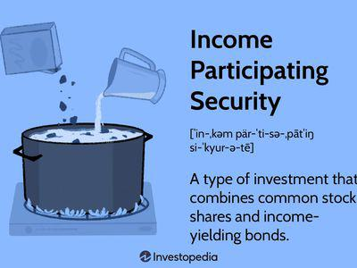

## Table of Contents

## What are Income Deposit Securities (IDS)?

Income Deposit Securities (IDS) are a type of investment product that combines common shares of a company with a debenture, which is a type of debt instrument. This means that when you buy an IDS, you are getting both ownership in the company through the shares and a promise of regular interest payments from the debenture. The idea behind IDS is to offer investors a way to get both the potential for growth from the shares and a steady income from the interest payments.

IDS can be attractive to investors who want to diversify their portfolio without having to buy separate stocks and bonds. By bundling these two types of investments into one security, IDS can simplify the investment process and potentially reduce costs. However, like any investment, IDS come with risks, such as the possibility that the company might not perform well, affecting both the value of the shares and the ability to make interest payments on the debenture.

## How do Income Deposit Securities work?

Income Deposit Securities (IDS) are a special kind of investment that mixes two things: shares in a company and a debenture, which is like a loan to the company. When you buy an IDS, you get to own part of the company through the shares, and you also get regular interest payments from the debenture. This means you can make money in two ways: if the company does well, the value of your shares might go up, and you also get steady income from the interest.

IDS can be a good choice if you want to invest in both stocks and bonds but don't want to buy them separately. It's like getting a package deal that can make your investing easier and might save you some money. But remember, IDS also have risks. If the company doesn't do well, the value of your shares could drop, and the company might struggle to pay the interest on the debenture. So, it's important to think carefully before investing in IDS.

## What is the history of Income Deposit Securities?

Income Deposit Securities (IDS) were first introduced in the late 1990s. They were created to give investors a new way to invest in a company by combining shares and a debenture into one product. This idea was popular because it allowed people to get both the growth potential of stocks and the steady income from bonds in one investment. The first IDS was issued by a Canadian company called Premium Brands Holdings Corporation in 1999. This helped make IDS more well-known and showed that this type of investment could work.

Since then, IDS have been used by different companies, mostly in Canada and the United States. They became more common in the early 2000s as more investors and companies saw the benefits of this combined investment product. However, IDS are still not as widely used as other types of investments like regular stocks and bonds. They can be a good choice for some investors, but it's important to understand the risks and how they work before deciding to invest in them.

## What are the benefits of investing in Income Deposit Securities?

Investing in Income Deposit Securities (IDS) can be a good choice because they offer a mix of benefits from both stocks and bonds. When you buy IDS, you get to own part of a company through its shares, which means you can make money if the company does well and the share price goes up. At the same time, you also get a debenture, which is like a loan to the company, and it pays you regular interest. This means you can enjoy steady income even if the stock market is not doing great. It's like getting the best of both worlds in one investment.

Another benefit of IDS is that they can make your investing simpler. Instead of buying stocks and bonds separately, you can get them bundled together in one security. This can save you time and might even save you money on fees. IDS can also be a good way to spread out your investments, which is called diversification. By having both shares and a debenture in one product, you're not putting all your eggs in one basket. This can help reduce the risk of losing money if one part of your investment doesn't do well.

## What are the risks associated with Income Deposit Securities?

Investing in Income Deposit Securities (IDS) comes with some risks that you should know about. One big risk is that the company you're investing in might not do well. If the company's business goes down, the value of the shares you own could drop. This means you could lose money on the stock part of your IDS. Also, if the company is struggling, it might have a hard time paying the interest on the debenture. If the company can't pay, you might not get the steady income you were expecting.

Another risk is that IDS can be hard to sell quickly. They are not as common as regular stocks and bonds, so there might not be a lot of people wanting to buy them when you want to sell. This can make it harder to get your money out of the investment if you need it fast. Also, because IDS are a mix of stocks and bonds, they can be more complicated to understand. If you don't fully understand how they work, you might make a decision that's not right for you. So, it's important to do your homework and maybe talk to a financial advisor before investing in IDS.

## How are Income Deposit Securities structured?

Income Deposit Securities (IDS) are made up of two parts: common shares of a company and a debenture. The common shares give you ownership in the company, which means you can make money if the company does well and the share price goes up. The debenture is like a loan to the company, and it pays you regular interest. This means you get a steady income from the interest payments, even if the stock market is not doing great.

The way IDS are put together is meant to give you the benefits of both stocks and bonds in one investment. When you buy an IDS, you get both parts at the same time, which can make investing easier. You don't have to buy stocks and bonds separately, which can save you time and might even save you money on fees. But remember, IDS can be a bit more complicated than regular investments, so it's important to understand how they work before you decide to invest in them.

## What types of companies typically issue Income Deposit Securities?

Income Deposit Securities (IDS) are usually issued by smaller or medium-sized companies that want to raise money. These companies might find it harder to get big loans or sell a lot of regular stocks and bonds. By issuing IDS, they can attract investors who want a mix of stock and bond benefits in one product. This can be a good way for these companies to get the money they need to grow.

The companies that issue IDS are often in industries like manufacturing, food processing, or other businesses that need a lot of money to run and expand. They might be companies that are growing fast and need money to keep up with their growth. IDS can be a smart choice for these companies because it helps them reach investors who are looking for both growth and steady income.

## How do Income Deposit Securities compare to other investment vehicles like bonds and stocks?

Income Deposit Securities (IDS) are different from regular stocks and bonds because they mix both into one investment. When you buy IDS, you get shares in a company, which means you own part of it and can make money if the company does well. You also get a debenture, which is like a loan to the company that pays you regular interest. This is different from buying just stocks, where you only own part of the company and hope the share price goes up, or just bonds, where you lend money to the company and get interest payments but don't own any part of it.

IDS can be a good choice if you want the benefits of both stocks and bonds without having to buy them separately. This can make your investing easier and might save you money on fees. But IDS also have their own risks. If the company doesn't do well, both the value of your shares and the interest payments from the debenture could be in trouble. Regular stocks and bonds each have their own risks too, but they are simpler to understand and more common, so they might be easier to buy and sell.

## What are the tax implications of investing in Income Deposit Securities?

When you invest in Income Deposit Securities (IDS), you need to know about the tax rules. IDS have two parts: shares and a debenture. The money you make from the shares, like if the company does well and the share price goes up, is usually taxed as capital gains. This means you only pay tax on half of the profit you make when you sell the shares. The interest you get from the debenture part is taxed as regular income, just like the money you earn from a job. This can be important because regular income tax rates can be higher than capital gains tax rates.

It's also good to know that how you are taxed can change depending on where you live and your own tax situation. Some places might have different rules for taxing the interest from debentures or the gains from selling shares. It's a good idea to talk to a tax advisor to understand exactly how IDS will affect your taxes. They can help you figure out the best way to invest and make sure you're not surprised by any tax bills at the end of the year.

## How has the market for Income Deposit Securities evolved over time?

The market for Income Deposit Securities (IDS) started in the late 1990s when they were first introduced. The idea was to give investors a new way to invest by combining shares and a debenture into one product. The first IDS was issued by a Canadian company called Premium Brands Holdings Corporation in 1999. This helped make IDS more well-known and showed that this type of investment could work. Since then, IDS have been used by different companies, mostly in Canada and the United States. They became more common in the early 2000s as more investors and companies saw the benefits of this combined investment product.

Over time, the market for IDS has grown but not as much as other types of investments like regular stocks and bonds. IDS are still not as widely used, but they can be a good choice for some investors. They offer a way to get both the growth potential of stocks and the steady income from bonds in one investment. However, IDS can be more complicated than regular investments, and they might be harder to sell quickly because they are not as common. This means that while the market for IDS has evolved and become more established, it remains a niche part of the investment world.

## What are some notable examples of Income Deposit Securities?

One of the first and most well-known examples of Income Deposit Securities (IDS) is from Premium Brands Holdings Corporation. They issued the first IDS in 1999. This was a big deal because it showed that IDS could be a good way for companies to raise money and for investors to get both shares and a debenture in one investment. Premium Brands is a Canadian company that makes and sells food products. By using IDS, they were able to grow their business and attract investors who wanted a mix of growth and steady income.

Another example of IDS comes from a company called Clairvest Group Inc., also based in Canada. They issued IDS to help fund their investments in different businesses. Clairvest is a private equity firm, which means they invest in other companies to help them grow. By issuing IDS, Clairvest could raise money from investors who wanted to own part of the company and also get regular interest payments. These examples show how IDS can be used by different types of companies to meet their financial needs and offer investors a unique investment option.

## What future trends might affect the use and popularity of Income Deposit Securities?

In the future, Income Deposit Securities (IDS) might become more popular if more people learn about them and see the benefits. As investors look for new ways to make their money grow and get regular income, IDS could be a good choice. If companies keep finding it hard to get big loans or sell a lot of regular stocks and bonds, they might use IDS more often to raise money. Also, if the economy changes and people want safer investments that still have some growth, IDS could become more common. But for IDS to grow, they need to be easier to understand and buy and sell.

Another thing that could affect IDS is new rules and laws about investing. If governments make new rules that make it easier for companies to issue IDS or for investors to buy them, more people might use them. Technology could also play a big role. If new apps or websites make it easier to trade IDS, more investors might try them out. But if the economy goes through tough times or if people start thinking IDS are too risky, they might not be as popular. So, the future of IDS will depend on a lot of things, like how well companies do, what investors want, and what rules are in place.

## References & Further Reading

[1]: ["The Basics of Bonds"](https://www.investopedia.com/financial-edge/0312/the-basics-of-bonds.aspx) by Investopedia.

[2]: ["Advances in Financial Machine Learning"](https://www.amazon.com/Advances-Financial-Machine-Learning-Marcos/dp/1119482089) by Marcos Lopez de Prado.

[3]: ["Income Trusts: Understanding the Basics"](https://www.supermoney.com/encyclopedia/income-trusts) by The Balance.

[4]: ["Quantitative Trading: How to Build Your Own Algorithmic Trading Business"](https://www.amazon.com/Quantitative-Trading-Build-Algorithmic-Business/dp/1119800064) by Ernest P. Chan.

[5]: ["Introduction to Algorithmic Trading Strategies"](https://onlinelibrary.wiley.com/doi/epdf/10.1002/9781119206033.fmatter) by Coursera.

[6]: ["Government Bonds: Benefits and Drawbacks"](https://aspiringyouths.com/advantages-disadvantages/government-bonds/) by Fidelity.

[7]: ["Machine Learning for Algorithmic Trading"](https://github.com/stefan-jansen/machine-learning-for-trading) by Stefan Jansen.