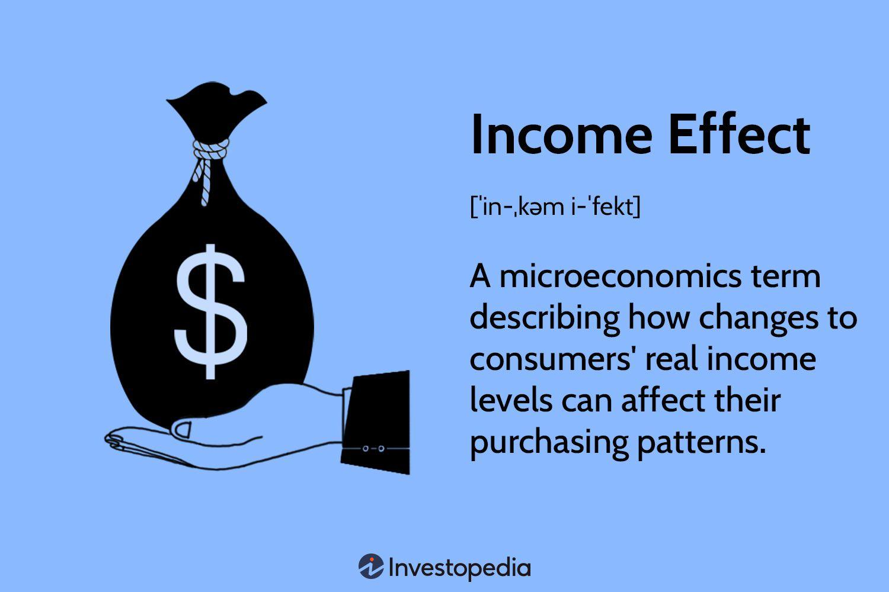

## Table of Contents

## What is the income effect?

The income effect is a concept in economics that explains how changes in a person's income can affect the amount and type of goods they buy. When someone's income goes up, they can afford to buy more things or buy better quality items. On the other hand, if their income goes down, they might have to cut back on spending or choose cheaper options.

For example, if a person gets a raise at work, they might decide to eat out at restaurants more often instead of cooking at home. This is because they now have more money to spend on dining out, which they see as a luxury. Conversely, if they lose their job and their income drops, they might switch from buying fresh produce to buying canned goods because they are less expensive. The income effect shows how changes in income can lead to changes in consumption patterns.

## How does the income effect differ from the substitution effect?

The income effect and the substitution effect are two ideas that explain how people change what they buy when prices change. The income effect happens when a price change makes someone feel richer or poorer. For example, if the price of bread goes down, people might feel like they have more money to spend on other things, so they buy more bread and maybe even more of other goods too. On the other hand, if the price of bread goes up, people might feel poorer and buy less bread and fewer other things.

The substitution effect is different because it's about switching to cheaper options when prices change. When the price of one thing goes up, people might start buying something else that does a similar job but costs less. For example, if the price of beef goes up, people might buy more chicken instead because it's cheaper. The substitution effect is all about choosing different products to save money, not about feeling richer or poorer.

Both the income effect and the substitution effect help explain why people change their buying habits, but they focus on different reasons. The income effect is about how a change in price affects how much money people feel they have, while the substitution effect is about choosing different products to keep spending the same amount of money.

## Can you explain the income effect with a simple example?

Imagine you like to buy apples every week. Normally, you can afford to buy 5 apples with your weekly budget. But one day, you get a raise at your job, so you have more money to spend. Now, with the extra money, you feel richer and decide to buy 7 apples instead of just 5. This is the income effect: when your income goes up, you can buy more of the things you like.

Now, let's say the opposite happens. You lose your job and your income goes down. You used to buy 5 apples, but now you can only afford 3 apples with your smaller budget. You feel poorer, so you have to cut back on how many apples you buy. This is also the income effect, but in the other direction: when your income goes down, you have to buy less of the things you like.

## What are the two types of income effect?

The first type of income effect is called the normal good income effect. This happens when you buy more of something because you have more money. For example, if you get a raise and start buying more apples because you can afford them, that's a normal good income effect. It means that when your income goes up, you buy more of the good, and when your income goes down, you buy less.

The second type is called the inferior good income effect. This is the opposite of the normal good income effect. It happens when you buy less of something because you have more money. For example, if you used to buy cheaper canned vegetables but switch to fresh ones when you get a raise, that's an inferior good income effect. It means that when your income goes up, you buy less of the inferior good, and when your income goes down, you might buy more of it because it's cheaper.

## How does the income effect influence consumer behavior?

The income effect changes how people spend their money when their income goes up or down. When people earn more money, they feel richer and might buy more things or choose better quality items. For example, if someone gets a raise, they might start buying more apples or switch from canned vegetables to fresh ones. This is because they can afford to spend more on things they enjoy or see as better.

On the other hand, when people's income goes down, they feel poorer and have to cut back on what they buy. They might buy fewer apples or switch from fresh vegetables back to canned ones because they need to save money. The income effect shows how changes in income lead to changes in what people buy, either buying more and better things when they have more money, or less and cheaper things when they have less.

## What role does the income effect play in demand curve analysis?

The income effect is important when we look at demand curves because it helps explain why people buy more or less of something when its price changes. A demand curve shows how much of a product people will buy at different prices. When the price of a product goes down, people feel like they have more money to spend on it, so they buy more. This is the income effect making the demand curve move to the right, showing that more is bought at each price.

On the other hand, if the price of a product goes up, people feel like they have less money to spend on it, so they buy less. This is the income effect making the demand curve move to the left, showing that less is bought at each price. By understanding the income effect, we can better see how changes in price affect how much people want to buy, which is shown by shifts in the demand curve.

## How can the income effect impact the labor supply curve?

The income effect can change how much people want to work. Imagine you have a job and you get paid more money. Now, because you have more money, you might decide to work less and enjoy more free time. This is the income effect making you feel richer, so you choose to have more leisure time instead of working more hours. On the labor supply curve, this means that as your wage goes up, you might supply less labor, causing the curve to bend backwards.

On the other hand, if your income goes down because you get paid less, you might need to work more hours to make up for it. You feel poorer, so you have to work more to keep buying the things you need. This is the income effect pushing you to work more. On the labor supply curve, this shows that as your wage goes down, you might supply more labor, which can make the curve slope upwards at lower wages. The income effect helps explain why the labor supply curve can sometimes look different at different wage levels.

## What is the relationship between the income effect and normal goods?

The income effect has a special connection with normal goods. Normal goods are things that people buy more of when they have more money. When someone's income goes up, they feel richer and can spend more on normal goods. For example, if you get a raise at work, you might buy more apples because you can afford them. This shows the income effect making you buy more of a normal good.

On the other hand, if someone's income goes down, they feel poorer and have to cut back on normal goods. They might buy fewer apples because they need to save money. The income effect here makes people buy less of the normal good when they have less money. So, the income effect and normal goods go hand in hand, showing how changes in income change how much people buy of these goods.

## How does the income effect relate to inferior goods?

The income effect works differently with inferior goods. Inferior goods are things that people buy less of when they have more money. When someone's income goes up, they feel richer and might switch to better or more expensive options. For example, if you get a raise, you might stop buying canned vegetables and start buying fresh ones instead. This is the income effect making you buy less of the inferior good because you can afford something better.

On the other hand, if someone's income goes down, they feel poorer and might have to buy more of the inferior good to save money. They might switch back to canned vegetables because they are cheaper. The income effect here makes people buy more of the inferior good when they have less money. So, the income effect and inferior goods show how changes in income can make people switch between different types of goods.

## Can the income effect lead to a Giffen good scenario?

Yes, the income effect can lead to a Giffen good scenario. A Giffen good is a special kind of inferior good where people buy more of it when its price goes up. This might sound strange, but it happens because the income effect is stronger than the substitution effect. When the price of a Giffen good goes up, people feel poorer because they can't afford as much of it. They might have to cut back on other things they buy, like meat, and end up buying even more of the Giffen good, like potatoes, because it's a big part of their diet and they need it to get by.

For example, imagine a poor family that mostly eats potatoes. If the price of potatoes goes up, they feel like they have less money to spend on other foods. Instead of buying less potatoes and more of something else, they might buy even more potatoes because they can't afford much else. This is the income effect making them feel poorer and pushing them to rely more on the cheaper option, even though its price went up. So, the income effect can lead to a Giffen good scenario when people's need for the good is strong and they have few other choices.

## How do economists measure the income effect empirically?

Economists measure the income effect by looking at how people change what they buy when their income changes. They often do this by using surveys or data from households to see how much people spend on different things when they earn more or less money. For example, they might look at how a family's spending on food changes after one of the parents gets a raise. By comparing the spending before and after the income change, economists can figure out the income effect on different goods.

Another way economists measure the income effect is through experiments or controlled studies. They might give some people more money temporarily and see how their spending changes compared to a group that doesn't get extra money. This helps them understand how income changes affect buying habits. By carefully analyzing this data, economists can separate the income effect from other factors, like changes in prices, to get a clear picture of how income influences what people buy.

## What are some advanced theoretical models that incorporate the income effect?

One advanced theoretical model that incorporates the income effect is the lifecycle model. This model looks at how people plan their spending over their whole life. It says that people try to smooth out their spending, so they save money when they earn a lot and spend more when they earn less. The income effect is important here because it shows how people change what they buy when their income goes up or down. For example, if someone gets a big bonus at work, they might buy more luxury items or save more for the future. On the other hand, if they lose their job, they might cut back on spending and use their savings. The lifecycle model helps economists understand how people manage their money over time, and the income effect is a big part of that.

Another model that uses the income effect is the permanent income hypothesis. This model says that people base their spending on what they think their income will be in the long run, not just what they earn right now. The income effect comes into play because it shows how people react to changes in their income. If someone expects their income to go up in the future, they might start spending more now, even if their current income hasn't changed. But if they think their income will go down, they might save more or spend less. The permanent income hypothesis helps explain why people might spend more or less than they earn at any given time, and the income effect is key to understanding these choices.

## What is the Income Effect in Economics and How Can It Be Understood?

The income effect is a fundamental concept in economics, highlighting how variations in consumer purchasing power influence demand for goods and services. When consumer income changes, the quantity of goods demanded can either increase or decrease depending on the type of goods in question. 

In the case of normal goods, a rise in income typically leads to an increase in demand. This occurs because consumers have greater financial capability, allowing them to purchase more or higher-quality goods. The relationship between income and demand for normal goods is characterized by a positive income elasticity of demand. Mathematically, income elasticity of demand ($E_d$) is expressed as:

$$
E_d = \frac{\%\ \text{change in quantity demanded}}{\%\ \text{change in income}}
$$

For normal goods, $E_d > 0$, indicating that demand grows as income rises.

Conversely, inferior goods exhibit an inverse relationship between income and demand. When consumer incomes increase, the demand for inferior goods often decreases. This is because consumers are likely to switch to more desirable alternatives. Inferior goods have a negative income elasticity of demand, where $E_d < 0$.

Understanding the income effect necessitates an appreciation for how elasticity of demand interacts with consumer behavior. Elasticity of demand measures the sensitivity of quantity demanded to changes in income or price. If a good’s demand is highly elastic, then small changes in income can lead to substantial shifts in demand.

These dynamics for normal and inferior goods underscore broader economic phenomena. For instance, during economic expansions, increases in consumer income generally lead to higher demand for normal goods such as electronics and vehicles, stimulating growth in those sectors. Conversely, in times of economic downturns, we may observe an expansion in the market for certain inferior goods, like budget groceries, as spending power diminishes.

To model these effects and predict market behavior, economists often utilize demand curves that adjust with income levels. Shifts in these curves represent changes in demand due to the income effect, and understanding these shifts is crucial for interpreting consumer behavior and making informed policy decisions.

In conclusion, the income effect provides critical insights into economic dynamics by illustrating how shifts in consumer income can lead to changes in demand for various goods. This understanding is essential for analyzing market trends and consumer choices, enabling businesses and policymakers to anticipate and respond appropriately to economic fluctuations.

## What is the difference between consumer behavior towards normal goods and inferior goods?

Consumer behavior significantly impacts the demand dynamics for various categories of goods, bifurcated mainly into normal and inferior goods. This categorization is primarily determined by the concept of income elasticity of demand. For normal goods, the demand escalates as consumer income increases, demonstrating a positive income elasticity. In contrast, inferior goods display a negative income elasticity, where demand diminishes with a rise in income.

Mathematically, income elasticity of demand ($E_i$) can be defined as:

$$

E_i = \frac{\%\ \text{Change in Quantity Demanded}}{\%\ \text{Change in Income}} 
$$

For normal goods, $E_i > 0$, meaning that as income increases, the quantity demanded also rises. These goods typically include luxury items and essentials whose consumption grows as individuals have more disposable income at their disposal.

Conversely, inferior goods possess an $E_i < 0$, indicating that an increase in income results in a reduction in demand. Common examples include basic necessities or generic brands, which consumers often substitute with higher-quality alternatives as their purchasing power expands.

In addition to economic factors, cultural and societal norms heavily influence whether a good is classified as normal or inferior. For instance, rice might be considered a staple and thus a normal good in Asian countries, whereas in Western societies, it might be perceived as an inferior good, particularly among wealthier consumers who opt for more diverse carbohydrate sources. 

Understanding these subtleties is crucial for businesses and policymakers to predict changes in demand in response to shifts in economic conditions. Furthermore, economic theories related to consumer choice and substitution effects also provide insights into how consumption patterns are likely to alter with varying income levels.

## What are the Frequently Asked Questions?

### What differentiates inferior goods from normal goods?

Inferior goods and normal goods are distinguished by how their demand correlates with consumer income. The primary differentiator is the elasticity of demand in relation to income changes:

- **Normal Goods:** As consumer income increases, the demand for normal goods generally rises. This positive correlation is known as positive income elasticity of demand. Examples of normal goods include luxury items and organic foods, where increased income allows consumers to afford higher-quality or additional quantities of these goods.

- **Inferior Goods:** Conversely, inferior goods exhibit a negative income elasticity of demand. Demand for these goods decreases as income rises because consumers often shift to more desirable substitutes. Examples include generic or store-brand products, which may be replaced by brand-name items as consumers' purchasing power grows.

In economic terms, the income elasticity of demand ($E_i$) is defined as:

$$
E_i = \frac{\% \, \Delta Q_d}{\% \, \Delta I}
$$

where $\% \, \Delta Q_d$ is the percentage change in the quantity demanded and $\% \, \Delta I$ is the percentage change in income. For normal goods, $E_i > 0$, while for inferior goods, $E_i < 0$.

### How does consumer behavior influence the demand for inferior goods?

Consumer behavior significantly impacts the demand for inferior goods, particularly through preferences and the perceived value of such goods. Economic conditions, cultural influences, and personal preferences can drive demand for these goods:

- **Economic Conditions:** In times of economic downturn or recession, consumers may revert to purchasing inferior goods due to reduced income. For example, during economic hardships, individuals might prefer public transportation over owning a car.

- **Cultural and Social Factors:** Cultural norms and societal expectations can also define whether a good is considered inferior. What is deemed an inferior good in one culture might not hold the same status elsewhere, as societal values influence purchasing habits.

- **Substitutability and Preferences:** Consumers' propensity to substitute inferior goods with normal goods as income rises reflects their preference dynamics. This substitution effect accounts for shifts in demand, where individuals opt for higher-status alternatives when possible.

### In what ways can algorithmic trading benefit from understanding economic models?

Algorithmic trading can greatly benefit from the integration of economic models by leveraging insights from consumer behavior and demand elasticity to improve trading strategies:

- **Predictive Analytics:** Understanding economic models that capture consumer behavior allows for better prediction of market trends. Algorithms can use this data to anticipate changes in demand for specific stocks or commodities, optimizing trade timings and selections.

- **Risk Management:** By incorporating economic indicators that affect inferior and normal goods, traders can develop algorithms that adjust strategies in response to macroeconomic changes. This adaptability can mitigate potential losses during economic downturns.

- **Enhancing Decision-making Algorithms:** Economic models offer foundational insights that can refine decision-making algorithms, allowing them to account for variabilities in consumer income and preferences. This enhances the precision of algorithmic trading systems in modeling market behavior.

Here is an example of how a simple Python function might use economic indicators to adjust an algorithmic trading decision:

```python
def trading_strategy(income_change, current_demand):
    if income_change < 0:
        # During a downturn, increase the weight for inferior goods
        demand_adjustment = current_demand * 1.2
    else:
        # During economic growth, focus more on normal goods
        demand_adjustment = current_demand * 0.8

    return demand_adjustment

# Sample usage
adjusted_demand = trading_strategy(-5, 100)
print(adjusted_demand)
```

This function modifies trading strategies based on income changes, suggesting an increased focus on inferior goods during economic downturns. Integrating such economic insights into trading algorithms can streamline strategy performance in changing market environments.

## References & Further Reading

[1]: Bernheim, B. D., & Rangel, A. (2007). "Behavioral Public Economics: Welfare and Policy Analysis with Non-Standard Decision-Makers." In Diamond, P., & Vartiainen, H. (Eds.), Behavioral Economics and Its Applications. Princeton University Press.

[2]: Croushore, D. (2014). ["Macroeconomics: Modern Economic Issues"](https://books.google.com/books/about/Macroeconomics.html?id=hC5xmAEACAAJ). The Teaching Company.

[3]: Goolsbee, A., Levitt, S., & Syverson, C. (2019). ["Microeconomics"](https://www.amazon.com/Microeconomics/dp/1319306799). Worth Publishers.

[4]: Hull, J. (2012). ["Options, Futures, and Other Derivatives"](https://www.semanticscholar.org/paper/Options%2C-Futures%2C-and-Other-Derivatives-Hull/89bdee500c8623864fc9eb7a471546aa713acc44). Pearson Education.

[5]: Kumar, A., & Lee, C. (2006). "Retail Investor Sentiment and Return Comovements." The Journal of Finance, 61(6), 2451-2486.

[6]: Merton, R. C. (1992). "Continuous-Time Finance." Blackwell Publishing.

[7]: Shiller, R. J. (2005). ["Irrational Exuberance"](https://www.jstor.org/stable/j.ctt7st4s). Princeton University Press.

[8]: Thaler, R. H., & Sunstein, C. R. (2009). ["Nudge: Improving Decisions About Health, Wealth, and Happiness"](https://www.researchgate.net/publication/257178709_Nudge_Improving_Decisions_About_Health_Wealth_and_Happiness_RH_Thaler_CR_Sunstein_Yale_University_Press_New_Haven_2008_293_pp). Yale University Press.

[9]: Varian, H. (2014). ["Intermediate Microeconomics: A Modern Approach"](https://archive.org/details/intermediatemicr0000vari_z9edo2). W.W. Norton & Company.

[10]: Woodford, M. (2003). "Interest and Prices: Foundations of a Theory of Monetary Policy." Princeton University Press.