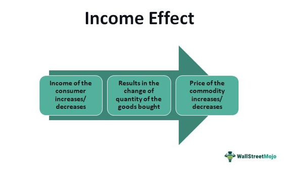

Modern economics is a complex field shaped by several fundamental concepts, including the income effect, consumer behavior, and algorithmic trading. These elements collectively influence how markets operate and evolve over time. The income effect specifically concerns the variation in consumer spending power and its resultant impact on the demand for goods and services. This concept is crucial for understanding shifts in economic activities, as it highlights how changes in income levels can alter consumption patterns and ultimately drive market demand.

Consumer behavior further elaborates on these consumption patterns by categorizing goods into normal and inferior types based on how demand shifts with income changes. For instance, normal goods experience increased demand as consumer incomes rise, owing to their positive income elasticity. Conversely, inferior goods see reduced demand as people earn more, thus exhibiting negative income elasticity. Such distinctions not only define economic dynamics but also inform business strategies and policy-making.



Algorithmic trading represents a separate yet increasingly significant arena within modern economics, where quantitative models and economic principles are harnessed to optimize trading strategies. By integrating insights into consumer behavior and the income effect, algorithmic trading systems can enhance their predictions of market movements, thereby improving efficiency and profitability. For example, understanding demand elasticity allows these systems to anticipate fluctuations in stock prices in response to economic events, making them more adaptable and reactive to market conditions.

In summary, the interplay between income variations, consumer behavior, and advanced trading techniques such as algorithmic trading underscores the multifaceted nature of contemporary economic systems. These interrelationships provide essential insights into market movements and consumer choices, forming the foundation upon which economists, traders, and policymakers can better understand and navigate the economic landscape.

## Table of Contents

## Understanding the Income Effect in Economics

The income effect is a fundamental concept in economics, highlighting how variations in consumer purchasing power influence demand for goods and services. When consumer income changes, the quantity of goods demanded can either increase or decrease depending on the type of goods in question. 

In the case of normal goods, a rise in income typically leads to an increase in demand. This occurs because consumers have greater financial capability, allowing them to purchase more or higher-quality goods. The relationship between income and demand for normal goods is characterized by a positive income elasticity of demand. Mathematically, income elasticity of demand ($E_d$) is expressed as:

$$
E_d = \frac{\%\ \text{change in quantity demanded}}{\%\ \text{change in income}}
$$

For normal goods, $E_d > 0$, indicating that demand grows as income rises.

Conversely, inferior goods exhibit an inverse relationship between income and demand. When consumer incomes increase, the demand for inferior goods often decreases. This is because consumers are likely to switch to more desirable alternatives. Inferior goods have a negative income elasticity of demand, where $E_d < 0$.

Understanding the income effect necessitates an appreciation for how elasticity of demand interacts with consumer behavior. Elasticity of demand measures the sensitivity of quantity demanded to changes in income or price. If a good’s demand is highly elastic, then small changes in income can lead to substantial shifts in demand.

These dynamics for normal and inferior goods underscore broader economic phenomena. For instance, during economic expansions, increases in consumer income generally lead to higher demand for normal goods such as electronics and vehicles, stimulating growth in those sectors. Conversely, in times of economic downturns, we may observe an expansion in the market for certain inferior goods, like budget groceries, as spending power diminishes.

To model these effects and predict market behavior, economists often utilize demand curves that adjust with income levels. Shifts in these curves represent changes in demand due to the income effect, and understanding these shifts is crucial for interpreting consumer behavior and making informed policy decisions.

In conclusion, the income effect provides critical insights into economic dynamics by illustrating how shifts in consumer income can lead to changes in demand for various goods. This understanding is essential for analyzing market trends and consumer choices, enabling businesses and policymakers to anticipate and respond appropriately to economic fluctuations.

## Consumer Behavior: Normal vs. Inferior Goods

Consumer behavior significantly impacts the demand dynamics for various categories of goods, bifurcated mainly into normal and inferior goods. This categorization is primarily determined by the concept of income elasticity of demand. For normal goods, the demand escalates as consumer income increases, demonstrating a positive income elasticity. In contrast, inferior goods display a negative income elasticity, where demand diminishes with a rise in income.

Mathematically, income elasticity of demand ($E_i$) can be defined as:

$$

E_i = \frac{\%\ \text{Change in Quantity Demanded}}{\%\ \text{Change in Income}} 
$$

For normal goods, $E_i > 0$, meaning that as income increases, the quantity demanded also rises. These goods typically include luxury items and essentials whose consumption grows as individuals have more disposable income at their disposal.

Conversely, inferior goods possess an $E_i < 0$, indicating that an increase in income results in a reduction in demand. Common examples include basic necessities or generic brands, which consumers often substitute with higher-quality alternatives as their purchasing power expands.

In addition to economic factors, cultural and societal norms heavily influence whether a good is classified as normal or inferior. For instance, rice might be considered a staple and thus a normal good in Asian countries, whereas in Western societies, it might be perceived as an inferior good, particularly among wealthier consumers who opt for more diverse carbohydrate sources. 

Understanding these subtleties is crucial for businesses and policymakers to predict changes in demand in response to shifts in economic conditions. Furthermore, economic theories related to consumer choice and substitution effects also provide insights into how consumption patterns are likely to alter with varying income levels.

## Algorithmic Trading: Harnessing Economic Models

Algorithmic trading involves the use of computer algorithms and advanced mathematical models to make trading decisions, which are executed at speeds and frequencies that would be impossible for a human trader. The integration of economic concepts such as consumer behavior and demand elasticity into [algorithmic trading](/wiki/algorithmic-trading) strategies plays a crucial role in enhancing the efficiency and effectiveness of these algorithms.

Economic theories, particularly those related to consumer behavior, offer valuable insights into market dynamics. For instance, understanding how consumers might react to changes in income or prices allows algorithms to predict shifts in demand for specific assets. This predictive capability is vital for developing trading strategies that can profit from anticipated market movements. 

Demand elasticity, which measures how sensitive the quantity demanded of a good is to a change in its price, is another key concept utilized in algorithmic trading. Algorithms can analyze variations in demand elasticity to adjust their trading strategies accordingly. For example, during periods of economic downturn, the demand elasticity for certain goods may increase as consumers become more price sensitive. By factoring in these elasticities, algorithmic traders can optimize their strategies to buy or sell assets at opportune moments.

A practical example is the use of [machine learning](/wiki/machine-learning) models to identify market trends based on historical data. These models can assess how certain events or economic indicators affect consumer behavior, thus helping traders predict market responses to similar future occurrences. For instance, leveraging regression analysis or time-series forecasting, algorithms can identify patterns related to consumption and investment during economic downturns, thereby informing trading decisions that capitalize on these patterns.

Moreover, algorithmic trading systems permeate financial markets during periods of economic instability, such as recessions or market crashes. These systems are designed to recognize downturn signals and execute trades that hedge against potential losses or exploit new market trends. By integrating consumer behavior insights and elasticity considerations, these systems can more accurately predict downturn-related trends, such as increased demand for inferior goods or a shift away from luxury consumption.

In summary, the fusion of consumer behavior theories and economic models with sophisticated algorithmic trading techniques enables traders to better anticipate and navigate market fluctuations. This synergy not only improves the precision and efficiency of trading algorithms but also enhances their ability to withstand and thrive during periods of economic [volatility](/wiki/volatility-trading-strategies).

## Case Studies and Practical Applications

The 2008 financial crisis and the COVID-19 pandemic are pivotal events that elucidate the profound impact of income shifts on consumer behavior and market dynamics. These economic upheavals reveal how changes in demand patterns for various goods, particularly inferior goods, can significantly influence trading strategies and inform economic policy development.

### 2008 Financial Crisis

During the 2008 financial crisis, widespread economic instability led to substantial changes in consumer incomes. This crisis highlighted an increase in demand for inferior goods—products for which demand rises as consumer income declines. For instance, budget-friendly items such as generic food products and discount store offerings saw increased consumer demand. This shift was a direct consequence of reduced discretionary income and heightened economic uncertainty. 

Algorithmic trading systems, which leverage economic models to predict market trends, played a critical role during this period. These systems integrate factors such as consumer behavior changes and demand elasticity to optimize trading strategies. By recognizing the increased volatility and the growing preference for inferior goods, traders utilizing algorithmic systems were able to adjust their portfolios accordingly, thus mitigating risks and capitalizing on market opportunities. For example, a Python-based trading algorithm could employ machine learning techniques to analyze historical data and consumer spending patterns, adjusting stock positions in real time to maximize returns during economic downturns.

```python
import numpy as np
from sklearn.linear_model import LinearRegression

# Simple model to adjust portfolio based on consumer income changes
def predict_inferior_goods_demand(income_changes, spending_patterns):
    X = np.array(income_changes).reshape(-1, 1)
    y = np.array(spending_patterns)

    model = LinearRegression().fit(X, y)
    return model.coef_, model.intercept_

# Sample data: income changes and corresponding demand for inferior goods
income_changes = [-0.05, -0.1, -0.15, -0.2]  # Negative values indicating income decline
spending_patterns = [0.02, 0.05, 0.1, 0.15]  # Increase in demand for inferior goods

coef, intercept = predict_inferior_goods_demand(income_changes, spending_patterns)
print(f"Coefficient: {coef}, Intercept: {intercept}")
```

### COVID-19 Pandemic

The COVID-19 pandemic further exemplifies how sudden shifts in income influence consumer behavior and market dynamics. With global lockdowns and job losses, many consumers experienced a decrease in income, prompting a similar rise in demand for inferior goods as seen during the 2008 crisis. Economic policy interventions, such as stimulus payments, aimed to stabilize income and stimulate demand across the economic spectrum.

Algorithmic trading systems were pivotal in adapting to these unprecedented market conditions. By understanding economic principles, these algorithms could incorporate pandemic-related data, consumer spending shifts, and fiscal policy changes to predict market trends. The adaptability of these systems during the pandemic demonstrated their effectiveness in navigating economic disruptions and their potential in guiding future trading strategies and policy developments.

Both the 2008 financial crisis and the COVID-19 pandemic underscore the importance of understanding income effects and consumer behavior in economic modeling. As these events continue to inform the development of more sophisticated algorithmic trading systems, they highlight the enduring value of integrating economic insights into financial strategies.

## Conclusion

The integration of consumer behavior theories, the income effect, and algorithmic trading represents a crucial axis in the study of modern economics. A robust understanding of these components allows economists and traders to more accurately predict and respond to market trends. As consumer purchasing power shifts, it influences demand for both normal and inferior goods, providing actionable insights into broader economic patterns. This information can be effectively utilized in algorithmic trading strategies, where the ability to anticipate market movements confers a tangible advantage.

Furthermore, as technological innovation progresses and economic models become more sophisticated, these areas of study promise enhanced economic stability and growth. The rise of machine learning and [artificial intelligence](/wiki/ai-artificial-intelligence) in analyzing consumer behavior and market data exemplifies how intertwined these disciplines have become. Consequently, a deep comprehension of the income effect and its implications on consumer decision-making is imperative for crafting responsive trading algorithms. 

In parallel, the increasing accuracy and adaptability of algorithmic trading systems underscore their potential in mitigating risks and leveraging opportunities within volatile markets. As such, the continuous evolution and integration of economic theories and technological advancements hold substantial promise for shaping future economic landscapes, fostering an era of improved predictability and stability in financial markets.

## FAQs

### What differentiates inferior goods from normal goods?

Inferior goods and normal goods are distinguished by how their demand correlates with consumer income. The primary differentiator is the elasticity of demand in relation to income changes:

- **Normal Goods:** As consumer income increases, the demand for normal goods generally rises. This positive correlation is known as positive income elasticity of demand. Examples of normal goods include luxury items and organic foods, where increased income allows consumers to afford higher-quality or additional quantities of these goods.

- **Inferior Goods:** Conversely, inferior goods exhibit a negative income elasticity of demand. Demand for these goods decreases as income rises because consumers often shift to more desirable substitutes. Examples include generic or store-brand products, which may be replaced by brand-name items as consumers' purchasing power grows.

In economic terms, the income elasticity of demand ($E_i$) is defined as:

$$
E_i = \frac{\% \, \Delta Q_d}{\% \, \Delta I}
$$

where $\% \, \Delta Q_d$ is the percentage change in the quantity demanded and $\% \, \Delta I$ is the percentage change in income. For normal goods, $E_i > 0$, while for inferior goods, $E_i < 0$.

### How does consumer behavior influence the demand for inferior goods?

Consumer behavior significantly impacts the demand for inferior goods, particularly through preferences and the perceived value of such goods. Economic conditions, cultural influences, and personal preferences can drive demand for these goods:

- **Economic Conditions:** In times of economic downturn or recession, consumers may revert to purchasing inferior goods due to reduced income. For example, during economic hardships, individuals might prefer public transportation over owning a car.

- **Cultural and Social Factors:** Cultural norms and societal expectations can also define whether a good is considered inferior. What is deemed an inferior good in one culture might not hold the same status elsewhere, as societal values influence purchasing habits.

- **Substitutability and Preferences:** Consumers' propensity to substitute inferior goods with normal goods as income rises reflects their preference dynamics. This substitution effect accounts for shifts in demand, where individuals opt for higher-status alternatives when possible.

### In what ways can algorithmic trading benefit from understanding economic models?

Algorithmic trading can greatly benefit from the integration of economic models by leveraging insights from consumer behavior and demand elasticity to improve trading strategies:

- **Predictive Analytics:** Understanding economic models that capture consumer behavior allows for better prediction of market trends. Algorithms can use this data to anticipate changes in demand for specific stocks or commodities, optimizing trade timings and selections.

- **Risk Management:** By incorporating economic indicators that affect inferior and normal goods, traders can develop algorithms that adjust strategies in response to macroeconomic changes. This adaptability can mitigate potential losses during economic downturns.

- **Enhancing Decision-making Algorithms:** Economic models offer foundational insights that can refine decision-making algorithms, allowing them to account for variabilities in consumer income and preferences. This enhances the precision of algorithmic trading systems in modeling market behavior.

Here is an example of how a simple Python function might use economic indicators to adjust an algorithmic trading decision:

```python
def trading_strategy(income_change, current_demand):
    if income_change < 0:
        # During a downturn, increase the weight for inferior goods
        demand_adjustment = current_demand * 1.2
    else:
        # During economic growth, focus more on normal goods
        demand_adjustment = current_demand * 0.8

    return demand_adjustment

# Sample usage
adjusted_demand = trading_strategy(-5, 100)
print(adjusted_demand)
```

This function modifies trading strategies based on income changes, suggesting an increased focus on inferior goods during economic downturns. Integrating such economic insights into trading algorithms can streamline strategy performance in changing market environments.

## References & Further Reading

[1]: Bernheim, B. D., & Rangel, A. (2007). "Behavioral Public Economics: Welfare and Policy Analysis with Non-Standard Decision-Makers." In Diamond, P., & Vartiainen, H. (Eds.), Behavioral Economics and Its Applications. Princeton University Press.

[2]: Croushore, D. (2014). ["Macroeconomics: Modern Economic Issues"](https://books.google.com/books/about/Macroeconomics.html?id=hC5xmAEACAAJ). The Teaching Company.

[3]: Goolsbee, A., Levitt, S., & Syverson, C. (2019). ["Microeconomics"](https://www.amazon.com/Microeconomics/dp/1319306799). Worth Publishers.

[4]: Hull, J. (2012). ["Options, Futures, and Other Derivatives"](https://www.semanticscholar.org/paper/Options%2C-Futures%2C-and-Other-Derivatives-Hull/89bdee500c8623864fc9eb7a471546aa713acc44). Pearson Education.

[5]: Kumar, A., & Lee, C. (2006). "Retail Investor Sentiment and Return Comovements." The Journal of Finance, 61(6), 2451-2486.

[6]: Merton, R. C. (1992). "Continuous-Time Finance." Blackwell Publishing.

[7]: Shiller, R. J. (2005). ["Irrational Exuberance"](https://www.jstor.org/stable/j.ctt7st4s). Princeton University Press.

[8]: Thaler, R. H., & Sunstein, C. R. (2009). ["Nudge: Improving Decisions About Health, Wealth, and Happiness"](https://www.researchgate.net/publication/257178709_Nudge_Improving_Decisions_About_Health_Wealth_and_Happiness_RH_Thaler_CR_Sunstein_Yale_University_Press_New_Haven_2008_293_pp). Yale University Press.

[9]: Varian, H. (2014). ["Intermediate Microeconomics: A Modern Approach"](https://archive.org/details/intermediatemicr0000vari_z9edo2). W.W. Norton & Company.

[10]: Woodford, M. (2003). "Interest and Prices: Foundations of a Theory of Monetary Policy." Princeton University Press.