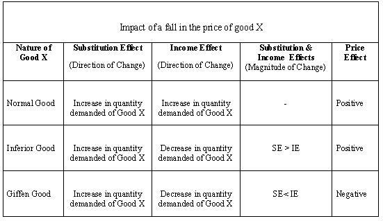

## Table of Contents

## What is the income effect?

The income effect is a concept in economics that explains how changes in a person's income can affect the amount and type of goods they buy. When someone's income goes up, they can afford to buy more things or buy more expensive items. On the other hand, if their income goes down, they might have to cut back on spending and buy less or choose cheaper options.

For example, if you get a raise at work, you might decide to eat out at restaurants more often instead of cooking at home. This is because you have more money to spend, and the income effect is making you feel richer. But if you lose your job, you might switch to buying cheaper brands of food to save money. The income effect shows how our buying habits change when our financial situation changes.

## What is the price effect?

The price effect is a concept in economics that shows how the price of a product can change how much of it people buy. When the price of something goes up, people usually buy less of it because it becomes more expensive. On the other hand, if the price goes down, people might buy more because it's cheaper and they can afford to get more for their money.

For example, if the price of apples goes up, you might decide to buy fewer apples or switch to buying a cheaper fruit like bananas. This shows the price effect in action, where a change in price directly influences the amount of a product you're willing to purchase. Understanding the price effect helps businesses and economists predict how changes in prices will affect the overall demand for goods and services.

## How does the income effect influence consumer behavior?

The income effect changes how people spend their money when their income goes up or down. When people earn more money, they feel richer and might buy more things or choose more expensive options. For example, if someone gets a raise, they might start buying nicer clothes or going out to eat more often. This happens because they can now afford things that were too expensive before. The income effect makes people feel like they have more money to spend, so they change what they buy.

On the other hand, if someone's income goes down, they have to be more careful with their money. They might start buying cheaper products or cut back on things they used to buy regularly. For instance, if someone loses their job, they might switch to buying store-brand foods instead of name-brand items to save money. The income effect makes people adjust their spending habits to match their new financial situation. This shows how important income is in deciding what and how much people buy.

## How does the price effect influence consumer behavior?

The price effect changes how much people buy of something when its price changes. If the price of a product goes up, people usually buy less of it because it costs more money. For example, if the price of gas goes up, people might drive less or look for cheaper ways to get around. This happens because people want to save money and can't afford to spend as much on things that have become more expensive. The price effect makes people think about what they're buying and how much they're willing to spend.

When the price of something goes down, people often buy more of it because it's cheaper. For instance, if there's a big sale on shoes, people might buy more pairs than they normally would. This is because they feel like they're getting a good deal and can afford to buy more. The price effect shows how sensitive people are to changes in price and how it can make them change what they buy and how much they buy.

## Can you explain the income effect with an example?

The income effect is about how people change what they buy when they have more or less money. Imagine you get a big raise at your job. Suddenly, you have more money to spend each month. Before the raise, you might have bought store-brand cereal because it was cheaper. But now, with extra money, you decide to buy the more expensive name-brand cereal you like better. This is the income effect in action – you're buying different things because you feel richer.

Now, think about what happens if you lose your job. Your income goes down, and you have less money to spend. You might have been used to eating out at restaurants a few times a week, but now you can't afford it. Instead, you start cooking at home more often and buying cheaper ingredients. The income effect makes you change your spending habits to match your new, lower income. It shows how important money is in deciding what we buy.

## Can you explain the price effect with an example?

The price effect is about how people change what they buy when the price of something goes up or down. Imagine you love buying apples, but one day the price of apples goes up a lot. You might decide to buy fewer apples because they're too expensive now. Or, you might switch to buying bananas instead because they're cheaper. This is the price effect – when the price changes, it makes you think about what you're buying and how much you're willing to spend.

Now, think about what happens if the price of something goes down. Let's say there's a big sale on your favorite brand of shoes. Normally, you might only buy one pair, but since they're on sale, you decide to buy two pairs. You feel like you're getting a good deal, so you buy more than you usually would. The price effect shows how sensitive people are to changes in price and how it can make them buy more or less of something.

## What is the difference between income effect and price effect?

The income effect and the price effect are two different ways that changes can affect what people buy. The income effect happens when someone's income changes. If a person gets more money, like from a raise at work, they might start buying more expensive things or more of what they like. For example, they might switch from buying cheap cereal to a more expensive brand. But if their income goes down, like if they lose their job, they have to buy cheaper things or less of what they want, like switching to store-brand foods to save money.

The price effect, on the other hand, is about how the price of something changes what people buy. If the price of a product goes up, people usually buy less of it because it's more expensive. For instance, if apples get more expensive, people might buy fewer apples or switch to buying bananas instead. But if the price goes down, like during a big sale, people might buy more of that product because it's cheaper. They might buy two pairs of shoes instead of one because they're on sale. So, the price effect shows how changes in price can make people change what and how much they buy.

## How do income and price effects interact in the market?

In the market, the income and price effects work together to shape what people buy. The income effect happens when someone's money changes. If they get more money, they might buy nicer things or more of what they like. But if they have less money, they have to be careful and might buy cheaper things or less of what they want. This can change how much people want to buy certain things in the market. For example, if a lot of people get raises, they might buy more cars, which can make car sales go up.

The price effect comes into play when the price of something changes. If the price goes up, people usually buy less of it because it's more expensive. But if the price goes down, people might buy more because it's cheaper. This can also change how much people want to buy things in the market. For instance, if the price of gas goes down, more people might drive, which can increase the demand for gas. Together, the income and price effects can make the market go up and down as people change what they buy based on their money and the prices of things.

## What role do income and price effects play in demand theory?

In demand theory, the income effect and the price effect help explain why people buy more or less of something. The income effect looks at how changes in a person's money can change what they buy. If someone gets more money, they might feel richer and buy more things or choose more expensive options. But if they have less money, they might have to buy cheaper things or cut back on what they usually buy. This shows how important money is in deciding what people want to buy and how much they can afford.

The price effect, on the other hand, looks at how changes in the price of something can change what people buy. If the price of a product goes up, people usually buy less of it because it's more expensive. But if the price goes down, people might buy more because it's cheaper. The price effect helps explain how sensitive people are to changes in price and how it can make them change what and how much they buy. Together, the income and price effects help economists understand how people's buying habits change based on their money and the prices of things.

## How can income and price effects be measured empirically?

To measure the income effect empirically, researchers often use data from surveys or experiments where people's income changes. They look at how people's spending changes when they get more or less money. For example, they might give some people a small amount of extra money and see if they buy more or different things. By comparing what people buy before and after their income changes, researchers can see how the income effect works. They use [statistics](/wiki/bayesian-statistics) to figure out how much of a change in spending is because of the change in income.

To measure the price effect, researchers often look at what happens when the price of a product changes. They might use data from stores or from experiments where the price of something goes up or down. For example, they might lower the price of a product in one store and keep it the same in another store, then compare how much people buy in each store. By looking at how people's buying changes when prices change, researchers can see how the price effect works. They use statistics to figure out how much of a change in buying is because of the change in price.

## What are the limitations of traditional models in explaining income and price effects?

Traditional models that explain income and price effects can be useful, but they have some problems. One big problem is that these models often assume that people always act in a clear and predictable way. But in real life, people's choices can be hard to predict because they are influenced by many things, like their feelings, habits, and what other people are doing. These models also often assume that people have all the information they need to make good choices, but in reality, people might not know everything about prices or their own money.

Another limitation is that traditional models usually look at things one at a time. For example, they might only look at how a change in income affects what people buy, without thinking about how changes in prices at the same time might change things. This can make the models less accurate because in real life, income and prices can change together and affect each other. Also, these models might not work well for everyone because people's situations can be very different. What works for one person might not work for another, so the models can miss important details about how different groups of people make choices.

## How do advanced economic models account for complex income and price effect scenarios?

Advanced economic models try to deal with the problems of traditional models by looking at more things at once. They don't just focus on how income or price changes affect what people buy. Instead, they think about how these changes can happen together and affect each other. For example, they might look at how a raise at work could make someone buy more things, but if the prices of those things also go up, the person might not buy as much as they would have if prices stayed the same. These models use computer simulations and big data to see how different situations can play out, making them more accurate and helpful for understanding real life.

These models also take into account that people are different and might react to changes in income and prices in different ways. They consider things like people's feelings, habits, and what other people around them are doing. For instance, if a lot of people start buying a certain product because it's popular, the model might show how this trend can affect how much people buy, even if their income or the price of the product doesn't change. By including these extra details, advanced models can give a better picture of how income and price effects work in the real world, helping economists and businesses make better decisions.

## What is the understanding of Income Effect and Price Effect?

The income effect and price effect are key components in the analysis of consumer behavior and market economics. These concepts offer insights into how changes in external factors such as income levels and product prices alter consumer purchasing decisions and, consequently, overall market demand.

The income effect occurs when a change in a consumer's income leads to a corresponding change in the quantity of goods and services they purchase. If a consumer's income increases, they may choose to buy more of certain goods, given they now have more purchasing power. Conversely, a decrease in income typically results in reduced consumption. For example, with increased income, a consumer might afford more luxury goods, whereas a reduction in income might force them to focus on essentials.

Mathematically, the income effect can be represented as a shift in the demand curve, moving either rightward or leftward depending on whether income increases or decreases. The formula for calculating the income effect often involves examining changes in consumption resulting from income variation, holding prices constant.

On the other hand, the price effect examines how changes in the price of a particular good or service influence the quantity demanded by consumers. This phenomenon is governed by the law of demand, which states that, all else being equal, an increase in the price of a good will lead to a decrease in its quantity demanded, and vice versa. The magnitude of this effect is often captured by the concept of price elasticity of demand, which measures how sensitive the quantity demanded of a good is to a change in its price.

The price elasticity of demand ($E_d$) is mathematically expressed as:

$$
E_d = \frac{\%\ \text{change in quantity demanded}}{\%\ \text{change in price}}
$$

A larger absolute value of $E_d$ indicates greater sensitivity to price changes, affecting consumer purchasing decisions significantly.

Both the income and price effects are integral in shaping economic demand curves. The income effect causes a parallel shift of the demand curve, while the price effect results in movements along the demand curve. Together, these effects influence the market equilibrium, allowing businesses and traders to predict consumer behavior and adjust their strategies. Anticipating how these factors interact helps businesses optimize pricing strategies, forecast demand, and develop long-term economic models that align with broader market trends.

In practice, businesses and traders harness these insights to make informed decisions that align with anticipated market shifts. By understanding consumer responsiveness to price and income changes, firms can better navigate competitive markets and drive strategic growth.

## What is the Price Effect in Algo Trading?

The price effect is pivotal in shaping [algorithmic trading](/wiki/algorithmic-trading) strategies. It revolves around how changes in the price of goods or assets influence the quantity demanded, a concept encapsulated by price elasticity. Algorithmic trading systems are designed to identify and exploit these variations, enabling traders to execute orders at optimal points to maximize returns.  

Price elasticity, defined as the percentage change in quantity demanded resulting from a one percent change in price, plays a critical role in this process. Algorithms frequently calculate the elasticity of different assets to adjust their trading strategies dynamically. This is especially useful in volatile markets where rapid price changes can significantly impact demand. The formula for price elasticity of demand (PED) is:

$$
\text{PED} = \frac{\%\text{ Change in Quantity Demanded}}{\%\text{ Change in Price}}
$$

Algorithms incorporate this elasticity metric to predict potential market movements, ensuring trades align with the anticipated changes in demand. For instance, if an asset's price elasticity indicates a strong sensitivity to price changes, the algorithm might prioritize swift buying decisions when a price drop is detected, expecting a significant demand increase.

The capacity to react promptly to market movements is facilitated by high-frequency trading ([HFT](/wiki/high-frequency-trading-strategies)) techniques that leverage powerful computing infrastructure and minimal latency. An example in Python for assessing price movements could involve using advanced data analysis libraries such as NumPy or Pandas to analyze historical price data and calculate elasticity:

```python
import pandas as pd
import numpy as np

# Example price and demand data
data = {'Price': [100, 105, 95, 102],
        'Quantity': [200, 190, 220, 210]}
df = pd.DataFrame(data)

# Calculate percentage changes
df['Price_Change'] = df['Price'].pct_change()
df['Quantity_Change'] = df['Quantity'].pct_change()

# Calculate Price Elasticity of Demand
df['PED'] = df['Quantity_Change'] / df['Price_Change']
```

This approach allows traders to backtest their strategies and refine algorithmic responses to observed elasticity, optimizing buying or selling conditions. With precise modeling of price effects, traders can enhance their algorithms' predictive capabilities, crafting more efficient and profitable trading strategies. Understanding the nuances of price impacts on demand is crucial for refining these algorithms and ensuring they respond adeptly to ever-changing market conditions.

## References & Further Reading

[1]: McKenzie, L. W., & Jones, R. W. (1978). ["The Income and Substitution Effects of a Price Change."](https://www.lancaster.ac.uk/staff/desilvad/Lecture7.pdf) The Review of Economic Studies, 45(3), 361-375.

[2]: Fama, E. F. (1970). ["Efficient Capital Markets: A Review of Theory and Empirical Work."](https://www.jstor.org/stable/2325486) The Journal of Finance, 25(2), 383-417.

[3]: Lopez de Prado, M. (2018). ["Advances in Financial Machine Learning."](https://www.amazon.com/Advances-Financial-Machine-Learning-Marcos/dp/1119482089) Wiley.

[4]: Jansen, S. (2018). ["Hands-On Machine Learning for Algorithmic Trading: Design and implement intelligent real-world applications to automate trading strategies."](https://www.sportsnet.ca/mlb/article/giants-name-former-gm-bobby-evans-ex-agent-jeff-berry-as-special-advisers/) Packt Publishing.

[5]: Chan, E. P. (2009). ["Quantitative Trading: How to Build Your Own Algorithmic Trading Business."](https://github.com/ftvision/quant_trading_echan_book) Wiley.

[6]: Mandelbrot, B. B., & Hudson, R. L. (2004). ["The (Mis)Behavior of Markets: A Fractal View of Risk, Ruin, and Reward."](https://books.google.com/books/about/The_Mis_Behaviour_of_Markets.html?id=zg91TAIs6bgC) Basic Books.

[7]: Kahneman, D., & Tversky, A. (1979). ["Prospect Theory: An Analysis of Decision under Risk."](http://web.mit.edu/curhan/www/docs/Articles/15341_Readings/Behavioral_Decision_Theory/Kahneman_Tversky_1979_Prospect_theory.pdf) Econometrica, 47(2), 263-291.