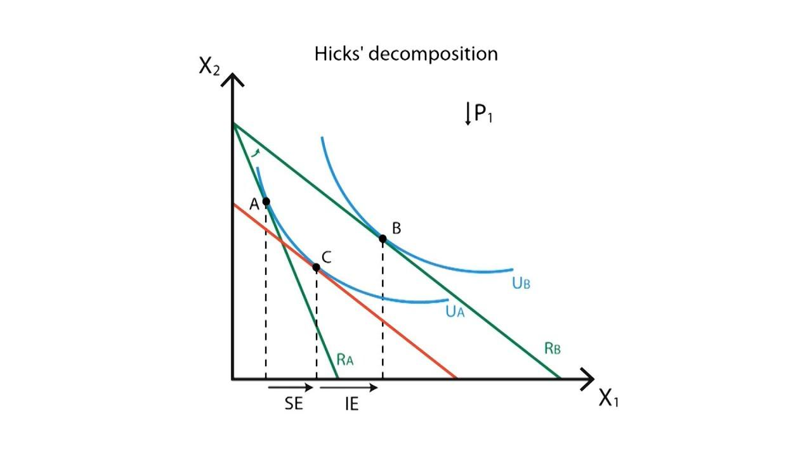

## Table of Contents

## What are the income effect and substitution effect?

The income effect happens when a person's income changes, and it affects how much they can buy. If someone's income goes up, they might feel richer and buy more things. If their income goes down, they might feel poorer and buy less. For example, if you get a raise at work, you might decide to eat out more often because you can afford it. But if you lose your job, you might cut back on eating out to save money.

The substitution effect happens when the price of something changes, and people switch to a different product. If the price of one thing goes up, people might buy something else that's cheaper. For example, if the price of beef goes up, people might buy more chicken instead because it's less expensive. This effect shows how people make choices based on what's more affordable at the time.

Both the income effect and the substitution effect help explain how people make decisions about what to buy. They show how changes in income or prices can lead people to change their buying habits. Understanding these effects can help businesses and economists predict how people will react to changes in the economy.

## How do the income effect and substitution effect relate to consumer behavior?

The income effect and substitution effect are key ideas that help explain why people buy certain things. The income effect shows how changes in a person's income can change what they buy. If someone gets more money, they might feel like they can afford to buy more stuff or nicer things. But if their income goes down, they might have to cut back on spending and buy less. This effect is all about how much money someone has and how it affects their choices.

The substitution effect, on the other hand, is about how people react when the price of something changes. If the price of a product goes up, people might switch to a cheaper option. For example, if the price of coffee goes up, someone might start drinking tea instead. This effect shows how people make choices based on what's more affordable at the time. Both effects together help explain why people might change what they buy, depending on their money situation and the prices of things.

## Can you explain the income effect with a simple example?

Imagine Sarah gets a big raise at her job. Before the raise, she used to eat out at restaurants once a month because that's all she could afford. But now, with more money coming in, Sarah feels richer. She decides to eat out twice a month instead. This is the income effect at work. Because Sarah's income went up, she can now afford to spend more on eating out, which makes her feel like she can enjoy more meals outside her home.

Now, let's say Sarah loses her job and her income drops a lot. Before, she was eating out twice a month, but now she can't afford that. She goes back to eating out only once a month, or maybe even stops going out to eat altogether. This change in her behavior is also the income effect. When Sarah's income went down, she had to cut back on her spending, which meant fewer meals at restaurants. The income effect shows how changes in income can lead to changes in what people buy.

## Can you explain the substitution effect with a simple example?

Imagine that the price of apples at the grocery store goes up a lot. Before the price went up, Sam used to buy apples every week because he liked them and they were a good price. But now that apples are more expensive, Sam decides to buy oranges instead. Oranges are cheaper and still a good fruit to eat. This is the substitution effect. It shows how Sam switched from apples to oranges because the price of apples changed, and he wanted to save money.

Now, let's say the price of gas at the gas station goes up. Before, Lisa used to drive her car to work every day. But with the higher gas prices, it's getting too expensive. So, Lisa decides to take the bus to work instead. The bus is cheaper than buying gas for her car. This is another example of the substitution effect. Lisa switched from driving to taking the bus because the price of gas changed, and she wanted to spend less money. The substitution effect helps explain why people might change what they buy or do when prices change.

## How do changes in price influence the income and substitution effects?

When the price of something changes, it can affect both the income and substitution effects. Let's talk about the income effect first. If the price of a product you buy a lot goes up, it's like your income has gone down because you can't buy as much with the same amount of money. For example, if the price of milk goes up and you buy milk every week, you might feel like you have less money to spend on other things. On the other hand, if the price of milk goes down, it's like getting a little raise because you can buy more with the same amount of money.

Now let's look at the substitution effect. When the price of something goes up, people often look for a cheaper option. This is the substitution effect at work. For example, if the price of beef goes up, people might start buying more chicken because it's less expensive. The change in price makes people switch to something else that they can afford more easily. Both the income effect and the substitution effect show how changes in price can lead people to change what they buy, even if their actual income stays the same.

## What is the difference between normal goods and inferior goods in the context of the income effect?

Normal goods and inferior goods are types of products that people buy, and they react differently when someone's income changes. Normal goods are things that people buy more of when they have more money. For example, if someone gets a raise at work, they might start buying more steak or going to nicer restaurants because they can afford it. These are normal goods because people see them as better or more desirable, and they buy more of them when their income goes up.

Inferior goods, on the other hand, are things that people buy less of when their income goes up. These are usually cheaper options that people choose when they don't have a lot of money. For example, if someone gets a raise, they might stop buying as much instant noodles and start buying fresh vegetables instead. Instant noodles would be an inferior good because people buy less of them when they can afford better options. The difference between normal and inferior goods shows how people's buying habits change with their income.

## How does the income effect impact the demand curve?

The income effect can change the demand curve by making people buy more or less of something when their income changes. If someone's income goes up and they start buying more of a normal good, like steak, the demand for steak will go up. This means the demand curve for steak will shift to the right, showing that people want to buy more steak at every price. On the other hand, if someone's income goes down, they might buy less steak, and the demand curve will shift to the left, showing that people want to buy less steak at every price.

For inferior goods, the income effect works the other way around. If someone's income goes up, they might buy less of an inferior good, like instant noodles, because they can afford better options. This would make the demand curve for instant noodles shift to the left, showing that people want to buy fewer instant noodles at every price. If someone's income goes down, they might buy more instant noodles, and the demand curve would shift to the right, showing that people want to buy more instant noodles at every price. The income effect helps explain why the demand for different goods changes when people's incomes change.

## How does the substitution effect impact the demand curve?

The substitution effect changes the demand curve by making people switch to different products when prices change. If the price of one thing goes up, people might start buying something else that's cheaper. For example, if the price of beef goes up, people might buy more chicken instead. This would make the demand for beef go down and the demand for chicken go up. The demand curve for beef would shift to the left, showing that people want to buy less beef at every price. The demand curve for chicken would shift to the right, showing that people want to buy more chicken at every price.

The substitution effect shows how people make choices based on what's more affordable at the time. When the price of a product changes, it can make people change what they buy, even if their income stays the same. This can lead to big changes in the demand for different products. For example, if the price of gas goes up, people might start taking the bus more often. This would make the demand for gas go down and the demand for bus rides go up. The demand curve for gas would shift to the left, and the demand curve for bus rides would shift to the right. The substitution effect helps explain why the demand for different goods changes when prices change.

## What role do income and substitution effects play in the theory of consumer choice?

The income and substitution effects are big parts of the theory of consumer choice. They help explain why people buy certain things. The income effect shows how people's buying habits change when they have more or less money. If someone gets more money, they might feel like they can buy more stuff or nicer things. But if they lose money, they might have to buy less or cheaper things. This effect is all about how much money someone has and how it changes what they buy.

The substitution effect is about how people react when the price of something changes. If the price of one thing goes up, people might switch to something else that's cheaper. For example, if the price of beef goes up, people might buy more chicken instead. This effect shows how people make choices based on what's more affordable at the time. Both the income effect and the substitution effect help explain why people might change what they buy, depending on their money situation and the prices of things. Together, these effects help us understand how people make choices about what to buy.

## How can the Slutsky equation be used to decompose the total effect of a price change into income and substitution effects?

The Slutsky equation is a tool that helps us understand how people change what they buy when the price of something goes up or down. It breaks down the total change in how much someone buys into two parts: the income effect and the substitution effect. The income effect is about how people feel richer or poorer when the price of something they buy a lot changes. For example, if the price of bread goes up and someone buys a lot of bread, they might feel like they have less money to spend on other things. The substitution effect is about how people switch to different things when the price of something changes. If the price of bread goes up, people might start buying more rice instead because it's cheaper.

Using the Slutsky equation, we can see how much of the change in what people buy comes from feeling richer or poorer (income effect) and how much comes from switching to cheaper things (substitution effect). Imagine the price of apples goes up. People might buy fewer apples because they feel like they have less money (income effect), and they might start buying more oranges because they're cheaper (substitution effect). The Slutsky equation helps us add up these two effects to see the total change in how many apples people buy. It's a way to understand why people's buying habits change when prices change, by looking at both their income and their choices between different products.

## What are the limitations of the income and substitution effect models in real-world applications?

The income and substitution effect models help us understand why people buy certain things, but they have some limits in the real world. One big limit is that these models assume people always make choices based on clear thinking and perfect information. In real life, people often make choices based on feelings, habits, or what they see others doing. They might not always know all the prices or have time to think about every choice. This means the models might not always predict what people will do because they don't take into account these real-life factors.

Another limit is that the models assume people's tastes and preferences stay the same. But in the real world, people's tastes can change over time. For example, someone might start liking a new type of food or decide to buy less of something because they learn it's not good for the environment. The models also don't always consider how other things, like advertising or social trends, can affect what people buy. So, while the income and substitution effect models are useful for understanding some parts of consumer behavior, they can't explain everything that happens in the real world.

## How do income and substitution effects influence policy-making in economics?

Income and substitution effects play a big role in how governments and policymakers make decisions about the economy. When the government thinks about changing taxes or prices, they need to understand how these changes will affect what people buy. For example, if the government raises taxes on cigarettes to make them more expensive, they might hope people will smoke less. This is using the substitution effect, where people might switch to cheaper things, like quitting smoking or buying less expensive tobacco products. Policymakers also think about the income effect. If the price of something important, like gas, goes up, people might feel poorer and cut back on spending. This can help policymakers predict how their policies will change how people spend their money.

Policymakers also use these effects to help plan things like welfare programs and tax policies. If the government wants to help people who don't have a lot of money, they might give them more money through programs like food stamps. This extra money can make people feel richer, which is the income effect, and they might buy more food or better food. On the other hand, if the government raises taxes on luxury items, they are using the substitution effect to make people switch to cheaper options. Understanding these effects helps policymakers make better decisions that can lead to a healthier economy and happier people.

## What is the Income Effect and how can it be understood?

The income effect illustrates how variations in a consumer's income level influence their purchasing decisions. When real income increases, consumers typically allocate greater spending towards normal goods, which are goods for which demand rises as income increases. Conversely, for inferior goods, the demand may decrease as consumers' purchasing power improves. For instance, individuals might opt for higher-quality groceries and dining experiences, reducing their expenditure on basic staples like instant noodles or generic brand products.

This effect plays a crucial role in determining consumer behavior and purchasing power, thereby impacting market dynamics. Economists utilize this concept to forecast how changes in income levels can modify consumer spending patterns, thereby affecting overall economic activity. For instance, during periods of economic growth, an increase in disposable income can lead to higher consumption of luxury goods, which reinforces positive demand cycles. However, during economic downturns, reduced income levels might lead consumers to cut back on non-essential purchases, impacting businesses that provide such goods and services.

Understanding and analyzing the income effect is fundamental for examining broader economic phenomena such as consumer confidence and demand cycles. Consumer confidence, which reflects how optimistic consumers are about their financial situation, is closely linked to income levels and can significantly affect spending patterns. An increase in consumer confidence often leads to increased spending, further stimulating economic growth. Conversely, if consumers anticipate a decline in their income or financial stability, they might reduce spending, contributing to economic contraction.

To further quantify this effect, one can model consumer preferences and income changes using utility functions. For example, considering a simple utility function $U(x, y)$, representing utility derived from goods $x$ and $y$, and considering budget constraints, changes in income can shift the budget line, impacting quantities consumed. In practical applications, econometric models are utilized to estimate the income elasticity of demand, which measures the responsiveness of demand for a good to a change in income. This is expressed as:

$$
E_{I} = \frac{\%\ \text{change in quantity demanded}}{\%\ \text{change in income}}
$$

where $E_{I} > 0$ indicates a normal good, and $E_{I} < 0$ indicates an inferior good.

By analyzing data on consumer spending and income changes, economists and policymakers can gain insights into spending behaviors and the ensuing economic impacts. This understanding assists in crafting policies that aim to stabilize consumer demand and support economic growth through diverse phases of the economic cycle.

## What is the Substitution Effect and how can it be explored?

The substitution effect is a key concept in economics that explains how consumers adjust their consumption patterns in response to changes in relative prices. When the price of a good increases, it becomes more expensive relative to other similar goods. Consequently, consumers tend to reduce their consumption of the more expensive good and increase their consumption of a less expensive substitute, striving to maintain overall utility while optimizing their spending.

For example, consider a rise in the price of coffee. If tea is viewed as a suitable substitute for coffee by consumers, a price increase in coffee might lead to an increase in tea consumption. This reflects an inherent consumer preference to achieve similar satisfaction at a lower cost amidst varying prices.

Understanding the substitution effect is instrumental for businesses and policymakers as it provides insights into potential shifts in consumer demand. When companies anticipate how price changes influence consumer behavior, they can better strategize product pricing, marketing, and inventory management. Policymakers can also use this understanding to predict market responses and adjust policy measures accordingly to stabilize markets.

In economic theory, the substitution effect contributes significantly to the formation of demand curves. Formally, it is represented in the Slutsky equation, which separates the total effect of a price change into substitution and income effects. The equation can be written as:

$$
\Delta Q = \Delta Q_{s} + \Delta Q_{i}
$$

where $\Delta Q$ is the total change in the quantity demanded, $\Delta Q_{s}$ is the change due to the substitution effect, and $\Delta Q_{i}$ is the change due to the income effect. By isolating these components, economists can better understand consumer behavior in response to price changes.

In summary, the substitution effect is a fundamental aspect of consumer theory and market dynamics. It highlights how consumers allocate their budget to maintain satisfaction while minimizing expenses, directly impacting demand curves and contributing to the establishment of market equilibrium.

## What are the key differences between the Income Effect and the Substitution Effect?

While both the income and substitution effects significantly influence consumer choices, they function through distinctly different mechanisms. The income effect pertains to variations in a consumer’s purchasing power, which arise due to changes in their real income. This effect signifies how an increase or decrease in income levels affects the quantity of goods demanded. For example, if a consumer’s real income rises, they might increase their consumption of normal goods because they can now afford more than before. Conversely, demand for inferior goods might decrease, as individuals opt for higher-quality alternatives.

On the other hand, the substitution effect is triggered by variations in the relative price of goods, impacting consumer decisions independently of changes in purchasing power. When the price of a good rises, consumers may opt for cheaper alternatives, maintaining their level of satisfaction while minimizing costs. For instance, if the price of coffee increases, a consumer might purchase more tea instead, assuming tea serves as an adequate substitute.

These effects can be represented mathematically. Consider a utility function $U(x, y)$, where $x$ and $y$ are two goods. A change in budget constraint due to varying income, $I$, or prices, $P_x$ and $P_y$, affects the consumer's choice. The income effect is captured by:

$$
\frac{\partial x}{\partial I} \quad \text{and} \quad \frac{\partial y}{\partial I}
$$

This represents how the consumption of good $x$ or $y$ changes with income changes $I$. Meanwhile, the substitution effect is observed by holding utility constant and examining response to price:

$$
\frac{\partial x}{\partial P_x} \quad \text{while} \quad U(x, y) = \text{constant}
$$

Together, these effects facilitate a complete understanding of shifts in consumer demand in response to price changes. When analyzing market behaviors and consumer decision-making, distinguishing between these effects is essential. The income effect primarily signals shifts in demand resulting from altered purchasing power, while the substitution effect reveals preferences under varying price conditions without real income change.

The combined impact of income and substitution effects profoundly shapes a consumer's demand curve, indicating total demand response to price variations. Their interaction is crucial for understanding market responses to economic perturbations, helping to explain how shifts in price levels influence both individual consumer decisions and aggregate market dynamics. Understanding these differences is indispensable for comprehensively assessing market behaviors, providing insights crucial for effective policy-making and strategic market planning.

## References & Further Reading

Comprehensive literature on income and substitution effects can be found extensively in economic textbooks and academic journals. Seminal works such as "Microeconomic Theory" by Mas-Colell, Whinston, and Green provide foundational insights into the mathematical modeling and analysis of these effects. Additionally, "Intermediate Microeconomics" by Hal R. Varian explores practical examples and empirical applications of these concepts in consumer choice theory.

Specialized publications on [algorithmic trading](/wiki/algorithmic-trading) and its implementation in financial markets offer a wealth of information for those seeking to understand the application of economic theories in technological contexts. Books like "Algorithmic Trading and DMA" by Barry Johnson and "Trading and Exchanges: Market Microstructure for Practitioners" by Larry Harris provide detailed examinations of algorithmic strategies and market efficiencies. These resources illustrate how economic theories inform algorithmic trading, optimizing decision-making processes based on consumer behavior insights and market trends.

Theoretical and empirical analyses in journals such as the Journal of Economic Perspectives and the Journal of Finance provide valuable insights into consumer behavior and market dynamics. They highlight the interplay between income and substitution effects, offering robust frameworks for predicting market responses to different economic stimuli. Articles in these journals frequently address the implications of advanced trading technologies and their alignment with classical economic principles.

Further reading on the integration of economic theories into trading strategies can enhance understanding of their practical applications. Publications like "Quantitative Finance" demonstrate how mathematical models and algorithmic approaches are utilized to anticipate market movements and manage financial risk.

Continued study in this area is crucial for advancing both academic and practical knowledge in economics and finance. With the rapid development of [artificial intelligence](/wiki/ai-artificial-intelligence) and [machine learning](/wiki/machine-learning), the refinement of trading algorithms to encapsulate complex consumer behaviors presents significant opportunities for innovation and improvement in financial systems. Scholarly articles and cutting-edge research papers remain essential resources for engaging with these ongoing developments and expanding the field's theoretical and practical boundaries.

