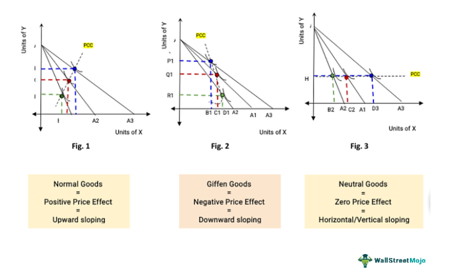

This article explores the intricate economic concepts of income effect and price effect and their relevance in the modern context of algorithmic trading. The income effect describes the change in the quantity demanded of a good or service resulting from a variation in consumer income. When consumers experience an increase in income, they may alter their consumption patterns, purchasing more of certain goods and less of others. Conversely, a decrease in income can lead to reduced spending.

The price effect, on the other hand, combines the income and substitution effects to signify how modifications in a good's price influence consumer demand. A price change impacts consumers directly by altering the quantity demanded and indirectly by adjusting consumers' real income levels. These effects are fundamental to understanding consumer behavior, a critical factor for both individual investors and large trading firms.



Algorithmic trading, a prominent force in today's financial markets, relies heavily on complex mathematical models and data-driven strategies. Its automated nature aims to execute trades with high precision, free from emotional biases, and to exploit market inefficiencies. However, the effectiveness of these algorithms can be significantly enhanced by incorporating economic insights into the income and price effects.

This article seeks to connect core economic theories with practical financial strategies. By integrating an understanding of how income and price variations affect consumer behavior, algorithmic trading systems can be optimized for superior performance. This combination of economic insight and advanced trading technology holds the potential to reshape financial market dynamics, offering a more calculated approach to investment and trading strategies. As algorithmic trading continues to evolve, leveraging these economic concepts will be essential for achieving competitive advantages and informed trading decisions.

## Table of Contents

## Understanding Income Effect and Price Effect

Income effect and price effect are integral concepts in economics that describe how consumers adjust their purchasing behavior in response to changes in their income and the prices of goods and services.

**Income Effect**  
The income effect occurs when a change in a consumer's income leads to a change in the quantity demanded of a good or service. For normal goods, an increase in income typically results in an increase in demand, as the consumer now has more purchasing power to allocate towards these goods. Conversely, for inferior goods, an increase in income may result in a decrease in demand, as consumers opt for higher-quality alternatives. Mathematically, the income effect ($IE$) can be expressed by holding prices constant and examining the effect of a change in income ($Y$) on the demand for good $X$:

$$

IE = \frac{\partial Q_x}{\partial Y}
$$

where $Q_x$ is the quantity of good $X$ demanded.

**Price Effect**  
The price effect is a combination of the income effect and the substitution effect, illustrating how a change in the price of a good affects consumer demand. The substitution effect occurs when a price change makes a good relatively cheaper or more expensive compared to other goods, prompting consumers to substitute one for another. The income effect, in this context, is the change in demand resulting from the altered purchasing power due to the price change.

The overall price effect ($PE$) can be expressed as:

$$

PE = SE + IE 
$$

where $SE$ denotes the substitution effect and $IE$ the income effect.

To understand the impact of price changes further, consider how a reduction in the price of a good increases the consumer's real income—effectively providing them with more purchasing power—and how it alters their consumption choices. An increase in real income can lead consumers to buy more of the good (positive income effect), while the substitution effect may encourage the consumer to purchase the less expensive good over alternatives.

Understanding these effects is crucial for analyzing consumer behavior in response to economic changes. For instance, in [algorithmic trading](/wiki/algorithmic-trading), anticipating how price and income changes might alter demand can be pivotal in developing effective trading strategies. Algorithms that incorporate these economic principles can better forecast market dynamics and optimize trading decisions accordingly.

## Calculating Income and Price Effect

Calculating the income and price effects involves analyzing how changes in a consumer’s income and the price of goods influence the quantity demanded. When a price change occurs, it affects the consumer’s purchasing power and alters the mix of goods purchased. This interplay is captured by two effects: the income effect and the substitution effect, which together constitute the price effect.

To calculate these effects, economists typically use three primary approaches: the compensating variation, Hicksian, and Slutskian methods. Each provides a distinct way to separate and quantify the impacts of price and income changes. 

1. **Compensating Variation**: This method evaluates the change in income that would allow a consumer to achieve their original utility level after a price change. It focuses on calculating the necessary compensation for maintaining constant utility, making it integral for welfare economics. Mathematically, it is represented as the difference between the old and new income levels required to reach the initial utility level given the new prices.

2. **Hicksian Demand (Compensated Demand)**: The Hicksian approach isolates the substitution effect by considering how a consumer would adjust consumption to maintain the initial utility level after a price change. The Hicksian demand curve holds utility constant and differs from the Marshallian (uncompensated) demand that allows for changes in utility. In this context, the Hicksian method summarizes how consumers substitute towards cheaper alternatives when prices change, without considering changes in real income.

3. **Slutskian Approach**: This classic method divides the total effect of a price change into substitution and income effects. The substitution effect is derived by adjusting prices to keep the consumer's purchasing power constant, while the income effect reflects the change in consumption due to the variation in real purchasing power. The Slutsky equation provides a formal way to separate these components: 
$$
   \text{Total Change} = \text{Substitution Effect} + \text{Income Effect}

$$

   In practical terms, the Slutsky equation is expressed as:
$$
   \frac{\partial x_i}{\partial p_j} = \frac{\partial x_i^{h}}{\partial p_j} - \frac{\partial x_i}{\partial I} \times x_j

$$

   where $\frac{\partial x_i}{\partial p_j}$ represents the total price effect, $\frac{\partial x_i^{h}}{\partial p_j}$ the substitution effect, and $\frac{\partial x_i}{\partial I} \times x_j$ the income effect; here, $x_i$ is the demand for good $i$, $p_j$ is the price of good $j$, and $I$ is income.

Understanding these calculations is crucial for predicting consumer behavior and assessing market dynamics. By analyzing how demand shifts in response to price changes, economists can forecast economic conditions and inform policy decisions. In financial markets, traders can leverage these insights to anticipate shifts in consumer demand, enhancing strategies and optimizing resource allocation.

## Algorithmic Trading: An Overview

Algorithmic trading involves the use of computer programs to execute trades automatically in financial markets. These programs operate based on predefined algorithms, which are sets of specific rules or instructions designed to perform trading activities with minimal human intervention. The key advantage of algorithmic trading is that it allows for systematic trading, reducing the role of human emotions, which can often lead to irrational decisions. This objectivity helps market participants to capitalize on efficiencies and opportunities quickly, often within milliseconds, something that human traders simply cannot replicate.

One of the primary strategies employed in algorithmic trading is trend-following. This strategy analyzes historical price data to identify and capitalize on existing market trends. Algorithms can recognize patterns and execute trades that align with the trend, whether it's bullish or bearish, with the objective of maximizing profits by entering trades at optimal points.

Another common strategy is [arbitrage](/wiki/arbitrage), which exploits price discrepancies of the same or related financial instruments across different markets or segments. For example, if a stock is priced differently in two exchanges, an algorithm can simultaneously buy the stock from the cheaper market and sell it in the more expensive one, pocketing the difference as profit. The speed of algorithms ensures that these trades occur faster than the market can adjust the prices, thus realizing gains in fractions of a second.

Execution of large orders is also a crucial aspect of algorithmic trading. Large orders, when executed manually, can significantly influence market prices due to the sheer [volume](/wiki/volume-trading-strategy), potentially leading to unfavorable execution prices. Algorithmic trading addresses this issue by breaking down large orders into smaller ones, distributing them over a specific time frame or in relation to the trade volume. This is where strategies such as the Volume-Weighted Average Price (VWAP) or Time-Weighted Average Price (TWAP) come into play, helping to minimize the market impact and achieve better average prices for orders.

Algorithmic trading methods rely heavily on historical data, real-time data processing, and mathematical models to make informed trading decisions. Traders and firms heavily utilize programming languages, particularly Python due to its extensive libraries and community support, to develop and fine-tune these algorithms. Key Python libraries such as NumPy for numerical operations, pandas for data manipulation, and scikit-learn for implementing [machine learning](/wiki/machine-learning) models play a crucial role in the development of algorithmic trading systems.

Overall, algorithmic trading stands out as a sophisticated method in modern trading environments, combining advanced computational techniques and strategic economic theories, making it an essential practice for contemporary financial markets.

## Integrating Economic Concepts in Algo Trading

Integrating economic concepts such as income and price effects into algorithmic trading can significantly enhance the predictive capabilities of trading models. These economic theories aid in understanding demand fluctuations, which are crucial for optimizing trade strategies in rapidly changing markets.

The income effect, which describes how changes in consumer income influence the quantity demanded, can help algorithms predict shifts in consumer behavior. For instance, algorithms can utilize data on economic indicators like wage reports or employment figures to adjust predictions about market demand. If a significant portion of consumers experience an increase in income, an algorithm could predict a probable rise in the demand for luxury goods, thereby informing strategic investment in relevant stocks or commodities.

Similarly, the price effect, which encompasses both income and substitution effects, can be integrated into trading models to capture nuances of consumer demand in response to price changes. The substitution effect, specifically, implies that consumers may change their consumption patterns based on relative price changes of goods. Algorithms can simulate these consumer behavior patterns to gauge the potential increase or decrease in demand for different asset classes. For example, a decrease in energy prices might lead to an increased demand for energy-dependent goods, which can be anticipated by an algorithm designed to recognize such patterns.

By mathematically modelling these economic effects, trading algorithms can dynamically adjust trading positions. For instance, using regression analysis and machine learning techniques, algorithms can predict the elasticity of demand for various assets. This involves calculating the price elasticity of demand, defined as:

$$
E_d = \frac{\% \text{ change in quantity demanded}}{\% \text{ change in price}}
$$

Such computations allow algorithms to evaluate how sensitive consumer behavior is to price changes, enabling more informed decision-making about trades.

Additionally, sophisticated algorithms are capable of processing large volumes of data to simulate consumer behavior in complex economic environments. These simulations can enable algorithms to anticipate market movements based on expected shifts in consumer demand patterns, informed by historical data, current market conditions, and overarching economic trends.

In practice, integrating these economic considerations in algorithmic trading could involve setting up adaptive models using Python libraries such as TensorFlow or PyTorch. These tools can be programmed to recognize patterns in economic data and continually update trading instructions based on refined forecasts. For instance, an algorithm using the following Python pseudo-code could predict and adjust for price elasticity in real-time:

```python
import numpy as np
from sklearn.linear_model import LinearRegression

# Example demand data 
price_changes = np.array([0.01, 0.02, -0.05, 0.03])
demand_changes = np.array([0.02, 0.03, -0.10, 0.04])

# Simple linear regression model to estimate price elasticity
model = LinearRegression().fit(price_changes.reshape(-1, 1), demand_changes)
elasticity = model.coef_[0]

print(f"Estimated price elasticity: {elasticity}")
```

This integration of economic theories into algorithmic trading bridges core economic understanding and innovative trading strategies, paving the way for more agile and accurate trading systems capable of capitalizing on market efficiencies.

## Case Studies and Applications

Traders have found innovative ways to incorporate economic theories such as income and price effects into their algorithmic trading strategies, yielding notable successes and uncovering certain limitations. This section highlights some real-world applications of these concepts within automated trading systems and discusses their potential and constraints.

### Illustrative Examples

1. **Demand Forecasting with Income and Price Elasticities**: 
   - Several trading firms use algorithms calibrated to assess demand elasticity, a response measure of quantity demanded to price changes, drawing directly from the income and price effects. By programming algorithms to interpret high-frequency price data, traders can predict market averages' movements, aligning buy and sell strategies accordingly. For instance, an elastic demand scenario implies that a small change in price leads to a larger change in quantity demanded, which can trigger trading signals for short-term buy or sell actions.

2. **Price Impact Models**: 
   - Algorithms employ economic theories to estimate the impact of large orders on market prices and adjust their execution strategies. By leveraging the substitution effect, traders can determine which assets might serve as viable alternatives when a target asset's price rises, ensuring optimal execution without significant market disturbance. For example, if a trade in Asset A would increase its price by 2%, the algorithm might seek an Asset B with a high cross-elasticity, executing orders there to maintain profitability.

### Real-world Applications and Successes

- **Quantitative Hedge Funds**: 
  - Hedge funds like Renaissance Technologies have achieved substantial returns by integrating advancements in statistical arbitrage with economic insights. Their algorithms incorporate elasticity coefficients, allowing for robust assessments of market conditions and enhancing predictive capabilities. By simulating market scenarios with hypothetical income and price changes, these funds can predict future market trends, adjusting portfolio strategies to mitigate risk.

- **Retail Investment Platforms**: 
  - Platforms such as Robinhood have begun implementing basic forms of algorithmic trading that leverage economic indicators. They simplify trading for individual investors by offering tools that analyze sensitivity to economic changes, thus democratizing access to sophisticated trading models. Such implementations enable users to scale trades according to inferred income effect insights.

### Potential and Limitations

While incorporating economic principles into algorithmic systems has shown promise, certain limitations must be considered. Economic theories often rely on assumptions, such as rational behavior and static preferences, which may not hold true in dynamic and complex markets. Moreover, the limitation of historical data usage in predicting future trends means inherent uncertainties remain.

Additionally, algorithmic systems must grapple with latency issues and the robustness of models across different market scenarios. For example, real-time data processing is critical for executing orders based on sudden income and price changes. However, slight delays or incorrect elasticity estimations can lead to losses.

In conclusion, while the integration of economic theories presents lucrative opportunities for enhancing algorithmic trading models, it also requires careful calibration to account for real-world uncertainties. Embracing a multidisciplinary approach, combining both economic insights and advanced computational methods, is essential for optimizing these systems and achieving sustained trading success.

## Conclusion

Understanding economic concepts such as the income effect and price effect is vital in financial trading and investment. These principles are not abstract theories but practical tools that can deeply influence decision-making processes in trading environments. They enable traders and investors to anticipate market behavior, allowing them to make more strategic and thoughtful investment decisions.

The integration of these economic concepts with algorithmic trading represents a significant advancement in financial strategies. Algorithmic trading, driven by precise mathematical and algorithmic models, can be enhanced by incorporating an understanding of how consumer demand responds to changes in income and price. This synergy allows for the development of more refined trading strategies that are responsive to market dynamics, leading to improved trading outcomes. Such integration can lead to algorithms that dynamically adjust to market fluctuations, thereby optimizing trading performance.

Moreover, the relationship between economics and algorithmic trading is expected to play a crucial role in shaping future market dynamics. As markets become increasingly complex and interconnected, the ability to predict and respond to economic changes swiftly becomes ever more critical. The fusion of economic insights with algorithmic trading offers a pathway to harness these complexities, transforming challenges into opportunities for gains.

Investors and trading firms are encouraged to continue exploring these topics, as doing so can empower them to create more data-driven and informed trading practices. By continuously refining trading algorithms with economic concepts, market participants can stay competitive in an ever-evolving financial landscape. Pursuing further research and development in this area not only enhances the effectiveness of trading strategies but also contributes to a deeper understanding of market mechanics. This exploration holds the potential to revolutionize how trading is conducted, making it more efficient and insightful.

## References & Further Reading

[1]: Bergstra, J., Bardenet, R., Bengio, Y., & Kégl, B. (2011). ["Algorithms for Hyper-Parameter Optimization."](https://papers.nips.cc/paper/4443-algorithms-for-hyper-parameter-optimization) Advances in Neural Information Processing Systems 24.

[2]: ["Advances in Financial Machine Learning"](https://www.amazon.com/Advances-Financial-Machine-Learning-Marcos/dp/1119482089) by Marcos Lopez de Prado

[3]: ["Evidence-Based Technical Analysis: Applying the Scientific Method and Statistical Inference to Trading Signals"](https://books.google.com/books/about/Evidence_Based_Technical_Analysis.html?id=MeoJAQAAMAAJ) by David Aronson

[4]: ["Machine Learning for Algorithmic Trading"](https://github.com/stefan-jansen/machine-learning-for-trading) by Stefan Jansen

[5]: ["Quantitative Trading: How to Build Your Own Algorithmic Trading Business"](https://www.amazon.com/Quantitative-Trading-Build-Algorithmic-Business/dp/1119800064) by Ernest P. Chan