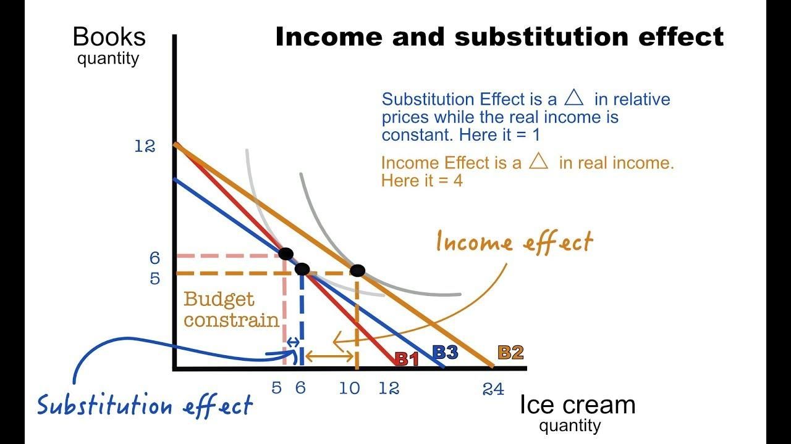

## Table of Contents

## What is the income effect in economics?

The income effect in economics is how changes in a person's income affect what they buy. When someone's income goes up, they can afford to buy more things or better quality items. On the other hand, if their income goes down, they might have to cut back on spending or choose cheaper options. This effect helps explain why people might change their buying habits when their financial situation changes.

For example, if a worker gets a raise, they might start buying more expensive food or go out to eat more often because they have more money to spend. But if they lose their job or get a pay cut, they might switch to buying cheaper brands or eat out less to save money. The income effect is important for understanding how economic policies, like tax changes, can influence people's spending and overall economic activity.

## What is the price effect in economics?

The price effect in economics is about how people change what they buy when the price of something goes up or down. If the price of a product increases, people usually buy less of it because it costs more. On the other hand, if the price goes down, people might buy more because it's cheaper. This change in buying behavior happens because people want to get the most value for their money.

For example, if the price of gasoline goes up, people might drive less or look for cheaper alternatives like public transport. But if the price of gasoline drops, they might drive more because it's less expensive. The price effect is important for businesses and policymakers because it helps them understand how changing prices can affect the demand for their products and the overall economy.

## How do the income effect and price effect differ?

The income effect and the price effect are both important ideas in economics, but they look at different things. The income effect is all about how people change what they buy when their income changes. If someone gets more money, they might buy more or better stuff. If they have less money, they might have to buy less or cheaper things. It's like when you get a birthday gift of money and you can buy that new toy you wanted, or when you have to save money because you didn't get any gifts.

The price effect, on the other hand, is about how people change their buying habits when the price of something goes up or down. If the price of a product goes up, people usually buy less of it because it's more expensive. If the price goes down, they might buy more because it's cheaper. It's like when your favorite snack at the store costs more, so you buy it less often, but if it's on sale, you might buy more of it.

Both effects help explain how people make choices with their money, but the income effect focuses on changes in how much money someone has, while the price effect focuses on changes in the cost of goods. Understanding these effects helps businesses and governments make better decisions about pricing and economic policies.

## Can you explain the concept of a normal good in relation to the income effect?

A normal good is something that people buy more of when their income goes up. It's called a "normal" good because it's what usually happens. When people have more money, they can afford to buy more of the things they like or want. For example, if someone gets a raise at work, they might start eating out at restaurants more often or buy more clothes because they have extra money to spend.

The income effect helps explain why people buy more normal goods when their income increases. When income goes up, people feel richer and can spend more on things they enjoy. So, if someone's salary increases, they might decide to buy a better brand of coffee or go on more vacations. The income effect shows how having more money can lead to buying more normal goods, making people's lives a bit more enjoyable or comfortable.

## How does the income effect influence consumer behavior?

The income effect is all about how people change what they buy when their income changes. When someone gets more money, they might start buying more things or better quality items. For example, if a person gets a raise at work, they might decide to eat out at restaurants more often or buy a new TV. This happens because they feel richer and can afford to spend more on things they enjoy. The income effect shows how having more money can lead to buying more of what people want, making their lives a bit more enjoyable or comfortable.

On the other hand, if someone's income goes down, they might have to cut back on spending or choose cheaper options. For instance, if a person loses their job, they might switch to buying cheaper brands of food or stop going out to eat as much. This is because they have less money to spend, so they need to be careful with their choices. The income effect helps explain why people might change their buying habits when their financial situation changes, whether it's for the better or worse.

## What is the substitution effect and how does it relate to the price effect?

The substitution effect is about how people switch to different products when the price of something they usually buy goes up. If the price of a product increases, people might start buying something else that is cheaper but does a similar job. For example, if the price of beef goes up, people might buy more chicken instead because it's less expensive. The substitution effect helps explain why people change what they buy when prices change, trying to get the best value for their money.

The substitution effect is closely related to the price effect. The price effect is about how people change their buying habits when the price of something goes up or down. The substitution effect is a big part of the price effect because it shows how people switch to other products when the price of their usual choice changes. For example, if the price of gasoline goes up, people might use public transport more often because it's cheaper. So, the substitution effect is one way the price effect happens, showing how people look for cheaper alternatives when prices go up.

## How can you calculate the income effect for a consumer?

To calculate the income effect for a consumer, you need to see how much more or less of a product they buy when their income changes. First, you find out how much of the product the consumer buys at their current income. Then, you change their income and see how their buying changes. For example, if someone's income goes up by $100 and they start buying 2 more units of a product, the income effect shows that the extra money made them buy more.

The income effect can be tricky because it's mixed up with the substitution effect, which is about switching to cheaper products when prices change. To get just the income effect, you need to take away the substitution effect. You do this by figuring out how much of the change in buying is because of the price change and how much is because of the income change. It's like solving a puzzle to see how much more someone buys just because they have more money, not because the price changed.

## What are the steps to calculate the price effect?

To calculate the price effect, you first need to see how much a consumer changes what they buy when the price of a product goes up or down. Start by finding out how much of the product the consumer buys at the current price. Then, change the price and see how their buying changes. For example, if the price of a soda goes up by $0.50 and the consumer buys 3 fewer sodas, the price effect shows that the higher price made them buy less.

The price effect is made up of two parts: the substitution effect and the income effect. The substitution effect is about how people switch to other products when the price goes up. The income effect is about how people feel richer or poorer when prices change. To find just the price effect, you need to figure out how much of the change in buying is because of the substitution effect and how much is because of the income effect. It's like solving a puzzle to see how much less someone buys because of the higher price, not just because they switched to something else or felt poorer.

## How do income and substitution effects combine to affect demand?

When the price of something changes, it can affect how much people want to buy it. This change in demand is because of two things: the income effect and the substitution effect. The income effect happens when the price of a product goes up or down, making people feel richer or poorer. If the price goes up, people feel like they have less money to spend on other things, so they might buy less of that product. If the price goes down, they feel like they have more money, so they might buy more. The substitution effect is about switching to different products when the price changes. If the price of one thing goes up, people might buy something else that's cheaper but does a similar job. Together, these effects explain why people change what they buy when prices change.

For example, let's say the price of apples goes up. The income effect might make people feel like they have less money to spend on other things, so they buy fewer apples. The substitution effect might make them buy more oranges instead because oranges are now cheaper compared to apples. Both effects work together to change how much people want to buy apples. If the price of apples goes down, the opposite might happen: people feel richer and might buy more apples, and they might not switch to oranges as much. Understanding how the income and substitution effects work together helps explain why demand for a product goes up or down when its price changes.

## Can you provide an example of calculating the income effect for a specific good?

Imagine Sarah usually buys 5 apples a week when her income is $500. Each apple costs $1, so she spends $5 on apples. Now, Sarah gets a raise and her income goes up to $600. With more money, she decides to buy 7 apples a week instead of 5. The income effect shows how Sarah's extra money made her buy more apples. To find out the income effect, we look at the difference: she went from buying 5 apples to 7 apples because of her higher income. So, the income effect for Sarah is 2 more apples a week.

This example is simple because it doesn't include changes in the price of apples or other things Sarah might buy instead. In real life, the income effect can be trickier to calculate because it's mixed up with the substitution effect, which is about switching to cheaper products when prices change. To get just the income effect, you'd need to figure out how much of Sarah's change in buying apples is because of her higher income and not because the price of apples or other fruits changed. But in this simple example, we can see clearly that Sarah bought more apples because she had more money.

## How does the Slutsky equation help in distinguishing between income and substitution effects?

The Slutsky equation is a tool economists use to separate the income effect from the substitution effect when the price of something changes. It helps us understand how much of the change in what people buy is because they feel richer or poorer, and how much is because they switch to cheaper things. Imagine the price of a product goes up. People might buy less of it because it's more expensive, and that's the substitution effect. But they might also buy less because they feel like they have less money to spend on other things, and that's the income effect. The Slutsky equation helps us figure out how much of the change is because of each effect.

To use the Slutsky equation, you first need to know how much of a product someone buys before the price changes. Then, you see how much they buy after the price goes up or down. The equation breaks this change down into two parts. One part shows how much the person changes what they buy because the price changed, which is the substitution effect. The other part shows how much they change because they feel richer or poorer, which is the income effect. By using the Slutsky equation, economists can better understand why people change what they buy and make better predictions about how prices affect demand.

## What advanced techniques can be used to analyze the income and price effects in econometric models?

To study the income and price effects in a detailed way, economists use something called econometric models. These models help them look at lots of data to see how people change what they buy when their income or the price of things changes. One common way is to use regression analysis. This is like a math tool that helps find patterns in the data. For example, it can show how much more someone buys of a product when their income goes up by a certain amount. Another method is to use panel data, which means looking at the same people over time. This helps see how their buying changes as their income or prices change.

Another advanced technique is called the difference-in-differences method. This is useful when there's a big change, like a new law that affects prices or incomes. Economists can compare groups of people who are affected by the change with groups who aren't. By looking at the differences in how these groups change what they buy, they can figure out the income and price effects. Also, some economists use something called instrumental variables. This helps deal with tricky situations where income or prices might be affected by other things that are hard to measure. By using these advanced methods, economists can get a clearer picture of how income and price changes really affect what people buy.

## What is the understanding of Income Effect and Price Effect?

Income effect and price effect are integral concepts in economics that describe how consumers adjust their purchasing behavior in response to changes in their income and the prices of goods and services.

**Income Effect**  
The income effect occurs when a change in a consumer's income leads to a change in the quantity demanded of a good or service. For normal goods, an increase in income typically results in an increase in demand, as the consumer now has more purchasing power to allocate towards these goods. Conversely, for inferior goods, an increase in income may result in a decrease in demand, as consumers opt for higher-quality alternatives. Mathematically, the income effect ($IE$) can be expressed by holding prices constant and examining the effect of a change in income ($Y$) on the demand for good $X$:

$$

IE = \frac{\partial Q_x}{\partial Y}
$$

where $Q_x$ is the quantity of good $X$ demanded.

**Price Effect**  
The price effect is a combination of the income effect and the substitution effect, illustrating how a change in the price of a good affects consumer demand. The substitution effect occurs when a price change makes a good relatively cheaper or more expensive compared to other goods, prompting consumers to substitute one for another. The income effect, in this context, is the change in demand resulting from the altered purchasing power due to the price change.

The overall price effect ($PE$) can be expressed as:

$$

PE = SE + IE 
$$

where $SE$ denotes the substitution effect and $IE$ the income effect.

To understand the impact of price changes further, consider how a reduction in the price of a good increases the consumer's real income—effectively providing them with more purchasing power—and how it alters their consumption choices. An increase in real income can lead consumers to buy more of the good (positive income effect), while the substitution effect may encourage the consumer to purchase the less expensive good over alternatives.

Understanding these effects is crucial for analyzing consumer behavior in response to economic changes. For instance, in [algorithmic trading](/wiki/algorithmic-trading), anticipating how price and income changes might alter demand can be pivotal in developing effective trading strategies. Algorithms that incorporate these economic principles can better forecast market dynamics and optimize trading decisions accordingly.

## How do you calculate the income and price effect?

Calculating the income and price effects involves analyzing how changes in a consumer’s income and the price of goods influence the quantity demanded. When a price change occurs, it affects the consumer’s purchasing power and alters the mix of goods purchased. This interplay is captured by two effects: the income effect and the substitution effect, which together constitute the price effect.

To calculate these effects, economists typically use three primary approaches: the compensating variation, Hicksian, and Slutskian methods. Each provides a distinct way to separate and quantify the impacts of price and income changes. 

1. **Compensating Variation**: This method evaluates the change in income that would allow a consumer to achieve their original utility level after a price change. It focuses on calculating the necessary compensation for maintaining constant utility, making it integral for welfare economics. Mathematically, it is represented as the difference between the old and new income levels required to reach the initial utility level given the new prices.

2. **Hicksian Demand (Compensated Demand)**: The Hicksian approach isolates the substitution effect by considering how a consumer would adjust consumption to maintain the initial utility level after a price change. The Hicksian demand curve holds utility constant and differs from the Marshallian (uncompensated) demand that allows for changes in utility. In this context, the Hicksian method summarizes how consumers substitute towards cheaper alternatives when prices change, without considering changes in real income.

3. **Slutskian Approach**: This classic method divides the total effect of a price change into substitution and income effects. The substitution effect is derived by adjusting prices to keep the consumer's purchasing power constant, while the income effect reflects the change in consumption due to the variation in real purchasing power. The Slutsky equation provides a formal way to separate these components: 
$$
   \text{Total Change} = \text{Substitution Effect} + \text{Income Effect}

$$

   In practical terms, the Slutsky equation is expressed as:
$$
   \frac{\partial x_i}{\partial p_j} = \frac{\partial x_i^{h}}{\partial p_j} - \frac{\partial x_i}{\partial I} \times x_j

$$

   where $\frac{\partial x_i}{\partial p_j}$ represents the total price effect, $\frac{\partial x_i^{h}}{\partial p_j}$ the substitution effect, and $\frac{\partial x_i}{\partial I} \times x_j$ the income effect; here, $x_i$ is the demand for good $i$, $p_j$ is the price of good $j$, and $I$ is income.

Understanding these calculations is crucial for predicting consumer behavior and assessing market dynamics. By analyzing how demand shifts in response to price changes, economists can forecast economic conditions and inform policy decisions. In financial markets, traders can leverage these insights to anticipate shifts in consumer demand, enhancing strategies and optimizing resource allocation.

## How can economic concepts be integrated into algorithmic trading?

Integrating economic concepts such as income and price effects into algorithmic trading can significantly enhance the predictive capabilities of trading models. These economic theories aid in understanding demand fluctuations, which are crucial for optimizing trade strategies in rapidly changing markets.

The income effect, which describes how changes in consumer income influence the quantity demanded, can help algorithms predict shifts in consumer behavior. For instance, algorithms can utilize data on economic indicators like wage reports or employment figures to adjust predictions about market demand. If a significant portion of consumers experience an increase in income, an algorithm could predict a probable rise in the demand for luxury goods, thereby informing strategic investment in relevant stocks or commodities.

Similarly, the price effect, which encompasses both income and substitution effects, can be integrated into trading models to capture nuances of consumer demand in response to price changes. The substitution effect, specifically, implies that consumers may change their consumption patterns based on relative price changes of goods. Algorithms can simulate these consumer behavior patterns to gauge the potential increase or decrease in demand for different asset classes. For example, a decrease in energy prices might lead to an increased demand for energy-dependent goods, which can be anticipated by an algorithm designed to recognize such patterns.

By mathematically modelling these economic effects, trading algorithms can dynamically adjust trading positions. For instance, using regression analysis and [machine learning](/wiki/machine-learning) techniques, algorithms can predict the elasticity of demand for various assets. This involves calculating the price elasticity of demand, defined as:

$$
E_d = \frac{\% \text{ change in quantity demanded}}{\% \text{ change in price}}
$$

Such computations allow algorithms to evaluate how sensitive consumer behavior is to price changes, enabling more informed decision-making about trades.

Additionally, sophisticated algorithms are capable of processing large volumes of data to simulate consumer behavior in complex economic environments. These simulations can enable algorithms to anticipate market movements based on expected shifts in consumer demand patterns, informed by historical data, current market conditions, and overarching economic trends.

In practice, integrating these economic considerations in algorithmic trading could involve setting up adaptive models using Python libraries such as TensorFlow or PyTorch. These tools can be programmed to recognize patterns in economic data and continually update trading instructions based on refined forecasts. For instance, an algorithm using the following Python pseudo-code could predict and adjust for price elasticity in real-time:

```python
import numpy as np
from sklearn.linear_model import LinearRegression

# Example demand data 
price_changes = np.array([0.01, 0.02, -0.05, 0.03])
demand_changes = np.array([0.02, 0.03, -0.10, 0.04])

# Simple linear regression model to estimate price elasticity
model = LinearRegression().fit(price_changes.reshape(-1, 1), demand_changes)
elasticity = model.coef_[0]

print(f"Estimated price elasticity: {elasticity}")
```

This integration of economic theories into algorithmic trading bridges core economic understanding and innovative trading strategies, paving the way for more agile and accurate trading systems capable of capitalizing on market efficiencies.

## References & Further Reading

[1]: Bergstra, J., Bardenet, R., Bengio, Y., & Kégl, B. (2011). ["Algorithms for Hyper-Parameter Optimization."](https://papers.nips.cc/paper/4443-algorithms-for-hyper-parameter-optimization) Advances in Neural Information Processing Systems 24.

[2]: ["Advances in Financial Machine Learning"](https://www.amazon.com/Advances-Financial-Machine-Learning-Marcos/dp/1119482089) by Marcos Lopez de Prado

[3]: ["Evidence-Based Technical Analysis: Applying the Scientific Method and Statistical Inference to Trading Signals"](https://books.google.com/books/about/Evidence_Based_Technical_Analysis.html?id=MeoJAQAAMAAJ) by David Aronson

[4]: ["Machine Learning for Algorithmic Trading"](https://github.com/stefan-jansen/machine-learning-for-trading) by Stefan Jansen

[5]: ["Quantitative Trading: How to Build Your Own Algorithmic Trading Business"](https://www.amazon.com/Quantitative-Trading-Build-Algorithmic-Business/dp/1119800064) by Ernest P. Chan